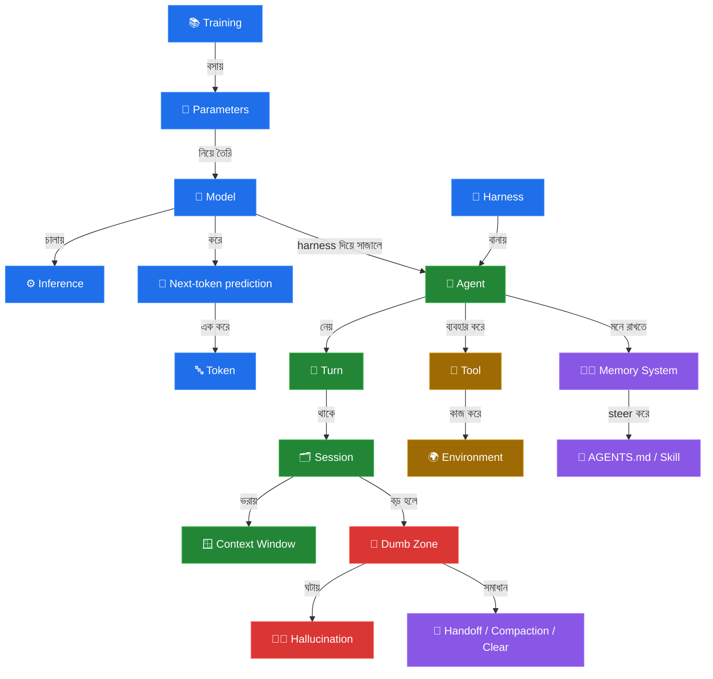

# 🗺️ কনসেপ্ট ম্যাপ ও চিট-শিট (Cheat Sheet)

> পুরো ছবিটা এক জায়গায় ধরা থাকল। উপরে **কনসেপ্ট ম্যাপ** — কোন শব্দ কার সঙ্গে কীভাবে জড়িয়ে,
> তার নকশা। আর নিচে **চিট-শিট** — ৬২টা শব্দের এক-লাইনের মানে, চট করে রিভিশন দেওয়ার জন্য। 🚀

[⬅️ মূল পাতায় ফিরুন](../README.md)

---

## 🧭 কনসেপ্ট ম্যাপ — সব কিছু কীভাবে জড়িত

> 💡 **এক বাক্যে গল্পটা:** *Training* সংখ্যা (*Parameters*) বসিয়ে *Model* বানায়; *Harness* তাকে
> *Agent* করে; Agent *Turn*-এ *Turn*-এ কথা বলে, যা *Session*-এ জমে *Context Window* ভরায়; বড়
> হলে *Dumb Zone* আসে, তখন *Handoff* করতে হয়। 🎯

---

## 📋 চিট-শিট — ৬২টি শব্দের এক-লাইনের মানে

### 🧠 সেকশন ১ — মডেল
| English | বাংলা | এক লাইনে |
|---|---|---|
| [Model](01-the-model.md#মডেল-model) | মডেল | একগাদা সংখ্যা, যা পরের শব্দ আন্দাজ করে |
| [Parameters](01-the-model.md#প্যারামিটার-parameters) | প্যারামিটার | মডেলের ভেতরের সংখ্যা = তার "জ্ঞান" |
| [Training](01-the-model.md#ট্রেনিং-training) | ট্রেনিং | প্যারামিটার বসানোর একবারের খরুচে প্রসেস |
| [Inference](01-the-model.md#ইনফারেন্স-inference) | ইনফারেন্স | মডেল চালিয়ে উত্তর বানানো (প্রতিবার দাম) |
| [Token](01-the-model.md#টোকেন-token) | টোকেন | লেখার ছোট টুকরা; খরচ এতেই মাপা হয় |
| [Next-token prediction](01-the-model.md#নেক্সট-টোকেন-প্রেডিকশন-next-token-prediction) | নেক্সট-টোকেন প্রেডিকশন | এক টোকেন করে করে আউটপুট বানানো |
| [Non-determinism](01-the-model.md#নন-ডিটারমিনিজম-non-determinism) | নন-ডিটারমিনিজম | একই প্রশ্নে আলাদা উত্তর (স্বাভাবিক) |
| [Model provider](01-the-model.md#মডেল-প্রোভাইডার-model-provider) | মডেল প্রোভাইডার | যে মডেল চালায় (Anthropic, Ollama...) |
| [Harness](01-the-model.md#হার্নেস-harness) | হার্নেস | মডেলকে এজেন্ট বানায় (টুল+প্রম্পট+পারমিশন) |
| [Model provider request](01-the-model.md#মডেল-প্রোভাইডার-রিকোয়েস্ট-model-provider-request) | রিকোয়েস্ট | প্রোভাইডারে একবার যাওয়া-আসা |
| [Input tokens](01-the-model.md#ইনপুট-টোকেন-input-tokens) | ইনপুট টোকেন | যা পাঠান (সস্তা) |
| [Output tokens](01-the-model.md#আউটপুট-টোকেন-output-tokens) | আউটপুট টোকেন | যা মডেল বানায় (দামি) |
| [Prefix cache](01-the-model.md#প্রিফিক্স-ক্যাশ-prefix-cache) | প্রিফিক্স ক্যাশ | শুরুটা আবার কাজ না করার চালাকি |
| [Cache tokens](01-the-model.md#ক্যাশ-টোকেন-cache-tokens) | ক্যাশ টোকেন | আগে থেকে জমানো সস্তা টোকেন |

### 💬 সেকশন ২ — সেশন, কনটেক্সট ও টার্ন
| English | বাংলা | এক লাইনে |
|---|---|---|
| [Stateless](02-sessions-context-turns.md#স্টেটলেস-stateless) | স্টেটলেস | আগের কিছু মনে রাখে না (গোল্ডি 🐠) |
| [Context](02-sessions-context-turns.md#কনটেক্সট-context) | কনটেক্সট | এখন হাতে থাকা দরকারি তথ্য |
| [Context window](02-sessions-context-turns.md#কনটেক্সট-উইন্ডো-context-window) | কনটেক্সট উইন্ডো | মডেলের দেখার একমাত্র সীমিত জানালা |
| [Stateful](02-sessions-context-turns.md#স্টেটফুল-stateful) | স্টেটফুল | আগের তথ্য বয়ে নেয় (harness দিয়ে) |
| [Agent](02-sessions-context-turns.md#এজেন্ট-agent) | এজেন্ট | মডেল+হার্নেস, যার সঙ্গে কথা বলেন |
| [System prompt](02-sessions-context-turns.md#সিস্টেম-প্রম্পট-system-prompt) | সিস্টেম প্রম্পট | এজেন্টের স্থায়ী ডিউটি চার্ট |
| [Session](02-sessions-context-turns.md#সেশন-session) | সেশন | একটানা এক কথোপকথনের পর্ব |
| [Turn](02-sessions-context-turns.md#টার্ন-turn) | টার্ন | এক প্রশ্ন-উত্তর পর্ব (Session>Turn>Request) |

### 🧰 সেকশন ৩ — টুল ও এনভায়রনমেন্ট
| English | বাংলা | এক লাইনে |
|---|---|---|
| [Environment](03-tools-and-environment.md#এনভায়রনমেন্ট-environment) | এনভায়রনমেন্ট | এজেন্ট যেখানে কাজ করে (রাস্তা) |
| [Filesystem](03-tools-and-environment.md#ফাইলসিস্টেম-filesystem) | ফাইলসিস্টেম | সবচেয়ে কমন environment |
| [Tool](03-tools-and-environment.md#টুল-tool) | টুল | এজেন্টের হাত-চোখ (Read/Write/Bash) |
| [Tool call](03-tools-and-environment.md#টুল-কল-tool-call) | টুল কল | মডেলের লেখা অর্ডার (নিজে কিছু করে না) |
| [Tool result](03-tools-and-environment.md#টুল-রেজাল্ট-tool-result) | টুল রেজাল্ট | অর্ডারের ফেরত আসা ফলাফল |
| [MCP](03-tools-and-environment.md#mcp) | MCP | নতুন টুল আনার স্ট্যান্ডার্ড পোর্ট |
| [Permission request](03-tools-and-environment.md#পারমিশন-রিকোয়েস্ট-permission-request) | পারমিশন রিকোয়েস্ট | ঝুঁকির কাজের আগে অনুমতি চাওয়া |
| [Permission mode](03-tools-and-environment.md#পারমিশন-মোড-permission-mode) | পারমিশন মোড | কখন থামবে তার সেটিং |
| [Agent mode](03-tools-and-environment.md#এজেন্ট-মোড-agent-mode) | এজেন্ট মোড | Plan / Accept-edits / YOLO প্রিসেট |
| [Sandbox](03-tools-and-environment.md#স্যান্ডবক্স-sandbox) | স্যান্ডবক্স | নিরাপদ বালির বাক্স |

### ⚠️ সেকশন ৪ — ভুল করার ধরন
| English | বাংলা | এক লাইনে |
|---|---|---|
| [Sycophancy](04-failure-modes.md#সাইকোফ্যান্সি-sycophancy) | সাইকোফ্যান্সি | খুশি করতে রাজি হয়ে যাওয়া |
| [Hallucination](04-failure-modes.md#হ্যালুসিনেশন-hallucination) | হ্যালুসিনেশন | আত্মবিশ্বাসের সাথে ভুল (২ ধরন) |
| [Parametric knowledge](04-failure-modes.md#প্যারামেট্রিক-নলেজ-parametric-knowledge) | প্যারামেট্রিক নলেজ | মুখস্থ জ্ঞান (ঝাপসা হতে পারে) |
| [Knowledge cutoff](04-failure-modes.md#নলেজ-কাটঅফ-knowledge-cutoff) | নলেজ কাটঅফ | জ্ঞানের শেষ তারিখ |
| [Contextual knowledge](04-failure-modes.md#কনটেক্সচুয়াল-নলেজ-contextual-knowledge) | কনটেক্সচুয়াল নলেজ | সামনের পাতা দেখে পড়া (ভুল কম) |
| [Attention relationship](04-failure-modes.md#অ্যাটেনশন-রিলেশনশিপ-attention-relationship) | অ্যাটেনশন রিলেশনশিপ | দুই টোকেনের জোড়া |
| [Attention budget](04-failure-modes.md#অ্যাটেনশন-বাজেট-attention-budget) | অ্যাটেনশন বাজেট | প্রতি-টোকেন ফিক্সড মনোযোগ |
| [Attention degradation](04-failure-modes.md#অ্যাটেনশন-ডিগ্রেডেশন-attention-degradation) | অ্যাটেনশন ডিগ্রেডেশন | কনটেক্সট বড় হলে মনোযোগ পাতলা |
| [Smart zone](04-failure-modes.md#স্মার্ট-জোন-smart-zone) | স্মার্ট জোন | শুরুতে তীক্ষ্ণ, পরে ডাম্ব জোন |

### 🤝 সেকশন ৫ — হ্যান্ডঅফ
| English | বাংলা | এক লাইনে |
|---|---|---|
| [Clearing](05-handoffs.md#ক্লিয়ারিং-clearing) | ক্লিয়ারিং | সব মুছে নতুন শুরু |
| [Handoff](05-handoffs.md#হ্যান্ডঅফ-handoff) | হ্যান্ডঅফ | পরের সেশনে কাজ পার (ফেরার পথ নেই) |
| [Handoff artifact](05-handoffs.md#হ্যান্ডঅফ-আর্টিফ্যাক্ট-handoff-artifact) | হ্যান্ডঅফ আর্টিফ্যাক্ট | পার করার সেই ডকুমেন্ট |
| [Spec](05-handoffs.md#স্পেক-spec) | স্পেক | বড় কাজের নকশা |
| [Ticket](05-handoffs.md#টিকিট-ticket) | টিকিট | এক সেশনের কাজ |
| [Compaction](05-handoffs.md#কম্প্যাকশন-compaction) | কম্প্যাকশন | lossy সারাংশ-হ্যান্ডঅফ |
| [Autocompact](05-handoffs.md#অটোকম্প্যাক্ট-autocompact) | অটোকম্প্যাক্ট | harness নিজে compact করে |

### 🧭 সেকশন ৬ — মেমরি ও স্টিয়ারিং
| English | বাংলা | এক লাইনে |
|---|---|---|
| [Memory system](06-memory-and-steering.md#মেমরি-সিস্টেম-memory-system) | মেমরি সিস্টেম | ফাইলে লিখে রিলোড করে কৃত্রিম স্মৃতি |
| [AGENTS.md](06-memory-and-steering.md#agentsmd) | AGENTS.md | সেশন-শুরুর স্থায়ী ব্রিফ |
| [Progressive disclosure](06-memory-and-steering.md#প্রগ্রেসিভ-ডিসক্লোজার-progressive-disclosure) | প্রগ্রেসিভ ডিসক্লোজার | দরকারমতো লোড করা |
| [Context pointer](06-memory-and-steering.md#কনটেক্সট-পয়েন্টার-context-pointer) | কনটেক্সট পয়েন্টার | অন্য ডকের দিকে ইশারা |
| [Skill](06-memory-and-steering.md#স্কিল-skill) | স্কিল | এজেন্ট যা পড়ে শেখে (tool ≠ skill) |
| [Subagent](06-memory-and-steering.md#সাবএজেন্ট-subagent) | সাবএজেন্ট | আলাদা context-এ ভারী কাজ, এক উত্তর |

### 🛠️ সেকশন ৭ — কাজের ধরন
| English | বাংলা | এক লাইনে |
|---|---|---|
| [Human-in-the-loop](07-patterns-of-work.md#হিউম্যান-ইন-দ্য-লুপ-human-in-the-loop) | হিউম্যান-ইন-দ্য-লুপ | মানুষ পাশে, রিয়েল-টাইমে স্টিয়ার |
| [AFK](07-patterns-of-work.md#afk) | AFK | একা ছেড়ে দেওয়া (sandbox জরুরি) |
| [Automated check](07-patterns-of-work.md#অটোমেটেড-চেক-automated-check) | অটোমেটেড চেক | deterministic পাস/ফেল (টেস্ট, lint) |
| [Automated review](07-patterns-of-work.md#অটোমেটেড-রিভিউ-automated-review) | অটোমেটেড রিভিউ | এক এজেন্ট আরেকটার মতামত |
| [Human review](07-patterns-of-work.md#হিউম্যান-রিভিউ-human-review) | হিউম্যান রিভিউ | নিজে ডিফ পড়া (সারাংশ নয়) |
| [Vibe coding](07-patterns-of-work.md#ভাইব-কোডিং-vibe-coding) | ভাইব কোডিং | রিভিউ ছাড়া কোড মেনে নেওয়া |
| [Design concept](07-patterns-of-work.md#ডিজাইন-কনসেপ্ট-design-concept) | ডিজাইন কনসেপ্ট | কী বানানো হচ্ছে তার ভাগ করা বোঝাপড়া |
| [Grilling](07-patterns-of-work.md#গ্রিলিং-grilling) | গ্রিলিং | কোডের আগে প্রশ্ন করে বোঝাপড়া পাকা করা |

---

[⬅️ মূল পাতায় ফিরুন](../README.md) · [সেকশন ১ থেকে শুরু করুন ➡️](01-the-model.md)
