# সেকশন ১ — মডেল (The Model) 🧠

> AI-এর ভেতরটা আসলে কেমন? এই সেকশনে আমরা সেখানেই ঢুকব। মডেল জিনিসটা কী, শেখে কীভাবে,
> উত্তরই বা বানায় কীভাবে — আর সবচেয়ে মজার প্রশ্ন, একই কথা দুবার জিজ্ঞেস করলে কেন দু-রকম উত্তর আসে।
>
> 🐠 সঙ্গে থাকবে গোল্ডি, একটা গোল্ডফিশ। শোনা যায়, ওর স্মৃতি নাকি তিন সেকেন্ডের বেশি টেকে না।
> গোটা পথ ও কানের কাছে একটা কথাই বলে যাবে: মডেল নিজে থেকে কিচ্ছু মনে রাখে না।

[⬅️ মূল পাতায় ফিরুন](../README.md)

---

### মডেল (Model)

মডেলকে আমরা অনেকেই AI-এর "ব্রেন" বলে ভাবি। কথাটা একদম ভুল নয়, তবে ভেতরে উঁকি দিলে ব্রেন-টেন কিছু চোখে পড়বে না। পড়বে সারি সারি সংখ্যা — এদেরই নাম [প্যারামিটার (Parameters)](#প্যারামিটার-parameters)। আর এই সংখ্যার পাহাড় জীবনে একটা জিনিসই শিখেছে: এর পরের শব্দটা কী হতে পারে, তার আন্দাজ করা। হ্যাঁ, ওইটুকুই।

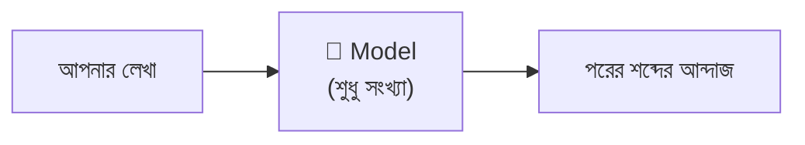

একটা ক্যালকুলেটরের কথা ভাবুন তো। সে কি কখনো নিজে থেকে অঙ্ক কষে? বোতাম না চাপলে চুপচাপ পড়ে থাকে। মডেলও ঠিক তেমন — প্রশ্ন না করলে নিজে থেকে টুঁ শব্দটিও করবে না।

"Claude Opus", "GPT-5" — এগুলো এক-একটা মডেলের নাম। কিন্তু মডেল একা বসে থাকলে নিজে থেকে কিছুই করতে পারে না। কাজে লাগাতে হলে তাকে পরাতে হয় একটা [হার্নেস (Harness)](#হার্নেস-harness)।

গোল্ডিও এখানে একটা কথা মনে করিয়ে দিচ্ছে 🐠 — মডেল হলো **stateless**। মানে ওর নিজের কোনো স্মৃতি নেই, গোল্ডির মতোই ফাঁকা। তাই প্রতিবার ওকে পুরো গল্পটা গোড়া থেকে শোনাতে হয়। "ভাবছে", "সিদ্ধান্ত নিচ্ছে" বলে যা মনে হয়, আদতে সবটাই পরের শব্দ আন্দাজ করার খেলা।

💬 কথোপকথনে

🙋 "প্ল্যানিং স্টেপের জন্য মডেলটা Sonnet থেকে Opus-এ বদলে দিই?"

🧑‍🏫 "দিতে পারেন, ক্ষতি নেই। তবে আসল খাটুনিটা এখানে করছে harness। সিস্টেম প্রম্পট আর টুল ঠিক না থাকলে শুধু মডেল বদলে কিছু হবে না।"

  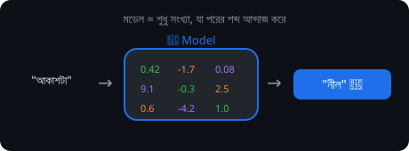

**🎬 টার্মিনালে দেখুন:** মডেল পরের শব্দের সম্ভাবনা মেপে একটা বেছে নিচ্ছে —

  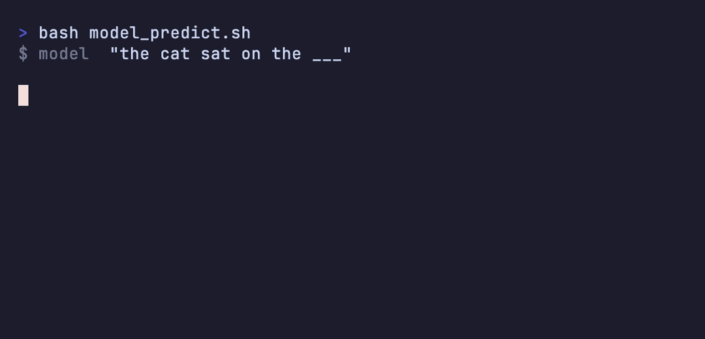

---

### প্যারামিটার (Parameters)

এই যে মডেলের ভেতরের সংখ্যাগুলোর কথা বলছিলাম — সংখ্যায় এরা প্রায়ই কয়েকশো **কোটি**। মডেল যা কিছু "জানে", তার পুরোটাই লুকিয়ে আছে এই সংখ্যাগুলোয়। ইংরেজিতে এদের *weights*-ও বলে।

একটা গানের মিক্সিং বোর্ড দেখেছেন? হাজার হাজার নব, প্রতিটাকে ঠিক জায়গায় না বসালে গানটা কানে লাগে। প্যারামিটার অনেকটা সেই নবগুলোর সেটিং। [ট্রেনিং (Training)](#ট্রেনিং-training)-এর সময় একে একে এগুলো ঘুরিয়ে ঠিক করা হয়। আর একবার বসে গেলে — মডেল যখন আসলে চলে, মানে [ইনফারেন্স (Inference)](#ইনফারেন্স-inference)-এর সময় — এগুলো আর নড়ে না।

এ কারণেই মডেলকে নতুন কিছু শেখানো এত ঝামেলার। শেখানো মানে তো এই প্যারামিটারগুলোই আবার নাড়াচাড়া করা, আর সেটা মাসের পর মাস আর গাদা গাদা টাকার গল্প। 💸 তাই একটা প্রজেক্টের জন্য মডেলকে নতুন করে ট্রেনিং দেওয়ার চেয়ে দরকারি তথ্যটুকু সরাসরি context-এ ধরিয়ে দেওয়াই সস্তা।

💬 কথোপকথনে

🙋 "আমাদের কোডবেসের ওপর মডেলটাকে fine-tune করা যায় না?"

🧑‍🏫 "করলে তো প্যারামিটারই বদলে যাবে — কার্যত একটা নতুন মডেল দাঁড় করানো হবে। এক প্রজেক্টের জন্য অতটা না করে কোডবেসটা [কনটেক্সট (Context)](02-sessions-context-turns.md#কনটেক্সট-context)-এ লোড করে দিন, ঢের সস্তা পড়বে।"

**🎬 টার্মিনালে দেখুন:** ট্রেনিংয়ে weight-গুলো নড়তে নড়তে থিতু হচ্ছে —

  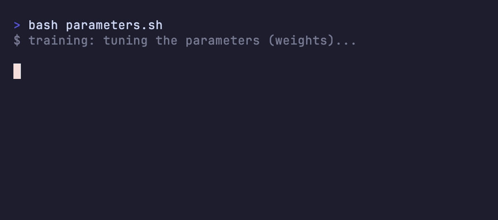

---

### ট্রেনিং (Training)

মডেলের [প্যারামিটার (Parameters)](#প্যারামিটার-parameters)গুলো ঠিকঠাক বসানোর গোটা কাজটারই নাম ট্রেনিং। পদ্ধতিটা সোজা শুনতে: বিশাল পরিমাণ লেখা বারবার মডেলের সামনে ধরা হয়, আর "পরের শব্দ আন্দাজ" করতে করতে সে আস্তে আস্তে ওস্তাদ হয়ে ওঠে।

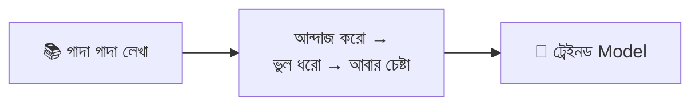

পরীক্ষার আগে হাজার অঙ্ক কষে যাওয়ার সঙ্গে এর তফাত খুব বেশি নেই — যত প্র্যাকটিস, তত ভুল কম। শুধু একটা জায়গায় ফারাক: মডেলের এই প্র্যাকটিস হয় মোটে একবার, বিশাল খরচ গুনে, আর সেটা সারে [মডেল প্রোভাইডার (Model provider)](#মডেল-প্রোভাইডার-model-provider)। একবার হয়ে যাওয়ার পর মডেল আর নতুন খবর শেখে না। আজ সকালে কী ঘটল, সেটা নিজে থেকে context-এ না বলে দিলে ও জানতেই পারবে না।

💬 কথোপকথনে

🙋 "মডেলকে আমাদের internal API চিনিয়ে দেওয়া যায়?"

🧑‍🏫 "ট্রেনিং দিয়ে নয় — ওটা প্রোভাইডারের মাসব্যাপী কারবার। তার চেয়ে API-এর ডকটা context-এ দিয়ে দিন। ওটাই আপনার হাতে থাকা আসল উপায়।"

**🎬 টার্মিনালে দেখুন:** অ্যাকুরেসি বার ভরছে, শেষে প্যারামিটার ফ্রিজ —

  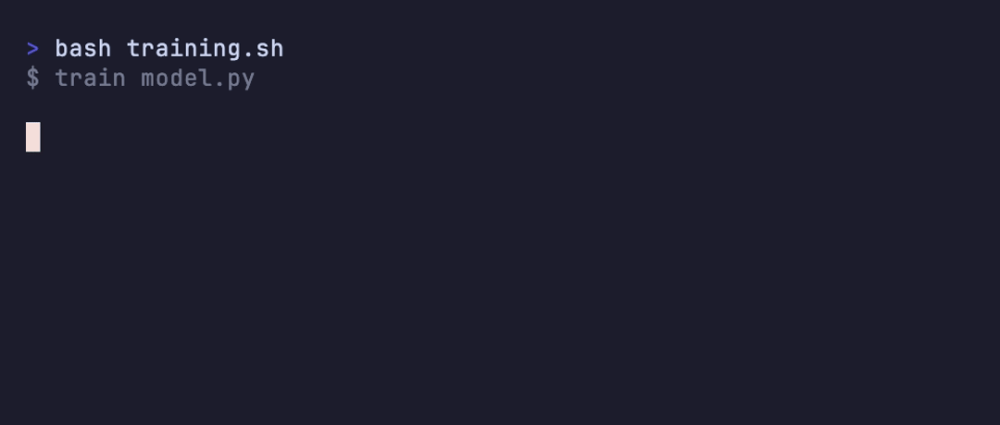

---

### ইনফারেন্স (Inference)

ট্রেইনড মডেলকে চালিয়ে আসলে উত্তর বার করার নামই ইনফারেন্স। আপনি যখনই কিছু জিজ্ঞেস করছেন, পর্দার আড়ালে ঘটছে এই inference-ই।

ট্রেনিংকে যদি ধরি পরীক্ষার পড়াশোনা, তাহলে ইনফারেন্স হলো হলে বসে আসল উত্তর লেখা। পড়াটা একবারই হয়েছিল; এখন শুধু সেই শেখাটুকু খাটিয়ে যাওয়া। প্যারামিটার সব ফিক্সড, মডেল কেবল পরের শব্দটা আন্দাজ করে চলে।

ট্রেনিংয়ের তুলনায় এটা সস্তা ঠিকই, কিন্তু দাম গোনা হয় প্রতিটা [টোকেন (Token)](#টোকেন-token) ধরে। AI ব্যবহারের আসল খরচটা এখানেই। আপনার বিল কেন একটা বাঁধা মাসিক ফি না হয়ে ব্যবহারের সঙ্গে ওঠানামা করে, তার উত্তরও এটাই — প্রতিবার প্রশ্ন করলে প্রোভাইডারের হার্ডওয়্যারে মডেলটা একবার করে চলে, আর প্রতিবার চলার একটা খরচ আছে।

💬 কথোপকথনে

🙋 "বিলটা ফ্ল্যাট লাইসেন্স ফি না হয়ে ব্যবহারের সঙ্গে বাড়ে কেন?"

🧑‍🏫 "আপনি তো inference-এর দাম দিচ্ছেন — প্রতিবার প্রশ্নে প্রোভাইডারের হার্ডওয়্যারে মডেল চলছে। আর এক [টার্ন (Turn)](02-sessions-context-turns.md#টার্ন-turn)-এ টুল ডাকলে ভেতরে ভেতরে অনেকগুলো রিকোয়েস্ট হয়ে যায়।"

  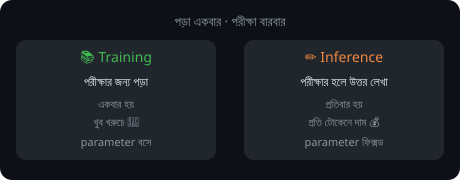

**🎬 টার্মিনালে দেখুন:** ট্রেনিং একবার, কিন্তু inference চলে প্রতিবার — প্রতি টোকেনে দাম —

  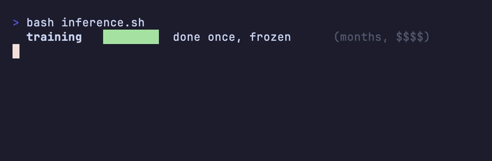

---

### টোকেন (Token)

মডেল লেখা পড়ে আর লেখে — তবে গোটা শব্দ ধরে নয়, ছোট ছোট টুকরোয়। এই টুকরোগুলোর নামই টোকেন। মাপে এরা প্রায় শব্দের সমান, কিন্তু হুবহু শব্দ নয়। চেনা শব্দ সাধারণত এক টোকেনেই এঁটে যায়, আর বিরল বা লম্বা শব্দ ভেঙে যায় কয়েক টোকেনে।

  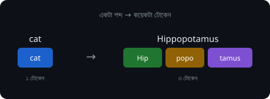

খাতায় উত্তর লেখার সময় কল্পনা করুন, প্রতিটা শব্দাংশ আলাদা একটা ঘরে বসছে। ছোট শব্দ এক ঘরেই কুলিয়ে যায়, কঠিন বড় শব্দকে কয়েক ঘর জুড়ে বসতে হয়। টোকেন হলো সেই "ঘর"। [কনটেক্সট উইন্ডো (Context window)](02-sessions-context-turns.md#কনটেক্সট-উইন্ডো-context-window)-র সাইজ, খরচ, গতি — সব হিসাব হয় এই টোকেনে।

একটা জায়গায় অনেকেই হোঁচট খান: টোকেনকে "শব্দ" ধরে নেওয়া। 🚩 দুটো এক জিনিস নয়। একই অর্থের লেখাও বেশি টোকেন খেয়ে ফেলতে পারে, যদি তাতে অদ্ভুত অক্ষর, কোড বা ইমোজি গুঁজে থাকে। তাই "আমার প্রম্পটটা কত বড়" — এটা জানতে চাইলে শব্দ গোনা বাদ দিন, টোকেন গুনুন।

💬 কথোপকথনে

🙋 "এই প্রম্পটটা কত বড় হবে?"

🧑‍🏫 "একটা tokenizer-এ ফেলে দেখুন। লেখাটা দেখতে ছোট, কিন্তু এতে যা অদ্ভুত অক্ষর আছে, ভাবনার চেয়ে অনেক বেশি টোকেনে ভাঙবে।"

**🎬 টার্মিনালে দেখুন:**

  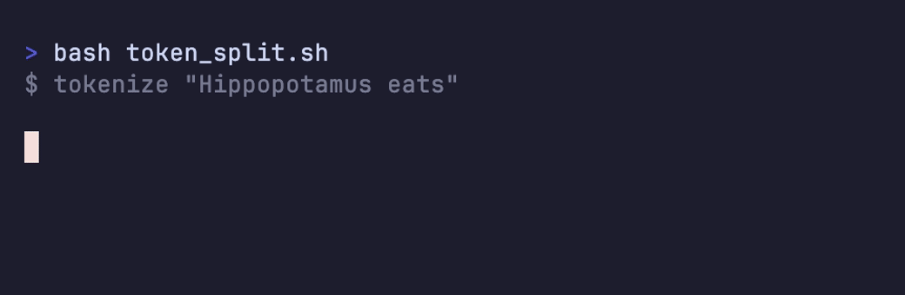

---

### নেক্সট-টোকেন প্রেডিকশন (Next-token prediction)

পর্দার আড়ালে মডেল আসলে যা করে, তা একটা চক্র। কনটেক্সট দেখে একটা পরের [টোকেন (Token)](#টোকেন-token) বেছে নেয়, সেটা শেষে জুড়ে দেয়, তারপর গোটাটা নিয়ে আবার শুরু থেকে চালায়। আবার। আবার। 🔁

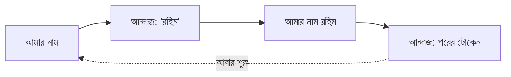

ফোনে টাইপ করার সময় ওপরে পরের শব্দের যে সাজেশন ভেসে ওঠে — মডেল মোটামুটি সেই কাজটাই করে। তফাত শুধু, সে এটা করে হাজার গুণ ভালোভাবে, আর একটার পর একটা টোকেন জুড়তে জুড়তে গোটা প্যারাগ্রাফ নামিয়ে দেয়। একটা বাক্য হোক, একটা [টুল কল (Tool call)](03-tools-and-environment.md#টুল-কল-tool-call) হোক, কি হাজার লাইনের একটা ফাইল — সবই তৈরি হয় এক টোকেন করে করে। মডেলের ঝুলিতে আর কোনো চাল নেই, এই একটাই।

💬 কথোপকথনে

🙋 "এজেন্ট কীভাবে 'ঠিক করে' কখন টুল ডাকবে?"

🧑‍🏫 "ও কিছুই ঠিক করে না — পুরোটাই next-token prediction। টুল কলটা আসলে একটা সাজানো টেক্সট, যেটা harness আউটপুট থেকে পড়ে নিয়ে চালায়।"

**🎬 টার্মিনালে দেখুন:** এক টোকেন করে করে বাক্য তৈরি হচ্ছে —

  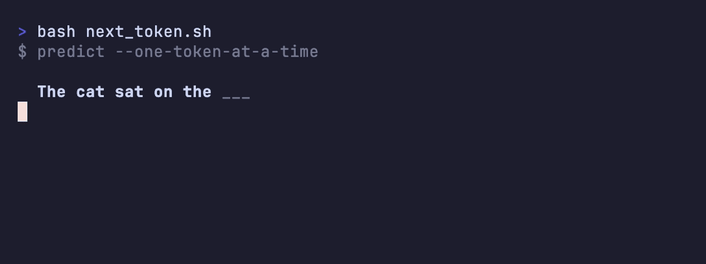

---

### নন-ডিটারমিনিজম (Non-determinism)

একই প্রশ্নের উত্তর প্রতিবার একটু একটু আলাদা হতে পারে। এমনকি হুবহু একই context দুবার দিলেও দু-রকম উত্তর আসা বিচিত্র নয়। 🎲

একটা গল্প দুজন বন্ধুকে বলতে বলুন তো — দুজন দু-ভাবে বলবে। মূল কথাটা এক, শুধু শব্দ আলাদা। মডেলও তেমন, প্রতিবার একটু আলাদা ছক্কা ফেলে। এটা ওর লেখা বানানোর স্বভাবেই গাঁথা, বন্ধ করার কোনো সুইচ নেই। তাই একই কাজে মডেলকে কোনো দিন মনে হবে জিনিয়াস, কোনো দিন আনাড়ি।

আর আমরা মানুষ তো সবেতেই প্যাটার্ন খুঁজি। পরপর দু-তিনটে বাজে উত্তর পেলেই ধরে নিই, "আজ মডেলটা গেছে।" বেশির ভাগ সময় ব্যাপারটা ওই এলোমেলো ছক্কারই কারসাজি — ভেতরে আসলে কিচ্ছু বদলায়নি।

💬 কথোপকথনে

🙋 "Claude আজ একদম যাচ্ছেতাই! ওরা কি কোনো খারাপ ভার্সন ছেড়েছে?"

🧑‍🏫 "সম্ভবত না। আউটপুট তো non-deterministic, একই কাজে ভালো-খারাপ দিন আসবেই। আগে কাল আরেকবার চালিয়ে দেখুন, তারপর কারণ খুঁজবেন।"

  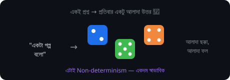

**🎬 টার্মিনালে দেখুন:** একই প্রম্পট দুবার → দুই উত্তর —

  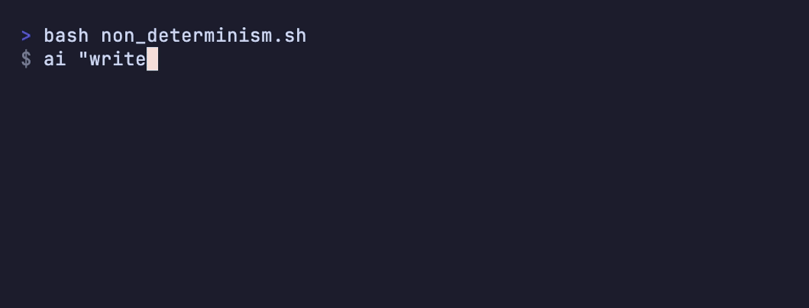

---

### মডেল প্রোভাইডার (Model provider)

মডেলটাকে আসলে যে চালায় — মানে [ইনফারেন্স (Inference)](#ইনফারেন্স-inference)-টা যে করে — সে-ই মডেল প্রোভাইডার। বেশির ভাগ সময় এটা দূরের কোনো সার্ভিস: Anthropic, OpenAI, Google। তবে চাইলে নিজের কম্পিউটারেও হতে পারে, যেমন Ollama বা LM Studio।

রেস্টুরেন্টের কথাই ধরুন। আপনি অর্ডার দেন, রান্নাঘর রান্না করে খাবার পাঠায়। 🍕 প্রোভাইডার হলো সেই রান্নাঘর — আপনি প্রশ্ন পাঠান, ও মডেল চালিয়ে উত্তর ফেরত দেয়। মজার ব্যাপার, [হার্নেস (Harness)](#হার্নেস-harness) নিজে কিন্তু মডেল চালায় না। সে কেবল প্রোভাইডারের দরজায় গিয়ে বলে আসে, "এই নাও, একটা উত্তর বানিয়ে দাও।"

💬 কথোপকথনে

🙋 "এয়ার-গ্যাপড ক্লায়েন্টের জন্য এটা অফলাইনে চালানো যাবে?"

🧑‍🏫 "প্রোভাইডারটা বদলে একটা লোকাল-এরটা বসান — ওদের মেশিনে Ollama। Harness-এর কিছুই যায়-আসে না, ও কেবল আলাদা একটা endpoint-এ গিয়ে কড়া নাড়বে।"

**🎬 টার্মিনালে দেখুন:** অর্ডার → রান্নাঘর (প্রোভাইডার) → খাবার ফেরত —

  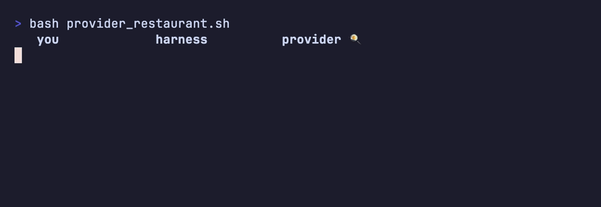

---

### হার্নেস (Harness)

মডেলের চারপাশের সবকিছু মিলিয়ে যা ওকে একটা কাজের [এজেন্ট (Agent)](02-sessions-context-turns.md#এজেন্ট-agent)-এ বদলে দেয়, তার নাম হার্নেস। [টুল (Tool)](03-tools-and-environment.md#টুল-tool), [সিস্টেম প্রম্পট (System prompt)](02-sessions-context-turns.md#সিস্টেম-প্রম্পট-system-prompt), পারমিশন — গোটা প্যাকেজটাই। 🧰

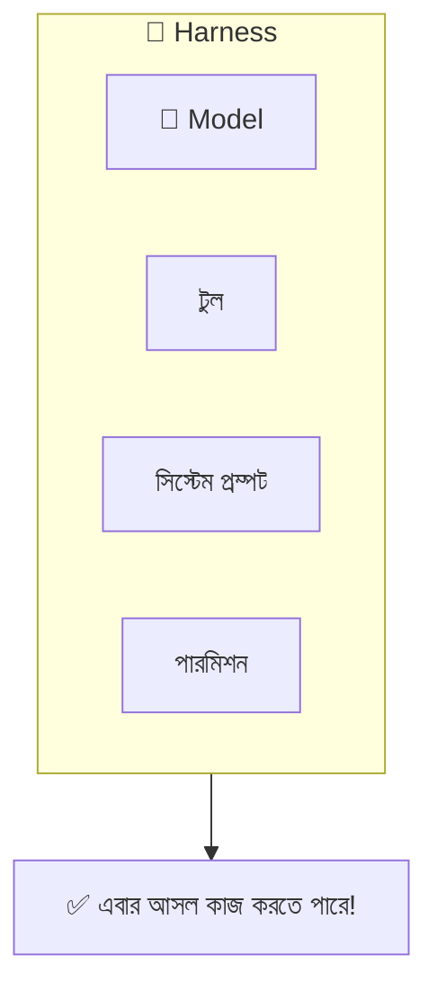

মডেল এখানে কেবল ইঞ্জিন 🏎️, আর হার্নেস হলো গোটা গাড়িটা — চাকা, স্টিয়ারিং, ব্রেক, সিট, সব। একই ইঞ্জিন দুটো আলাদা গাড়িতে বসিয়ে দিন, গাড়ি দুটো একদম আলাদা ভাবে চলবে। **Claude.ai** আর **Claude Code** একই মডেলে চলেও কেন আলাদা আচরণ করে, রহস্যটা ওখানেই — ওদের হার্নেস আলাদা।

💬 কথোপকথনে

🙋 "একই মডেল, তবু Claude Code ফাইল এডিট করছে আর Claude.ai শুধু উত্তর দিচ্ছে কেন?"

🧑‍🏫 "ওই যে, harness আলাদা। Claude Code-এ [ফাইলসিস্টেম (Filesystem)](03-tools-and-environment.md#ফাইলসিস্টেম-filesystem) টুল আছে, আলাদা সিস্টেম প্রম্পট আছে, একটা পারমিশন লেয়ার আছে। মডেলটা এখানে আসল ব্যাপার নয়।"

  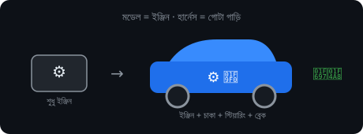

**🎬 টার্মিনালে দেখুন:** একই মডেল, আলাদা হার্নেস → আলাদা এজেন্ট —

  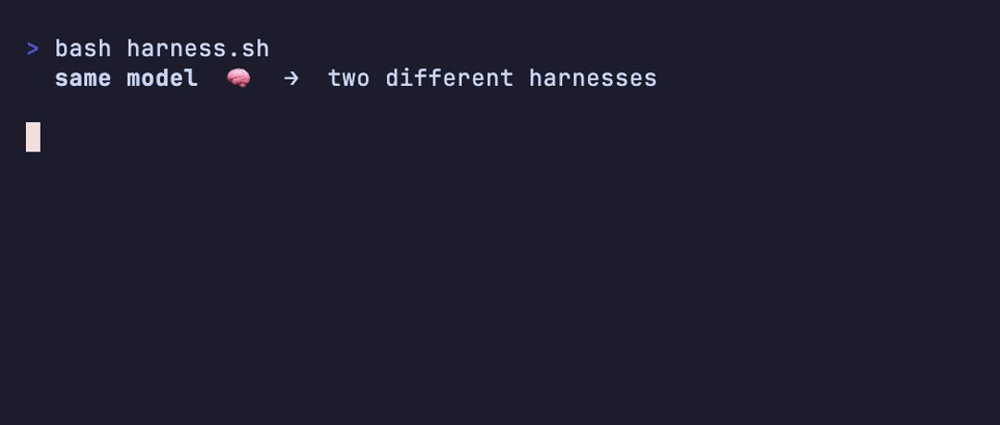

---

### মডেল প্রোভাইডার রিকোয়েস্ট (Model provider request)

[হার্নেস (Harness)](#হার্নেস-harness) থেকে [মডেল প্রোভাইডার (Model provider)](#মডেল-প্রোভাইডার-model-provider)-এ একবার যাওয়া আর ফেরা — এটুকুই একটা রিকোয়েস্ট। হার্নেস এখনকার পুরো context পাঠায়, প্রোভাইডার একটা উত্তর ফেরত দেয়। ✉️

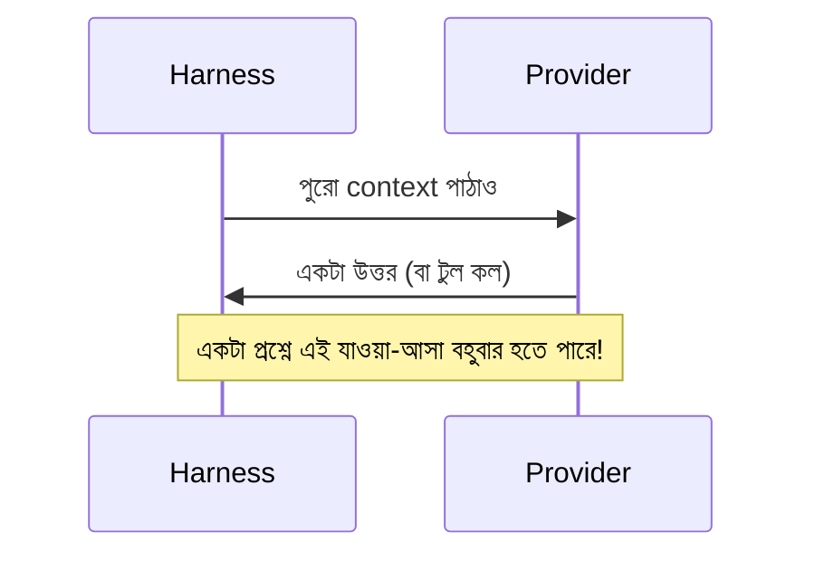

চিঠি পাঠিয়ে উত্তরের অপেক্ষা করার মতো ব্যাপার। 📬 তবে এখানে একটা টুইস্ট আছে — ডাকপিয়নটি যে গোল্ডি-মেমোরির 🐠! তাই প্রতিবার চিঠিতে পুরো গল্পটা গোড়া থেকে আবার লিখে দিতে হয়। আর আপনার একটামাত্র প্রশ্ন থেকেই অনেকগুলো রিকোয়েস্ট হয়ে যেতে পারে, কারণ এজেন্ট যতবার কোনো [টুল (Tool)](03-tools-and-environment.md#টুল-tool) ধরে, ততবারই একটা করে নতুন রিকোয়েস্ট লাগে।

💬 কথোপকথনে

🙋 "একটা প্রশ্নে ৪০ হাজার টোকেন পুড়ল?!"

🧑‍🏫 "টুল কলগুলো একবার গুনে দেখুন — ১২ বার grep, ৮ বার read, ৪ বার edit। প্রতিটা টুল রেজাল্ট আরেকটা request টেনে আনে, আর প্রতিবার পুরো [সেশন (Session)](02-sessions-context-turns.md#সেশন-session)-এর শুরুটা আবার পাঠানো হয়।"

**🎬 টার্মিনালে দেখুন:** একটা প্রশ্ন → অনেকগুলো রিকোয়েস্ট, প্রতিবার পুরো গল্প আবার —

  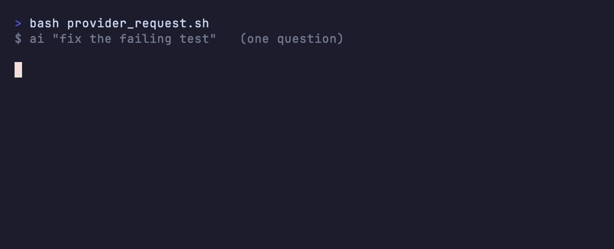

---

### ইনপুট টোকেন (Input tokens)

আপনি যা যা *পাঠাচ্ছেন* — প্রশ্ন, আগের কথাবার্তা, ফাইলের লেখা — সবই [টোকেন (Token)](#টোকেন-token) হিসেবে গোনা হয়। এগুলোই ইনপুট টোকেন। আর এদের দাম [আউটপুট টোকেন (Output tokens)](#আউটপুট-টোকেন-output-tokens)-এর চেয়ে কম। 📥

পরীক্ষায় প্রশ্নপত্র পড়া আর উত্তর লেখা — দুটোর পরিশ্রম কি এক? পড়তে এনার্জি কম পোড়ে, লিখতে গেলেই হাত ব্যথা করে। ইনপুট হলো সেই পড়ার দিকটা, তাই সস্তা।

💬 কথোপকথনে

🙋 "বিল এত বেশি, অথচ এজেন্ট তো তেমন কিছু লিখছেই না!"

🧑‍🏫 "এটা input token-এর কাণ্ড — প্রতি টার্নে পুরো সেশনটা আবার পাঠানো হচ্ছে। [প্রিফিক্স ক্যাশ (Prefix cache)](#প্রিফিক্স-ক্যাশ-prefix-cache) না থাকলে প্রতিবার গোটা ইতিহাসের দাম আবার দিতে হয়।"

---

### আউটপুট টোকেন (Output tokens)

মডেল যে [টোকেন (Token)](#টোকেন-token)গুলো *বানিয়ে ফেরত* দেয়, সেগুলোই আউটপুট টোকেন। এদের দাম ইনপুটের চেয়ে বেশি, কারণ লেখা বানাতে অনেক বেশি খাটুনি — মানে বেশি কম্পিউটিং — লাগে। 📤

সেই পরীক্ষার কথাতেই ফিরি: উত্তর লেখা পড়ার চেয়ে অনেক বেশি সময় আর কষ্টের। একটা কাজের টিপস দিই — এজেন্ট যদি পুরো ফাইল আবার না লিখে শুধু ছোট ছোট বদলটুকু (edit) করে, খরচ অনেকটা নেমে আসে। 💡

💬 কথোপকথনে

🙋 "রিফ্যাক্টর সেশনটা ক্রেডিট খেয়ে ফেলছে, অথচ ইনপুট তো ছোট।"

🧑‍🏫 "এজেন্ট পুরো ফাইল আবার লিখছে, প্যাচ করছে না। Output token ইনপুটের প্রায় পাঁচ গুণ দামি — ওকে edit করতে বলুন, বিল নেমে যাবে।"

---

### প্রিফিক্স ক্যাশ (Prefix cache)

এটা প্রোভাইডারের একটা ছোট্ট চালাকি। পরপর দুটো request-এর শুরুর অংশটা যদি এক হয়, তাহলে সে আগের কাজটা আবার করে না — পুরোনোটাই কাজে লাগিয়ে দেয়, আর ওই অংশের দাম অনেক কমিয়ে [ক্যাশ টোকেন (Cache tokens)](#ক্যাশ-টোকেন-cache-tokens) হিসেবে নেয়। 🧠💾

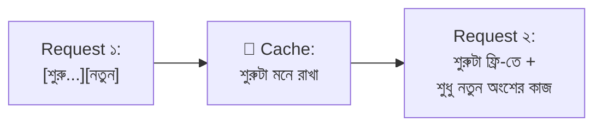

পরীক্ষায় প্রতিটা উত্তরের আগে নাম-রোল নতুন করে লিখতে গিয়ে যে সময়টা যায়, মনে আছে? এবার ভাবুন, আগেরবারের লেখাটা ম্যাজিকের মতো নিজে থেকে বসে যাচ্ছে। সময় বাঁচল। প্রিফিক্স ক্যাশ ঠিক ওই সময়টা — আর সঙ্গে টাকাটাও — বাঁচায়। তবে শর্ত একটাই: শুরুর কিছু একটা বদলে গেলেই (ধরুন, প্রতিবার একটা নতুন সময় ঢুকিয়ে দিলেন) cache ভেঙে পড়ে, আর বাকিটা পুরো দামে গোনা শুরু হয়। 💔

💬 কথোপকথনে

🙋 "সেশনের মাঝপথে বিল হঠাৎ লাফ দিল কেন?"

🧑‍🏫 "Harness প্রতি টার্নে সিস্টেম প্রম্পটে current time ঢোকাচ্ছিল। প্রথম যে টোকেনটা বদলায়, ঠিক সেখানেই prefix cache ভাঙে — তারপর থেকে প্রতিটা request পুরো দামে।"

  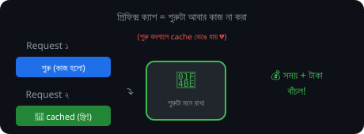

**🎬 টার্মিনালে দেখুন:** দ্বিতীয় রিকোয়েস্টে শুরুটা cached, দাম পড়ে গেল —

  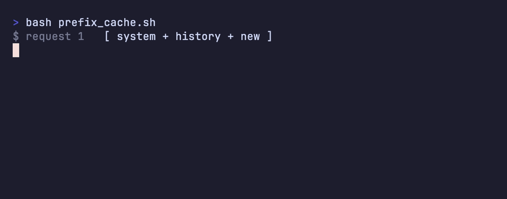

---

### ক্যাশ টোকেন (Cache tokens)

[ইনপুট টোকেন (Input tokens)](#ইনপুট-টোকেন-input-tokens)-এর মধ্যে যেগুলো প্রোভাইডার আগের request থেকে [প্রিফিক্স ক্যাশ (Prefix cache)](#প্রিফিক্স-ক্যাশ-prefix-cache)-এ জমিয়ে রেখেছিল, সেগুলোই ক্যাশ টোকেন। এদের আর নতুন করে প্রসেস করতে হয় না বলে দামও অনেক কম। 🏷️

হোমওয়ার্কের যে অংশটা গতকাল করে রেখেছেন, সেটা কি আজ আবার করবেন? শুধু নতুন অংশটুকুই তো বাকি। ক্যাশ টোকেন হলো সেই "আগেই করা" অংশ, যার পুরো দাম আর দিতে হয় না। লম্বা [সেশন (Session)](02-sessions-context-turns.md#সেশন-session) সস্তায় চালানোর আসল নায়ক কিন্তু এই জিনিসটাই। 🦸

💬 কথোপকথনে

🙋 "লম্বা সেশনে খরচ ভয়ংকর — এক রিফ্যাক্টরেই ৮ ডলার!"

🧑‍🏫 "Cache token-টা একবার দেখুন। Harness যদি টার্নে টার্নে সিস্টেম প্রম্পট বা ফাইল এলোমেলো করে, prefix ভেঙে যায়, আর প্রতিবার পুরো input রেটে দাম গুনতে হয়।"

---

## 🎯 সেকশন রিভিউ — সব মনে আছে তো?

প্রশ্ন ১: মডেল নিজে নিজে কাজ করতে পারে না কেন?

কারণ মডেল শুধু পরের টোকেন আন্দাজ করে। কাজ করাতে হলে তাকে **harness** দিয়ে সাজাতে হয় (টুল + সিস্টেম প্রম্পট + পারমিশন)।

প্রশ্ন ২: Training আর inference-এর পার্থক্য এক লাইনে বলুন।

Training = পরীক্ষার জন্য পড়া (একবার, খরুচে)। Inference = পরীক্ষার হলে উত্তর লেখা (প্রতিবার, প্রতি টোকেনে দাম)।

প্রশ্ন ৩: একই প্রশ্নে দু-রকম উত্তর আসে কেন?

**Non-determinism** — মডেলের লেখা বানানোর স্বাভাবিক স্বভাব। বন্ধ করার সুইচ নেই।

প্রশ্ন ৪: Output token input-এর চেয়ে দামি কেন?

লেখা (output) বানাতে পড়ার (input) চেয়ে অনেক বেশি কম্পিউটিং লাগে — প্রায় পাঁচ গুণ দামি।

## 🧩 মিনি-চ্যালেঞ্জ

🕵️ আপনার AI বিল হঠাৎ লাফ দিয়ে বেড়ে গেল। এই সেকশনের কোন ৩টা শব্দ এর কারণ ব্যাখ্যা করতে পারে?

- **Inference** — প্রতিবার প্রশ্নেই খরচ হয়।
- **Input tokens** — প্রতি টার্নে পুরো ইতিহাস আবার পাঠানো হয়।
- **Prefix cache (ভেঙে যাওয়া)** — শুরুর অংশ বদলালে cache কাজ করে না, পুরো দাম দিতে হয়।

বোনাস: **Output tokens** — এজেন্ট পুরো ফাইল আবার লিখলে খরচ পাঁচ গুণ!

## ✅ শেখার চেকলিস্ট

> 💡 *এই রিপো fork করে নিচের বক্সে টিক দিতে পারেন — কোনটা বুঝেছেন, মিলিয়ে নিন।*

- [ ] মডেল আসলে শুধু সংখ্যা, পরের টোকেন আন্দাজ করে
- [ ] প্যারামিটার = মডেলের "জ্ঞান", ট্রেনিং-এ বসে, পরে ফিক্সড
- [ ] Training (একবার) বনাম Inference (প্রতিবার)
- [ ] টোকেন = লেখার ছোট টুকরো, শব্দ নয়
- [ ] Next-token prediction = মডেলের একমাত্র চাল
- [ ] Non-determinism = একই প্রশ্নে আলাদা উত্তর, স্বাভাবিক
- [ ] Harness = মডেলকে এজেন্ট বানায়
- [ ] Input সস্তা, Output দামি, Cache সবচেয়ে সস্তা

---

[⬅️ মূল পাতা](../README.md) · [পরের সেকশন: সেশন, কনটেক্সট ও টার্ন ➡️](02-sessions-context-turns.md)
