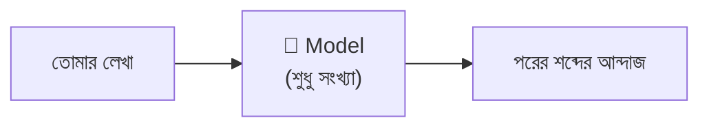
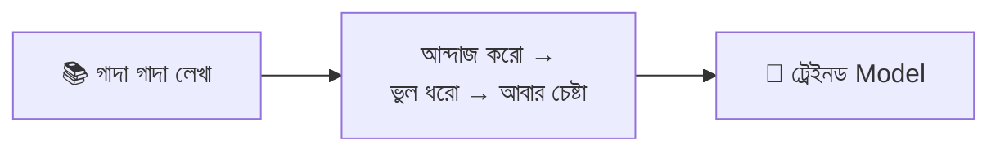
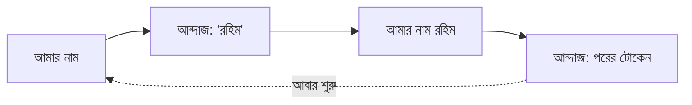
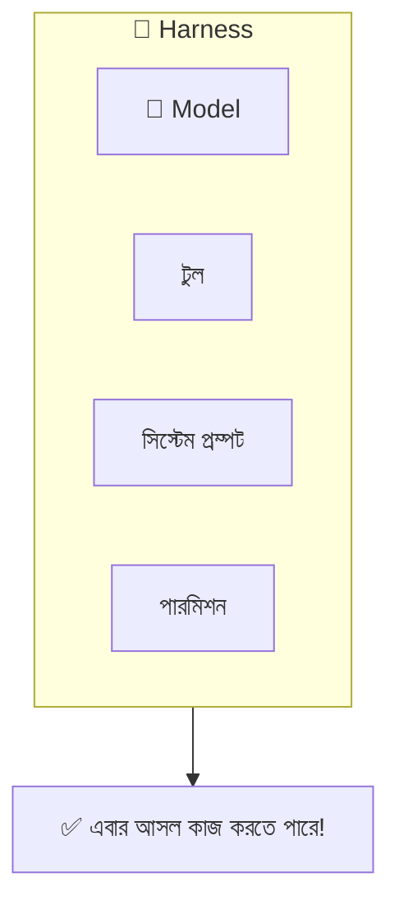
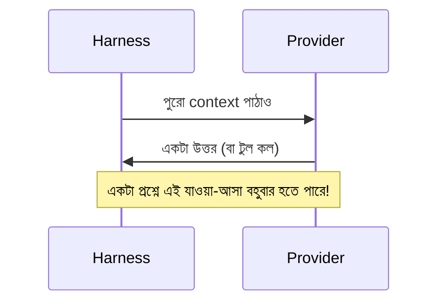
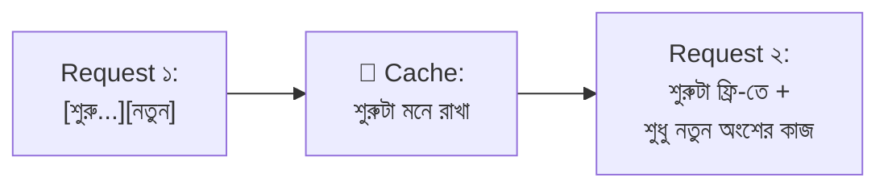

# সেকশন ১ — মডেল (The Model) 🧠

> এই সেকশনে আমরা AI-এর একদম পেটের ভেতরে ঢুকব। মডেল জিনিসটা আসলে কী, কীভাবে শেখে,
> কীভাবে উত্তর বানায়, আর কেন একই প্রশ্ন করলে প্রতিবার একটু আলাদা উত্তর আসে। 🎲
>
> 🐠 **পথে আমাদের সাথে থাকবে গোল্ডি** — একটা গোল্ডফিশ, যার স্মৃতি ৩ সেকেন্ড! ও বারবার মনে
> করিয়ে দেবে: মডেল নিজে কিচ্ছু মনে রাখে না।

[⬅️ মূল পাতায় ফিরে যাও](../README.md)

---

### মডেল (Model)
🔊 *উচ্চারণ: মো-ডেল*

AI-এর "ব্রেন" বলে যেটাকে ভাবো — সেটাই মডেল। কিন্তু মজার ব্যাপার: এর ভেতরে কোনো জাদু নেই, আছে শুধু একগাদা সংখ্যা ([প্যারামিটার (Parameters)](#প্যারামিটার-parameters))। আর এই সংখ্যাগুলো একটাই কাজ জানে — **পরের শব্দটা কী হবে আন্দাজ করা**। ব্যস, এটুকুই! 😮

> 🌟 **রোজকার উদাহরণ**
> মডেল হলো একটা ঢাউস ক্যালকুলেটরের মতো। ক্যালকুলেটর নিজে থেকে অঙ্ক করে? না! তুমি বোতাম না
> চাপলে ও শুধু হাঁ করে বসে থাকে। মডেলও ঠিক তেমন — কেউ প্রশ্ন না দিলে নিজে থেকে নড়েও না। 😴

"Claude Opus" বা "GPT-5" — এগুলো এক একটা model-এর নাম। কিন্তু মডেল একা বসে থাকলে কিচ্ছু করতে পারে না; তাকে আসল কাজে লাগাতে দরকার হয় একটা [হার্নেস (Harness)](#হার্নেস-harness)।

💬 কথোপকথনে

🙋 "প্ল্যানিং স্টেপের জন্য মডেলটা Sonnet থেকে Opus-এ বদলে দিই?"

🧑‍🏫 "চেষ্টা করতে পারো — তবে এই কাজে আসল খাটুনি করছে harness। সিস্টেম প্রম্পট আর টুল ঠিক না থাকলে শুধু মডেল বদলে লাভ নেই।"

🔍 আরও জানো

🐠 গোল্ডি বলছে: মডেল হলো **stateless** — মানে আমার মতোই, আগের কথা কিচ্ছু মনে রাখে না! প্রতিবার
তাকে পুরো গল্প আবার নতুন করে শোনাতে হয়। "ভাবছে" বা "ডিসিশন নিচ্ছে" বলে যা মনে হয়, পুরোটাই
আসলে পরের শব্দ আন্দাজ করা।

📝 নিজেকে যাচাই করো

প্রশ্ন: মডেল কি একা একা একটা পুরো ওয়েবসাইট বানিয়ে দিতে পারে?

**উত্তর:** নাহ্‌! মডেল শুধু পরের শব্দ আন্দাজ করতে পারে। আসল কাজ করতে তাকে একটা harness দিয়ে
সাজাতে হয়, যেটা টুল আর নির্দেশনা জোগায়।

  

<!-- GIF-PLACEHOLDER: একটা মডেল box-এ শব্দ ঢুকছে আর পরের শব্দ পপ করে বের হচ্ছে — সিম্পল লুপিং gif -->

---

### প্যারামিটার (Parameters)
🔊 *উচ্চারণ: প্যা-রা-মি-টার্স*

মডেলের ভেতরের সংখ্যাগুলো — প্রায়ই কয়েকশো **কোটি**! 🤯 মডেল যা কিছু "জানে", সব এই সংখ্যাগুলোর মধ্যেই লুকানো। এদের *weights*-ও বলা হয়।

> 🌟 **রোজকার উদাহরণ**
> ভাবো একটা গানের মিক্সিং বোর্ডে হাজার হাজার নব ঠিকঠাক জায়গায় ঘোরানো, যাতে গানটা একদম
> পারফেক্ট শোনায়। 🎚️ Parameter হলো সেই নবগুলোর সেটিং। [ট্রেনিং (Training)](#ট্রেনিং-training)-এর
> সময় এগুলো একে একে ঠিক করা হয়।

ট্রেনিং এই সংখ্যাগুলো বসায়; এরপর মডেল চলার সময় ([ইনফারেন্স (Inference)](#ইনফারেন্স-inference)) এগুলো আর একটুও বদলায় না।

💬 কথোপকথনে

🙋 "আমাদের কোডবেসের ওপর মডেলটাকে fine-tune করা যায় না?"

🧑‍🏫 "সেটা করলে parameter বদলে যাবে — পুরো নতুন মডেল হয়ে যাবে। এক প্রজেক্টের জন্য সেটা না করে কোডবেসটা [কনটেক্সট (Context)](02-sessions-context-turns.md#কনটেক্সট-context)-এ লোড করাই সস্তা।"

🔍 আরও জানো

মডেলকে নতুন কিছু "শেখাতে" হলে এই parameter বদলাতে হয় — সেটা মাসের পর মাস সময় আর গাদা গাদা
টাকার ব্যাপার। 💸 তাই এক প্রজেক্টের জন্য মডেলকে আবার ট্রেনিং না দিয়ে, দরকারি তথ্য সরাসরি
context-এ দিয়ে দেওয়াই সহজ আর সস্তা।

📝 নিজেকে যাচাই করো

প্রশ্ন: মডেল উত্তর দেওয়ার সময় parameter গুলো কি বদলায়?

**উত্তর:** না! ট্রেনিং-এর সময় একবার বসানো হয়, তারপর সেগুলো একদম ফিক্সড।

<!-- GIF-PLACEHOLDER: হাজার হাজার slider একসাথে adjust হচ্ছে — satisfying gif -->

---

### ট্রেনিং (Training)
🔊 *উচ্চারণ: ট্রেই-নিং*

মডেলের [প্যারামিটার (Parameters)](#প্যারামিটার-parameters)গুলো ঠিকঠাক বসানোর প্রসেস। বিশাল পরিমাণ লেখা বারবার দেখিয়ে মডেলকে "পরের শব্দ আন্দাজ"-এ ওস্তাদ বানানো হয়।

> 🌟 **রোজকার উদাহরণ**
> পরীক্ষার আগে হাজার হাজার অঙ্ক প্র্যাকটিস করার মতো। যত প্র্যাকটিস, তত ভুল কম। ✏️ Training হলো
> মডেলের সেই প্র্যাকটিস — তবে এটা হয় মাত্র একবার, বিশাল খরচ করে, [মডেল প্রোভাইডার (Model provider)](#মডেল-প্রোভাইডার-model-provider) করে।

💬 কথোপকথনে

🙋 "মডেলকে আমাদের internal API চেনানো যায়?"

🧑‍🏫 "ট্রেনিং দিয়ে নয় — ওটা প্রোভাইডারের মাসব্যাপী কাজ। বরং API-এর ডকটা context-এ দাও, ওটাই তোমার হাতে থাকা আসল উপায়।"

🔍 আরও জানো

ট্রেনিং একবারের কাজ, আর ভয়াবহ খরুচে। এর পরে মডেল আর "আজকের খবর" শেখে না — তাই আজ সকালে কী
হলো মডেল জানবে না, যদি না তুমি নিজে সেটা context-এ বলে দাও।

📝 নিজেকে যাচাই করো

প্রশ্ন: আজকের খবর মডেলকে জানাতে চাইলে কি তাকে আবার ট্রেনিং দিতে হবে?

**উত্তর:** নাহ্‌, সেটা পাগলামি — ভীষণ কঠিন আর খরুচে। খবরটা সরাসরি context-এ দিয়ে দিলেই হয়ে গেল।

<!-- GIF-PLACEHOLDER: accuracy bar ধীরে ধীরে ভরে উঠছে — progress gif -->

---

### ইনফারেন্স (Inference)
🔊 *উচ্চারণ: ইন-ফা-রেন্স*

ট্রেইনড মডেলকে চালিয়ে উত্তর বানানো। তুমি যখনই কিছু জিজ্ঞেস করো, পর্দার পেছনে এই inference-ই ঘটে। ⚙️

> 🌟 **রোজকার উদাহরণ**
> Training যদি হয় পরীক্ষার জন্য পড়াশোনা, তাহলে inference হলো আসল পরীক্ষার হলে বসে উত্তর লেখা।
> 📝 পড়াটা একবারই হয়েছিল; এখন প্রতিবার উত্তর লেখার সময় সেই শেখা কাজে লাগছে।

[প্যারামিটার (Parameters)](#প্যারামিটার-parameters) ফিক্সড থাকে; মডেল শুধু পরের শব্দ আন্দাজ করে যায়। ট্রেনিংয়ের তুলনায় সস্তা, কিন্তু এর দাম গোনা হয় প্রতি [টোকেন (Token)](#টোকেন-token) হিসেবে — আর এটাই AI ব্যবহারের আসল খরচ। 💰

💬 কথোপকথনে

🙋 "বিল ফ্ল্যাট লাইসেন্স ফি না হয়ে ব্যবহারের সাথে বাড়ে কেন?"

🧑‍🏫 "তুমি inference-এর দাম দিচ্ছ — প্রতিবার প্রশ্নে প্রোভাইডারের হার্ডওয়্যারে মডেল চলে। আর এক [টার্ন (Turn)](02-sessions-context-turns.md#টার্ন-turn)-এ টুল ডাকলে অনেকগুলো রিকোয়েস্ট হয়।"

🔍 আরও জানো

বিল কেন ব্যবহারের সাথে বাড়ে, একটা ফিক্সড মাসিক ফি কেন নয়? কারণ তুমি inference-এর দাম দিচ্ছ —
প্রতিবার প্রশ্ন করলে প্রোভাইডারের কম্পিউটারে মডেলটা চলে, আর প্রতিবার চলার খরচ আছে।

📝 নিজেকে যাচাই করো

প্রশ্ন: Inference-এর সময় মডেল কি নতুন কিছু শেখে?

**উত্তর:** না। শেখা শেষ ট্রেনিং-এ। Inference শুধু সেই শেখা খাটিয়ে উত্তর বানায়।

  

<!-- GIF-PLACEHOLDER: পরীক্ষার হলে কলম দিয়ে দ্রুত উত্তর লেখার ছোট gif -->

---

### টোকেন (Token)
🔊 *উচ্চারণ: টো-কেন*

মডেল যে ছোট ছোট টুকরায় লেখা পড়ে আর লেখে। প্রায় শব্দের সমান, কিন্তু হুবহু শব্দ নয় — সাধারণ শব্দ এক টোকেন, বিরল বা লম্বা শব্দ কয়েক টোকেনে ভেঙে যায়।

  

> 🌟 **রোজকার উদাহরণ**
> খাতায় উত্তর লেখার সময় ভাবো প্রতিটা শব্দাংশ আলাদা ঘরে বসছে। ছোট শব্দ এক ঘরে এঁটে যায়, কঠিন
> বড় শব্দ কয়েক ঘর জুড়ে বসে। 🧱 Token হলো সেই "ঘর"।

[কনটেক্সট উইন্ডো (Context window)](02-sessions-context-turns.md#কনটেক্সট-উইন্ডো-context-window)-এর সাইজ, খরচ, গতি — সব কিছুই টোকেন দিয়ে মাপা হয়।

> ⚠️ **এড়িয়ে চলো:** টোকেনকে "শব্দ" ভেবে নেওয়া। টোকেনের সীমা শব্দের সীমার সাথে মেলে না, আর খরচ-গতি সব টোকেনেই হিসাব হয়।

💬 কথোপকথনে

🙋 "এই প্রম্পটটা কত বড় হবে?"

🧑‍🏫 "একটা tokenizer-এ চালিয়ে দেখো — লেখাটা ছোট, কিন্তু এতে অদ্ভুত অক্ষর থাকায় তুমি যা ভাবছ তার চেয়ে বেশি টোকেনে ভাঙবে।"

🔍 আরও জানো

একই অর্থের লেখাও বেশি token নিতে পারে যদি তাতে অদ্ভুত অক্ষর, কোড, বা ইমোজি 🎉 থাকে। তাই
"আমার প্রম্পট কত বড়" জানতে হলে শব্দ না গুনে token গোনাই বুদ্ধিমানের কাজ।

📝 নিজেকে যাচাই করো

প্রশ্ন: "cat" আর "Hippopotamus" — কোনটা বেশি টোকেনে ভাঙার চান্স বেশি?

**উত্তর:** "Hippopotamus" 🦛 — লম্বা আর তুলনায় বিরল শব্দ, তাই কয়েক টোকেনে ভাঙবে।

**🎬 টার্মিনালে দেখো:**

  

---

### নেক্সট-টোকেন প্রেডিকশন (Next-token prediction)
🔊 *উচ্চারণ: নেক্সট-টো-কেন প্রি-ডিক-শন*

মডেল আসলে যা করে: কনটেক্সট দেখে একটা পরের [টোকেন (Token)](#টোকেন-token) বেছে নেয়, সেটা জুড়ে দেয়, তারপর আবার চালায়। আবার। আবার। 🔁

> 🌟 **রোজকার উদাহরণ**
> ফোনের কিবোর্ডে টাইপ করার সময় ওপরে পরের শব্দের সাজেশন আসে না? 📱 মডেল ঠিক ওটাই করে — তবে
> হাজার গুণ ভালোভাবে, আর একটার পর একটা টোকেন জুড়ে জুড়ে পুরো প্যারাগ্রাফ নামিয়ে দেয়।

একটা বাক্য, একটা [টুল কল (Tool call)](03-tools-and-environment.md#টুল-কল-tool-call), হাজার লাইনের ফাইল — সবই বানানো হয় এক টোকেন করে করে। মডেলের আর কোনো মোড নেই, এটাই একমাত্র চাল।

💬 কথোপকথনে

🙋 "এজেন্ট কীভাবে 'ঠিক করে' কখন টুল ডাকবে?"

🧑‍🏫 "ও ঠিক করে না — পুরোটাই next-token prediction! টুল কলটা স্রেফ একটা স্ট্রাকচার্ড টেক্সট, যেটা harness আউটপুট থেকে পড়ে নেয়।"

📝 নিজেকে যাচাই করো

প্রশ্ন: মডেল কি পুরো উত্তরটা একবারে "ভেবে" বানিয়ে ফেলে?

**উত্তর:** না! এক টোকেন করে করে, একটার পর একটা জুড়ে। প্রতিবার শুধু "পরেরটা কী" — ব্যস।

**🎬 টার্মিনালে দেখো:** এক টোকেন করে করে বাক্য তৈরি হচ্ছে —

  

---

### নন-ডিটারমিনিজম (Non-determinism)
🔊 *উচ্চারণ: নন-ডি-টার্-মি-নিজম*

একই প্রশ্নের উত্তর প্রতিবার একটু একটু আলাদা হতে পারে। হুবহু একই context দিয়ে দুবার চালালেও দু-রকম উত্তর আসতে পারে। 🎲

> 🌟 **রোজকার উদাহরণ**
> একই গল্প দুজন বন্ধুকে বলতে বললে দুজন একটু আলাদা করে বলবে — মূল ভাব এক, শব্দ আলাদা। মডেলও
> তেমন, প্রতিবার একটু আলাদা "ছক্কা" ফেলে। 🎲

এটা মডেলের লেখা বানানোর স্বাভাবিক স্বভাব — বন্ধ করার কোনো সুইচ নেই। তাই একই কাজে মডেলকে কোনো দিন জিনিয়াস, কোনো দিন একটু আনাড়ি মনে হতে পারে। 🤷

💬 কথোপকথনে

🙋 "Claude আজ একদম বাজে! ওরা কি খারাপ ভার্সন ছেড়েছে?"

🧑‍🏫 "সম্ভবত না — আউটপুট non-deterministic। একই কাজে ভালো-খারাপ দিন আসবেই। কারণ খোঁজার আগে কাল আরেকবার ট্রাই করো।"

🔍 আরও জানো

আমরা মানুষ প্যাটার্ন খুঁজি — পরপর কয়েকটা বাজে উত্তর পেলেই মনে হয় "আজ মডেল খারাপ হয়ে গেছে!" 😤
বেশিরভাগ সময় এটা স্রেফ ওই এলোমেলো ছক্কারই ব্যাপার, আসলে কিচ্ছু বদলায়নি।

📝 নিজেকে যাচাই করো

প্রশ্ন: একই প্রশ্নে দু-রকম উত্তর পেলে কি ধরে নেব মডেল নষ্ট হয়ে গেছে?

**উত্তর:** না! এটা non-determinism — একদম স্বাভাবিক। প্যানিক করার আগে কাল আরেকবার ট্রাই করো।

  

**🎬 টার্মিনালে দেখো:** একই প্রম্পট দুবার → দুই উত্তর —

  

---

### মডেল প্রোভাইডার (Model provider)
🔊 *উচ্চারণ: মো-ডেল প্রো-ভাই-ডার*

যে মডেলটাকে আসলে চালায় ([ইনফারেন্স (Inference)](#ইনফারেন্স-inference) করে)। সাধারণত একটা দূরের সার্ভিস (Anthropic, OpenAI, Google), তবে নিজের কম্পিউটারেও হতে পারে (Ollama, LM Studio)।

> 🌟 **রোজকার উদাহরণ**
> তুমি অর্ডার দাও, রান্নাঘর রান্না করে খাবার পাঠায় 🍕 — সেই রান্নাঘরটাই model provider। তুমি
> প্রশ্ন পাঠাও, ও মডেল চালিয়ে উত্তর ফেরত দেয়।

[হার্নেস (Harness)](#হার্নেস-harness) নিজে মডেল চালায় না; সে প্রোভাইডারকে অনুরোধ পাঠায়, "এই নাও, একটা উত্তর বানিয়ে দাও।"

💬 কথোপকথনে

🙋 "এয়ার-গ্যাপড ক্লায়েন্টের জন্য এটা অফলাইনে চালানো যাবে?"

🧑‍🏫 "Model provider বদলে একটা লোকাল-এরটা দাও — ওদের মেশিনে Ollama। Harness-এর কিছু যায়-আসে না, শুধু আলাদা একটা endpoint-এ হিট করবে।"

📝 নিজেকে যাচাই করো

প্রশ্ন: ইন্টারনেট ছাড়া কি মডেল চালানো যায়?

**উত্তর:** হ্যাঁ — যদি provider হয় নিজের কম্পিউটারের কোনো লোকাল সফটওয়্যার (যেমন Ollama)।

<!-- GIF-PLACEHOLDER: রেস্টুরেন্টে অর্ডার → রান্নাঘর → খাবার ফেরত — ছোট gif -->

---

### হার্নেস (Harness)
🔊 *উচ্চারণ: হা-র্নেস*

মডেলের চারপাশের সব কিছু, যা মডেলকে একটা কাজের [এজেন্ট (Agent)](02-sessions-context-turns.md#এজেন্ট-agent)-এ বদলে দেয়: [টুল (Tool)](03-tools-and-environment.md#টুল-tool), [সিস্টেম প্রম্পট (System prompt)](02-sessions-context-turns.md#সিস্টেম-প্রম্পট-system-prompt), পারমিশন — পুরো প্যাকেজ। 🧰

> 🌟 **রোজকার উদাহরণ**
> মডেল হলো শুধু ইঞ্জিন 🏎️, আর harness হলো গোটা গাড়ি — চাকা, স্টিয়ারিং, ব্রেক, সিট। একই
> ইঞ্জিন আলাদা গাড়িতে বসালে গাড়িগুলো একদম আলাদা চলে।

**Claude.ai** আর **Claude Code** একই মডেলে চলে, তবু আলাদা আচরণ করে — কারণ ওদের harness আলাদা।

💬 কথোপকথনে

🙋 "একই মডেল, তবু Claude Code ফাইল এডিট করছে আর Claude.ai শুধু উত্তর দিচ্ছে কেন?"

🧑‍🏫 "আলাদা harness — Claude Code-এ [ফাইলসিস্টেম (Filesystem)](03-tools-and-environment.md#ফাইলসিস্টেম-filesystem) টুল, আলাদা সিস্টেম প্রম্পট, পারমিশন লেয়ার আছে। মডেল এখানে আসল ফ্যাক্টর নয়।"

📝 নিজেকে যাচাই করো

প্রশ্ন: একই মডেল ব্যবহার করেও দুটো অ্যাপ আলাদা কাজ করে কেন?

**উত্তর:** ওদের harness আলাদা — আলাদা টুল, আলাদা সিস্টেম প্রম্পট, আলাদা নিয়ম।

  

<!-- GIF-PLACEHOLDER: একই ইঞ্জিন আলাদা আলাদা গাড়িতে বসছে — এমন gif -->

---

### মডেল প্রোভাইডার রিকোয়েস্ট (Model provider request)
🔊 *উচ্চারণ: মো-ডেল প্রো-ভাই-ডার রি-কোয়েস্ট*

[হার্নেস (Harness)](#হার্নেস-harness) থেকে [মডেল প্রোভাইডার (Model provider)](#মডেল-প্রোভাইডার-model-provider)-এ একবার যাওয়া-আসা। হার্নেস বর্তমান context পাঠায়; প্রোভাইডার একটা উত্তর ফেরত দেয়। ✉️

> 🌟 **রোজকার উদাহরণ**
> চিঠি পাঠিয়ে উত্তর পাওয়ার মতো 📬 — কিন্তু মজার টুইস্ট: ডাকপিয়ন গোল্ডি-মেমোরির 🐠, তাই প্রতিবার
> চিঠিতে পুরো গল্পটা আবার গোড়া থেকে লিখতে হয়!

তোমার একটাই প্রশ্ন থেকে অনেকগুলো request হতে পারে — কারণ এজেন্ট প্রতিবার [টুল (Tool)](03-tools-and-environment.md#টুল-tool) ব্যবহার করলে আরেকটা নতুন request লাগে।

💬 কথোপকথনে

🙋 "একটা প্রশ্নে ৪০ হাজার টোকেন পুড়ল?!"

🧑‍🏫 "টুল কলগুলো দেখো — ১২ বার grep, ৮ বার read, ৪ বার edit। প্রতিটা টুল রেজাল্ট আরেকটা request আনে, আর প্রতিবার পুরো [সেশন (Session)](02-sessions-context-turns.md#সেশন-session)-এর শুরুটা আবার পাঠানো হয়।"

🔍 আরও জানো

একটা প্রশ্ন কীভাবে ৪০ হাজার token খেয়ে ফেলে?! 😱 এজেন্ট হয়তো ১২ বার সার্চ, ৮ বার পড়া, ৪ বার
এডিট করেছে — প্রতিটা টুলের ফলাফলের পর আরেকটা request, আর প্রতিবার পুরো ইতিহাস আবার পাঠানো হয়।

📝 নিজেকে যাচাই করো

প্রশ্ন: একটা প্রশ্ন মানে কি সবসময় একটাই provider request?

**উত্তর:** না। টুল ব্যবহার করলে একই প্রশ্নে গাদা গাদা request হয়ে যেতে পারে।

<!-- GIF-PLACEHOLDER: চিঠি পাঠানো ও উত্তর ফেরত আসার বারবার লুপ — এমন gif -->

---

### ইনপুট টোকেন (Input tokens)
🔊 *উচ্চারণ: ইন-পুট টো-কেন্স*

তুমি যা *পাঠাও* — প্রশ্ন, আগের কথা, ফাইলের লেখা — সব [টোকেন (Token)](#টোকেন-token) হিসেবে গোনা হয়। এগুলোই input token, আর এদের দাম [আউটপুট টোকেন (Output tokens)](#আউটপুট-টোকেন-output-tokens)-এর চেয়ে কম। 📥

> 🌟 **রোজকার উদাহরণ**
> পরীক্ষায় প্রশ্নপত্র *পড়ার* মতো — পড়তে এনার্জি কম লাগে, কিন্তু *লিখতে* গেলেই হাত ব্যথা! 😅
> তাই input (পড়া) সস্তা, output (লেখা) দামি।

💬 কথোপকথনে

🙋 "বিল বেশি, অথচ এজেন্ট তো তেমন কিছু লিখছেই না!"

🧑‍🏫 "এটা input token — প্রতি টার্নে পুরো সেশনটা আবার পাঠানো হচ্ছে। [প্রিফিক্স ক্যাশ (Prefix cache)](#প্রিফিক্স-ক্যাশ-prefix-cache) না থাকলে প্রতিবার ইতিহাসের দাম আবার দিতে হয়।"

📝 নিজেকে যাচাই করো

প্রশ্ন: Input আর output token — কোনটা সাধারণত সস্তা?

**উত্তর:** Input token। (পড়া সস্তা, লেখা দামি!)

---

### আউটপুট টোকেন (Output tokens)
🔊 *উচ্চারণ: আউট-পুট টো-কেন্স*

মডেল যে [টোকেন (Token)](#টোকেন-token)গুলো *ফেরত বানিয়ে* দেয়। এদের দাম [ইনপুট টোকেন (Input tokens)](#ইনপুট-টোকেন-input-tokens)-এর চেয়ে বেশি, কারণ লেখা বানাতে বেশি খাটুনি (কম্পিউটিং) লাগে। 📤

> 🌟 **রোজকার উদাহরণ**
> পরীক্ষায় উত্তর *লেখা* — পড়ার চেয়ে অনেক বেশি কষ্ট আর সময়। ✍️ তাই output token-এর দাম বেশি।
> টিপস: এজেন্ট যদি পুরো ফাইল আবার না লিখে শুধু ছোট ছোট বদল (edit) করে, খরচ অনেক কমে যায়! 💡

💬 কথোপকথনে

🙋 "রিফ্যাক্টর সেশনটা ক্রেডিট খেয়ে ফেলছে, অথচ ইনপুট তো ছোট।"

🧑‍🏫 "এজেন্ট পুরো ফাইল আবার লিখছে, প্যাচ করছে না। Output token ইনপুটের প্রায় ৫ গুণ দামি — edit করাও, বিল নেমে যাবে।"

📝 নিজেকে যাচাই করো

প্রশ্ন: পুরো ফাইল আবার লেখা বনাম শুধু কয়েক লাইন বদলানো — কোনটায় output খরচ কম?

**উত্তর:** শুধু কয়েক লাইন বদলানো (edit) — কম output token, কম বিল।

---

### প্রিফিক্স ক্যাশ (Prefix cache)
🔊 *উচ্চারণ: প্রি-ফিক্স ক্যাশ*

প্রোভাইডারের একটা দারুণ চালাকি: পরপর দুটো request-এর শুরুর অংশ এক হলে, আগের কাজটা আবার না করে সেটা পুনরায় ব্যবহার করে — আর সেই অংশের দাম অনেক কমিয়ে [ক্যাশ টোকেন (Cache tokens)](#ক্যাশ-টোকেন-cache-tokens) হিসেবে নেয়। 🧠💾

> 🌟 **রোজকার উদাহরণ**
> পরীক্ষায় প্রতিটা উত্তরে নাম-রোল আবার পুরো লিখতে হয় বলে কত সময় নষ্ট! 😩 কল্পনা করো আগেরটা
> ম্যাজিকের মতো কপি হয়ে যাচ্ছে — সময় বাঁচল। Prefix cache ঠিক সেই সময় (আর টাকা) বাঁচায়।

কিন্তু শুরুর কোনো কিছু বদলে গেলে (যেমন প্রতিবার একটা নতুন সময় ঢুকিয়ে দেওয়া) cache ভেঙে যায়, আর বাকিটা পুরো দামে গোনা হয়। 💔

💬 কথোপকথনে

🙋 "সেশনের মাঝপথে বিল হঠাৎ লাফ দিল কেন?"

🧑‍🏫 "Harness প্রতি টার্নে সিস্টেম প্রম্পটে current time ঢোকাচ্ছিল। প্রথম বদলে যাওয়া টোকেনেই prefix cache ভাঙে, তারপর প্রতিটা request পুরো দামে।"

🔍 আরও জানো

বিল হঠাৎ মাঝপথে লাফ দিয়ে বাড়ল কেন? 📈 হয়তো harness প্রতি টার্নে সিস্টেম প্রম্পটে নতুন সময় ঢোকাচ্ছে।
প্রথম যে টোকেনটা বদলায়, সেখানেই cache ভাঙে — তারপর প্রতিটা request পুরো দামে।

📝 নিজেকে যাচাই করো

প্রশ্ন: Prefix cache কখন ভেঙে যায়?

**উত্তর:** যখন request-এর শুরুর অংশ বদলে যায় — যেমন সিস্টেম প্রম্পটে প্রতিবার নতুন তথ্য (সময়) ঢোকানো।

  

<!-- GIF-PLACEHOLDER: একটা অংশে "💾 cached" স্ট্যাম্প পড়ছে, পরের বার সেটা skip হচ্ছে — এমন gif -->

---

### ক্যাশ টোকেন (Cache tokens)
🔊 *উচ্চারণ: ক্যাশ টো-কেন্স*

[ইনপুট টোকেন (Input tokens)](#ইনপুট-টোকেন-input-tokens) যেগুলো প্রোভাইডার আগের request থেকে [প্রিফিক্স ক্যাশ (Prefix cache)](#প্রিফিক্স-ক্যাশ-prefix-cache)-এ জমিয়ে রেখেছে, তাই আবার প্রসেস করতে হয় না — দামও অনেক কম। 🏷️

> 🌟 **রোজকার উদাহরণ**
> হোমওয়ার্কের যে অংশ আগেই করে রেখেছ, সেটা আবার করতে হয় না — শুধু নতুন অংশটুকু করো। 📒 Cache
> token হলো সেই "আগেই করা" অংশ, যার জন্য পুরো দাম দিতে হয় না। লম্বা [সেশন (Session)](02-sessions-context-turns.md#সেশন-session)
> সস্তা রাখার আসল হিরো এটাই! 🦸

💬 কথোপকথনে

🙋 "লম্বা সেশনে খরচ ভয়ংকর — এক রিফ্যাক্টরে ৮ ডলার!"

🧑‍🏫 "Cache token চেক করো। Harness যদি টার্নে টার্নে সিস্টেম প্রম্পট বা ফাইল এলোমেলো করে, prefix ভাঙে আর প্রতিবার পুরো input রেটে দাম দিতে হয়।"

📝 নিজেকে যাচাই করো

প্রশ্ন: Cache token সাধারণ input token-এর চেয়ে সস্তা কেন?

**উত্তর:** কারণ প্রোভাইডার ওই অংশের কাজ আগেই সেরে রেখেছে, নতুন করে আর করতে হয় না।

---

## 🎯 সেকশন রিভিউ — সব মনে আছে তো?

প্রশ্ন ১: মডেল নিজে নিজে কাজ করতে পারে না কেন?

কারণ মডেল শুধু পরের টোকেন আন্দাজ করে। কাজ করতে তাকে **harness** দিয়ে সাজাতে হয় (টুল + সিস্টেম প্রম্পট + পারমিশন)।

প্রশ্ন ২: Training আর inference-এর পার্থক্য এক লাইনে বলো।

Training = পরীক্ষার জন্য পড়া (একবার, খরুচে)। Inference = পরীক্ষার হলে উত্তর লেখা (প্রতিবার, প্রতি টোকেনে দাম)।

প্রশ্ন ৩: কেন একই প্রশ্নে দু-রকম উত্তর আসে?

**Non-determinism** — মডেলের লেখা বানানোর স্বাভাবিক স্বভাব। বন্ধ করার সুইচ নেই।

প্রশ্ন ৪: Output token input-এর চেয়ে দামি কেন?

লেখা (output) বানাতে পড়ার (input) চেয়ে অনেক বেশি কম্পিউটিং লাগে — প্রায় ৫ গুণ দামি।

## 🧩 মিনি-চ্যালেঞ্জ

🕵️ তোমার AI বিল হঠাৎ লাফ দিয়ে বেড়ে গেল। এই সেকশনের কোন ৩টা শব্দ এর কারণ ব্যাখ্যা করতে পারে?

- **Inference** — প্রতিবার প্রশ্নেই খরচ হয়।
- **Input tokens** — প্রতি টার্নে পুরো ইতিহাস আবার পাঠানো হয়।
- **Prefix cache (ভেঙে যাওয়া)** — শুরুর অংশ বদলালে cache কাজ করে না, পুরো দাম দিতে হয়।

বোনাস: **Output tokens** — এজেন্ট পুরো ফাইল আবার লিখলে খরচ পাঁচ গুণ!

## ✅ শেখার চেকলিস্ট

> 💡 *এই রিপো fork করে নিচের বক্সে টিক দিতে পারো — কোনটা বুঝেছ মিলিয়ে নাও!*

- [ ] মডেল আসলে শুধু সংখ্যা, পরের টোকেন আন্দাজ করে
- [ ] প্যারামিটার = মডেলের "জ্ঞান", ট্রেনিং-এ বসে, পরে ফিক্সড
- [ ] Training (একবার) বনাম Inference (প্রতিবার)
- [ ] টোকেন = লেখার ছোট টুকরা, শব্দ নয়
- [ ] Next-token prediction = মডেলের একমাত্র চাল
- [ ] Non-determinism = একই প্রশ্নে আলাদা উত্তর, স্বাভাবিক
- [ ] Harness = মডেলকে এজেন্ট বানায়
- [ ] Input সস্তা, Output দামি, Cache সবচেয়ে সস্তা

---

[⬅️ মূল পাতা](../README.md) · [পরের সেকশন: সেশন, কনটেক্সট ও টার্ন ➡️](02-sessions-context-turns.md)
