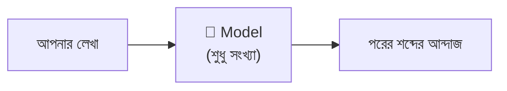
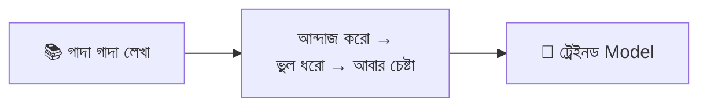
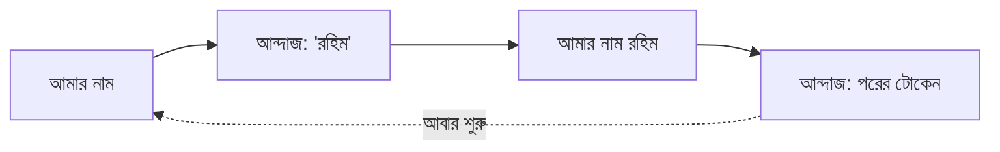
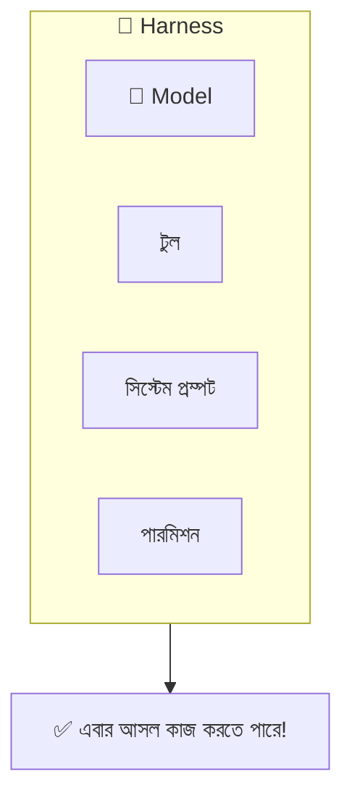
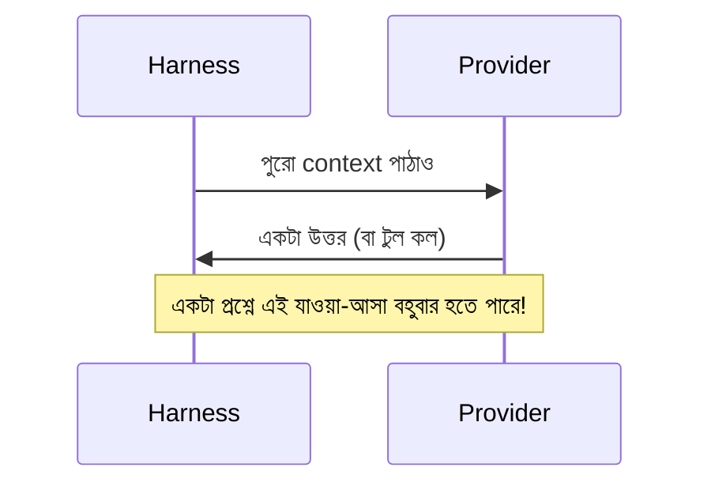
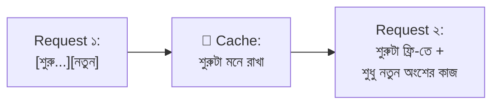

# সেকশন ১ — মডেল (The Model) 🧠

> এই সেকশনে আমরা AI-এর একদম পেটের ভেতরে ঢুকব। মডেল জিনিসটা আসলে কী, কীভাবে শেখে,
> কীভাবে উত্তর বানায়, আর কেন একই প্রশ্ন করলে প্রতিবার একটু আলাদা উত্তর আসে।
>
> 🐠 পথে আমাদের সঙ্গী থাকবে গোল্ডি — একটা গোল্ডফিশ, যার স্মৃতি নাকি মোটে তিন সেকেন্ডের। ও
> বারবার একটা কথাই মনে করিয়ে দেবে: মডেল নিজে থেকে কিচ্ছু মনে রাখে না।

[⬅️ মূল পাতায় ফিরুন](../README.md)

---

### মডেল (Model)

AI-এর "ব্রেন" বলে যেটাকে আপনি ভাবছেন, সেটাই মডেল। তবে ভেতরে উঁকি দিলে কোনো জাদু চোখে পড়বে না — পড়বে শুধু একগাদা সংখ্যা, যাদের নাম [প্যারামিটার (Parameters)](#প্যারামিটার-parameters)। আর এই সংখ্যাগুলো সারা জীবনে একটাই কাজ শিখেছে — পরের শব্দটা কী হবে, তার আন্দাজ করা। এটুকুই।

ব্যাপারটা অনেকটা প্রকাণ্ড একটা ক্যালকুলেটরের মতো। ক্যালকুলেটর নিজে থেকে অঙ্ক কষে না; বোতাম না চাপলে সে চুপচাপ বসে থাকে। মডেলও তেমনই — কেউ প্রশ্ন না করলে নিজে থেকে নড়ে না।

"Claude Opus" কিংবা "GPT-5" — এগুলো এক-একটা মডেলের নাম। কিন্তু মডেল একা বসে থাকলে কিছুই করতে পারে না; তাকে কাজে লাগাতে লাগে একটা [হার্নেস (Harness)](#হার্নেস-harness)।

গোল্ডি এখানে একটা কথা মনে করিয়ে দিতে চায় 🐠 — মডেল জিনিসটা **stateless**, অর্থাৎ ওর নিজের কোনো স্মৃতি নেই, ঠিক গোল্ডির মতোই। প্রতিবার ওকে পুরো গল্পটা গোড়া থেকে শোনাতে হয়। ও যে "ভাবছে" বা "সিদ্ধান্ত নিচ্ছে" বলে আপনার মনে হয়, পুরোটাই আসলে পরের শব্দ আন্দাজ করার খেলা।

💬 কথোপকথনে

🙋 "প্ল্যানিং স্টেপের জন্য মডেলটা Sonnet থেকে Opus-এ বদলে দিই?"

🧑‍🏫 "চেষ্টা করে দেখতে পারেন। তবে এই কাজে আসল খাটুনিটা করছে harness — সিস্টেম প্রম্পট আর টুল ঠিক না থাকলে শুধু মডেল বদলে লাভ নেই।"

  

<!-- GIF-PLACEHOLDER: একটা মডেল box-এ শব্দ ঢুকছে আর পরের শব্দ পপ করে বের হচ্ছে — সিম্পল লুপিং gif -->

---

### প্যারামিটার (Parameters)

মডেলের ভেতরের সেই সংখ্যাগুলো — সংখ্যায় প্রায়ই কয়েকশো **কোটি**। মডেল যা কিছু "জানে", তার সবটুকু এই সংখ্যাগুলোর মধ্যেই গাঁথা। এদের আরেক নাম *weights*।

ভাবুন একটা গানের মিক্সিং বোর্ডের কথা — হাজার হাজার নব, প্রতিটাকে ঠিক জায়গায় ঘোরালে তবেই গানটা পরিষ্কার শোনায়। প্যারামিটার হলো সেই নবগুলোর সেটিং, আর [ট্রেনিং (Training)](#ট্রেনিং-training)-এর সময় একে একে সেগুলো ঠিক করা হয়। ট্রেনিং সংখ্যাগুলো বসিয়ে দেওয়ার পর মডেল যখন আসলে চলে ([ইনফারেন্স (Inference)](#ইনফারেন্স-inference)), তখন এগুলো আর একটুও বদলায় না।

এই কারণেই মডেলকে নতুন কিছু "শেখানো" মানে এই প্যারামিটারগুলো আবার নাড়াচাড়া করা — যা মাসের পর মাস সময় আর গাদা গাদা টাকার ব্যাপার। 💸 তাই একটা প্রজেক্টের জন্য মডেলকে আবার ট্রেনিং না দিয়ে দরকারি তথ্যটুকু সরাসরি context-এ তুলে দেওয়াই সহজ, আর সস্তাও।

💬 কথোপকথনে

🙋 "আমাদের কোডবেসের ওপর মডেলটাকে fine-tune করা যায় না?"

🧑‍🏫 "করলে প্যারামিটার বদলে যাবে — কার্যত নতুন একটা মডেল দাঁড়াবে। এক প্রজেক্টের জন্য অতটা না করে কোডবেসটা [কনটেক্সট (Context)](02-sessions-context-turns.md#কনটেক্সট-context)-এ লোড করে দেওয়াই অনেক সস্তা।"

<!-- GIF-PLACEHOLDER: হাজার হাজার slider একসাথে adjust হচ্ছে — satisfying gif -->

---

### ট্রেনিং (Training)

মডেলের [প্যারামিটার (Parameters)](#প্যারামিটার-parameters)গুলো ঠিকঠাক বসানোর গোটা প্রক্রিয়াটাই ট্রেনিং। বিশাল পরিমাণ লেখা বারবার দেখিয়ে মডেলকে "পরের শব্দ আন্দাজ"-এ ওস্তাদ করে তোলা হয়।

পরীক্ষার আগে হাজার হাজার অঙ্ক কষে যাওয়ার সঙ্গে এর মিল আছে — যত প্র্যাকটিস, তত ভুল কম। তফাত শুধু এই যে, মডেলের এই প্র্যাকটিস হয় মাত্র একবার, বিশাল খরচ গুনে, আর সেটা করে [মডেল প্রোভাইডার (Model provider)](#মডেল-প্রোভাইডার-model-provider)। একবার হয়ে গেলে মডেল আর "আজকের খবর" শেখে না — আজ সকালে কী ঘটল, সেটা ওকে নিজে থেকে context-এ না বলে দিলে ও জানবেই না।

💬 কথোপকথনে

🙋 "মডেলকে আমাদের internal API চিনিয়ে দেওয়া যায়?"

🧑‍🏫 "ট্রেনিং দিয়ে নয় — ওটা প্রোভাইডারের মাসব্যাপী কাজ। বরং API-এর ডকটা context-এ দিন, ওটাই আপনার হাতে থাকা আসল উপায়।"

<!-- GIF-PLACEHOLDER: accuracy bar ধীরে ধীরে ভরে উঠছে — progress gif -->

---

### ইনফারেন্স (Inference)

ট্রেইনড মডেলকে চালিয়ে আসলে উত্তর বানানোর নামই ইনফারেন্স। আপনি যখনই কিছু জিজ্ঞেস করেন, পর্দার পেছনে এই inference-ই ঘটে।

ট্রেনিংকে যদি পরীক্ষার জন্য পড়াশোনা ধরি, তাহলে ইনফারেন্স হলো হলে বসে আসল উত্তর লেখা। পড়াটা একবারই হয়েছিল; এখন প্রতিবার উত্তর লেখার সময় সেই শেখাটুকুই কাজে লাগছে। [প্যারামিটার (Parameters)](#প্যারামিটার-parameters) ফিক্সড থাকে, মডেল শুধু পরের শব্দ আন্দাজ করে যায়।

ট্রেনিংয়ের তুলনায় এটা সস্তা, কিন্তু এর দাম গোনা হয় প্রতিটা [টোকেন (Token)](#টোকেন-token) ধরে — আর এখানেই AI ব্যবহারের আসল খরচটা লুকিয়ে। বিল কেন একটা ফিক্সড মাসিক ফি না হয়ে ব্যবহারের সঙ্গে বাড়ে, তার উত্তরও এটাই: আপনি প্রতিবার প্রশ্ন করলে প্রোভাইডারের হার্ডওয়্যারে মডেলটা একবার চলে, আর প্রতিবার চলার খরচ আছে।

💬 কথোপকথনে

🙋 "বিলটা ফ্ল্যাট লাইসেন্স ফি না হয়ে ব্যবহারের সঙ্গে বাড়ে কেন?"

🧑‍🏫 "আপনি inference-এর দাম দিচ্ছেন — প্রতিবার প্রশ্নে প্রোভাইডারের হার্ডওয়্যারে মডেল চলে। আর এক [টার্ন (Turn)](02-sessions-context-turns.md#টার্ন-turn)-এ টুল ডাকলে ভেতরে ভেতরে অনেকগুলো রিকোয়েস্ট হয়ে যায়।"

  

<!-- GIF-PLACEHOLDER: পরীক্ষার হলে কলম দিয়ে দ্রুত উত্তর লেখার ছোট gif -->

---

### টোকেন (Token)

মডেল লেখা পড়ে আর লেখে ছোট ছোট টুকরোয় — সেই টুকরোগুলোর নাম টোকেন। প্রায় শব্দের সমান, তবে হুবহু শব্দ নয়: চেনা শব্দ সাধারণত এক টোকেন, আর বিরল বা লম্বা শব্দ কয়েক টোকেনে ভেঙে যায়।

  

খাতায় উত্তর লেখার সময় কল্পনা করুন প্রতিটা শব্দাংশ আলাদা ঘরে বসছে — ছোট শব্দ এক ঘরে এঁটে যায়, কঠিন বড় শব্দ কয়েক ঘর জুড়ে বসে। টোকেন হলো সেই "ঘর"। [কনটেক্সট উইন্ডো (Context window)](02-sessions-context-turns.md#কনটেক্সট-উইন্ডো-context-window)-এর সাইজ, খরচ, গতি — সবকিছুই মাপা হয় এই টোকেন দিয়ে।

একটা ভুল এখানে অনেকেই করেন: টোকেনকে "শব্দ" ধরে নেওয়া। 🚩 টোকেনের সীমা শব্দের সীমার সঙ্গে মেলে না, আর একই অর্থের লেখাও বেশি টোকেন খেতে পারে যদি তাতে অদ্ভুত অক্ষর, কোড বা ইমোজি থাকে। তাই "আমার প্রম্পটটা কত বড়" জানতে চাইলে শব্দ না গুনে টোকেন গোনাই বুদ্ধিমানের কাজ।

💬 কথোপকথনে

🙋 "এই প্রম্পটটা কত বড় হবে?"

🧑‍🏫 "একটা tokenizer-এ চালিয়ে দেখুন। লেখাটা ছোট, কিন্তু এতে অদ্ভুত অক্ষর থাকায় আপনি যা ভাবছেন তার চেয়ে বেশি টোকেনে ভাঙবে।"

**🎬 টার্মিনালে দেখুন:**

  

---

### নেক্সট-টোকেন প্রেডিকশন (Next-token prediction)

মডেল ভেতরে ভেতরে আসলে যা করে: কনটেক্সট দেখে একটা পরের [টোকেন (Token)](#টোকেন-token) বেছে নেয়, সেটা জুড়ে দেয়, তারপর আবার শুরু থেকে চালায়। আবার। আবার। 🔁

ফোনের কিবোর্ডে টাইপ করার সময় ওপরে পরের শব্দের যে সাজেশন ভেসে ওঠে, মডেল মোটামুটি সেই কাজটাই করে — তবে হাজার গুণ ভালোভাবে, আর একটার পর একটা টোকেন জুড়ে জুড়ে গোটা প্যারাগ্রাফ নামিয়ে দেয়। একটা বাক্য, একটা [টুল কল (Tool call)](03-tools-and-environment.md#টুল-কল-tool-call), হাজার লাইনের একটা ফাইল — সবই তৈরি হয় এক টোকেন করে করে। মডেলের অন্য কোনো মোড নেই, এটাই ওর একমাত্র চাল।

💬 কথোপকথনে

🙋 "এজেন্ট কীভাবে 'ঠিক করে' কখন টুল ডাকবে?"

🧑‍🏫 "ও আসলে কিছু ঠিক করে না — পুরোটাই next-token prediction। টুল কলটা স্রেফ একটা স্ট্রাকচার্ড টেক্সট, যেটা harness আউটপুট থেকে পড়ে নেয়।"

**🎬 টার্মিনালে দেখুন:** এক টোকেন করে করে বাক্য তৈরি হচ্ছে —

  

---

### নন-ডিটারমিনিজম (Non-determinism)

একই প্রশ্নের উত্তর প্রতিবার একটু একটু আলাদা হতে পারে। এমনকি হুবহু একই context দিয়ে দুবার চালালেও দু-রকম উত্তর আসা অস্বাভাবিক নয়। 🎲

একই গল্প দুজন বন্ধুকে বলতে বললে দুজন একটু আলাদা ভাবে বলবে — মূল ব্যাপারটা এক, শব্দগুলো আলাদা। মডেলও তেমন, প্রতিবার একটু আলাদা "ছক্কা" ফেলে। এটা মডেলের লেখা বানানোর স্বাভাবিক স্বভাব, বন্ধ করার কোনো সুইচ নেই। ফলে একই কাজে মডেলকে কোনো দিন জিনিয়াস, কোনো দিন একটু আনাড়ি মনে হতেই পারে।

আমরা মানুষ আবার সবকিছুতে প্যাটার্ন খুঁজি — পরপর দু-তিনটে বাজে উত্তর পেলেই মনে হয় "আজ মডেলটা খারাপ হয়ে গেছে!" বেশিরভাগ সময় এটা স্রেফ ওই এলোমেলো ছক্কারই কারসাজি, ভেতরে আসলে কিচ্ছু বদলায়নি।

💬 কথোপকথনে

🙋 "Claude আজ একদম যাচ্ছেতাই! ওরা কি কোনো খারাপ ভার্সন ছেড়েছে?"

🧑‍🏫 "সম্ভবত না — আউটপুট non-deterministic, তাই একই কাজে ভালো-খারাপ দিন আসবেই। কারণ খোঁজার আগে কাল আরেকবার চালিয়ে দেখুন।"

  

**🎬 টার্মিনালে দেখুন:** একই প্রম্পট দুবার → দুই উত্তর —

  

---

### মডেল প্রোভাইডার (Model provider)

যে আসলে মডেলটাকে চালায়, অর্থাৎ [ইনফারেন্স (Inference)](#ইনফারেন্স-inference) করে, সে-ই মডেল প্রোভাইডার। সাধারণত এটা দূরের কোনো সার্ভিস (Anthropic, OpenAI, Google), তবে নিজের কম্পিউটারেও হতে পারে (Ollama, LM Studio)।

রেস্টুরেন্টের কথা ভাবুন — আপনি অর্ডার দেন, রান্নাঘর রান্না করে খাবার পাঠায়। 🍕 সেই রান্নাঘরটাই প্রোভাইডার: আপনি প্রশ্ন পাঠান, ও মডেল চালিয়ে উত্তর ফেরত দেয়। [হার্নেস (Harness)](#হার্নেস-harness) নিজে কিন্তু মডেল চালায় না; সে শুধু প্রোভাইডারকে অনুরোধ পাঠায় — "এই নাও, একটা উত্তর বানিয়ে দাও।"

💬 কথোপকথনে

🙋 "এয়ার-গ্যাপড ক্লায়েন্টের জন্য এটা অফলাইনে চালানো যাবে?"

🧑‍🏫 "প্রোভাইডার বদলে একটা লোকাল-এরটা দিন — ওদের মেশিনে Ollama বসিয়ে। Harness-এর কিছুই যায়-আসে না, ও শুধু আলাদা একটা endpoint-এ গিয়ে কড়া নাড়বে।"

<!-- GIF-PLACEHOLDER: রেস্টুরেন্টে অর্ডার → রান্নাঘর → খাবার ফেরত — ছোট gif -->

---

### হার্নেস (Harness)

মডেলের চারপাশের সবকিছু, যা মিলেমিশে মডেলকে কাজের একটা [এজেন্ট (Agent)](02-sessions-context-turns.md#এজেন্ট-agent)-এ বদলে দেয় — [টুল (Tool)](03-tools-and-environment.md#টুল-tool), [সিস্টেম প্রম্পট (System prompt)](02-sessions-context-turns.md#সিস্টেম-প্রম্পট-system-prompt), পারমিশন, গোটা প্যাকেজটাই হার্নেস। 🧰

মডেল এখানে স্রেফ ইঞ্জিন 🏎️, আর হার্নেস হলো গোটা গাড়ি — চাকা, স্টিয়ারিং, ব্রেক, সিট সমেত। একই ইঞ্জিন আলাদা গাড়িতে বসালে গাড়িগুলো একদম আলাদা ভাবে চলে। এই কারণেই **Claude.ai** আর **Claude Code** একই মডেলে চলেও আলাদা আচরণ করে — ওদের হার্নেস আলাদা।

💬 কথোপকথনে

🙋 "একই মডেল, তবু Claude Code ফাইল এডিট করছে আর Claude.ai শুধু উত্তর দিচ্ছে কেন?"

🧑‍🏫 "আলাদা harness — Claude Code-এ [ফাইলসিস্টেম (Filesystem)](03-tools-and-environment.md#ফাইলসিস্টেম-filesystem) টুল আছে, আলাদা সিস্টেম প্রম্পট আছে, একটা পারমিশন লেয়ার আছে। মডেল এখানে আসল ফ্যাক্টর নয়।"

  

<!-- GIF-PLACEHOLDER: একই ইঞ্জিন আলাদা আলাদা গাড়িতে বসছে — এমন gif -->

---

### মডেল প্রোভাইডার রিকোয়েস্ট (Model provider request)

[হার্নেস (Harness)](#হার্নেস-harness) থেকে [মডেল প্রোভাইডার (Model provider)](#মডেল-প্রোভাইডার-model-provider)-এ একবার যাওয়া-আসা — এটুকুই একটা রিকোয়েস্ট। হার্নেস বর্তমান context পাঠায়, প্রোভাইডার একটা উত্তর ফেরত দেয়। ✉️

ব্যাপারটা চিঠি পাঠিয়ে উত্তর পাওয়ার মতো 📬 — তবে এখানে একটা মজার টুইস্ট আছে: ডাকপিয়নটি গোল্ডি-মেমোরির 🐠, তাই প্রতিবার চিঠিতে পুরো গল্পটা গোড়া থেকে আবার লিখতে হয়। আর আপনার একটামাত্র প্রশ্ন থেকেই অনেকগুলো রিকোয়েস্ট হয়ে যেতে পারে, কারণ এজেন্ট প্রতিবার কোনো [টুল (Tool)](03-tools-and-environment.md#টুল-tool) ব্যবহার করলে আরেকটা নতুন রিকোয়েস্ট লাগে।

💬 কথোপকথনে

🙋 "একটা প্রশ্নে ৪০ হাজার টোকেন পুড়ল?!"

🧑‍🏫 "টুল কলগুলো একবার দেখুন — ১২ বার grep, ৮ বার read, ৪ বার edit। প্রতিটা টুল রেজাল্ট আরেকটা request টেনে আনে, আর প্রতিবার পুরো [সেশন (Session)](02-sessions-context-turns.md#সেশন-session)-এর শুরুটা আবার পাঠানো হয়।"

<!-- GIF-PLACEHOLDER: চিঠি পাঠানো ও উত্তর ফেরত আসার বারবার লুপ — এমন gif -->

---

### ইনপুট টোকেন (Input tokens)

আপনি যা *পাঠান* — প্রশ্ন, আগের কথা, ফাইলের লেখা — সবই [টোকেন (Token)](#টোকেন-token) হিসেবে গোনা হয়। এগুলোই ইনপুট টোকেন, আর এদের দাম [আউটপুট টোকেন (Output tokens)](#আউটপুট-টোকেন-output-tokens)-এর চেয়ে কম। 📥

পরীক্ষায় প্রশ্নপত্র *পড়া* আর উত্তর *লেখা*-র তফাতটা মনে করুন — পড়তে এনার্জি কম পোড়ে, কিন্তু লিখতে গেলেই হাত ব্যথা। ইনপুট হলো সেই পড়ার অংশ, তাই সস্তা।

💬 কথোপকথনে

🙋 "বিল এত বেশি, অথচ এজেন্ট তো তেমন কিছু লিখছেই না!"

🧑‍🏫 "এটা input token — প্রতি টার্নে পুরো সেশনটা আবার পাঠানো হচ্ছে। [প্রিফিক্স ক্যাশ (Prefix cache)](#প্রিফিক্স-ক্যাশ-prefix-cache) না থাকলে প্রতিবার গোটা ইতিহাসের দাম আবার গুনতে হয়।"

---

### আউটপুট টোকেন (Output tokens)

মডেল যে [টোকেন (Token)](#টোকেন-token)গুলো *ফেরত বানিয়ে* দেয়, সেগুলোই আউটপুট টোকেন। এদের দাম [ইনপুট টোকেন (Input tokens)](#ইনপুট-টোকেন-input-tokens)-এর চেয়ে বেশি, কারণ লেখা বানাতে অনেক বেশি খাটুনি — মানে বেশি কম্পিউটিং — লাগে। 📤

পরীক্ষায় উত্তর লেখা যেমন পড়ার চেয়ে অনেক বেশি সময় আর কষ্টের, এখানেও তেমন। তাই একটা কাজের টিপস: এজেন্ট যদি পুরো ফাইল আবার না লিখে শুধু ছোট ছোট বদল (edit) করে, খরচ অনেকটা নেমে যায়। 💡

💬 কথোপকথনে

🙋 "রিফ্যাক্টর সেশনটা ক্রেডিট খেয়ে ফেলছে, অথচ ইনপুট তো ছোট।"

🧑‍🏫 "এজেন্ট পুরো ফাইল আবার লিখছে, প্যাচ করছে না। Output token ইনপুটের প্রায় পাঁচ গুণ দামি — edit করতে বলুন, বিল নেমে যাবে।"

---

### প্রিফিক্স ক্যাশ (Prefix cache)

প্রোভাইডারের একটা দারুণ চালাকি। পরপর দুটো request-এর শুরুর অংশ যদি এক হয়, তবে আগের কাজটা আবার না করে সেটাকেই পুনরায় কাজে লাগায় — আর ওই অংশের দাম অনেক কমিয়ে [ক্যাশ টোকেন (Cache tokens)](#ক্যাশ-টোকেন-cache-tokens) হিসেবে নেয়। 🧠💾

পরীক্ষায় প্রতিটা উত্তরে নাম-রোল আবার নতুন করে লিখতে গিয়ে কত সময় নষ্ট হয়, মনে আছে? কল্পনা করুন আগেরবারের লেখাটা ম্যাজিকের মতো কপি হয়ে যাচ্ছে — সময় বাঁচল। প্রিফিক্স ক্যাশ ঠিক সেই সময় (আর টাকা) বাঁচায়। তবে একটা শর্ত: শুরুর কিছু একটা বদলে গেলেই (যেমন প্রতিবার একটা নতুন সময় ঢুকিয়ে দেওয়া) cache ভেঙে যায়, আর বাকিটা পুরো দামে গোনা হয়। 💔

💬 কথোপকথনে

🙋 "সেশনের মাঝপথে বিল হঠাৎ লাফ দিল কেন?"

🧑‍🏫 "Harness প্রতি টার্নে সিস্টেম প্রম্পটে current time ঢোকাচ্ছিল। প্রথম যে টোকেনটা বদলায়, সেখানেই prefix cache ভাঙে — তারপর প্রতিটা request পুরো দামে।"

  

<!-- GIF-PLACEHOLDER: একটা অংশে "💾 cached" স্ট্যাম্প পড়ছে, পরের বার সেটা skip হচ্ছে — এমন gif -->

---

### ক্যাশ টোকেন (Cache tokens)

[ইনপুট টোকেন (Input tokens)](#ইনপুট-টোকেন-input-tokens)-এর মধ্যে যেগুলো প্রোভাইডার আগের request থেকে [প্রিফিক্স ক্যাশ (Prefix cache)](#প্রিফিক্স-ক্যাশ-prefix-cache)-এ জমিয়ে রেখেছে, সেগুলোই ক্যাশ টোকেন। এদের আবার নতুন করে প্রসেস করতে হয় না, তাই দামও অনেক কম। 🏷️

হোমওয়ার্কের যে অংশটা আগেই করে রেখেছেন, সেটা তো আর দ্বিতীয়বার করতে হয় না — শুধু নতুন অংশটুকু করলেই চলে। ক্যাশ টোকেন হলো সেই "আগেই করা" অংশ, যার জন্য পুরো দাম দিতে হয় না। লম্বা [সেশন (Session)](02-sessions-context-turns.md#সেশন-session) সস্তা রাখার আসল নায়ক এটাই। 🦸

💬 কথোপকথনে

🙋 "লম্বা সেশনে খরচ ভয়ংকর — এক রিফ্যাক্টরেই ৮ ডলার!"

🧑‍🏫 "Cache token-টা চেক করুন। Harness যদি টার্নে টার্নে সিস্টেম প্রম্পট বা ফাইল এলোমেলো করে, prefix ভাঙে, আর প্রতিবার পুরো input রেটে দাম দিতে হয়।"

---

## 🎯 সেকশন রিভিউ — সব মনে আছে তো?

প্রশ্ন ১: মডেল নিজে নিজে কাজ করতে পারে না কেন?

কারণ মডেল শুধু পরের টোকেন আন্দাজ করে। কাজ করাতে হলে তাকে **harness** দিয়ে সাজাতে হয় (টুল + সিস্টেম প্রম্পট + পারমিশন)।

প্রশ্ন ২: Training আর inference-এর পার্থক্য এক লাইনে বলুন।

Training = পরীক্ষার জন্য পড়া (একবার, খরুচে)। Inference = পরীক্ষার হলে উত্তর লেখা (প্রতিবার, প্রতি টোকেনে দাম)।

প্রশ্ন ৩: একই প্রশ্নে দু-রকম উত্তর আসে কেন?

**Non-determinism** — মডেলের লেখা বানানোর স্বাভাবিক স্বভাব। বন্ধ করার সুইচ নেই।

প্রশ্ন ৪: Output token input-এর চেয়ে দামি কেন?

লেখা (output) বানাতে পড়ার (input) চেয়ে অনেক বেশি কম্পিউটিং লাগে — প্রায় পাঁচ গুণ দামি।

## 🧩 মিনি-চ্যালেঞ্জ

🕵️ আপনার AI বিল হঠাৎ লাফ দিয়ে বেড়ে গেল। এই সেকশনের কোন ৩টা শব্দ এর কারণ ব্যাখ্যা করতে পারে?

- **Inference** — প্রতিবার প্রশ্নেই খরচ হয়।
- **Input tokens** — প্রতি টার্নে পুরো ইতিহাস আবার পাঠানো হয়।
- **Prefix cache (ভেঙে যাওয়া)** — শুরুর অংশ বদলালে cache কাজ করে না, পুরো দাম দিতে হয়।

বোনাস: **Output tokens** — এজেন্ট পুরো ফাইল আবার লিখলে খরচ পাঁচ গুণ!

## ✅ শেখার চেকলিস্ট

> 💡 *এই রিপো fork করে নিচের বক্সে টিক দিতে পারেন — কোনটা বুঝেছেন, মিলিয়ে নিন।*

- [ ] মডেল আসলে শুধু সংখ্যা, পরের টোকেন আন্দাজ করে
- [ ] প্যারামিটার = মডেলের "জ্ঞান", ট্রেনিং-এ বসে, পরে ফিক্সড
- [ ] Training (একবার) বনাম Inference (প্রতিবার)
- [ ] টোকেন = লেখার ছোট টুকরো, শব্দ নয়
- [ ] Next-token prediction = মডেলের একমাত্র চাল
- [ ] Non-determinism = একই প্রশ্নে আলাদা উত্তর, স্বাভাবিক
- [ ] Harness = মডেলকে এজেন্ট বানায়
- [ ] Input সস্তা, Output দামি, Cache সবচেয়ে সস্তা

---

[⬅️ মূল পাতা](../README.md) · [পরের সেকশন: সেশন, কনটেক্সট ও টার্ন ➡️](02-sessions-context-turns.md)
