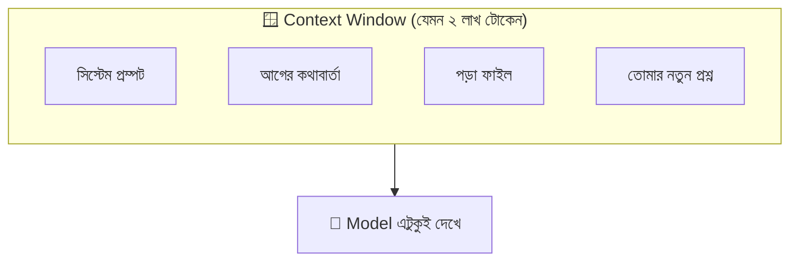
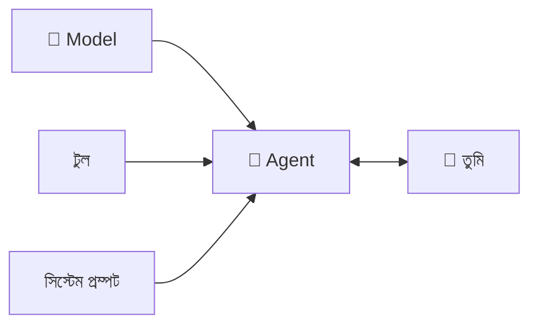
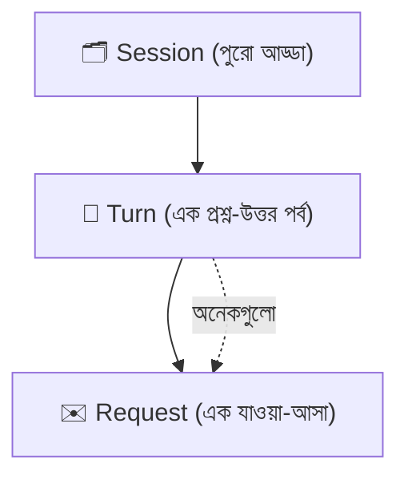

# সেকশন ২ — সেশন, কনটেক্সট ও টার্ন 💬

> মডেল তো আগের কথা মনে রাখে না (মনে আছে? গোল্ডফিশ! 🐠)। তাহলে চ্যাট করার সময় ও আগের কথা
> "মনে রাখে" কীভাবে? এই সেকশনে সেই রহস্য — সেশন, কনটেক্সট, টার্ন।

[⬅️ মূল পাতা](../README.md) · [⬅️ আগের সেকশন](01-the-model.md)

---

### স্টেটলেস (Stateless)

আগের কিছু মনে রাখে না — প্রতিবার নতুন করে শুরু। মডেল প্রতিটা [রিকোয়েস্ট (Model provider request)](01-the-model.md#মডেল-প্রোভাইডার-রিকোয়েস্ট-model-provider-request)-এ পুরো [কনটেক্সট উইন্ডো (Context window)](#কনটেক্সট-উইন্ডো-context-window) আবার পায়, কারণ এ ছাড়া ওর দেখার আর কোনো উপায় নেই। এটা [স্টেটফুল (Stateful)](#স্টেটফুল-stateful)-এর উল্টো।

> 🌟 **রোজকার উদাহরণ**
> সেই গোল্ডফিশ 🐠 — প্রতিবার ঘুরে এসে ভুলে যায় আগে কী হয়েছিল। মডেলও তাই: নতুন চ্যাট মানে
> একদম সাদা পাতা, আগের কিছুর চিহ্নও নেই।

📝 নিজেকে যাচাই করো

প্রশ্ন: চ্যাট [ক্লিয়ার (Clearing)](05-handoffs.md#ক্লিয়ারিং-clearing) করলে মডেল আগের নিয়ম ভুলে যায় কেন?

**উত্তর:** কারণ মডেল stateless — নতুন সেশন একদম খালি শুরু হয়। মনে রাখাতে চাইলে [AGENTS.md](06-memory-and-steering.md#agentsmd) বা memory ফাইলে লিখে রাখতে হবে।

---

### কনটেক্সট (Context)

এই মুহূর্তে এজেন্টের হাতে যেসব দরকারি তথ্য আছে — সেটাই context। মানে এজেন্ট *এখন কাজের জন্য যা যা জানে*। 🧳

> 🌟 **রোজকার উদাহরণ**
> পরীক্ষার হলে তোমার টেবিলে যা যা আছে — প্রশ্ন, খাতা, অ্যাডমিট কার্ড — সেটাই তোমার "context"।
> বাড়িতে রাখা বই টেবিলে নেই মানে এখন কাজে লাগছে না। "context-এ আনা" মানে জিনিসটা টেবিলে তুলে আনা।

"It keeps inventing fields" — মানে দরকারি ফাইলটা context-এ নেই, এজেন্ট আন্দাজে কাজ চালাচ্ছে। আগে সেটা পড়িয়ে নাও।

📝 নিজেকে যাচাই করো

প্রশ্ন: এজেন্ট একটা টাইপের ভুল ফিল্ড বানিয়ে ফেলছে — কী করব?

**উত্তর:** আসল টাইপ ফাইলটা context-এ পড়িয়ে দাও। তখন আর আন্দাজ করতে হবে না।

---

### কনটেক্সট উইন্ডো (Context window)

প্রতিটা [রিকোয়েস্ট (Model provider request)](01-the-model.md#মডেল-প্রোভাইডার-রিকোয়েস্ট-model-provider-request)-এ মডেল যা যা *দেখতে পায়*, তার পুরোটা। এটা সীমিত (finite), মডেলভেদে আলাদা, আর মডেলের দেখার **একমাত্র** জানালা। 🪟

> 🌟 **রোজকার উদাহরণ**
> একটা হোয়াইটবোর্ড 🧑‍🏫 — যতটুকু জায়গা, ততটুকুই লেখা যায়। বোর্ড ভরে গেলে নতুন কিছু লিখতে হলে
> পুরোনো কিছু মুছতে হবে। মডেলের জানালাও তেমন সীমিত।

> ⚠️ **এড়িয়ে চলো:** একে "মেমরি" বলা। Context window হলো এখনকার কাজের জায়গা, এটা সেশনের পর সেশন থাকে না। [মেমরি সিস্টেম (Memory system)](06-memory-and-steering.md#মেমরি-সিস্টেম-memory-system) আলাদা জিনিস।

🔍 আরও জানো

"পুরো প্রজেক্টটা পেস্ট করে দিই?" — না! Context window হয়তো ২ লাখ টোকেন, যা গোটা রিপোর এক-পঞ্চমাংশও
না। যে ফাইলগুলো কাজে লাগবে শুধু সেগুলো দাও, বাকিটা টুলের পেছনে থাক।

📝 নিজেকে যাচাই করো

প্রশ্ন: পুরো বিশাল প্রজেক্ট কি একবারে context window-এ ঢোকানো যায়?

**উত্তর:** সাধারণত না — জায়গা সীমিত। দরকারি ফাইলগুলোই বেছে দাও।

<!-- GIF-PLACEHOLDER: একটা বক্স ধীরে ধীরে টোকেন দিয়ে ভরে যাচ্ছে, ভরে গেলে red হয়ে যাচ্ছে — এমন gif -->

---

### স্টেটফুল (Stateful)

আগের তথ্য সামনে বয়ে নিয়ে যায়। একটা [সেশন (Session)](#সেশন-session) টার্নে টার্নে stateful — কথা জমতে থাকে (তাই লম্বা সেশন আস্তে আস্তে [ডাম্ব জোন (Smart zone)](04-failure-modes.md#স্মার্ট-জোন-smart-zone)-এ চলে যায়)। [স্টেটলেস (Stateless)](#স্টেটলেস-stateless)-এর উল্টো।

> 🌟 **রোজকার উদাহরণ**
> তোমার ডায়েরি 📔 — গতকাল যা লিখেছ আজও আছে। মডেল নিজে গোল্ডফিশ, কিন্তু harness যদি কথাগুলো
> ডায়েরিতে (ফাইলে) লিখে রাখে আর পরদিন আবার পড়ে শোনায়, তাহলে এজেন্টকে stateful মনে হয়।

📝 নিজেকে যাচাই করো

প্রশ্ন: এজেন্ট কাল আমার পছন্দ মনে রেখেছে — মানে কি মডেল শিখে ফেলেছে?

**উত্তর:** না! Harness সেটা একটা memory ফাইলে লিখে রেখেছিল আর আজ আবার পড়িয়েছে। মডেল নিজে কালকের কিছুই দেখেনি।

---

### এজেন্ট (Agent)

একটা [মডেল (Model)](01-the-model.md#মডেল-model)-কে [হার্নেস (Harness)](01-the-model.md#হার্নেস-harness) দিয়ে সাজিয়ে — টুল, সিস্টেম প্রম্পট, কনটেক্সট উইন্ডো — যেটা তোমার সাথে [টার্ন (Turn)](#টার্ন-turn) নিয়ে কথা বলে। তুমি আসলে যার সাথে কথা বলো, সেটাই এজেন্ট। 🤖

> 🌟 **রোজকার উদাহরণ**
> Claude Code একটা agent. Cursor একটা agent. Claude.ai একটা agent. একই মডেল ভেতরে, কিন্তু
> আলাদা harness — তাই আলাদা ব্যক্তিত্ব, যেন একই অভিনেতা আলাদা চরিত্রে। 🎭

> ⚠️ **এড়িয়ে চলো:** "the AI" বা "the bot" — বড্ড ঝাপসা, বোঝা যায় না তুমি মডেল না পুরো এজেন্টের কথা বলছ।

📝 নিজেকে যাচাই করো

প্রশ্ন: Claude Code আর Cursor কি আলাদা মডেল?

**উত্তর:** জরুরি না — ভেতরে একই মডেল হতে পারে, কিন্তু harness আলাদা বলে দুটো আলাদা agent।

---

### সিস্টেম প্রম্পট (System prompt)

[হার্নেস (Harness)](01-the-model.md#হার্নেস-harness) প্রতিটা রিকোয়েস্টের শুরুতে যে নির্দেশনা জুড়ে দেয় — এজেন্টের "ডিউটি চার্ট": সে কে, কীভাবে আচরণ করবে, কোন টুল ব্যবহার করতে পারবে। সাধারণত পুরো সেশনে এক থাকে। 📋

> 🌟 **রোজকার উদাহরণ**
> চাকরিতে জয়েন করার দিন হাতে ধরানো নিয়মের কাগজ 📄 — "তুমি কে, কী করবে, কী করবে না"। এজেন্ট
> প্রতিবার কথা বলার আগে এই কাগজটা পড়ে নেয়।

দুটো harness একই মডেলে একদম আলাদা আচরণ করে কেন? প্রায়ই system prompt আলাদা বলে — divergence-টা তোমার মেসেজ পৌঁছানোর আগেই শুরু।

📝 নিজেকে যাচাই করো

প্রশ্ন: একই মডেলে দুটো অ্যাপ আলাদা স্বভাবের কেন হতে পারে?

**উত্তর:** আলাদা system prompt — একটার ব্রিফ "সংক্ষেপে কোড লেখো", আরেকটার "বুঝিয়ে বলো"।

---

### সেশন (Session)

একটা এজেন্টের সাথে একটানা একটা কথোপকথনের পর্ব। খালি শুরু হয়, মেসেজ-টুল রেজাল্ট-পড়া ফাইল জমতে থাকে, আর [ক্লিয়ার (Clearing)](05-handoffs.md#ক্লিয়ারিং-clearing)/বন্ধ/[কম্প্যাক্ট (Compaction)](05-handoffs.md#কম্প্যাকশন-compaction) হলে শেষ। 🗂️

> 🌟 **রোজকার উদাহরণ**
> [কনটেক্সট উইন্ডো (Context window)](#কনটেক্সট-উইন্ডো-context-window) যদি হয় একটা খালি বাক্স 📦,
> তাহলে session হলো সেই জিনিসগুলো যা আস্তে আস্তে বাক্সটা ভরছে। কাজ বাক্সের চেয়ে বড় হলে কয়েকটা
> বাক্সে (সেশনে) ভাগ করে নিতে হয়।

🔍 আরও জানো

একটা সেশন কতক্ষণ ভালো থাকে? কাজভেদে আলাদা — ফোকাসড রিফ্যাক্টর অনেকক্ষণ শার্প থাকে, এলোমেলো
রিসার্চ তাড়াতাড়ি ঘোলাটে হয়। সেশন ফুলে গেলে জোর করে চালিয়ে না গিয়ে [হ্যান্ডঅফ (Handoff)](05-handoffs.md#হ্যান্ডঅফ-handoff) করো বা compact করো।

📝 নিজেকে যাচাই করো

প্রশ্ন: একটা সেশন শুরু হয় কী অবস্থায়?

**উত্তর:** একদম খালি — তারপর কথা, ফাইল, টুল রেজাল্ট জমতে জমতে context window ভরতে থাকে।

---

### টার্ন (Turn)

তোমার একটা মেসেজ + তার জবাবে এজেন্ট যা যা করে, যতক্ষণ না আবার তোমার কাছে ফিরে আসে — পুরোটা মিলে এক turn। এর ভেতরে এক বা একাধিক [রিকোয়েস্ট (Model provider request)](01-the-model.md#মডেল-প্রোভাইডার-রিকোয়েস্ট-model-provider-request) থাকে। 🔄

> 🌟 **রোজকার উদাহরণ**
> ক্লাসে তুমি একটা প্রশ্ন করলে, স্যার বোর্ডে কয়েকটা স্টেপ করে শেষে তোমার দিকে তাকালেন — "বুঝেছ?"
> পুরোটা মিলে এক turn। তোমার পরের প্রশ্ন মানে পরের turn। ক্রম: **Session > Turn > Request**।

📝 নিজেকে যাচাই করো

প্রশ্ন: এক turn-এ কি একাধিক provider request হতে পারে?

**উত্তর:** হ্যাঁ — এজেন্ট টুল ব্যবহার করলে এক turn-এর ভেতরেই অনেকগুলো request হয়ে যায়।

---

[⬅️ মূল পাতা](../README.md) · [পরের সেকশন: টুল ও এনভায়রনমেন্ট ➡️](03-tools-and-environment.md)
