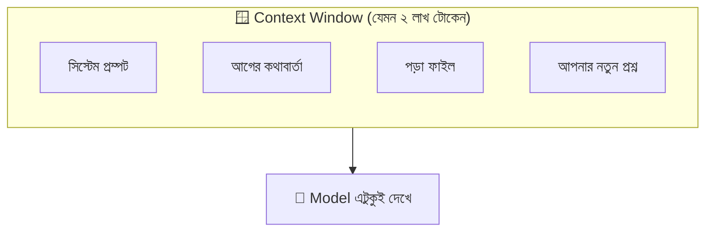
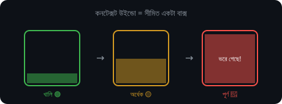
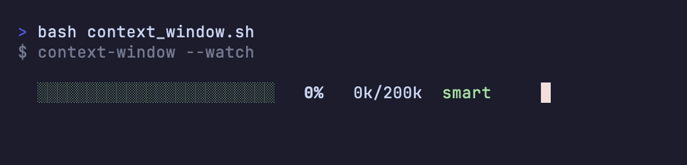
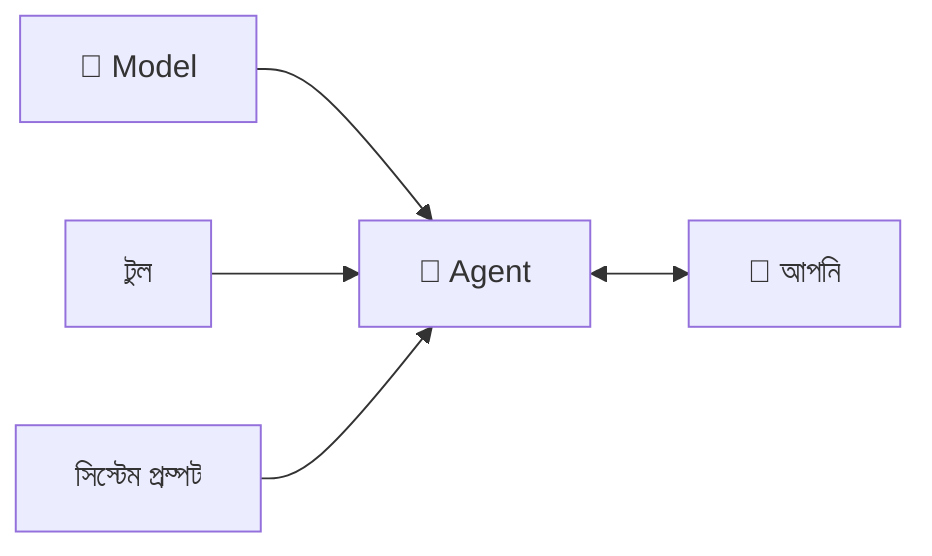
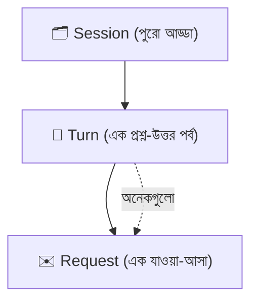

# সেকশন ২ — সেশন, কনটেক্সট ও টার্ন 💬

> মডেল তো আগের কথা মনে রাখে না — গোল্ডির 🐠 কথা ভুলে যাননি নিশ্চয়ই। তাহলে চ্যাট করার সময় ও
> আগের কথা "মনে রাখে" কীভাবে? রহস্যটা লুকিয়ে তিনটে শব্দে — সেশন, কনটেক্সট, টার্ন।

[⬅️ মূল পাতা](../README.md) · [⬅️ আগের সেকশন](01-the-model.md)

---

### স্টেটলেস (Stateless)

আগের কিছুই মনে রাখে না, প্রতিবার একদম নতুন করে শুরু — এটাই stateless। মডেল প্রতিটা [রিকোয়েস্ট (Model provider request)](01-the-model.md#মডেল-প্রোভাইডার-রিকোয়েস্ট-model-provider-request)-এ পুরো [কনটেক্সট উইন্ডো (Context window)](#কনটেক্সট-উইন্ডো-context-window) আবার নতুন করে পায়, কারণ এ ছাড়া ওর দেখার আর কোনো পথই নেই। ঠিক উল্টোটা হলো [স্টেটফুল (Stateful)](#স্টেটফুল-stateful)।

এ যেন আমাদের গোল্ডি 🐠 — একপাক ঘুরে এসেই ভুলে গেল আগে কী হয়েছিল। নতুন একটা চ্যাট খোলা মানে মডেলের সামনে একদম সাদা পাতা, আগের কিছুর চিহ্নমাত্র নেই।

  

💬 কথোপকথনে

🙋 "[ক্লিয়ার (Clearing)](05-handoffs.md#ক্লিয়ারিং-clearing) করলেই কনভেনশনটা প্রতিবার ভুলে যায় কেন?"

🧑‍🏫 "মডেল তো stateless — নতুন সেশন খালি হাতে শুরু হয়। বয়ে নিতে চাইলে [AGENTS.md](06-memory-and-steering.md#agentsmd) বা কোনো memory ফাইলে লিখে রাখুন, harness সেশনের শুরুতে সেটা টেনে নেবে।"

---

### কনটেক্সট (Context)

এই মুহূর্তে এজেন্টের হাতের কাছে যেসব দরকারি তথ্য আছে, তার সবটুকু মিলিয়েই context। সোজা কথায়, কাজটা করার জন্য এজেন্ট *এখন যা যা জানে*। 🧳

পরীক্ষার হলের কথা ভাবুন। টেবিলে যা যা আছে — প্রশ্ন, খাতা, অ্যাডমিট কার্ড — সেটাই আপনার "context"। বাড়ির তাকে রাখা বইটা টেবিলে নেই, মানে এই মুহূর্তে সেটা কোনো কাজে আসছে না। কোনো কিছু "context-এ আনা" মানে জিনিসটা তুলে টেবিলে রাখা।

💬 কথোপকথনে

🙋 "এটা বারবার এমন ফিল্ড বানাচ্ছে যা টাইপেই নেই!"

🧑‍🏫 "টাইপ ফাইলটা তো context-এ নেই — ও কল-সাইট দেখে আন্দাজে চালাচ্ছে। আগে ডেফিনিশনটা একবার পড়িয়ে নিন।"

---

### কনটেক্সট উইন্ডো (Context window)

প্রতিটা [রিকোয়েস্ট (Model provider request)](01-the-model.md#মডেল-প্রোভাইডার-রিকোয়েস্ট-model-provider-request)-এ মডেল যা যা *দেখতে পায়*, তার পুরোটা মিলিয়ে কনটেক্সট উইন্ডো। এটা সীমিত, মডেলভেদে আলাদা, আর মডেলের গোটা দুনিয়া দেখার একমাত্র জানালা। 🪟

একটা হোয়াইটবোর্ডের কথা ভাবুন 🧑‍🏫 — যতটুকু জায়গা, লেখাও ততটুকুই। বোর্ড ভরে গেলে নতুন কিছু লিখতে হলে পুরোনো কিছু মুছতেই হবে। মডেলের জানালাটাও তেমন বাঁধা।

এখানে একটা ভুল অনেকেই করে বসেন — একে "মেমরি" বলে ফেলা। 🚩 দুটো কিন্তু এক নয়। কনটেক্সট উইন্ডো হলো এখনকার কাজের জায়গা, সেশন শেষ হলে এটা আর থাকে না; আসল [মেমরি সিস্টেম (Memory system)](06-memory-and-steering.md#মেমরি-সিস্টেম-memory-system) একদম আলাদা ব্যাপার। এই সীমার কারণেই গোটা monorepo প্রম্পটে পেস্ট করে দেওয়াটা কাজে আসে না — উইন্ডো হয়তো ২ লাখ টোকেন, যেখানে পুরো রিপোটা তার পাঁচ গুণও হতে পারে। যে ফাইলগুলো সত্যিই লাগবে, কেবল সেগুলোই দিন; বাকিটা টুল কলের পেছনে পড়ে থাকুক।

💬 কথোপকথনে

🙋 "পুরো monorepo-টা প্রম্পটে পেস্ট করে দিলেই তো হয়?"

🧑‍🏫 "Context window মোটে ২ লাখ টোকেন — গোটা রিপোর হয়তো এক-পঞ্চমাংশ। যে ফাইলগুলো কাজে লাগবে শুধু সেগুলো দিন, বাকিটা টুল কলের পেছনে থাক।"

  

**🎬 টার্মিনালে দেখুন:** কনটেক্সট উইন্ডো ভরে গিয়ে ডাম্ব জোনে —

  

---

### স্টেটফুল (Stateful)

আগের তথ্য সামনের দিকে বয়ে নিয়ে চলে — এটাই stateful। একটা [সেশন (Session)](#সেশন-session) টার্নে টার্নে stateful, কথা জমতেই থাকে। আর এই জমে ওঠার ফল হলো, লম্বা সেশন আস্তে আস্তে [ডাম্ব জোন (Smart zone)](04-failure-modes.md#স্মার্ট-জোন-smart-zone)-এর দিকে গড়ায়। ঠিক উল্টো [স্টেটলেস (Stateless)](#স্টেটলেস-stateless)।

ধরুন আপনার একটা ডায়েরি আছে 📔 — গতকাল যা লিখেছেন, আজও সেখানে অক্ষত। মডেল নিজে তো গোল্ডি 🐠, কিন্তু harness যদি কথাগুলো ডায়েরিতে (মানে কোনো ফাইলে) টুকে রাখে আর পরদিন আবার পড়ে শোনায়, তাহলে বাইরে থেকে এজেন্টকে দিব্যি stateful মনে হয়। শেখা নয়, নেহাত পড়ে শোনানো।

💬 কথোপকথনে

🙋 "এটা কাল থেকে আমার পছন্দ মনে রেখেছে — মানে মডেল শিখে ফেলেছে?"

🧑‍🏫 "না না, এজেন্ট stateful কারণ harness সেটা memory ফাইলে লিখে সেশনের শুরুতে রিলোড করেছে। মডেল নিজে কালকের কিচ্ছুই দেখেনি।"

---

### এজেন্ট (Agent)

একটা [মডেল (Model)](01-the-model.md#মডেল-model)-কে [হার্নেস (Harness)](01-the-model.md#হার্নেস-harness) দিয়ে সাজানো হয় — টুল, সিস্টেম প্রম্পট, কনটেক্সট উইন্ডো, সব মিলিয়ে — আর সেই সাজানো জিনিসটাই আপনার সঙ্গে [টার্ন (Turn)](#টার্ন-turn) নিয়ে কথা বলে। আপনি আসলে যার সঙ্গে কথা বলছেন, সে-ই এজেন্ট। 🤖

Claude Code একটা এজেন্ট। Cursor একটা এজেন্ট। Claude.ai-ও একটা এজেন্ট। ভেতরে একই মডেল থাকতে পারে, তবু harness আলাদা বলে এদের ব্যক্তিত্বও আলাদা — যেন একই অভিনেতা ভিন্ন ভিন্ন চরিত্রে। 🎭 এই কারণেই কথা বলার সময় "the AI" বা "the bot" বলাটা একটু এড়িয়ে চলা ভালো — শুনে বোঝাই যায় না আপনি স্রেফ মডেলের কথা বলছেন, না গোটা এজেন্টের।

💬 কথোপকথনে

🙋 "মাইগ্রেশনের জন্য কোন agent ব্যবহার করছেন?"

🧑‍🏫 "লোকালি Claude Code, আর UI-এর কাজে Cursor — ভেতরে একই মডেল, harness আলাদা।"

---

### সিস্টেম প্রম্পট (System prompt)

[হার্নেস (Harness)](01-the-model.md#হার্নেস-harness) প্রতিটা রিকোয়েস্টের শুরুতে যে নির্দেশনাটা জুড়ে দেয়, সেটাই সিস্টেম প্রম্পট — এজেন্টের "ডিউটি চার্ট"। সে কে, কীভাবে চলবে, কোন টুল ধরতে পারবে, সব লেখা থাকে এখানে। পুরো সেশনজুড়ে সাধারণত এটা একই থাকে। 📋

নতুন চাকরিতে জয়েন করার দিন হাতে ধরিয়ে দেওয়া নিয়মের কাগজটার কথা ভাবুন 📄 — "আপনি কে, কী করবেন, কী করবেন না"। এজেন্ট প্রতিবার মুখ খোলার আগে একবার চোখ বুলিয়ে নেয় ওই কাগজে। তাই একই মডেল, একই মেসেজ পেয়েও দুটো এজেন্ট আলাদা আচরণ করতে পারে — একটার সিস্টেম প্রম্পট হয়তো ছোট্ট কোড এডিটের জন্য টিউন করা, আরেকটার বুঝিয়ে বলার জন্য।

💬 কথোপকথনে

🙋 "দুটো harness, একই মডেল, একই প্রম্পট — তবু একদম আলাদা আচরণ!"

🧑‍🏫 "আলাদা system prompt, ওটাই আসল কথা। একটা টিউন করা সংক্ষিপ্ত কোড এডিটের জন্য, আরেকটা বুঝিয়ে বলার জন্য — আপনার মেসেজ পৌঁছানোর আগেই পার্থক্যটা শুরু হয়ে গেছে।"

---

### সেশন (Session)

একটা এজেন্টের সঙ্গে একটানা চলা একটা কথোপকথনের পর্ব। খালি হাতে শুরু হয়, তারপর মেসেজ, টুল রেজাল্ট, পড়া ফাইল — সব জমতে থাকে। আর শেষ হয় তখন, যখন আপনি [ক্লিয়ার (Clearing)](05-handoffs.md#ক্লিয়ারিং-clearing) করেন, বন্ধ করেন, কিংবা [কম্প্যাক্ট (Compaction)](05-handoffs.md#কম্প্যাকশন-compaction) করেন। 🗂️

[কনটেক্সট উইন্ডো (Context window)](#কনটেক্সট-উইন্ডো-context-window)-কে যদি একটা খালি বাক্স ধরি 📦, তাহলে সেশন হলো সেই জিনিসগুলো, যা আস্তে আস্তে বাক্সটা ভরিয়ে তোলে। কাজটা যদি বাক্সের চেয়ে বড় হয়ে যায়, তবে কয়েকটা বাক্সে — মানে কয়েকটা সেশনে — ভাগ করে নিতে হয়। একটা সেশন কতক্ষণ ভালো থাকবে, সেটা কাজের ওপর নির্ভর করে। ফোকাসড একটা রিফ্যাক্টর অনেকক্ষণ শার্প থাকে, আবার এলোমেলো ওপেন-এন্ডেড রিসার্চ তাড়াতাড়ি ঘোলাটে হয়ে যায়। সেশন ফুলে উঠলে জোর করে টেনে নেওয়ার দরকার নেই — [হ্যান্ডঅফ (Handoff)](05-handoffs.md#হ্যান্ডঅফ-handoff) করুন, নয়তো compact করে নিন।

💬 কথোপকথনে

🙋 "একটা সেশন কতক্ষণ চলতে পারে, ভেঙে পড়ার আগে?"

🧑‍🏫 "কাজভেদে আলাদা — ফোকাসড রিফ্যাক্টর অনেকক্ষণ শার্প থাকে, ওপেন-এন্ডেড রিসার্চ নয়। সেশন ফুলে গেলে জোর না করে [হ্যান্ডঅফ (Handoff)](05-handoffs.md#হ্যান্ডঅফ-handoff) বা compact করুন।"

---

### টার্ন (Turn)

আপনার একটা মেসেজ, আর তার জবাবে এজেন্ট যা যা করল — যতক্ষণ না আবার আপনার কাছে ফিরে আসছে — পুরোটা মিলিয়ে এক টার্ন। এর ভেতরে এক বা একাধিক [রিকোয়েস্ট (Model provider request)](01-the-model.md#মডেল-প্রোভাইডার-রিকোয়েস্ট-model-provider-request) থাকতে পারে। 🔄

ক্লাসে আপনি একটা প্রশ্ন করলেন। স্যার বোর্ডে কয়েকটা স্টেপ কষে, শেষে আপনার দিকে তাকিয়ে বললেন, "বুঝেছেন?" — পুরোটা মিলিয়ে এক টার্ন। আপনার পরের প্রশ্ন মানে পরের টার্ন। ক্রমটা মাথায় রাখুন: **Session > Turn > Request**।

💬 কথোপকথনে

🙋 "একটা turn-এ দুই মিনিট লাগল?!"

🧑‍🏫 "ওই turn-এর ভেতরে ১৪টা টুল কল হয়েছে — প্রতিটা আলাদা request। আপনার কাছে ফেরার আগে latency জমতে জমতে দুই মিনিট।"

---

## 🎯 সেকশন রিভিউ — সব মনে আছে তো?

প্রশ্ন ১: মডেল stateless হলে চ্যাটে আগের কথা "মনে রাখে" কীভাবে?

Harness প্রতিবার পুরো **সেশন**-এর ইতিহাস **context window**-এ আবার পাঠায়। মডেল নিজে মনে রাখে না — harness বারবার মনে করিয়ে দেয়।

প্রশ্ন ২: Session, Turn, Request — ক্রমটা কী?

**Session > Turn > Request।** এক সেশনে অনেক turn, এক turn-এ অনেক request।

প্রশ্ন ৩: Context window-কে "মেমরি" বলা ঠিক না কেন?

কারণ context window এখনকার কাজের জায়গা, সেশন শেষ হলেই উধাও। আসল মেমরি একটা আলাদা সিস্টেম।

## 🧩 মিনি-চ্যালেঞ্জ

🕵️ একটা লম্বা সেশনে এজেন্ট হঠাৎ এলোমেলো হয়ে গেল। কোন শব্দগুলো দিয়ে ব্যাখ্যা করবেন, আর কী করবেন?

- সেশন বড় হওয়ায় **context window** ভরে গেছে, এজেন্ট ডাম্ব জোনে।
- সমাধান: **clear** করে নতুন সেশন, বা **handoff/compaction** (সেকশন ৫-এ আসছে!)।

## ✅ শেখার চেকলিস্ট

> 💡 *Fork করে টিক দিন!*

- [ ] Stateless = আগের কিছু মনে রাখে না (গোল্ডি 🐠)
- [ ] Context = এখন হাতে থাকা দরকারি তথ্য
- [ ] Context window = মডেলের দেখার একমাত্র সীমিত জানালা
- [ ] Stateful = harness দিয়ে কৃত্রিম "মনে রাখা"
- [ ] Agent = মডেল + harness, যার সঙ্গে কথা বলেন
- [ ] System prompt = এজেন্টের স্থায়ী ডিউটি চার্ট
- [ ] Session > Turn > Request — ক্রমটা মনে আছে

---

[⬅️ মূল পাতা](../README.md) · [পরের সেকশন: টুল ও এনভায়রনমেন্ট ➡️](03-tools-and-environment.md)
