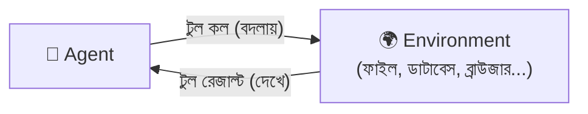
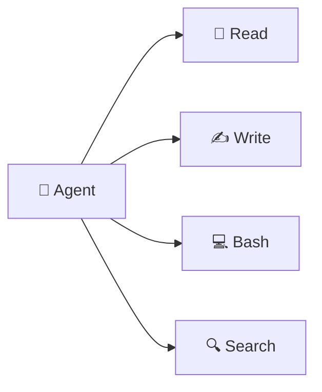
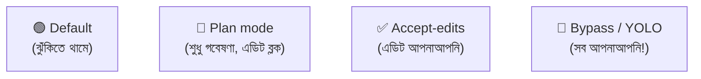

# সেকশন ৩ — টুল ও এনভায়রনমেন্ট 🧰

> মডেল তো শুধু শব্দ আন্দাজ করে। তাহলে ফাইল পড়ে, কোড লেখে, কমান্ড চালায় কীভাবে? উত্তর:
> **টুল**। আর এজেন্ট যে দুনিয়ায় কাজ করে সেটা **এনভায়রনমেন্ট**। চলো দেখি! 🔧

[⬅️ মূল পাতা](../README.md) · [⬅️ আগের সেকশন](02-sessions-context-turns.md)

---

### এনভায়রনমেন্ট (Environment)

এজেন্ট যে দুনিয়ায় কাজ করে — [হার্নেস (Harness)](01-the-model.md#হার্নেস-harness)-এর বাইরের সব কিছু, যা এজেন্ট [টুল রেজাল্ট (Tool result)](#টুল-রেজাল্ট-tool-result) দিয়ে *দেখে* আর [টুল কল (Tool call)](#টুল-কল-tool-call) দিয়ে *বদলায়*। 🌍

> 🌟 **রোজকার উদাহরণ**
> Harness হলো গাড়ি, আর environment হলো রাস্তা 🛣️ — যেখানে গাড়িটা আসলে চলে। [ফাইলসিস্টেম (Filesystem)](#ফাইলসিস্টেম-filesystem)
> সবচেয়ে কমন environment, তবে ডাটাবেস, রিমোট API, ব্রাউজার — এগুলোও environment হতে পারে।

> ⚠️ **এড়িয়ে চলো:** harness আর environment গুলিয়ে ফেলা। Harness হলো মোড়ক, environment হলো কাজের জায়গা।

📝 নিজেকে যাচাই করো

প্রশ্ন: এজেন্ট staging ডাটাবেস দেখতে পাচ্ছে না — কী করব?

**উত্তর:** ওটা environment-এ যুক্ত করো — একটা read-only `psql` টুল দাও। Harness ঠিকই আছে, ওর কাজ করার মতো কিছু নেই।

---

### ফাইলসিস্টেম (Filesystem)

ফাইল আর ফোল্ডারের একটা গাছ 🌳, যেখানে এজেন্ট পড়ে, লেখে, কমান্ড চালায় — কোডিং এজেন্টের সবচেয়ে কমন [এনভায়রনমেন্ট (Environment)](#এনভায়রনমেন্ট-environment)।

> 🌟 **রোজকার উদাহরণ**
> তোমার কম্পিউটারের Documents, Downloads ফোল্ডার — ভেতরে ফাইল, ফাইলের ভেতরে আরও ফোল্ডার। 📁
> এজেন্ট এখানেই কোড, [AGENTS.md](06-memory-and-steering.md#agentsmd), [স্কিল (Skill)](06-memory-and-steering.md#স্কিল-skill) — সব পায়।

📝 নিজেকে যাচাই করো

প্রশ্ন: এজেন্ট আমার AGENTS.md ধরছে না কেন হতে পারে?

**উত্তর:** হয়তো সে অন্য একটা filesystem-এ চলছে (ভুল ফোল্ডার)। Harness-কে ঠিক জায়গায় তাক করাও।

---

### টুল (Tool)

[হার্নেস (Harness)](01-the-model.md#হার্নেস-harness) এজেন্টকে যে ফাংশনগুলো ব্যবহার করতে দেয় — Read, Write, Bash, Search। টুল দিয়েই এজেন্ট [এনভায়রনমেন্ট (Environment)](#এনভায়রনমেন্ট-environment) দেখে আর বদলায়। 🔧

> 🌟 **রোজকার উদাহরণ**
> ভিডিও গেমের ইনভেন্টরির মতো 🎮 — তরবারি, ঢাল, চাবি। যে টুল হাতে আছে শুধু সেটাই ব্যবহার করতে
> পারো। টুল ছাড়া এজেন্ট অন্ধ — environment-এর কিছুই করতে পারে না।

প্রতিটা টুল কল একটা বাড়তি [রিকোয়েস্ট (Model provider request)](01-the-model.md#মডেল-প্রোভাইডার-রিকোয়েস্ট-model-provider-request) খরচ করে, কারণ ফলাফল মডেলে ফিরে যাওয়ার পরই সে পরের সিদ্ধান্ত নিতে পারে।

📝 নিজেকে যাচাই করো

প্রশ্ন: টুল ছাড়া এজেন্ট কেন কিছু করতে পারে না?

**উত্তর:** কারণ environment দেখার বা বদলানোর একমাত্র উপায় হলো টুল। টুল না থাকলে সে অন্ধ ও অসহায়।

---

### টুল কল (Tool call)

মডেলের আউটপুট, যেখানে সে একটা [টুল (Tool)](#টুল-tool)-এর নাম আর তার ইনপুট বলে — স্রেফ একটা স্ট্রাকচার্ড টেক্সট। নিজে থেকে এটা কিচ্ছু করে না; [হার্নেস (Harness)](01-the-model.md#হার্নেস-harness)-কে পড়ে চালাতে হয়। 📞

> 🌟 **রোজকার উদাহরণ**
> রেস্টুরেন্টে অর্ডার স্লিপ লেখার মতো 🧾 — তুমি লিখলে "এক প্লেট বিরিয়ানি"। স্লিপটা নিজে রান্না করে
> না! ওয়েটার (harness) ওটা রান্নাঘরে নিয়ে গেলে তবেই কিছু হয়।

📝 নিজেকে যাচাই করো

প্রশ্ন: এজেন্ট বলল "টেস্ট চালিয়েছি", কিন্তু কিছুই বদলায়নি — কী হলো?

**উত্তর:** হয়তো সে আসল tool call দেয়নি, শুধু *বলেছে* চালিয়েছে। মডেল কল বানায়, কিন্তু harness না চালালে কিছুই ঘটে না।

---

### টুল রেজাল্ট (Tool result)

[হার্নেস (Harness)](01-the-model.md#হার্নেস-harness) একটা [টুল কল (Tool call)](#টুল-কল-tool-call) চালানোর পর যা ফেরত পাঠায় — ফাইলের লেখা, কমান্ডের আউটপুট, বা এরর। এটাই এজেন্টের [এনভায়রনমেন্ট (Environment)](#এনভায়রনমেন্ট-environment) দেখার একমাত্র জানালা। 🪟

> 🌟 **রোজকার উদাহরণ**
> অর্ডার দিলে রান্নাঘর থেকে খাবার (বা "শেষ হয়ে গেছে" খবর) ফেরত আসে 🍽️ — সেটাই tool result।
> Tool call আর tool result একই লেনদেনের দুই মাথা, দুটোই এক [টার্ন (Turn)](02-sessions-context-turns.md#টার্ন-turn)-এর ভেতরে।

📝 নিজেকে যাচাই করো

প্রশ্ন: এজেন্ট একটা ফাইলকে "খালি" ভেবে কাজ করছে — কেন হতে পারে?

**উত্তর:** Tool result হয়তো ফাইলের লেখা না দিয়ে একটা "permission denied" এরর ফেরত দিয়েছে। মডেল শুধু সেই এররটাই দেখেছে।

---

### MCP

**Model Context Protocol.** বাইরের টুল-সার্ভার [হার্নেস (Harness)](01-the-model.md#হার্নেস-harness)-এ প্লাগ করার একটা নিয়ম — যেভাবে এজেন্ট harness-এর সাথে আসা টুলের বাইরেও নতুন [টুল (Tool)](#টুল-tool) পায়। 🔌

> 🌟 **রোজকার উদাহরণ**
> ফোনের চার্জিং পোর্ট স্ট্যান্ডার্ড বলে যেকোনো কোম্পানির চার্জার লাগানো যায় 🔌 — MCP তেমন একটা
> স্ট্যান্ডার্ড "পোর্ট"। এজেন্ট কখনো "MCP কল" করে না; সে একটা টুল কল করে, আর সেই টুলটা এসেছে MCP সার্ভার থেকে।

📝 নিজেকে যাচাই করো

প্রশ্ন: এজেন্টকে Linear থেকে টিকিট পড়াতে চাই — কী করব?

**উত্তর:** Harness-এ Linear-এর MCP সার্ভার যোগ করো — ওটা Linear API-কে টুল হিসেবে এনে দেয়, নিজে টুল লেখার ঝামেলা নেই।

---

### পারমিশন রিকোয়েস্ট (Permission request)

কোনো ঝুঁকির [টুল কল (Tool call)](#টুল-কল-tool-call) চালানোর আগে [হার্নেস (Harness)](01-the-model.md#হার্নেস-harness) ইউজারকে যে অনুমতি জিজ্ঞেস করে। ✋ Approve করলে চলে; deny করলে harness সেটা একটা [টুল রেজাল্ট (Tool result)](#টুল-রেজাল্ট-tool-result) হিসেবে মডেলকে জানিয়ে দেয়।

> 🌟 **রোজকার উদাহরণ**
> ছোট ভাই কাঁচি নিতে গেলে মা থামিয়ে জিজ্ঞেস করেন "কী করবি?" ✋ — সেটাই permission request।
> ঝুঁকির কাজে মানুষকে [লুপের ভেতরে (Human-in-the-loop)](07-patterns-of-work.md#হিউম্যান-ইন-দ্য-লুপ-human-in-the-loop) রাখার উপায়।

📝 নিজেকে যাচাই করো

প্রশ্ন: প্রতিটা ছোট কাজেও permission চাইছে, বিরক্তিকর — কী করব?

**উত্তর:** নিরাপদ টুলগুলো আগেই approve করে রাখো, তাহলে শুধু সত্যিকার ঝুঁকির কাজেই থামবে।

---

### পারমিশন মোড (Permission mode)

[এজেন্ট মোড (Agent mode)](#এজেন্ট-মোড-agent-mode)-এর সেই অংশ যেটা ঠিক করে — কোন [টুল কল (Tool call)](#টুল-কল-tool-call)-এ [পারমিশন রিকোয়েস্ট (Permission request)](#পারমিশন-রিকোয়েস্ট-permission-request) লাগবে আর কোনটা আপনাআপনি চলবে। ⚙️

> 🌟 **রোজকার উদাহরণ**
> ফোনের অ্যাপ পারমিশনের মতো — কোন অ্যাপ ক্যামেরা পাবে, কোনটা পাবে না, তুমি সেট করে দাও। 📷

📝 নিজেকে যাচাই করো

প্রশ্ন: রিসার্চের সময় প্রতিটা search-এ থেমে যাচ্ছে — কী করব?

**উত্তর:** Read-only টুলের permission mode ঢিলা করো, শুধু লেখা/শেল কমান্ডে থামতে দাও।

---

### এজেন্ট মোড (Agent mode)

একটা প্রিসেট, যা এজেন্ট কীভাবে চলবে তা ঠিক করে — [পারমিশন মোড (Permission mode)](#পারমিশন-মোড-permission-mode)-এর সাথে কিছু আচরণের নির্দেশনা বান্ডিল করে। সেশনের মাঝপথেও বদলানো যায়। 🎛️

> 🌟 **রোজকার উদাহরণ**
> ক্যামেরার মোড ডায়ালের মতো 📸 — Auto, Portrait, Sports। যে মোডে দাও, ক্যামেরা সেভাবেই আচরণ
> করে। "YOLO mode"-এ সব আপনাআপনি হয় — মজার, তবে শুধু [স্যান্ডবক্স (Sandbox)](#স্যান্ডবক্স-sandbox)-এর ভেতরে! 😅

🔍 আরও জানো

ভেন্ডর ভেদে নাম আলাদা — Claude Code বলে "permission modes", Codex বলে "approval modes"।
দুটোই আচরণ-বান্ডলিং চালুর আগে থেকে ছিল।

📝 নিজেকে যাচাই করো

প্রশ্ন: শুধু একটা প্ল্যান চাই, এজেন্ট যেন ফাইল এডিট না করে — কোন মোড?

**উত্তর:** Plan mode — এটা লেখা ব্লক করে, এজেন্টকে গবেষণায় রাখে।

---

### স্যান্ডবক্স (Sandbox)

একটা আলাদা, বিচ্ছিন্ন [এনভায়রনমেন্ট (Environment)](#এনভায়রনমেন্ট-environment), যার ভেতরে এজেন্ট চলে — কন্টেইনার, VM, বা সীমিত-পারমিশনের শেল। এজেন্ট কিছু ভেঙে ফেললেও ক্ষতি ওই বাক্সেই আটকে থাকে। 📦🛡️

> 🌟 **রোজকার উদাহরণ**
> বাচ্চাদের খেলার বালির বাক্স 🏖️ — যত খুশি গর্ত খোঁড়ো, ঘর বানাও, ভাঙো; বাইরের দুনিয়ার কিছু
> হয় না। এজেন্ট ভুল করে সর্বনাশা কমান্ড চালালেও sandbox-এর বাইরে আঁচ লাগে না।

📝 নিজেকে যাচাই করো

প্রশ্ন: এজেন্টকে সারারাত "bypass mode"-এ চালাতে চাই, কিন্তু ভয় লাগছে — সমাধান?

**উত্তর:** Sandbox-এ চালাও — তাজা কন্টেইনার, কোনো পাসওয়ার্ড নেই, ইন্টারনেট নেই। খারাপ হলে কন্টেইনারটা ফেলে দাও।

<!-- GIF-PLACEHOLDER: বালির বাক্সে খেলা, বাইরে কিছু হচ্ছে না — এমন gif -->

---

[⬅️ মূল পাতা](../README.md) · [পরের সেকশন: ভুল করার ধরন ➡️](04-failure-modes.md)
