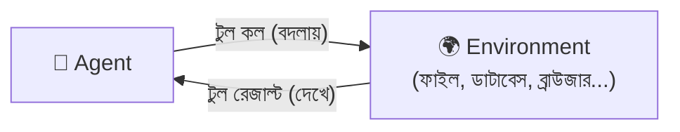
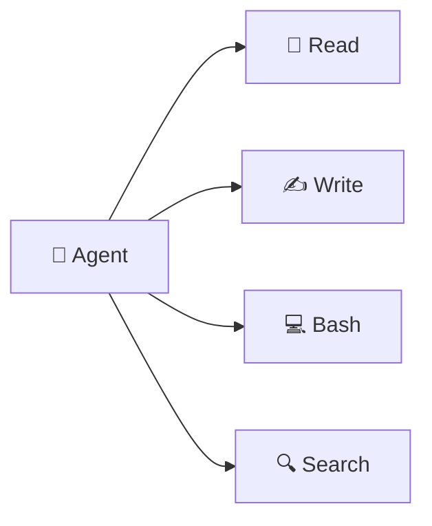
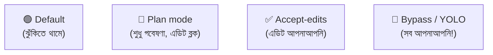

# সেকশন ৩ — টুল ও এনভায়রনমেন্ট 🧰

> মডেল তো শুধু শব্দ আন্দাজ করে। তাহলে ফাইল পড়ে, কোড লেখে, কমান্ড চালায় — এসব হয় কীভাবে?
> উত্তরটা একটাই শব্দ: **টুল**। আর এজেন্ট যে দুনিয়ায় বসে এসব করে, তার নাম **এনভায়রনমেন্ট**।

[⬅️ মূল পাতা](../README.md) · [⬅️ আগের সেকশন](02-sessions-context-turns.md)

---

### এনভায়রনমেন্ট (Environment)

এজেন্ট যে দুনিয়ায় কাজ করে, সেটাই এনভায়রনমেন্ট — [হার্নেস (Harness)](01-the-model.md#হার্নেস-harness)-এর বাইরের সবকিছু, যা এজেন্ট [টুল রেজাল্ট (Tool result)](#টুল-রেজাল্ট-tool-result) দিয়ে *দেখে* আর [টুল কল (Tool call)](#টুল-কল-tool-call) দিয়ে *বদলায়*। 🌍

হার্নেস যদি হয় গাড়ি, তাহলে environment হলো রাস্তা 🛣️ — যেখানে গাড়িটা আসলে চলে। দুটোকে গুলিয়ে ফেলবেন না: হার্নেস হলো মোড়ক, আর environment কাজের জায়গা। [ফাইলসিস্টেম (Filesystem)](#ফাইলসিস্টেম-filesystem) সবচেয়ে চেনা environment, তবে ডাটাবেস, রিমোট API, ব্রাউজার — এরাও দিব্যি environment হতে পারে।

💬 কথোপকথনে

🙋 "এজেন্ট staging DB-র schema দেখতে পাচ্ছে না।"

🧑‍🏫 "ওটা environment-এ যোগ করুন — staging-এ read-only স্কোপ করা একটা `psql` টুল দিন। Harness-এর কোনো দোষ নেই, ওর কাজ করার মতো কিছু নেই বলেই এই কাণ্ড।"

---

### ফাইলসিস্টেম (Filesystem)

ফাইল আর ফোল্ডারের একটা গাছ 🌳, যেখানে এজেন্ট পড়ে, লেখে, কমান্ড চালায়। কোডিং এজেন্টের সবচেয়ে চেনা [এনভায়রনমেন্ট (Environment)](#এনভায়রনমেন্ট-environment) এটাই।

আপনার কম্পিউটারের Documents বা Downloads ফোল্ডারটাই ভাবুন না — ভেতরে ফাইল, ফাইলের ভেতরে আরও ফোল্ডার। 📁 এজেন্ট এখানেই খুঁজে পায় কোড, [AGENTS.md](06-memory-and-steering.md#agentsmd), [স্কিল (Skill)](06-memory-and-steering.md#স্কিল-skill) — সবকিছু।

💬 কথোপকথনে

🙋 "আমার AGENTS.md ধরছে না কেন?"

🧑‍🏫 "ও হয়তো অন্য একটা filesystem-এ চলছে। [স্যান্ডবক্স (Sandbox)](#স্যান্ডবক্স-sandbox) হয়তো প্রজেক্ট রুট নয়, প্যারেন্ট ফোল্ডারটা মাউন্ট করে বসে আছে। Harness-কে ঠিক জায়গায় তাক করিয়ে দিন।"

---

### টুল (Tool)

[হার্নেস (Harness)](01-the-model.md#হার্নেস-harness) এজেন্টকে যে ফাংশনগুলো ব্যবহার করতে দেয় — Read, Write, Bash, Search। এই টুল দিয়েই এজেন্ট [এনভায়রনমেন্ট (Environment)](#এনভায়রনমেন্ট-environment) দেখে আর বদলায়। 🔧

ভিডিও গেমের ইনভেন্টরির কথা ভাবুন 🎮 — তরবারি, ঢাল, চাবি। যেটা হাতে আছে, কেবল সেটাই চালানো যায়। টুল না থাকলে এজেন্ট কার্যত অন্ধ, environment-এ আঙুল ছোঁয়াতে পারে না। আর মাথায় রাখবেন, প্রতিটা টুল কল একটা করে বাড়তি [রিকোয়েস্ট (Model provider request)](01-the-model.md#মডেল-প্রোভাইডার-রিকোয়েস্ট-model-provider-request) খরচ করে — কারণ ফলাফলটা মডেলে ফিরে না গেলে সে পরের পা ফেলতে পারে না।

💬 কথোপকথনে

🙋 "এজেন্ট কি সরাসরি staging-এ query করতে পারে?"

🧑‍🏫 "Harness-এ একটা read-only `psql` টুল যোগ করে দিন। ওই টুল না থাকলে [ফাইলসিস্টেমের (Filesystem)](#ফাইলসিস্টেম-filesystem) বাইরের সবকিছুতে এজেন্ট অন্ধ।"

---

### টুল কল (Tool call)

মডেলের আউটপুট, যেখানে সে একটা [টুল (Tool)](#টুল-tool)-এর নাম আর তার ইনপুট বলে দেয়। আদতে এটা স্রেফ একটা সাজানো টেক্সট — নিজে থেকে কিচ্ছু করে না; [হার্নেস (Harness)](01-the-model.md#হার্নেস-harness)-কে সেটা পড়ে চালাতে হয়। 📞

রেস্টুরেন্টে অর্ডার স্লিপ লেখার কথা ভাবুন 🧾। আপনি লিখলেন "এক প্লেট বিরিয়ানি"। স্লিপটা কি নিজে রান্না করে? মোটেই না। ওয়েটার (এই গল্পে harness) ওটা রান্নাঘরে নিয়ে গেলে তবেই হাঁড়ি চাপে।

💬 কথোপকথনে

🙋 "এটা বলল টেস্ট চালিয়েছে, কিন্তু ফাইলের টাইমস্ট্যাম্প বদলায়নি।"

🧑‍🏫 "ট্রান্সক্রিপ্টটা একবার দেখুন — ও কি সত্যিই একটা tool call দিয়েছিল, নাকি শুধু *বলেছে* চালিয়েছে? মডেল কল বানায় ঠিকই, কিন্তু harness না চালালে কিছুই ঘটে না।"

---

### টুল রেজাল্ট (Tool result)

[হার্নেস (Harness)](01-the-model.md#হার্নেস-harness) একটা [টুল কল (Tool call)](#টুল-কল-tool-call) চালানোর পর যা ফেরত পাঠায় — ফাইলের লেখা, কমান্ডের আউটপুট, কিংবা কোনো এরর। এটাই এজেন্টের [এনভায়রনমেন্ট (Environment)](#এনভায়রনমেন্ট-environment) দেখার একমাত্র জানালা। 🪟

অর্ডার দিলে রান্নাঘর থেকে হয় খাবার আসে, নয় "শেষ হয়ে গেছে" খবরটা আসে 🍽️ — সেটাই tool result। টুল কল আর টুল রেজাল্ট আসলে একই লেনদেনের দুই মাথা, দুটোই ঘটে এক [টার্ন (Turn)](02-sessions-context-turns.md#টার্ন-turn)-এর ভেতরে।

💬 কথোপকথনে

🙋 "এটা ফাইলটাকে খালি ধরে কাজ করছে।"

🧑‍🏫 "Tool result ফাইলের লেখা না দিয়ে একটা permission denial ফেরত দিয়েছে। মডেল কেবল ওই এরর স্ট্রিংটাই দেখেছে — ফাইলের আর কোনো জানালা ওর কাছে নেই।"

---

### MCP

**Model Context Protocol.** বাইরের টুল-সার্ভার [হার্নেস (Harness)](01-the-model.md#হার্নেস-harness)-এ প্লাগ করার একটা নিয়ম — এজেন্ট এভাবেই harness-এর সঙ্গে আসা টুলের বাইরেও নতুন [টুল (Tool)](#টুল-tool) হাতে পায়। 🔌

ফোনের চার্জিং পোর্ট স্ট্যান্ডার্ড বলেই যেকোনো কোম্পানির চার্জার লাগিয়ে দেওয়া যায় 🔌 — MCP তেমনই একটা স্ট্যান্ডার্ড "পোর্ট"। একটা মজার কথা: এজেন্ট কিন্তু কখনো "MCP কল" করে না। সে স্রেফ একটা টুল কল করে, আর সেই টুলটা এসেছে কোনো MCP সার্ভার থেকে।

💬 কথোপকথনে

🙋 "এজেন্টকে Linear থেকে টিকিট পড়াতে হবে।"

🧑‍🏫 "Harness-কে Linear MCP সার্ভারটা ব্যবহার করতে দিন — ওটা Linear API-কে টুল হিসেবে এনে হাজির করে। নিজে টুল র‍্যাপার লেখার ঝামেলাটা বাঁচল।"

---

### পারমিশন রিকোয়েস্ট (Permission request)

কোনো ঝুঁকির [টুল কল (Tool call)](#টুল-কল-tool-call) চালানোর আগে [হার্নেস (Harness)](01-the-model.md#হার্নেস-harness) ইউজারের কাছে যে অনুমতিটা চায়, সেটাই permission request। ✋ Approve করলে চলে; deny করলে harness সেটা একটা [টুল রেজাল্ট (Tool result)](#টুল-রেজাল্ট-tool-result) হিসেবে মডেলকে জানিয়ে দেয়।

ছোট ভাই কাঁচি নিতে গেলে মা থামিয়ে জিজ্ঞেস করেন, "কী করবি?" ✋ — সেটাই permission request। ঝুঁকির কাজে মানুষকে [লুপের ভেতরে (Human-in-the-loop)](07-patterns-of-work.md#হিউম্যান-ইন-দ্য-লুপ-human-in-the-loop) রাখার একটা উপায়।

💬 কথোপকথনে

🙋 "১০ মিনিট ধরে একটা permission request-এ আটকে আছে — আমি মিটিংয়ে ছিলাম।"

🧑‍🏫 "এটাই human-in-the-loop-এর দাম। নিরাপদ টুলগুলো আগেভাগে approve করে রাখুন, তাহলে request শুধু সত্যিকারের ঝুঁকির কাজেই মাথা তুলবে।"

---

### পারমিশন মোড (Permission mode)

[এজেন্ট মোড (Agent mode)](#এজেন্ট-মোড-agent-mode)-এর সেই অংশ, যেটা ঠিক করে দেয় কোন [টুল কল (Tool call)](#টুল-কল-tool-call)-এ [পারমিশন রিকোয়েস্ট (Permission request)](#পারমিশন-রিকোয়েস্ট-permission-request) লাগবে, আর কোনটা বিনা বাধায় চলে যাবে। ⚙️

ফোনের অ্যাপ পারমিশনের মতোই ব্যাপারটা — কোন অ্যাপ ক্যামেরা পাবে, কোনটা পাবে না, সেটা তো আপনিই সেট করে দেন। 📷

💬 কথোপকথনে

🙋 "প্রতিটা grep-এ থেমে যাচ্ছিল — পুরো [AFK](07-patterns-of-work.md#afk) রানটাই মাটি!"

🧑‍🏫 "Read-only টুলের permission mode-টা ঢিলা করুন, লেখা আর শেল কমান্ডে prompting রাখুন। রিসার্চ সেশনে বেশির ভাগ permission request আসলে স্রেফ নয়েজ।"

---

### এজেন্ট মোড (Agent mode)

একটা প্রিসেট, যা ঠিক করে দেয় এজেন্ট কীভাবে চলবে — [পারমিশন মোড (Permission mode)](#পারমিশন-মোড-permission-mode)-এর সঙ্গে কিছু আচরণের নির্দেশনা একসঙ্গে বেঁধে রাখে। সেশনের মাঝপথেও এটা বদলে নেওয়া যায়। 🎛️

ক্যামেরার মোড ডায়ালের কথা ভাবুন 📸 — Auto, Portrait, Sports। যে মোডে রাখবেন, ক্যামেরা ঠিক সেভাবেই চলবে। "YOLO mode"-এ আবার সবকিছু আপনাআপনি হয়ে যায় — মজার, তবে ওটা মানায় কেবল [স্যান্ডবক্স (Sandbox)](#স্যান্ডবক্স-sandbox)-এর ভেতরে। 😅 ভেন্ডরভেদে নামও পাল্টায় — Claude Code বলে "permission modes", Codex বলে "approval modes" — কাজটা অবশ্য একই।

💬 কথোপকথনে

🙋 "শুধু প্ল্যান চাই, কিন্তু এটা ফাইল এডিট করতে থাকে।"

🧑‍🏫 "Plan mode-এ যান — এটা লেখা ব্লক করে এজেন্টকে গবেষণাতেই আটকে রাখবে।"

🙋 "আর পরে AFK রানের জন্য?"

🧑‍🏫 "Bypass mode, তবে শুধু sandbox-এর ভেতরে।"

---

### স্যান্ডবক্স (Sandbox)

একটা আলাদা, বিচ্ছিন্ন [এনভায়রনমেন্ট (Environment)](#এনভায়রনমেন্ট-environment), যার ভেতরে এজেন্ট চলে — কন্টেইনার, VM, কিংবা সীমিত-পারমিশনের শেল। এজেন্ট কিছু ভেঙে ফেললেও ক্ষতিটা ওই বাক্সেই আটকে থাকে। 📦🛡️

বাচ্চাদের খেলার বালির বাক্সের কথা ভাবুন 🏖️ — যত খুশি গর্ত খুঁড়ুন, ঘর বানান, ভাঙুন; বাইরের দুনিয়ার কিচ্ছু হবে না। এজেন্ট ভুল করে সর্বনাশা একটা কমান্ড চালিয়ে দিলেও sandbox-এর বাইরে তার আঁচ পৌঁছায় না।

💬 কথোপকথনে

🙋 "রাতভর [bypass-permissions](#এজেন্ট-মোড-agent-mode) চালাতে চাই, কিন্তু সাহস পাচ্ছি না।"

🧑‍🏫 "Sandbox-এ ফেলে দিন — তাজা একটা কন্টেইনার, কোনো credential মাউন্ট নেই, নেটওয়ার্ক বন্ধ। খারাপ কিছু হলে বড়জোর নিজের filesystem-ই উড়িয়ে দেবে, আপনি কন্টেইনারটা ফেলে দিলেই হলো।"

  

<!-- GIF-PLACEHOLDER: বালির বাক্সে খেলা, বাইরে কিছু হচ্ছে না — এমন gif -->

---

## 🎯 সেকশন রিভিউ — সব মনে আছে তো?

প্রশ্ন ১: টুল ছাড়া এজেন্ট কী করতে পারে না, কেন?

কিছুই না — environment দেখার (tool result) বা বদলানোর (tool call) একমাত্র উপায় টুল। টুল ছাড়া এজেন্ট অন্ধ।

প্রশ্ন ২: Tool call আর tool result-এর সম্পর্ক কী?

একই লেনদেনের দুই মাথা — call যায়, result ফেরে, দুটোই এক **turn**-এর ভেতরে।

প্রশ্ন ৩: MCP আসলে কী করে?

বাইরের টুল-সার্ভার harness-এ প্লাগ করার স্ট্যান্ডার্ড "পোর্ট" — নতুন টুল এনে দেয়।

প্রশ্ন ৪: AFK রান নিরাপদ করতে sandbox কেন জরুরি?

এজেন্ট ভুল করলেও ক্ষতি বাক্সেই আটকে থাকে — বাইরের আসল সিস্টেমে আঁচ লাগে না।

## 🧩 মিনি-চ্যালেঞ্জ

🕵️ আপনি এজেন্টকে রাতভর একা ছেড়ে দিতে চান। কোন ৩টা সেটিং/শব্দ ঠিকঠাক না করলে বিপদ?

- **Permission mode** — খুব কড়া হলে প্রতি স্টেপে থেমে যাবে; খুব ঢিলা হলে ঝুঁকি।
- **Sandbox** — না থাকলে এজেন্টের ভুল আসল সিস্টেমে ক্ষতি করতে পারে।
- **Agent mode (bypass)** — শুধু sandbox-এর ভেতরে দিলে নিরাপদ।

## ✅ শেখার চেকলিস্ট

> 💡 *Fork করে টিক দিন!*

- [ ] Environment = এজেন্ট যেখানে কাজ করে (রাস্তা)
- [ ] Filesystem = সবচেয়ে কমন environment
- [ ] Tool = এজেন্টের হাত-চোখ; Read/Write/Bash/Search
- [ ] Tool call (অর্ডার) ↔ Tool result (খাবার)
- [ ] MCP = নতুন টুল আনার স্ট্যান্ডার্ড পোর্ট
- [ ] Permission request/mode = কখন থামবে তা ঠিক করে
- [ ] Agent mode = Plan / Accept-edits / YOLO
- [ ] Sandbox = নিরাপদ বালির বাক্স

---

[⬅️ মূল পাতা](../README.md) · [পরের সেকশন: ভুল করার ধরন ➡️](04-failure-modes.md)
