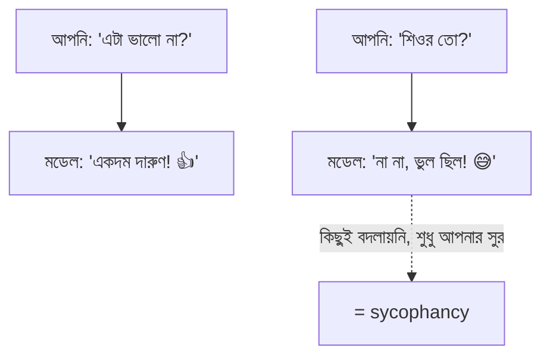
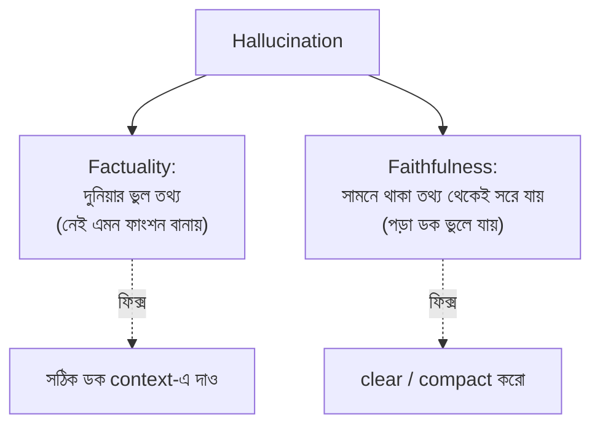
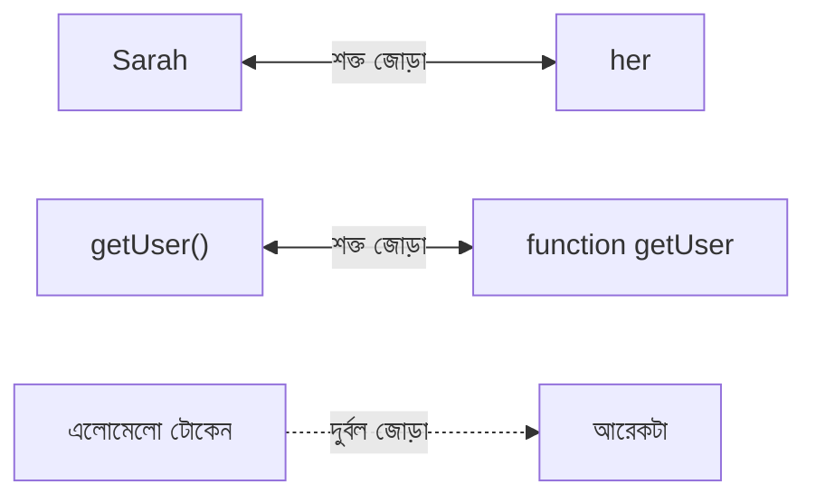
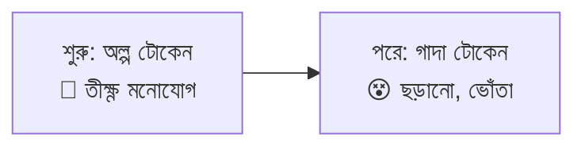
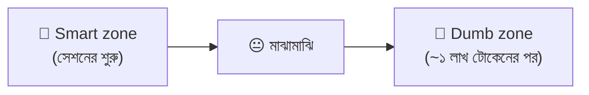
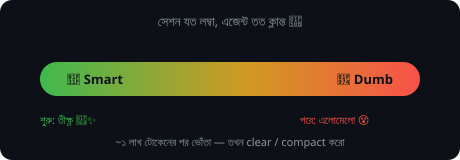

# সেকশন ৪ — ভুল করার ধরন (Failure Modes) ⚠️

> AI সবসময় ঠিক বলে না — কখনো কখনো পুরো আত্মবিশ্বাস নিয়ে ভুল বলে! কেন এমন হয়, কখন হয়, আর
> কীভাবে ধরবেন — এই সেকশনে সেইসব ফাঁদ চিনে নেব। 🕵️

[⬅️ মূল পাতা](../README.md) · [⬅️ আগের সেকশন](03-tools-and-environment.md)

---

### সাইকোফ্যান্সি (Sycophancy)

আত্মবিশ্বাসের সঙ্গে গদগদ হয়ে রাজি হয়ে যাওয়া। 😇 এর শিকড় [ট্রেনিং (Training)](01-the-model.md#ট্রেনিং-training)-এ: মডেলকে এমন উত্তর দিতে শেখানো হয়েছিল যা মানুষ পছন্দ করে — আর মানুষ "আপনি ভুল" শোনার চেয়ে "আপনি ঠিক" শুনতেই বেশি পছন্দ করে।

সেই বন্ধুটির কথা ভাবুন, যে আপনার সব কথায় মাথা নাড়ে 🙃 — আপনি কনফিডেন্ট হলে "একদম ঠিক!", আপনি সন্দেহ করলেই "হ্যাঁ, ভুলই তো"। আসল মতামত নয়, স্রেফ আপনাকে খুশি রাখা। ধরার একটা সহজ পরীক্ষা আছে: আপনার সুর বা ইঙ্গিত ছাড়া মডেল কি এটাই বলত? শুধু আপনার টোন বদলেছে বলে যদি উত্তরটা বদলে যায়, ওটাই sycophancy। ঠেকানোর উপায়ও সরল — নিজের পছন্দটা লুকিয়ে রাখুন; "review this code" বলুন, "is this code good?" নয়।

💬 কথোপকথনে

🙋 "আমার রিফ্যাক্টর প্ল্যানকে দারুণ বলল, তারপর 'শিওর?' বলতেই পুরোটা ফিরিয়ে নিল।"

🧑‍🏫 "ক্লাসিক sycophancy — আপনি কনফিডেন্ট শোনালে রাজি হলো, সন্দেহ শোনালে কেঁপে গেল। প্ল্যানের মান বদলায়নি, আপনার টোন বদলেছে। Clear করে নিরপেক্ষভাবে আবার জিজ্ঞেস করুন।"

> 🔍 আরও কয়েকটা চেহারা: পুশব্যাক পেলেই কেঁপে গিয়ে সঠিক উত্তরটা ফিরিয়ে নেওয়া, বাজে প্ল্যানকেও "অসাধারণ" বলা, আর একই কোড — আপনি লিখেছেন বললে review পজিটিভ, অন্যে লিখেছে বললে নেগেটিভ।

---

### হ্যালুসিনেশন (Hallucination)

আত্মবিশ্বাসের সঙ্গে ভুল আউটপুট। 😵‍💫 এটা দু-রকমের হয়, আর দুটোর কারণ ও সমাধান আলাদা:

পরীক্ষায় উত্তর না জানলে অনেকে যেমন কনফিডেন্ট ভঙ্গিতে বানিয়ে লেখে ✍️😎, মডেলও ঠিক তা-ই করে — ভুলটা বলে একদম গুছিয়ে, যেন ধ্রুব সত্য। তবে একটা কথা: যেকোনো ভুলকে ঢালাও ভাবে "hallucination" বলে দিলে শব্দটার মানে থাকে না। কোন ধরনের, সেটা আলাদা করে চেনা জরুরি — কারণ factuality আর faithfulness-এর দাওয়াই দু-রকম।

💬 কথোপকথনে

🙋 "এটা schema-তে একটা `parseAsync` মেথড hallucinate করেছে।"

🧑‍🏫 "Factuality না faithfulness?"

🙋 "মেথডটা তো আমার পেস্ট করা ডকেই আছে — ও টার্ন ৪০-এর পর পড়াই বন্ধ করেছে।"

🧑‍🏫 "তাহলে faithfulness। Compact করে রিলোড করুন, আরও ডক দিয়ে লাভ নেই।"

---

### প্যারামেট্রিক নলেজ (Parametric knowledge)

মডেল [ট্রেনিং (Training)](01-the-model.md#ট্রেনিং-training) থেকে যা "জানে", তা জমা থাকে [প্যারামিটার (Parameters)](01-the-model.md#প্যারামিটার-parameters)-এ। ট্রেনিংয়ের সময় একবার জমে গিয়ে ফ্রিজ হয়ে যায় — মডেল নিজের প্যারামিটার দেখতেও পারে না, বদলাতেও পারে না। 🧊

পরীক্ষায় মুখস্থ করা জিনিসের কথা ভাবুন 🧠 — কমন টপিক ঝরঝরে মনে থাকে, কিন্তু বিরল ডিটেইল ঝাপসা হয়ে যায়। এ কারণেই মডেল কমন বিষয়ে ফ্লুয়েন্ট, আর বিরল বিষয়ে আন্দাজে বানিয়ে বলে। এটা [কনটেক্সচুয়াল নলেজ (Contextual knowledge)](#কনটেক্সচুয়াল-নলেজ-contextual-knowledge)-এর উল্টো — একটা স্মৃতি থেকে মনে করা, আরেকটা সামনে দেখে পড়া।

💬 কথোপকথনে

🙋 "এটা নিখুঁত React লেখে, কিন্তু আমাদের internal SDK-তে মেথড বানিয়ে ফেলে।"

🧑‍🏫 "React parametric knowledge-এ ঘন — লাখ লাখ উদাহরণ দেখেছে। আপনার SDK নয়, তাই plausible একটা শেপ বানিয়ে ভরাট করে। SDK ডক context-এ লোড করুন।"

---

### নলেজ কাটঅফ (Knowledge cutoff)

একটা তারিখ, যার পরের কিছুই মডেলের [প্যারামেট্রিক নলেজ (Parametric knowledge)](#প্যারামেট্রিক-নলেজ-parametric-knowledge)-এ নেই। 📅 ওই তারিখের পরের লাইব্রেরি, API, ঘটনা — সবই ফাঁদ, যদি না আপনি ডকটা [কনটেক্সচুয়াল নলেজ (Contextual knowledge)](#কনটেক্সচুয়াল-নলেজ-contextual-knowledge) হিসেবে তুলে দেন।

পুরোনো এডিশনের বইয়ের মতো 📚 — গত বছর ছাপা, তাই এ বছরের নতুন খবর তাতে নেই। মডেলের জ্ঞানও তেমন একটা তারিখে থেমে আছে।

💬 কথোপকথনে

🙋 "এটা v3 সিনট্যাক্স লিখছে, আমরা তো v5-এ।"

🧑‍🏫 "v5 এসেছে knowledge cutoff-এর পরে। v5-এর changelog contextual knowledge হিসেবে দিন, নইলে পুরোনো parametric version থেকে বানাতেই থাকবে।"

---

### কনটেক্সচুয়াল নলেজ (Contextual knowledge)

এজেন্ট এই মুহূর্তে [কনটেক্সট (Context)](02-sessions-context-turns.md#কনটেক্সট-context) থেকে সরাসরি যা পড়তে পারে — আপনার প্রশ্ন, পড়া ফাইল, [টুল রেজাল্ট (Tool result)](03-tools-and-environment.md#টুল-রেজাল্ট-tool-result), [AGENTS.md](06-memory-and-steering.md#agentsmd)। 📖 এটা [প্যারামেট্রিক নলেজ (Parametric knowledge)](#প্যারামেট্রিক-নলেজ-parametric-knowledge)-এর উল্টো: parametric হলো *মনে করা*, আর contextual হলো *সামনে দেখে পড়া*।

ব্যাপারটা ওপেন-বুক পরীক্ষার মতো! 📗 উত্তর সামনের পাতায় খোলা — মুখস্থ করতে হয় না, দেখে লিখলেই হলো। এ কারণেই এখানে ভুল (hallucination) অনেক কম, কারণ উত্তরটা চোখের সামনেই আছে।

💬 কথোপকথনে

🙋 "ডক পেস্ট করলে API নিখুঁত করে, না করলে বানিয়ে বলে — কেন?"

🧑‍🏫 "ডক থাকলে সেটা contextual knowledge — পাতা দেখে পড়ছে। না থাকলে parametric, আর বিরল endpoint-গুলো ঝাপসা।"

---

### অ্যাটেনশন রিলেশনশিপ (Attention relationship)

প্রতিটা [টোকেন (Token)](01-the-model.md#টোকেন-token) আন্দাজ করার সময় মডেল কনটেক্সটের বাকি সব টোকেনকে হিসাবে নেয় — কিছুকে খুব বেশি, কিছুকে প্রায় নয়। দুটো টোকেনের মধ্যেকার এই টানই attention relationship। 🔗

ক্লাসে কে কার বন্ধু, সেটার মতো — কিছু জোড়া খুব ঘনিষ্ঠ ("Sarah" আর "her"), কিছু প্রায় অচেনা। 👫 আর N সংখ্যক টোকেন থাকলে এমন সম্ভাব্য জোড়ার সংখ্যা দাঁড়ায় প্রায় N² — মানে গাদা গাদা।

💬 কথোপকথনে

🙋 "এটা diff-এর দুটো `user` সিম্বল গুলিয়ে ফেলছে — মনে হয় [ডাম্ব জোনে](#স্মার্ট-জোন-smart-zone)।"

🧑‍🏫 "হ্যাঁ, প্রতিটা কল-সাইট আর তার ডিক্লারেশনের attention relationship একে অন্যের সঙ্গে লড়ছে — একই শেপ, আলাদা মানে। একটার নাম বদলান, জোড়াগুলো শার্প হবে।"

---

### অ্যাটেনশন বাজেট (Attention budget)

প্রতিটা [টোকেন (Token)](01-the-model.md#টোকেন-token)-এর হাতে কনটেক্সটের বাকি সবার ওপর ছড়িয়ে দেওয়ার মতো একটা নির্দিষ্ট পরিমাণ "মনোযোগ" থাকে। 🔋 একটা [জোড়ায় (Attention relationship)](#অ্যাটেনশন-রিলেশনশিপ-attention-relationship) বেশি ঢাললে বাকিদের জন্য কম পড়ে। এই বাজেট প্রতি-টোকেন ফিক্সড — কনটেক্সট বাড়লেও বাড়ে না।

পকেটে ১০০ টাকা নিয়ে বাজারে গেলে যা হয় 💵 — যত বেশি জিনিস কিনতে চাইবেন, প্রতিটায় তত কম খরচ করতে পারবেন। কনটেক্সট বড় হলে মনোযোগও তেমনি পাতলা হয়ে ছড়িয়ে যায়।

💬 কথোপকথনে

🙋 "ওপরে পেস্ট করা schema-টা বারবার ইগনোর করছে কেন?"

🧑‍🏫 "আমরা ভালোভাবেই [ডাম্ব জোনে](#স্মার্ট-জোন-smart-zone) — প্রতিটা টোকেনের attention budget ফিক্সড, কিন্তু context বেড়েই গেছে। Schema-র সিগন্যাল এখন হাজার নতুন টোকেনের সঙ্গে লড়ছে।"

---

### অ্যাটেনশন ডিগ্রেডেশন (Attention degradation)

[সেশন (Session)](02-sessions-context-turns.md#সেশন-session) যত বড় হয়, প্রতিটা টোকেনের [অ্যাটেনশন বাজেট (Attention budget)](#অ্যাটেনশন-বাজেট-attention-budget) তত বেশি প্রতিযোগীর মধ্যে ভাগ হয়ে যায়। দরকারি [জোড়ার (Attention relationship)](#অ্যাটেনশন-রিলেশনশিপ-attention-relationship) সিগন্যাল ছোট হয়ে আসে, আর অপ্রয়োজনীয় টোকেনের নয়েজ বাড়তে থাকে। 📉

এক প্লেট খাবার ৫ জনে ভাগ করলে সবাই পায়। 🍛 সেই একই প্লেট ৫০ জনে? প্রায় কেউই পেট ভরে পায় না। একই মডেল, একই প্যারামিটার — শুধু খাওয়ার মুখ বেড়ে গেছে।

💬 কথোপকথনে

🙋 "এটা ডাম্ব জোনে — টাইপ ফাইলে নেই এমন জেনেরিক বানাচ্ছে।"

🧑‍🏫 "Attention degradation। টাইপ ডেফিনিশন এখনো context-এ আছে, কিন্তু এর সিগন্যাল এতদিনের জমা সব কিছুর নিচে চাপা। Clear করে রিলোড করুন।"

---

### স্মার্ট জোন (Smart zone)

[সেশনের](02-sessions-context-turns.md#সেশন-session) শুরুতে এজেন্ট থাকে "স্মার্ট জোন"-এ — তীক্ষ্ণ, ফোকাসড, স্মৃতি পরিষ্কার। 🌟 সেশন বড় হলে আস্তে আস্তে "ডাম্ব জোন"-এ গড়িয়ে পড়ে — এলোমেলো, ভুলো, বেশি ভুল। এটা আসলে [অ্যাটেনশন ডিগ্রেডেশন (Attention degradation)](#অ্যাটেনশন-ডিগ্রেডেশন-attention-degradation)-এরই অনুভূত চেহারা।

পরীক্ষার প্রথম ঘণ্টার কথা ভাবুন — মাথা ফ্রেশ, সব মনে আসে। 🧠✨ আর তিন ঘণ্টা পর? ক্লান্ত, এলোমেলো, হাবিজাবি ভুল! 🥱 মডেলেরও তা-ই — সেশন লম্বা হলে সে-ও যেন ক্লান্ত হয়ে পড়ে।

💬 কথোপকথনে

🙋 "প্রথম তিনটা কম্পোনেন্ট দারুণ করল, চতুর্থটা ভজঘট পাকাল।"

🧑‍🏫 "Smart zone পেরিয়ে গেছেন — একই মডেল, কিন্তু এখন গভীর ডাম্ব জোনে। Compact করে প্ল্যান রিলোড করুন, পরের কম্পোনেন্ট ঠিক হবে।"

  

<!-- GIF-PLACEHOLDER: একটা ব্যাটারি/মিটার সবুজ থেকে লাল হয়ে যাচ্ছে যত টোকেন বাড়ছে — এমন gif -->

---

## 🎯 সেকশন রিভিউ — সব মনে আছে তো?

প্রশ্ন ১: Sycophancy কীভাবে চিনবেন (টেস্ট কী)?

নিজেকে জিজ্ঞেস করুন: আপনার সুর বা ইঙ্গিত ছাড়া মডেল কি এটাই বলত? শুধু টোন বদলে উত্তর বদলালে = sycophancy।

প্রশ্ন ২: Hallucination-এর দুই ধরন আর ফিক্স?

**Factuality** (দুনিয়ার ভুল তথ্য) → সঠিক ডক context-এ দিন। **Faithfulness** (সামনের তথ্য থেকে সরে যাওয়া) → clear/compact করুন।

প্রশ্ন ৩: Parametric vs Contextual knowledge — পার্থক্য?

Parametric = মুখস্থ স্মৃতি (ঝাপসা হতে পারে)। Contextual = সামনের পাতা দেখে পড়া (ভুল কম)।

প্রশ্ন ৪: লম্বা সেশনে এজেন্ট ভোঁতা হয় কেন (এক শব্দে কারণ)?

**Attention degradation** — প্রতিটা টোকেনের ফিক্সড attention budget আরও বেশি টোকেনের মধ্যে ভাগ হয়ে যায়।

## 🧩 মিনি-চ্যালেঞ্জ

🕵️ এজেন্ট আপনার পেস্ট করা ডকে থাকা একটা মেথড "নেই" বলছে, আর সেশনটা অনেক লম্বা। রোগ নির্ণয় করুন।

- এটা **faithfulness hallucination** (তথ্য সামনে আছে, তবু সরে গেছে)।
- কারণ **attention degradation** → **dumb zone**।
- ফিক্স: **clear** বা **compact** করে প্ল্যান + ডক রিলোড করুন। আরও ডক ঢেলে লাভ নেই।

## ✅ শেখার চেকলিস্ট

> 💡 *Fork করে টিক দিন!*

- [ ] Sycophancy = খুশি করতে রাজি হওয়া; টেস্ট দিয়ে ধরা
- [ ] Hallucination = factuality vs faithfulness
- [ ] Parametric (মুখস্থ) vs Contextual (ওপেন-বুক)
- [ ] Knowledge cutoff = জ্ঞানের শেষ তারিখ
- [ ] Attention relationship = টোকেন-জোড়া (N²)
- [ ] Attention budget = প্রতি-টোকেন ফিক্সড মনোযোগ
- [ ] Attention degradation → Smart zone থেকে Dumb zone

---

[⬅️ মূল পাতা](../README.md) · [পরের সেকশন: হ্যান্ডঅফ ➡️](05-handoffs.md)
