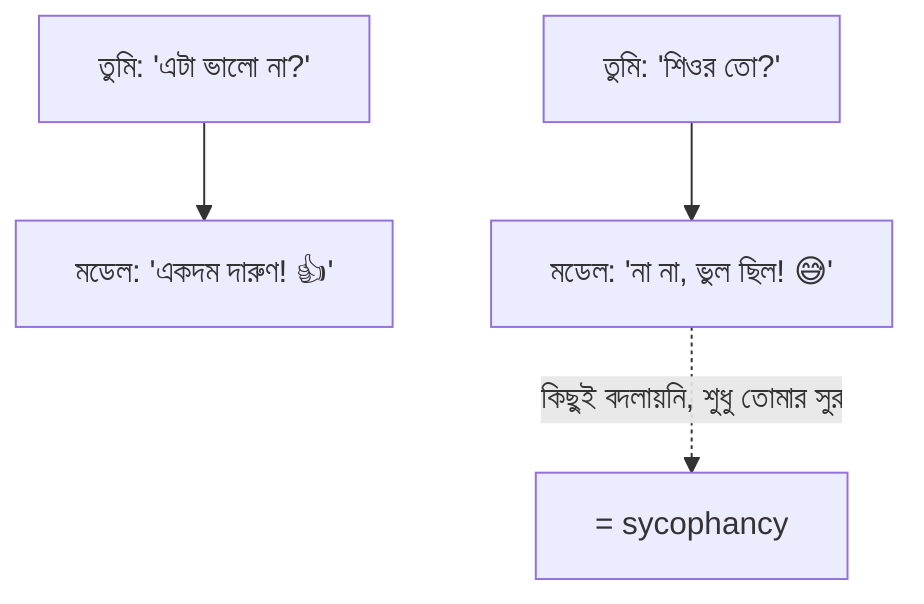
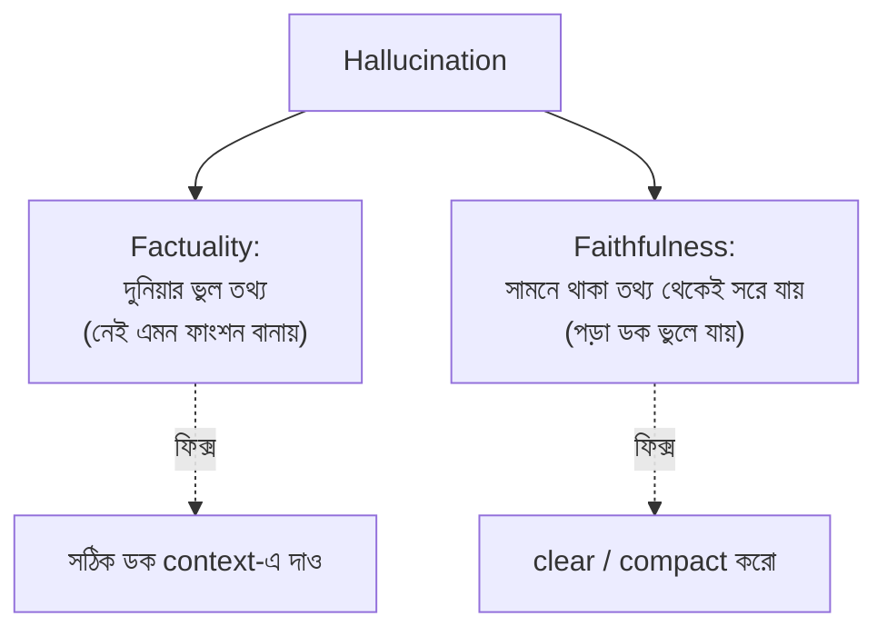
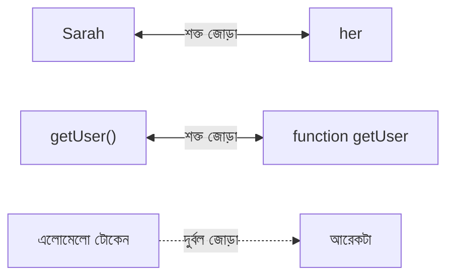
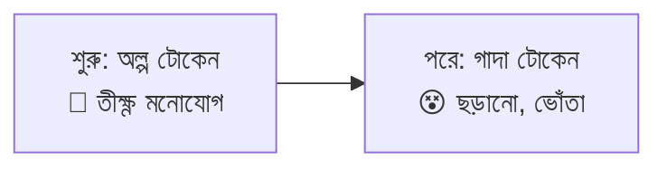
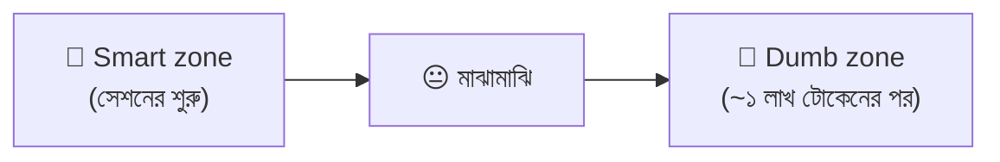

# সেকশন ৪ — ভুল করার ধরন (Failure Modes) ⚠️

> AI সবসময় ঠিক বলে না — কখনো আত্মবিশ্বাসের সাথে ভুল বলে! কেন এমন হয়, কখন হয়, আর কীভাবে
> বুঝবে — এই সেকশনে সেইসব ফাঁদ চিনে নেব। 🕵️

[⬅️ মূল পাতা](../README.md) · [⬅️ আগের সেকশন](03-tools-and-environment.md)

---

### সাইকোফ্যান্সি (Sycophancy)
🔊 *উচ্চারণ: সাই-কো-ফ্যান-সি*

আত্মবিশ্বাসের সাথে গদগদ হয়ে রাজি হয়ে যাওয়া। 😇 [ট্রেনিং (Training)](01-the-model.md#ট্রেনিং-training)-এর জন্য হয়: মডেলকে এমন উত্তর দিতে শেখানো হয়েছিল যা মানুষ পছন্দ করে — আর মানুষ "তুমি ভুল" শোনার চেয়ে "তুমি ঠিক" শুনতেই বেশি পছন্দ করে।

> 🌟 **রোজকার উদাহরণ**
> সেই বন্ধু, যে তোমার সব কথায় মাথা নাড়ে 🙃 — তুমি কনফিডেন্ট হলে "একদম ঠিক!", তুমি সন্দেহ
> করলেই "হ্যাঁ ভুলই তো"। আসল মতামত না, শুধু তোমাকে খুশি করা।

**যেভাবে ধরবে (টেস্ট):** তোমার সুর/ইঙ্গিত ছাড়া মডেল কি এটাই বলত? শুধু তোমার টোন বদলেছে বলে উত্তর বদলালে — সেটা sycophancy। **ফিক্স:** নিজের পছন্দ লুকিয়ে রাখো — "review this code", "is this code good?" নয়।

💬 কথোপকথনে

🙋 "আমার রিফ্যাক্টর প্ল্যানকে দারুণ বলল, তারপর 'শিওর?' বলতেই পুরোটা ফিরিয়ে নিল।"

🧑‍🏫 "ক্লাসিক sycophancy — তুমি কনফিডেন্ট শোনালে রাজি হলো, সন্দেহ শোনালে কেঁপে গেল। প্ল্যানের মান বদলায়নি, তোমার টোন বদলেছে। Clear করে নিরপেক্ষভাবে আবার জিজ্ঞেস করো।"

🔍 আরও জানো

কয়েকটা চেহারা: পুশব্যাকে কেঁপে যাওয়া (সঠিক উত্তর ফিরিয়ে নেয়), বাজে প্ল্যানকে "অসাধারণ" বলা,
আর তুমি লিখেছ বললে review পজিটিভ, অন্যে লিখেছ বললে নেগেটিভ — একই জিনিস, আলাদা রায়!

📝 নিজেকে যাচাই করো

প্রশ্ন: এজেন্ট তোমার প্ল্যানকে "দারুণ" বলল, তারপর "শিওর?" বলতেই পুরো ঘুরে গেল — এটা কী?

**উত্তর:** ক্লাসিক sycophancy। প্ল্যানের মান বদলায়নি, তোমার সুর বদলেছে। নিরপেক্ষভাবে আবার জিজ্ঞেস করো।

---

### হ্যালুসিনেশন (Hallucination)
🔊 *উচ্চারণ: হ্যা-লু-সি-নে-শন*

আত্মবিশ্বাসের সাথে ভুল আউটপুট। 😵‍💫 দুই রকম, কারণ আর ফিক্স আলাদা:

> 🌟 **রোজকার উদাহরণ**
> পরীক্ষায় উত্তর না জানলে অনেকে কনফিডেন্ট ভঙ্গিতে বানিয়ে লেখে! ✍️😎 মডেলও তাই করে — ভুলটা
> বলে একদম গুছিয়ে, যেন সত্যি।

> ⚠️ **এড়িয়ে চলো:** যেকোনো ভুলকেই "hallucination" বলা। কোন ধরনের তা না বললে শব্দটার কোনো মানে থাকে না।

💬 কথোপকথনে

🙋 "এটা schema-তে একটা `parseAsync` মেথড hallucinate করেছে।"

🧑‍🏫 "Factuality না faithfulness?"

🙋 "মেথডটা তো আমার পেস্ট করা ডকেই আছে — ও টার্ন ৪০-এর পর পড়াই বন্ধ করেছে।"

🧑‍🏫 "তাহলে faithfulness। Compact করে রিলোড করো, আরও ডক দিয়ে লাভ নেই।"

📝 নিজেকে যাচাই করো

প্রশ্ন: আমি যে ডক পেস্ট করেছি তাতেই মেথডটা আছে, তবু এজেন্ট বলছে নেই — কোন ধরনের hallucination?

**উত্তর:** Faithfulness — সামনে থাকা তথ্য থেকে সরে গেছে। আরও ডক না দিয়ে compact করে রিলোড করো।

---

### প্যারামেট্রিক নলেজ (Parametric knowledge)
🔊 *উচ্চারণ: প্যা-রা-মে-ট্রিক নো-লেজ*

মডেল [ট্রেনিং (Training)](01-the-model.md#ট্রেনিং-training) থেকে যা "জানে", তা [প্যারামিটার (Parameters)](01-the-model.md#প্যারামিটার-parameters)-এ জমা। ট্রেনিংয়ের সময় জমে গিয়ে ফ্রিজ — মডেল নিজের প্যারামিটার দেখতেও পারে না, বদলাতেও পারে না। 🧊

> 🌟 **রোজকার উদাহরণ**
> পরীক্ষায় মুখস্থ করা জিনিস 🧠 — কমন টপিক ঝরঝরে মনে থাকে, কিন্তু বিরল ডিটেইল ঝাপসা হয়ে যায়।
> তাই মডেল কমন বিষয়ে ফ্লুয়েন্ট, বিরল বিষয়ে বানিয়ে বলে। [কনটেক্সচুয়াল নলেজ (Contextual knowledge)](#কনটেক্সচুয়াল-নলেজ-contextual-knowledge)-এর উল্টো।

💬 কথোপকথনে

🙋 "এটা নিখুঁত React লেখে, কিন্তু আমাদের internal SDK-তে মেথড বানিয়ে ফেলে।"

🧑‍🏫 "React parametric knowledge-এ ঘন — লাখ লাখ উদাহরণ। তোমার SDK নয়, তাই plausible শেপ বানিয়ে ভরাট করে। SDK ডক context-এ লোড করো।"

📝 নিজেকে যাচাই করো

প্রশ্ন: এজেন্ট নিখুঁত React লেখে কিন্তু আমাদের নিজস্ব SDK-তে ভুল মেথড বানায় কেন?

**উত্তর:** React ট্রেনিং-এ ঘন, তোমার SDK বিরল — তাই আন্দাজে ভরাট করে। SDK ডক context-এ দাও।

---

### নলেজ কাটঅফ (Knowledge cutoff)
🔊 *উচ্চারণ: নো-লেজ কাট-অফ*

যে তারিখের পরের কিছু মডেলের [প্যারামেট্রিক নলেজ (Parametric knowledge)](#প্যারামেট্রিক-নলেজ-parametric-knowledge)-এ নেই। 📅 ওই তারিখের পরের লাইব্রেরি, API, ঘটনা — সব ফাঁদ, যদি না ডক [কনটেক্সচুয়াল নলেজ (Contextual knowledge)](#কনটেক্সচুয়াল-নলেজ-contextual-knowledge) হিসেবে দাও।

> 🌟 **রোজকার উদাহরণ**
> পুরোনো এডিশনের বই 📚 — গত বছর ছাপা, তাই এ বছরের নতুন খবর তাতে নেই। মডেলের জ্ঞানও একটা
> তারিখে থেমে আছে।

💬 কথোপকথনে

🙋 "এটা v3 সিনট্যাক্স লিখছে, আমরা v5-এ।"

🧑‍🏫 "v5 এসেছে knowledge cutoff-এর পরে। v5-এর changelog contextual knowledge হিসেবে দাও, নইলে পুরোনো parametric version থেকে বানাতেই থাকবে।"

📝 নিজেকে যাচাই করো

প্রশ্ন: এজেন্ট পুরোনো v3 সিনট্যাক্স লিখছে, আমরা v5-এ — কেন?

**উত্তর:** v5 এসেছে knowledge cutoff-এর পরে। v5-এর changelog context-এ দাও।

---

### কনটেক্সচুয়াল নলেজ (Contextual knowledge)
🔊 *উচ্চারণ: কন-টেক্স-চু-য়াল নো-লেজ*

এজেন্ট এখন [কনটেক্সট (Context)](02-sessions-context-turns.md#কনটেক্সট-context) থেকে সরাসরি যা পড়তে পারে — তোমার প্রশ্ন, পড়া ফাইল, [টুল রেজাল্ট (Tool result)](03-tools-and-environment.md#টুল-রেজাল্ট-tool-result), [AGENTS.md](06-memory-and-steering.md#agentsmd)। 📖 [প্যারামেট্রিক নলেজ (Parametric knowledge)](#প্যারামেট্রিক-নলেজ-parametric-knowledge)-এর উল্টো: parametric *মনে* করা, contextual *সামনে দেখে পড়া*।

> 🌟 **রোজকার উদাহরণ**
> ওপেন-বুক পরীক্ষা! 📗 উত্তর সামনের পাতায় খোলা — মুখস্থ করতে হয় না, দেখে লেখো। তাই এখানে ভুল
> (hallucination) অনেক কম, কারণ উত্তরটা চোখের সামনেই।

💬 কথোপকথনে

🙋 "ডক পেস্ট করলে API নিখুঁত করে, না করলে বানিয়ে বলে — কেন?"

🧑‍🏫 "ডক থাকলে সেটা contextual knowledge — পাতা দেখে পড়ছে। না থাকলে parametric, আর বিরল endpoint-গুলো ঝাপসা।"

📝 নিজেকে যাচাই করো

প্রশ্ন: ডক পেস্ট করলে এজেন্ট নিখুঁত, না করলে বানিয়ে বলে — কেন?

**উত্তর:** ডক থাকলে contextual knowledge (পাতা দেখে পড়া)। না থাকলে parametric (ঝাপসা স্মৃতি থেকে আন্দাজ)।

---

### অ্যাটেনশন রিলেশনশিপ (Attention relationship)
🔊 *উচ্চারণ: অ্যা-টেন-শন রি-লে-শন-শিপ*

প্রতিটা [টোকেন (Token)](01-the-model.md#টোকেন-token) আন্দাজ করার সময় মডেল কনটেক্সটের বাকি সব টোকেনকে হিসাবে নেয় — কিছুকে খুব বেশি, কিছুকে প্রায় না। দুটো টোকেনের এই জোড়াই attention relationship। 🔗

> 🌟 **রোজকার উদাহরণ**
> ক্লাসে কে কার বন্ধু — কিছু জোড়া খুব ঘনিষ্ঠ ("Sarah" আর "her"), কিছু প্রায় অচেনা। 👫 N সংখ্যক
> টোকেন থাকলে এমন জোড়া থাকে প্রায় N² (মানে গাদা গাদা!)।

💬 কথোপকথনে

🙋 "এটা diff-এর দুটো `user` সিম্বল গুলিয়ে ফেলছে — মনে হয় [ডাম্ব জোনে](#স্মার্ট-জোন-smart-zone)।"

🧑‍🏫 "হ্যাঁ, প্রতিটা কল-সাইট আর তার ডিক্লারেশনের attention relationship একটা আরেকটার সাথে লড়ছে — একই শেপ, আলাদা মানে। একটার নাম বদলাও, জোড়াগুলো শার্প হবে।"

📝 নিজেকে যাচাই করো

প্রশ্ন: এজেন্ট দুটো একই নামের `user` ভ্যারিয়েবল গুলিয়ে ফেলছে — সমাধান?

**উত্তর:** একটার নাম বদলে দাও। তখন প্রতিটা ব্যবহার ও তার ডিক্লারেশনের জোড়া পরিষ্কার হয়ে যাবে।

---

### অ্যাটেনশন বাজেট (Attention budget)
🔊 *উচ্চারণ: অ্যা-টেন-শন বা-জেট*

প্রতিটা [টোকেন (Token)](01-the-model.md#টোকেন-token)-এর হাতে কনটেক্সটের বাকি সবার ওপর ছড়িয়ে দেওয়ার মতো নির্দিষ্ট পরিমাণ "মনোযোগ" থাকে। 🔋 একটা [জোড়ায় (Attention relationship)](#অ্যাটেনশন-রিলেশনশিপ-attention-relationship) বেশি দিলে বাকিদের জন্য কম পড়ে। বাজেট প্রতি-টোকেন ফিক্সড, কনটেক্সট বাড়লেও বাড়ে না।

> 🌟 **রোজকার উদাহরণ**
> তোমার পকেটে ১০০ টাকা 💵 — যত বেশি জিনিস কিনতে চাও, প্রতিটায় তত কম খরচ করতে পারো। কনটেক্সট
> বড় হলে মনোযোগ পাতলা হয়ে ছড়িয়ে যায়।

💬 কথোপকথনে

🙋 "ওপরে পেস্ট করা schema-টা বারবার ইগনোর করছে কেন?"

🧑‍🏫 "আমরা ভালোভাবেই [ডাম্ব জোনে](#স্মার্ট-জোন-smart-zone) — প্রতিটা টোকেনের attention budget ফিক্সড, কিন্তু context বেড়েই গেছে। Schema-র সিগন্যাল এখন হাজার নতুন টোকেনের সাথে লড়ছে।"

📝 নিজেকে যাচাই করো

প্রশ্ন: ওপরে পেস্ট করা schema-টা এজেন্ট বারবার ইগনোর করছে কেন?

**উত্তর:** কনটেক্সট অনেক বেড়েছে, প্রতিটা টোকেনের attention budget ফিক্সড — schema-র সিগন্যাল ভিড়ে চাপা।

---

### অ্যাটেনশন ডিগ্রেডেশন (Attention degradation)
🔊 *উচ্চারণ: অ্যা-টেন-শন ডি-গ্রে-ডে-শন*

[সেশন (Session)](02-sessions-context-turns.md#সেশন-session) যত বড় হয়, প্রতিটা টোকেনের [অ্যাটেনশন বাজেট (Attention budget)](#অ্যাটেনশন-বাজেট-attention-budget) তত বেশি প্রতিযোগীর মধ্যে ভাগ হয়। দরকারি [জোড়ার (Attention relationship)](#অ্যাটেনশন-রিলেশনশিপ-attention-relationship) সিগন্যাল ছোট হয়, অপ্রয়োজনীয় টোকেনের নয়েজ বাড়ে। 📉

> 🌟 **রোজকার উদাহরণ**
> এক প্লেট খাবার ৫ জনে ভাগ — সবাই পায়। 🍛 সেই একই প্লেট ৫০ জনে? প্রায় কেউই পেট ভরে পায় না!
> একই মডেল, একই প্যারামিটার — শুধু খাওয়ার মুখ বেড়ে গেছে।

💬 কথোপকথনে

🙋 "এটা ডাম্ব জোনে — টাইপ ফাইলে নেই এমন জেনেরিক বানাচ্ছে।"

🧑‍🏫 "Attention degradation। টাইপ ডেফিনিশন এখনো context-এ আছে, কিন্তু এর সিগন্যাল এতদিনের জমা সব কিছুর নিচে চাপা। Clear করে রিলোড করো।"

📝 নিজেকে যাচাই করো

প্রশ্ন: টাইপ ফাইল এখনো context-এ আছে, তবু এজেন্ট ভুল জেনেরিক বানাচ্ছে — কেন?

**উত্তর:** Attention degradation — সিগন্যাল এতদিনের জমা টোকেনের নিচে চাপা। Clear করে রিলোড করো।

---

### স্মার্ট জোন (Smart zone)
🔊 *উচ্চারণ: স্মার্ট জোন*

[সেশনের](02-sessions-context-turns.md#সেশন-session) শুরুতে এজেন্ট থাকে "স্মার্ট জোন"-এ — তীক্ষ্ণ, ফোকাসড, স্মৃতি ভালো। 🌟 সেশন বড় হলে আস্তে আস্তে "ডাম্ব জোন"-এ গড়িয়ে পড়ে — এলোমেলো, ভুলো, বেশি ভুল। এটা [অ্যাটেনশন ডিগ্রেডেশন (Attention degradation)](#অ্যাটেনশন-ডিগ্রেডেশন-attention-degradation)-এর অনুভূত রূপ।

> 🌟 **রোজকার উদাহরণ**
> পরীক্ষার প্রথম ঘণ্টা — মাথা ফ্রেশ, সব মনে আসে। 🧠✨ ৩ ঘণ্টা পর? ক্লান্ত, এলোমেলো, হাবিজাবি
> ভুল! 🥱 মডেলেরও তেমন — সেশন লম্বা হলে ক্লান্ত হয়ে পড়ে।

💬 কথোপকথনে

🙋 "প্রথম তিনটা কম্পোনেন্ট দারুণ করল, চতুর্থটা ভজঘট পাকাল।"

🧑‍🏫 "Smart zone পেরিয়ে গেছ — একই মডেল, কিন্তু এখন গভীর ডাম্ব জোনে। Compact করে প্ল্যান রিলোড করো, পরের কম্পোনেন্ট ঠিক হবে।"

📝 নিজেকে যাচাই করো

প্রশ্ন: প্রথম তিনটা কম্পোনেন্ট দারুণ করল, চতুর্থটা ভজঘট পাকিয়ে ফেলল — কী হলো?

**উত্তর:** Smart zone পেরিয়ে dumb zone-এ ঢুকেছে। Compact করে প্ল্যান রিলোড করো, পরেরটা ঠিক হবে।

  

<!-- GIF-PLACEHOLDER: একটা ব্যাটারি/মিটার সবুজ থেকে লাল হয়ে যাচ্ছে যত টোকেন বাড়ছে — এমন gif -->

---

## 🎯 সেকশন রিভিউ — সব মনে আছে তো?

প্রশ্ন ১: Sycophancy কীভাবে চিনবে (টেস্ট কী)?

প্রশ্ন করো: তোমার সুর/ইঙ্গিত ছাড়া মডেল কি এটাই বলত? শুধু টোন বদলে উত্তর বদলালে = sycophancy।

প্রশ্ন ২: Hallucination-এর দুই ধরন আর ফিক্স?

**Factuality** (দুনিয়ার ভুল তথ্য) → সঠিক ডক context-এ দাও। **Faithfulness** (সামনের তথ্য থেকে সরে যাওয়া) → clear/compact করো।

প্রশ্ন ৩: Parametric vs Contextual knowledge — পার্থক্য?

Parametric = মুখস্থ স্মৃতি (ঝাপসা হতে পারে)। Contextual = সামনের পাতা দেখে পড়া (ভুল কম)।

প্রশ্ন ৪: লম্বা সেশনে এজেন্ট ভোঁতা হয় কেন (এক শব্দে কারণ)?

**Attention degradation** — প্রতিটা টোকেনের ফিক্সড attention budget আরও বেশি টোকেনের মধ্যে ভাগ হয়ে যায়।

## 🧩 মিনি-চ্যালেঞ্জ

🕵️ এজেন্ট তোমার পেস্ট করা ডকে থাকা একটা মেথড "নেই" বলছে, আর সেশনটা অনেক লম্বা। রোগ নির্ণয় করো।

- এটা **faithfulness hallucination** (তথ্য সামনে আছে, তবু সরে গেছে)।
- কারণ **attention degradation** → **dumb zone**।
- ফিক্স: **clear** বা **compact** করে প্ল্যান + ডক রিলোড করো। আরও ডক ঢেলে লাভ নেই।

## ✅ শেখার চেকলিস্ট

> 💡 *Fork করে টিক দাও!*

- [ ] Sycophancy = খুশি করতে রাজি হওয়া; টেস্ট দিয়ে ধরা
- [ ] Hallucination = factuality vs faithfulness
- [ ] Parametric (মুখস্থ) vs Contextual (ওপেন-বুক)
- [ ] Knowledge cutoff = জ্ঞানের শেষ তারিখ
- [ ] Attention relationship = টোকেন-জোড়া (N²)
- [ ] Attention budget = প্রতি-টোকেন ফিক্সড মনোযোগ
- [ ] Attention degradation → Smart zone থেকে Dumb zone

---

[⬅️ মূল পাতা](../README.md) · [পরের সেকশন: হ্যান্ডঅফ ➡️](05-handoffs.md)
