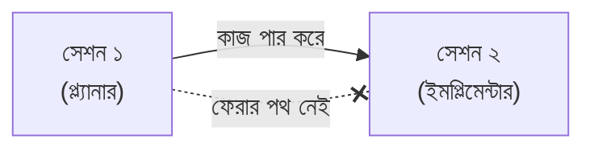
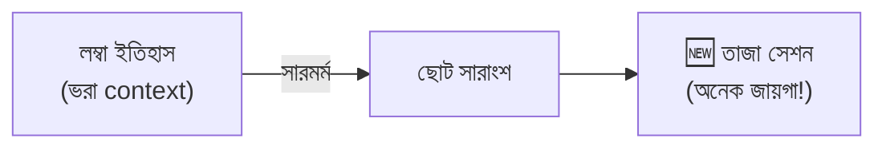

# সেকশন ৫ — হ্যান্ডঅফ (Handoffs) 🤝

> সেশন [ডাম্ব জোনে](04-failure-modes.md#স্মার্ট-জোন-smart-zone) ঢুকে গেলে কী করবে? নতুন সেশন শুরু
> করো — কিন্তু আগের কাজটা যেন হারিয়ে না যায়! এই সেকশনে কাজ এক সেশন থেকে আরেক সেশনে হাত-বদল করার কৌশল।

[⬅️ মূল পাতা](../README.md) · [⬅️ আগের সেকশন](04-failure-modes.md)

---

### ক্লিয়ারিং (Clearing)
🔊 *উচ্চারণ: ক্লি-য়া-রিং*

চলতি [সেশন (Session)](02-sessions-context-turns.md#সেশন-session) শেষ করে একদম নতুন একটা শুরু করা। পরের মেসেজ শুরু হবে খালি সেশন আর খালি [কনটেক্সট উইন্ডো (Context window)](02-sessions-context-turns.md#কনটেক্সট-উইন্ডো-context-window) দিয়ে। 🧹

> 🌟 **রোজকার উদাহরণ**
> হোয়াইটবোর্ড পুরো মুছে ফেলা 🧼 — সাদা বোর্ড, নতুন করে শুরু। আগের কিচ্ছু থাকে না।

💬 কথোপকথনে

🙋 "এটা একটা ফেইলিং টেস্টে লুপ করছে।"

🧑‍🏫 "শুধু clear করে দাও — প্ল্যান ডক আর টেস্ট ফাইল নিয়ে নতুন সেশন। পুরোনো এলোমেলো [কনটেক্সটের](02-sessions-context-turns.md#কনটেক্সট-context) সাথে লড়ে লাভ নেই।"

📝 নিজেকে যাচাই করো

প্রশ্ন: এজেন্ট একটা ফেইলিং টেস্টে লুপে আটকে গেছে — সহজ সমাধান?

**উত্তর:** Clear করে দাও — প্ল্যান ডক আর টেস্ট ফাইল নিয়ে নতুন সেশন শুরু করো।

---

### হ্যান্ডঅফ (Handoff)
🔊 *উচ্চারণ: হ্যান্ড-অফ*

এক [সেশন (Session)](02-sessions-context-turns.md#সেশন-session) থেকে আরেক সেশনে [কনটেক্সট (Context)](02-sessions-context-turns.md#কনটেক্সট-context) পার করে দেওয়া — ফেরার পথ ছাড়া। 🤝 [ক্লিয়ারিং (Clearing)](#ক্লিয়ারিং-clearing) থেকে আলাদা (সেখানে কিছুই পার হয় না)।

> 🌟 **রোজকার উদাহরণ**
> রিলে দৌড়ে ব্যাটন পাস 🏃‍♂️➡️🏃 — একজন তার অংশ শেষ করে পরেরজনকে ব্যাটন দিয়ে থেমে যায়। প্ল্যানার
> থেকে ইমপ্লিমেন্টার, বা একটা [AFK](07-patterns-of-work.md#afk) রান শুরু করতে — এভাবেই কাজ হাতবদল হয়।

💬 কথোপকথনে

🙋 "প্ল্যানিং সেশন ভারী হচ্ছে — চালিয়ে যাব?"

🧑‍🏫 "একটা handoff করো। সিদ্ধান্তগুলো ডকে লিখে, clear করে, নতুন সেশনে সেই ডক পড়ে ইমপ্লিমেন্ট শুরু করো।"

📝 নিজেকে যাচাই করো

প্রশ্ন: প্ল্যানিং সেশন ভারী হয়ে যাচ্ছে — থামব নাকি চালিয়ে যাব?

**উত্তর:** Handoff করো — সিদ্ধান্তগুলো ডকে লিখে, clear করে, নতুন সেশনে সেই ডক পড়ে ইমপ্লিমেন্ট শুরু করো।

---

### হ্যান্ডঅফ আর্টিফ্যাক্ট (Handoff artifact)
🔊 *উচ্চারণ: হ্যান্ড-অফ আর্-টি-ফ্যাক্ট*

একটা ডকুমেন্ট, যেটা [হ্যান্ডঅফ (Handoff)](#হ্যান্ডঅফ-handoff)-এর বাহন — এক সেশন লেখে, আরেক সেশন পড়ে। 📄

> 🌟 **রোজকার উদাহরণ**
> অফিসে ছুটিতে যাওয়ার আগে সহকর্মীর জন্য লিখে রাখা হ্যান্ডওভার নোট 📝 — "এই কাজগুলো বাকি, এই
> ফাইলে আছে, এই সিদ্ধান্ত নেওয়া হয়েছে"। পরেরজন ওটা পড়েই কাজে নামতে পারে।

💬 কথোপকথনে

🙋 "প্ল্যানিং আর ইমপ্লিমেন্টিং এজেন্টে কাজ ভাগ করব কীভাবে?"

🧑‍🏫 "প্ল্যানার একটা handoff artifact লিখুক — ফাইল পাথ, সিদ্ধান্ত, শর্ত। ইমপ্লিমেন্টারের সেশন ওই আর্টিফ্যাক্টের পয়েন্টার দিয়ে শুরু হয়ে সেটাকেই ব্রিফ ধরবে।"

📝 নিজেকে যাচাই করো

প্রশ্ন: প্ল্যানিং আর ইমপ্লিমেন্টিং দুটো এজেন্টে কাজ ভাগ করব কীভাবে?

**উত্তর:** প্ল্যানার একটা handoff artifact লিখুক — ফাইল পাথ, সিদ্ধান্ত, শর্ত। ইমপ্লিমেন্টার সেটা পড়ে শুরু করবে।

---

### স্পেক (Spec)
🔊 *উচ্চারণ: স্পেক*

একটা [হ্যান্ডঅফ আর্টিফ্যাক্ট (Handoff artifact)](#হ্যান্ডঅফ-আর্টিফ্যাক্ট-handoff-artifact), যা অনেকগুলো সেশনের একটা বড় কাজের বর্ণনা দেয় — *কী* বানানো হচ্ছে, প্রতিটা সেশন *কীভাবে* করবে তা নয়। কাজ এগোলে এটা বদলায়। অনেকগুলো [টিকিট (Ticket)](#টিকিট-ticket) দিয়ে তৈরি। 📐

> 🌟 **রোজকার উদাহরণ**
> বাড়ি বানানোর নকশা 🏗️ — পুরো বাড়িটা কেমন হবে তা দেখায়, কিন্তু প্রতিদিন কোন মিস্ত্রি কী করবে
> তা নয়। বড় কাজকে ছোট ছোট টিকিটে ভেঙে আলাদা সেশনে চালাও।

💬 কথোপকথনে

🙋 "এটা কি পুরোটা এক সেশনে?"

🧑‍🏫 "না, একটা spec হিসেবে লেখো — টিকিটে ভাঙো, প্রতিটা নিজের সেশনে চালাও। পুরোটা এক [কনটেক্সটে](02-sessions-context-turns.md#কনটেক্সট-context) করতে গেলে অর্ধেক পথেই ডাম্ব জোনে পড়বে।"

📝 নিজেকে যাচাই করো

প্রশ্ন: পুরো বড় কাজটা কি এক সেশনেই করা উচিত?

**উত্তর:** না — একটা spec লেখো, টিকিটে ভাঙো, প্রতিটা আলাদা সেশনে চালাও।

---

### টিকিট (Ticket)
🔊 *উচ্চারণ: টি-কেট*

একটা [হ্যান্ডঅফ আর্টিফ্যাক্ট (Handoff artifact)](#হ্যান্ডঅফ-আর্টিফ্যাক্ট-handoff-artifact), যা এক সেশনের কাজ সীমিত করে দেয়। একা দাঁড়াতে পারে, বা একটা [স্পেক (Spec)](#স্পেক-spec)-এর অধীনে ঝোলে। 🎫 টিকিটেরা একে অন্যকে আটকাতে পারে, তাই কাজের ক্রম একটা নির্ভরতার গ্রাফ থেকে বেরিয়ে আসে।

> 🌟 **রোজকার উদাহরণ**
> টু-ডু লিস্টের এক একটা কাজ ✅ — কিছু কাজ আগে শেষ না হলে পরেরটা শুরুই করা যায় না (আগে ময়দা
> মাখো, তবেই রুটি বেলবে 🫓)।

💬 কথোপকথনে

🙋 "মাইগ্রেশন spec-এ কোথা থেকে শুরু করব?"

🧑‍🏫 "টিকিট গ্রাফ দেখো — schema বদল backfill-কে আটকায়, backfill আটকায় API switch-কে। একটা leaf বেছে তার ওপর সেশন চালাও।"

📝 নিজেকে যাচাই করো

প্রশ্ন: মাইগ্রেশন spec-এ কোথা থেকে শুরু করব?

**উত্তর:** টিকিট গ্রাফ দেখো — যেটা কাউকে আটকায় না (leaf) সেটা দিয়ে শুরু করো।

---

### কম্প্যাকশন (Compaction)
🔊 *উচ্চারণ: কম্-প্যাক-শন*

স্মৃতিতেই করা একটা [হ্যান্ডঅফ (Handoff)](#হ্যান্ডঅফ-handoff): আগের [সেশনের](02-sessions-context-turns.md#সেশন-session) ইতিহাস সংক্ষেপে সারিয়ে নতুন একটা সেশন শুরু করা। 🗜️ এটা lossy — জায়গা পেতে কিছু ডিটেইল হারায়।

> 🌟 **রোজকার উদাহরণ**
> পুরো একটা সিনেমা বন্ধুকে দু-লাইনে বলে দেওয়া 🎬 — মূল গল্পটা থাকে, ছোট ছোট ডিটেইল বাদ পড়ে।
> Compact করার আগে যা জরুরি, সেটা সারাংশে লিখে রাখো।

💬 কথোপকথনে

🙋 "Context ভারী হচ্ছে, কিন্তু টেস্ট পাস করানো বাকি।"

🧑‍🏫 "শুরুর আগে compact করো — যা load-bearing (schema সিদ্ধান্ত) সেটা সারাংশে লিখে রাখো, exploration-টা বাদ দাও।"

📝 নিজেকে যাচাই করো

প্রশ্ন: Compaction-এ কী হারাতে পারে?

**উত্তর:** ছোট ডিটেইল — কারণ এটা lossy সারাংশ। তাই জরুরি জিনিস আগে সারাংশে লিখে নিতে হয়।

---

### অটোকম্প্যাক্ট (Autocompact)
🔊 *উচ্চারণ: অ-টো-কম্-প্যাক্ট*

[কম্প্যাকশন (Compaction)](#কম্প্যাকশন-compaction), যা [হার্নেস (Harness)](01-the-model.md#হার্নেস-harness) নিজে থেকে চালু করে দেয় যখন [কনটেক্সট উইন্ডো (Context window)](02-sessions-context-turns.md#কনটেক্সট-উইন্ডো-context-window) প্রায় ভরে যায়। 🤖🗜️

> 🌟 **রোজকার উদাহরণ**
> ফোনের স্টোরেজ ভরে গেলে নিজে থেকে পুরোনো ক্যাশ মুছে ফেলার মতো 📱 — তুমি না বললেও হয়ে যায়।
> সুবিধা, তবে মাঝে মাঝে দরকারি কিছুও হারিয়ে যেতে পারে!

💬 কথোপকথনে

🙋 "schema নিয়ে আগে যা ঠিক করেছিলাম সেটা মনে রাখছে না।"

🧑‍🏫 "টার্নের মাঝে autocompact হয়ে গেছে — শুরুর সিদ্ধান্ত সারাংশে গিয়ে কিছু হারিয়েছে। প্ল্যান ডক রিলোড করো, নয়তো পরেরবার নিজে manually compact করো যাতে কী রাখবে তুমি ঠিক করো।"

📝 নিজেকে যাচাই করো

প্রশ্ন: এজেন্ট হঠাৎ আগে নেওয়া সিদ্ধান্ত ভুলে গেল কেন হতে পারে?

**উত্তর:** মাঝপথে autocompact হয়ে গেছে — পুরোনো সিদ্ধান্ত সারাংশে গিয়ে কিছু হারিয়েছে। প্ল্যান ডক রিলোড করো।

---

## 🎯 সেকশন রিভিউ — সব মনে আছে তো?

প্রশ্ন ১: Clearing আর Handoff-এর পার্থক্য?

Clearing = সব মুছে নতুন শুরু, কিছুই পার হয় না। Handoff = কাজ/সিদ্ধান্ত পরের সেশনে পার করে দেওয়া (ফেরার পথ নেই)।

প্রশ্ন ২: Spec আর Ticket-এর সম্পর্ক?

Spec = পুরো বড় কাজের নকশা; Ticket = তার এক একটা ছোট অংশ (এক সেশনের কাজ)। Spec অনেক ticket দিয়ে তৈরি।

প্রশ্ন ৩: Compaction lossy মানে কী?

সারাংশ করতে গিয়ে কিছু ডিটেইল হারায় — তাই জরুরি জিনিস আগে সারাংশে লিখে রাখতে হয়।

## 🧩 মিনি-চ্যালেঞ্জ

🕵️ একটা বড় মাইগ্রেশন এক সেশনে শেষ হবে না। কোন শব্দগুলো ব্যবহার করে পরিকল্পনা করবে?

- পুরোটা একটা **spec**-এ লেখো।
- ছোট **ticket**-এ ভাঙো, dependency graph বানাও।
- প্রতিটা ticket নিজের সেশনে; সেশন ভারী হলে **handoff** বা **compaction**; আটকে গেলে **clear**।

## ✅ শেখার চেকলিস্ট

> 💡 *Fork করে টিক দাও!*

- [ ] Clearing = সব মুছে নতুন শুরু
- [ ] Handoff = পরের সেশনে কাজ পার (ফেরার পথ নেই)
- [ ] Handoff artifact = সেই পার করার ডকুমেন্ট
- [ ] Spec = বড় কাজের নকশা
- [ ] Ticket = এক সেশনের কাজ; dependency graph
- [ ] Compaction = lossy সারাংশ-হ্যান্ডঅফ
- [ ] Autocompact = harness নিজে compact করে

---

[⬅️ মূল পাতা](../README.md) · [পরের সেকশন: মেমরি ও স্টিয়ারিং ➡️](06-memory-and-steering.md)
