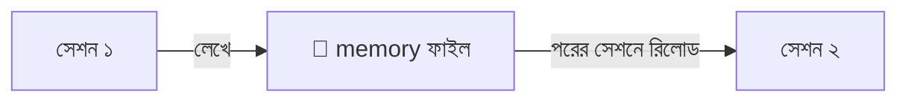
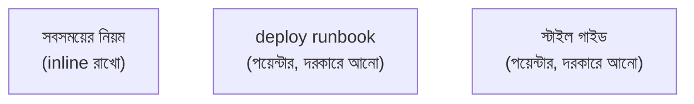
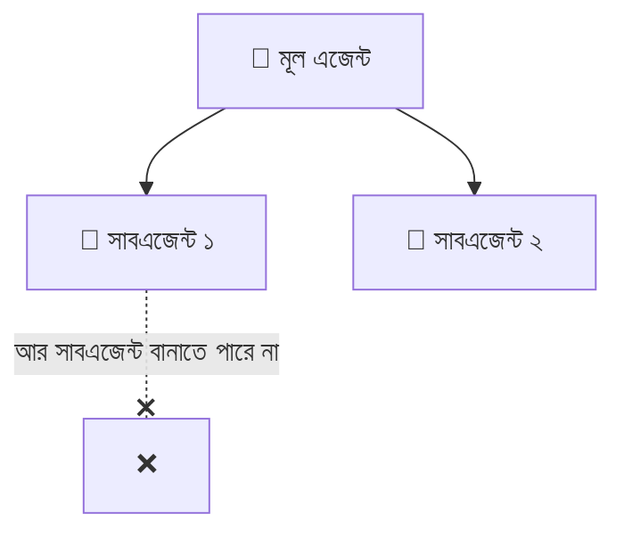

# সেকশন ৬ — মেমরি ও স্টিয়ারিং 🧭

> গোল্ডফিশ-মেমোরির মডেলকে কীভাবে "মনে রাখানো" যায়? আর তাকে কীভাবে সঠিক পথে চালানো (steer)
> যায়, কনটেক্সট নষ্ট না করে? এই সেকশনে সেই কৌশল। 🗺️

[⬅️ মূল পাতা](../README.md) · [⬅️ আগের সেকশন](05-handoffs.md)

---

### মেমরি সিস্টেম (Memory system)

একটা ব্যবস্থা, যা এজেন্টকে সেশনের পর সেশন [স্টেটফুল (Stateful)](02-sessions-context-turns.md#স্টেটফুল-stateful) করার চেষ্টা করে। 🧠💾 সেশন চলাকালীন তথ্য [এনভায়রনমেন্টে (Environment)](03-tools-and-environment.md#এনভায়রনমেন্ট-environment) লিখে রাখে, আর পরের সেশনের শুরুতে আবার [কনটেক্সট উইন্ডোতে (Context window)](02-sessions-context-turns.md#কনটেক্সট-উইন্ডো-context-window) তুলে আনে।

> 🌟 **রোজকার উদাহরণ**
> তোমার ব্যক্তিগত ডায়েরি 📔 — আজ যা শিখলে লিখে রাখলে, কাল সকালে পড়ে আবার মনে করে নিলে। মডেল
> নিজে গোল্ডফিশ ([স্টেটলেস](02-sessions-context-turns.md#স্টেটলেস-stateless)); memory layer ডায়েরির ভান করে ধারাবাহিকতা এনে দেয়।

📝 নিজেকে যাচাই করো

প্রশ্ন: বারবার বলতে হচ্ছে "আমরা Postgres ব্যবহার করি, MySQL না" — স্থায়ী সমাধান?

**উত্তর:** একটা memory system লাগাও — প্রথম turn-এ এটা ফাইলে লিখুক, সেশন শুরুতে রিলোড করুক।

---

### AGENTS.md

[এনভায়রনমেন্টের (Environment)](03-tools-and-environment.md#এনভায়রনমেন্ট-environment) একটা ফাইল, যা [হার্নেস (Harness)](01-the-model.md#হার্নেস-harness) প্রতিটা [সেশনের](02-sessions-context-turns.md#সেশন-session) শুরুতে [কনটেক্সট উইন্ডোতে (Context window)](02-sessions-context-turns.md#কনটেক্সট-উইন্ডো-context-window) তুলে নেয় — প্রজেক্টের তরফ থেকে এজেন্টকে দেওয়া স্থায়ী ব্রিফ। 📌

> 🌟 **রোজকার উদাহরণ**
> ক্লাসরুমের দেয়ালে টাঙানো নিয়মের চার্ট 📋 — সবাই সবসময় দেখতে পায়। কিন্তু সাবধান: এখানে যা
> লেখো, প্রতি [টার্নে](02-sessions-context-turns.md#টার্ন-turn) তার [টোকেন (Token)](01-the-model.md#টোকেন-token) খরচ হয়!

> ⚠️ **এড়িয়ে চলো:** AGENTS.md-তে এমন জিনিস রাখা যা [প্রগ্রেসিভ ডিসক্লোজার (Progressive disclosure)](#প্রগ্রেসিভ-ডিসক্লোজার-progressive-disclosure) দিয়ে দরকারমতো আনা উচিত।

📝 নিজেকে যাচাই করো

প্রশ্ন: প্রতিটা সেশন কেন ৪ হাজার টোকেন আগেই খরচ করে শুরু হচ্ছে?

**উত্তর:** AGENTS.md চেক করো — কেউ হয়তো পুরো স্টাইল গাইড সেখানে পেস্ট করেছে, যেটা একটা [স্কিল (Skill)](#স্কিল-skill)-এ থাকা উচিত ছিল।

---

### প্রগ্রেসিভ ডিসক্লোজার (Progressive disclosure)

এজেন্টের এই মুহূর্তে যতটুকু [কনটেক্সট (Context)](02-sessions-context-turns.md#কনটেক্সট-context) দরকার শুধু ততটুকু লোড করা, বাকিটার জন্য [কনটেক্সট পয়েন্টার (Context pointer)](#কনটেক্সট-পয়েন্টার-context-pointer) রেখে দেওয়া। 🎯

> 🌟 **রোজকার উদাহরণ**
> পুরো লাইব্রেরি 📚 ব্যাগে না নিয়ে শুধু আজকের ক্লাসের বইটা নাও; বাকিগুলো দরকার হলে তখন এনো।
> UI ডিজাইন থেকে ধার করা আইডিয়া — যখন যা লাগে, তখন তাই দেখাও।

📝 নিজেকে যাচাই করো

প্রশ্ন: পুরো স্টাইল গাইডটা কি AGENTS.md-তে ঢেলে দেব?

**উত্তর:** না — progressive disclosure। ওটাকে একটা skill বানাও, এজেন্ট কম্পোনেন্ট লেখার সময়ই শুধু লোড করবে।

---

### কনটেক্সট পয়েন্টার (Context pointer)

এক ডকুমেন্টে আরেকটার দিকে ইশারা, যাতে এজেন্ট দরকার হলেই সেটা [কনটেক্সট উইন্ডোতে (Context window)](02-sessions-context-turns.md#কনটেক্সট-উইন্ডো-context-window) টেনে আনতে পারে। 👉 [প্রগ্রেসিভ ডিসক্লোজার (Progressive disclosure)](#প্রগ্রেসিভ-ডিসক্লোজার-progressive-disclosure)-এর বিল্ডিং ব্লক।

> 🌟 **রোজকার উদাহরণ**
> বইয়ের ফুটনোট বা "পৃষ্ঠা ৫০ দেখো" 🔖 — পুরো লেখাটা এখানে নেই, কিন্তু দরকার হলে কোথায় পাবে তা
> বলা আছে।

📝 নিজেকে যাচাই করো

প্রশ্ন: AGENTS.md বিশাল হয়ে যাচ্ছে — কী করব?

**উত্তর:** বেশিরভাগ অংশ context pointer বানাও, পুরো কনটেন্ট নয়। সবসময়ের নিয়ম inline রাখো, বাকিটা skill-এ সরিয়ে পয়েন্টার রাখো।

---

### স্কিল (Skill)

একটা শেখানোর-যোগ্য দক্ষতা, একটা ইউনিট হিসেবে বান্ডিল করা — একটা কাজ ভালোভাবে করার নির্দেশনা ও রিসোর্স, যা [এনভায়রনমেন্টে (Environment)](03-tools-and-environment.md#এনভায়রনমেন্ট-environment) পড়ে থাকে যতক্ষণ না একটা [কনটেক্সট পয়েন্টার (Context pointer)](#কনটেক্সট-পয়েন্টার-context-pointer) দরকারমতো টেনে আনে। 📦

> 🌟 **রোজকার উদাহরণ**
> রান্নার রেসিপি কার্ড 🍳 — যখন ওই রান্নাটা করবে, তখনই কার্ডটা বের করো। সবসময় হাতে ধরে রাখার দরকার নেই।

> ⚠️ **এড়িয়ে চলো:** [টুল (Tool)](03-tools-and-environment.md#টুল-tool)-এর সাথে গুলিয়ে ফেলা। টুল এজেন্ট *কল করে*; skill এজেন্ট *পড়ে*।

📝 নিজেকে যাচাই করো

প্রশ্ন: Deploy runbook কোথায় রাখা ভালো — AGENTS.md নাকি skill?

**উত্তর:** Skill হিসেবে — deploy-এর কাজ এলে তবেই লোড হবে। AGENTS.md-তে রাখলে প্রতি turn-এ অযথা টোকেন পুড়ত।

---

### সাবএজেন্ট (Subagent)

একটা [এজেন্ট (Agent)](02-sessions-context-turns.md#এজেন্ট-agent), যাকে আরেকটা এজেন্ট একটা [টুল কল (Tool call)](03-tools-and-environment.md#টুল-কল-tool-call) দিয়ে জন্ম দেয়। নিজের আলাদা সেশন ও [কনটেক্সট উইন্ডোতে (Context window)](02-sessions-context-turns.md#কনটেক্সট-উইন্ডো-context-window) চলে, আর একটাই [টুল রেজাল্ট (Tool result)](03-tools-and-environment.md#টুল-রেজাল্ট-tool-result) ফেরত দেয়। 👶

> 🌟 **রোজকার উদাহরণ**
> বড় ভাই ছোট ভাইকে দোকানে পাঠাল 🏪 — "যা, খুঁজে শুধু দামটা জেনে আয়"। ছোট ভাই গাদা গাদা জিনিস
> দেখে এসে শুধু দরকারি উত্তরটা দিল, পুরো ভিড়ের ঝামেলা বড় ভাইয়ের ঘাড়ে চাপল না। (তবে সাবএজেন্ট
> আবার সাবএজেন্ট বানাতে পারে না — গাছ এক ধাপ গভীর!)

📝 নিজেকে যাচাই করো

প্রশ্ন: একটা বিশাল grep-এর ফলাফল আমার context উপচে দিচ্ছে — সমাধান?

**উত্তর:** একটা subagent দিয়ে সার্চটা করাও — ও নিজের context-এ নয়েজ পুড়িয়ে শুধু দরকারি দুটো পাথ ফেরত দেবে।

---

[⬅️ মূল পাতা](../README.md) · [পরের সেকশন: কাজের ধরন ➡️](07-patterns-of-work.md)
