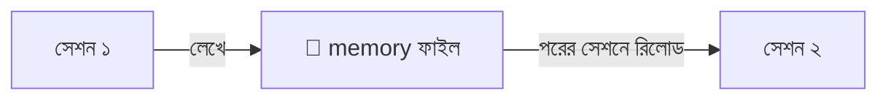
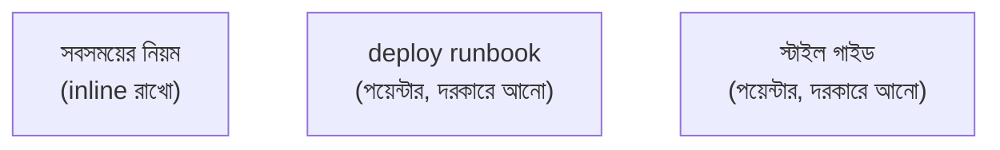
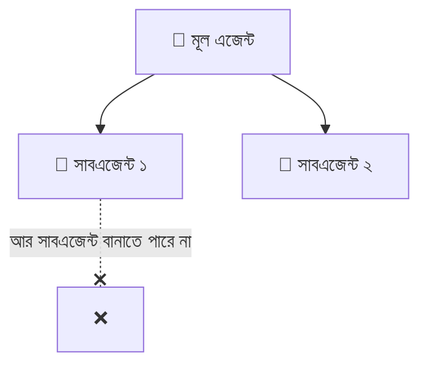

# সেকশন ৬ — মেমরি ও স্টিয়ারিং 🧭

> গোল্ডি-মেমোরির 🐠 মডেলকে কীভাবে "মনে রাখানো" যায়? আর কনটেক্সট নষ্ট না করে কীভাবে তাকে সঠিক
> পথে চালানো (steer) যায়? এই সেকশনে সেই কৌশলগুলোই। 🗺️

[⬅️ মূল পাতা](../README.md) · [⬅️ আগের সেকশন](05-handoffs.md)

---

### মেমরি সিস্টেম (Memory system)

একটা ব্যবস্থা, যা এজেন্টকে সেশনের পর সেশন [স্টেটফুল (Stateful)](02-sessions-context-turns.md#স্টেটফুল-stateful) করার চেষ্টা করে। 🧠💾 সেশন চলাকালীন তথ্য [এনভায়রনমেন্টে (Environment)](03-tools-and-environment.md#এনভায়রনমেন্ট-environment) লিখে রাখে, আর পরের সেশনের শুরুতে সেটা আবার [কনটেক্সট উইন্ডোতে (Context window)](02-sessions-context-turns.md#কনটেক্সট-উইন্ডো-context-window) তুলে আনে।

ভাবুন আপনার একটা ব্যক্তিগত ডায়েরি 📔 — আজ যা শিখলেন তা লিখে রাখলেন, কাল সকালে পড়ে আবার মনে করে নিলেন। মডেল নিজে তো গোল্ডি 🐠 ([স্টেটলেস](02-sessions-context-turns.md#স্টেটলেস-stateless)); এই memory layer-টা ডায়েরির ভান করে একটা ধারাবাহিকতা এনে দেয়।

💬 কথোপকথনে

🙋 "বারবার বলতে হচ্ছে আমরা Postgres-এ, MySQL-এ না।"

🧑‍🏫 "একটা memory system লাগান — প্রথম [টার্নে](02-sessions-context-turns.md#টার্ন-turn) যা শেখে তা [ফাইলসিস্টেমে](03-tools-and-environment.md#ফাইলসিস্টেম-filesystem) লিখুক, সেশনের শুরুতে রিলোড করুক। মডেল নিজে [স্টেটলেস](02-sessions-context-turns.md#স্টেটলেস-stateless); memory layer-ই ধারাবাহিকতার ভান করে।"

---

### AGENTS.md

[এনভায়রনমেন্টের (Environment)](03-tools-and-environment.md#এনভায়রনমেন্ট-environment) একটা ফাইল, যা [হার্নেস (Harness)](01-the-model.md#হার্নেস-harness) প্রতিটা [সেশনের](02-sessions-context-turns.md#সেশন-session) শুরুতে [কনটেক্সট উইন্ডোতে (Context window)](02-sessions-context-turns.md#কনটেক্সট-উইন্ডো-context-window) তুলে নেয় — প্রজেক্টের তরফ থেকে এজেন্টকে দেওয়া স্থায়ী ব্রিফ। 📌

ক্লাসরুমের দেয়ালে টাঙানো নিয়মের চার্টের মতো 📋 — সবাই সবসময় দেখতে পায়। তবে একটা সাবধানবাণী: এখানে যা লেখেন, প্রতি [টার্নে](02-sessions-context-turns.md#টার্ন-turn) তার [টোকেন (Token)](01-the-model.md#টোকেন-token) খরচ হয়। তাই যেসব জিনিস [প্রগ্রেসিভ ডিসক্লোজার (Progressive disclosure)](#প্রগ্রেসিভ-ডিসক্লোজার-progressive-disclosure) দিয়ে দরকারমতো আনা যায়, সেগুলো এখানে রেখে দেবেন না। 🚩

💬 কথোপকথনে

🙋 "প্রতিটা সেশন কেন আগেই ৪k টোকেন পুড়িয়ে শুরু হচ্ছে?"

🧑‍🏫 "AGENTS.md চেক করুন — কেউ হয়তো পুরো স্টাইল গাইডটা সেখানে পেস্ট করেছে, যেটা আসলে একটা [স্কিল (Skill)](#স্কিল-skill)-এর পেছনে থাকার কথা ছিল।"

---

### প্রগ্রেসিভ ডিসক্লোজার (Progressive disclosure)

এজেন্টের এই মুহূর্তে যতটুকু [কনটেক্সট (Context)](02-sessions-context-turns.md#কনটেক্সট-context) দরকার, শুধু ততটুকুই লোড করা — বাকিটার জন্য একটা [কনটেক্সট পয়েন্টার (Context pointer)](#কনটেক্সট-পয়েন্টার-context-pointer) রেখে দেওয়া। 🎯

পুরো লাইব্রেরিটা 📚 ব্যাগে না নিয়ে শুধু আজকের ক্লাসের বইটাই নিন; বাকিগুলো দরকার হলে তখন এনে নেওয়া যাবে। UI ডিজাইন থেকে ধার করা একটা সহজ আইডিয়া — যখন যা লাগে, ঠিক তখনই সেটা দেখান।

💬 কথোপকথনে

🙋 "পুরো স্টাইল গাইডটা AGENTS.md-তে ঢেলে দেব?"

🧑‍🏫 "না — progressive disclosure। স্টাইল গাইডটাকে একটা [স্কিল (Skill)](#স্কিল-skill) হিসেবে রাখুন, এজেন্ট কম্পোনেন্ট লেখার সময়ই সেটা লোড করবে। AGENTS.md কিন্তু প্রতি টার্নে টোকেন খরচ করে।"

---

### কনটেক্সট পয়েন্টার (Context pointer)

এক ডকুমেন্ট থেকে আরেকটার দিকে ইশারা, যাতে এজেন্ট দরকার হলেই সেটা [কনটেক্সট উইন্ডোতে (Context window)](02-sessions-context-turns.md#কনটেক্সট-উইন্ডো-context-window) টেনে আনতে পারে। 👉 [প্রগ্রেসিভ ডিসক্লোজার (Progressive disclosure)](#প্রগ্রেসিভ-ডিসক্লোজার-progressive-disclosure)-এর বিল্ডিং ব্লক এটাই।

বইয়ের ফুটনোট বা "পৃষ্ঠা ৫০ দেখুন"-এর মতো 🔖 — পুরো লেখাটা এখানে নেই, কিন্তু দরকার হলে কোথায় পাবেন তা বলা আছে।

💬 কথোপকথনে

🙋 "AGENTS.md বিশাল হয়ে যাচ্ছে।"

🧑‍🏫 "বেশিরভাগটাই context pointer হওয়া উচিত, পুরো কনটেন্ট নয়। সবসময়ের নিয়ম inline রাখুন; deploy runbook আর স্টাইল গাইডকে skill বানিয়ে শুধু পয়েন্টার রেখে দিন।"

---

### স্কিল (Skill)

একটা শেখানোর-যোগ্য দক্ষতা, একক হিসেবে বান্ডিল করা — কোনো কাজ ভালোভাবে করার নির্দেশনা ও রিসোর্স, যা [এনভায়রনমেন্টে (Environment)](03-tools-and-environment.md#এনভায়রনমেন্ট-environment) পড়ে থাকে, যতক্ষণ না একটা [কনটেক্সট পয়েন্টার (Context pointer)](#কনটেক্সট-পয়েন্টার-context-pointer) দরকারমতো সেটা টেনে আনে। 📦

রান্নার রেসিপি কার্ডের মতো 🍳 — যখন ওই রান্নাটা করবেন, তখনই কার্ডটা বের করবেন; সবসময় হাতে ধরে রাখার দরকার নেই। একে [টুল (Tool)](03-tools-and-environment.md#টুল-tool)-এর সঙ্গে গুলিয়ে ফেলবেন না — টুল এজেন্ট *কল করে*, আর skill এজেন্ট *পড়ে*।

💬 কথোপকথনে

🙋 "Deploy runbook কোথায় রাখব?"

🧑‍🏫 "একটা skill হিসেবে — deploy-এর কাজ এলে তবেই এজেন্ট লোড করবে। AGENTS.md-তে রাখলে সাপ্তাহিক একটা কাজের জন্য প্রতি টার্নে টোকেন পুড়ত।"

---

### সাবএজেন্ট (Subagent)

একটা [এজেন্ট (Agent)](02-sessions-context-turns.md#এজেন্ট-agent), যাকে আরেকটা এজেন্ট একটা [টুল কল (Tool call)](03-tools-and-environment.md#টুল-কল-tool-call) দিয়ে জন্ম দেয়। নিজের আলাদা সেশন আর [কনটেক্সট উইন্ডোতে (Context window)](02-sessions-context-turns.md#কনটেক্সট-উইন্ডো-context-window) চলে, আর শেষে একটাই [টুল রেজাল্ট (Tool result)](03-tools-and-environment.md#টুল-রেজাল্ট-tool-result) ফেরত দেয়। 👶

বড় ভাই ছোট ভাইকে দোকানে পাঠাল 🏪 — "যা, খুঁজে শুধু দামটা জেনে আয়"। ছোট ভাই গাদা গাদা জিনিস ঘেঁটে এসে শুধু দরকারি উত্তরটুকু দিল, পুরো ভিড়ের ঝামেলাটা আর বড় ভাইয়ের ঘাড়ে চাপল না। তবে মনে রাখবেন, সাবএজেন্ট আবার নিজে সাবএজেন্ট বানাতে পারে না — গাছটা মোটে এক ধাপ গভীর।

💬 কথোপকথনে

🙋 "Grep-এর ফলাফল আমার context উপচে দিচ্ছে।"

🧑‍🏫 "একটা subagent দিয়ে সার্চটা করান — ও নিজের context window-তে নয়েজ পুড়িয়ে শুধু দরকারি দুটো ফাইল পাথ ফেরত দেবে।"

---

## 🎯 সেকশন রিভিউ — সব মনে আছে তো?

প্রশ্ন ১: Memory system গোল্ডি 🐠-কে কীভাবে "মনে রাখায়"?

সেশন চলাকালীন তথ্য ফাইলে লিখে রাখে, পরের সেশনের শুরুতে আবার context window-এ রিলোড করে। মডেল নিজে মনে রাখে না।

প্রশ্ন ২: সবকিছু AGENTS.md-তে ঢেলে দেওয়া খারাপ কেন?

কারণ AGENTS.md প্রতি টার্নে context-এ লোড হয় — যা লেখেন তার টোকেন খরচ প্রতিবার দিতে হয়। দরকারি না হলে skill-এ সরান।

প্রশ্ন ৩: Tool আর Skill-এর পার্থক্য এক লাইনে?

Tool এজেন্ট **কল করে** (কাজ করায়); Skill এজেন্ট **পড়ে** (নির্দেশনা শেখে)।

প্রশ্ন ৪: Subagent কেন কাজে লাগে?

ভারী/নয়েজি কাজ (যেমন বড় সার্চ) আলাদা context-এ করিয়ে শুধু দরকারি উত্তরটা ফেরত আনে — মূল context পরিষ্কার থাকে।

## 🧩 মিনি-চ্যালেঞ্জ

🕵️ আপনার AGENTS.md ফুলে গেছে আর প্রতি সেশন অনেক টোকেন পুড়িয়ে শুরু হচ্ছে। ৩টা শব্দ দিয়ে সমাধান বলুন।

- **Progressive disclosure** — শুধু এখন যা দরকার তাই রাখুন।
- **Skill** — runbook/স্টাইল গাইড স্কিলে সরান।
- **Context pointer** — AGENTS.md-তে শুধু ইশারা রাখুন, পুরো কনটেন্ট নয়।

## ✅ শেখার চেকলিস্ট

> 💡 *Fork করে টিক দিন!*

- [ ] Memory system = ফাইলে লিখে রিলোড করে কৃত্রিম স্মৃতি
- [ ] AGENTS.md = সেশন-শুরুর স্থায়ী ব্রিফ (টোকেন খরচ করে)
- [ ] Progressive disclosure = দরকারমতো লোড
- [ ] Context pointer = অন্য ডকের দিকে ইশারা
- [ ] Skill = এজেন্ট যা পড়ে শেখে (tool ≠ skill)
- [ ] Subagent = আলাদা context-এ ভারী কাজ, এক উত্তর ফেরত

---

[⬅️ মূল পাতা](../README.md) · [পরের সেকশন: কাজের ধরন ➡️](07-patterns-of-work.md)
