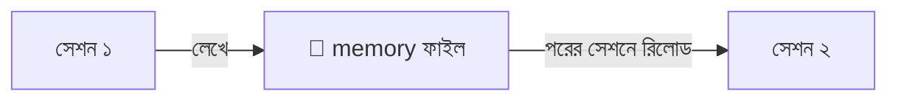
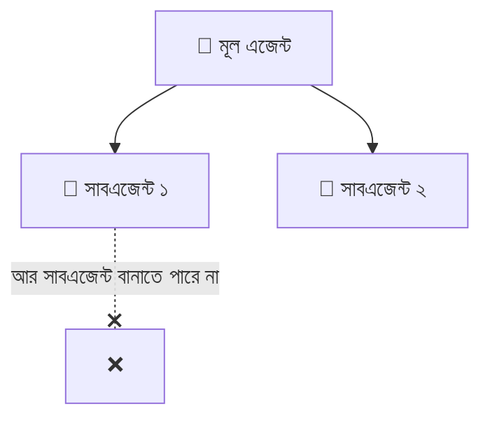

# সেকশন ৬ — মেমরি ও স্টিয়ারিং 🧭

> গোল্ডি-মেমোরির 🐠 একটা মডেলকে "মনে রাখানো" যায় কীভাবে? আর কনটেক্সট নষ্ট না করে তাকে সঠিক
> পথে চালানোই বা (steer) যায় কীভাবে? এই সেকশনে সেই কৌশলগুলোই। 🗺️

[⬅️ মূল পাতা](../README.md) · [⬅️ আগের সেকশন](05-handoffs.md)

---

### মেমরি সিস্টেম (Memory system)

একটা ব্যবস্থা, যা এজেন্টকে সেশনের পর সেশন [স্টেটফুল (Stateful)](02-sessions-context-turns.md#স্টেটফুল-stateful) করে তোলার চেষ্টা করে। 🧠💾 সেশন চলাকালীন তথ্য [এনভায়রনমেন্টে (Environment)](03-tools-and-environment.md#এনভায়রনমেন্ট-environment) লিখে রাখে, আর পরের সেশনের শুরুতে সেটা আবার [কনটেক্সট উইন্ডোতে (Context window)](02-sessions-context-turns.md#কনটেক্সট-উইন্ডো-context-window) তুলে আনে।

ধরুন আপনার একটা ব্যক্তিগত ডায়েরি আছে 📔 — আজ যা শিখলেন টুকে রাখলেন, কাল সকালে পড়ে আবার মনে করে নিলেন। মডেল নিজে তো গোল্ডি 🐠 ([স্টেটলেস](02-sessions-context-turns.md#স্টেটলেস-stateless)); এই memory layer-টা ডায়েরির ভূমিকা নিয়ে একটা ধারাবাহিকতার আভাস এনে দেয়।

💬 কথোপকথনে

🙋 "বারবার বলতে হচ্ছে আমরা Postgres-এ, MySQL-এ না।"

🧑‍🏫 "একটা memory system লাগিয়ে দিন — প্রথম [টার্নে](02-sessions-context-turns.md#টার্ন-turn) যা শেখে তা [ফাইলসিস্টেমে](03-tools-and-environment.md#ফাইলসিস্টেম-filesystem) লিখুক, সেশনের শুরুতে রিলোড করুক। মডেল নিজে [স্টেটলেস](02-sessions-context-turns.md#স্টেটলেস-stateless); ধারাবাহিকতার ভানটা ওই memory layer-ই করে।"

---

### AGENTS.md

[এনভায়রনমেন্টের (Environment)](03-tools-and-environment.md#এনভায়রনমেন্ট-environment) একটা ফাইল, যা [হার্নেস (Harness)](01-the-model.md#হার্নেস-harness) প্রতিটা [সেশনের](02-sessions-context-turns.md#সেশন-session) শুরুতেই [কনটেক্সট উইন্ডোতে (Context window)](02-sessions-context-turns.md#কনটেক্সট-উইন্ডো-context-window) তুলে নেয় — প্রজেক্টের তরফ থেকে এজেন্টকে দেওয়া একটা স্থায়ী ব্রিফ। 📌

ক্লাসরুমের দেয়ালে টাঙানো নিয়মের চার্টের মতো 📋 — সবাই সবসময় চোখের সামনে পায়। তবে একটা সাবধানবাণী আছে: এখানে যা লিখবেন, প্রতি [টার্নে](02-sessions-context-turns.md#টার্ন-turn) তার [টোকেন (Token)](01-the-model.md#টোকেন-token) খরচ হবে। তাই যেসব জিনিস [প্রগ্রেসিভ ডিসক্লোজার (Progressive disclosure)](#প্রগ্রেসিভ-ডিসক্লোজার-progressive-disclosure) দিয়ে দরকারমতো টেনে আনা যায়, সেগুলো এখানে গাদা করে রাখবেন না। 🚩

💬 কথোপকথনে

🙋 "প্রতিটা সেশন কেন আগেই ৪k টোকেন পুড়িয়ে শুরু হচ্ছে?"

🧑‍🏫 "AGENTS.md-টা একবার দেখুন — কেউ হয়তো গোটা স্টাইল গাইডটাই সেখানে পেস্ট করে রেখেছে, যেটা আসলে একটা [স্কিল (Skill)](#স্কিল-skill)-এর পেছনে থাকার কথা ছিল।"

---

### প্রগ্রেসিভ ডিসক্লোজার (Progressive disclosure)

এজেন্টের এই মুহূর্তে যতটুকু [কনটেক্সট (Context)](02-sessions-context-turns.md#কনটেক্সট-context) দরকার, শুধু ততটুকুই লোড করা — বাকিটার জন্য একটা [কনটেক্সট পয়েন্টার (Context pointer)](#কনটেক্সট-পয়েন্টার-context-pointer) রেখে দেওয়া। 🎯

পুরো লাইব্রেরিটা 📚 ব্যাগে ঢোকানোর দরকার কী? আজকের ক্লাসের বইটাই নিন; বাকিগুলো লাগলে তখন এনে নেওয়া যাবে। UI ডিজাইন থেকে ধার করা একটা সহজ আইডিয়া — যখন যা লাগে, ঠিক তখনই সেটা সামনে আনা।

💬 কথোপকথনে

🙋 "পুরো স্টাইল গাইডটা AGENTS.md-তে ঢেলে দেব?"

🧑‍🏫 "না না, progressive disclosure মানুন। স্টাইল গাইডটাকে একটা [স্কিল (Skill)](#স্কিল-skill) বানিয়ে রাখুন, এজেন্ট কম্পোনেন্ট লেখার সময়ই সেটা টেনে নেবে। AGENTS.md কিন্তু প্রতি টার্নে টোকেন গিলছে।"

---

### কনটেক্সট পয়েন্টার (Context pointer)

এক ডকুমেন্ট থেকে আরেকটার দিকে ইশারা, যাতে এজেন্ট দরকার পড়লেই সেটা [কনটেক্সট উইন্ডোতে (Context window)](02-sessions-context-turns.md#কনটেক্সট-উইন্ডো-context-window) টেনে আনতে পারে। 👉 [প্রগ্রেসিভ ডিসক্লোজার (Progressive disclosure)](#প্রগ্রেসিভ-ডিসক্লোজার-progressive-disclosure)-এর বিল্ডিং ব্লকটা এটাই।

বইয়ের ফুটনোট কিংবা "পৃষ্ঠা ৫০ দেখুন"-এর মতো 🔖 — পুরো লেখাটা এখানে নেই, কিন্তু দরকার হলে কোথায় পাবেন তা ঠিকঠাক বলা আছে।

💬 কথোপকথনে

🙋 "AGENTS.md বিশাল হয়ে যাচ্ছে।"

🧑‍🏫 "বেশির ভাগটাই context pointer হওয়ার কথা, পুরো কনটেন্ট নয়। সবসময়ের নিয়মগুলো inline রাখুন; deploy runbook আর স্টাইল গাইডকে skill বানিয়ে শুধু পয়েন্টারটুকু রেখে দিন।"

---

### স্কিল (Skill)

একটা শেখানোর-যোগ্য দক্ষতা, একক হিসেবে বাঁধা — কোনো কাজ ভালোভাবে করার নির্দেশনা আর রিসোর্স, যা [এনভায়রনমেন্টে (Environment)](03-tools-and-environment.md#এনভায়রনমেন্ট-environment) চুপচাপ পড়ে থাকে, যতক্ষণ না একটা [কনটেক্সট পয়েন্টার (Context pointer)](#কনটেক্সট-পয়েন্টার-context-pointer) দরকারমতো সেটা টেনে আনে। 📦

রান্নার রেসিপি কার্ডের মতো 🍳 — ওই রান্নাটা করার সময় কার্ডটা বের করবেন, সবসময় হাতে ধরে বসে থাকার মানে হয় না। একে আবার [টুল (Tool)](03-tools-and-environment.md#টুল-tool)-এর সঙ্গে গুলিয়ে ফেলবেন না — টুল এজেন্ট *কল করে*, আর skill এজেন্ট *পড়ে*।

💬 কথোপকথনে

🙋 "Deploy runbook কোথায় রাখব?"

🧑‍🏫 "একটা skill হিসেবে রাখুন — deploy-এর কাজ এলে তবেই এজেন্ট সেটা টেনে নেবে। AGENTS.md-তে রাখলে সপ্তাহে একবারের একটা কাজের জন্য প্রতি টার্নে টোকেন পুড়ত।"

---

### সাবএজেন্ট (Subagent)

একটা [এজেন্ট (Agent)](02-sessions-context-turns.md#এজেন্ট-agent), যাকে আরেকটা এজেন্ট একটা [টুল কল (Tool call)](03-tools-and-environment.md#টুল-কল-tool-call) দিয়ে জন্ম দেয়। নিজের আলাদা সেশন আর [কনটেক্সট উইন্ডোতে (Context window)](02-sessions-context-turns.md#কনটেক্সট-উইন্ডো-context-window) চলে, আর কাজ শেষে একটাই [টুল রেজাল্ট (Tool result)](03-tools-and-environment.md#টুল-রেজাল্ট-tool-result) ফেরত দেয়। 👶

বড় ভাই ছোট ভাইকে দোকানে পাঠাল 🏪 — "যা তো, খুঁজে শুধু দামটা জেনে আয়"। ছোট ভাই গাদা গাদা জিনিস ঘেঁটেঘুঁটে এসে কেবল দরকারি উত্তরটুকু দিল, ভিড়ের পুরো ঝামেলাটা আর বড় ভাইয়ের ঘাড়ে চাপল না। তবে একটা কথা — সাবএজেন্ট কিন্তু নিজে আবার সাবএজেন্ট বানাতে পারে না, গাছটা মোটে এক ধাপ গভীর।

💬 কথোপকথনে

🙋 "Grep-এর ফলাফল আমার context উপচে দিচ্ছে।"

🧑‍🏫 "একটা subagent দিয়ে সার্চটা করিয়ে নিন — ও নিজের context window-তে নয়েজটা পুড়িয়ে শুধু দরকারি দুটো ফাইল পাথ ফেরত দেবে।"

---

## 🎯 সেকশন রিভিউ — সব মনে আছে তো?

প্রশ্ন ১: Memory system গোল্ডি 🐠-কে কীভাবে "মনে রাখায়"?

সেশন চলাকালীন তথ্য ফাইলে লিখে রাখে, পরের সেশনের শুরুতে আবার context window-এ রিলোড করে। মডেল নিজে মনে রাখে না।

প্রশ্ন ২: সবকিছু AGENTS.md-তে ঢেলে দেওয়া খারাপ কেন?

কারণ AGENTS.md প্রতি টার্নে context-এ লোড হয় — যা লেখেন তার টোকেন খরচ প্রতিবার দিতে হয়। দরকারি না হলে skill-এ সরান।

প্রশ্ন ৩: Tool আর Skill-এর পার্থক্য এক লাইনে?

Tool এজেন্ট **কল করে** (কাজ করায়); Skill এজেন্ট **পড়ে** (নির্দেশনা শেখে)।

প্রশ্ন ৪: Subagent কেন কাজে লাগে?

ভারী/নয়েজি কাজ (যেমন বড় সার্চ) আলাদা context-এ করিয়ে শুধু দরকারি উত্তরটা ফেরত আনে — মূল context পরিষ্কার থাকে।

## 🧩 মিনি-চ্যালেঞ্জ

🕵️ আপনার AGENTS.md ফুলে গেছে আর প্রতি সেশন অনেক টোকেন পুড়িয়ে শুরু হচ্ছে। ৩টা শব্দ দিয়ে সমাধান বলুন।

- **Progressive disclosure** — শুধু এখন যা দরকার তাই রাখুন।
- **Skill** — runbook/স্টাইল গাইড স্কিলে সরান।
- **Context pointer** — AGENTS.md-তে শুধু ইশারা রাখুন, পুরো কনটেন্ট নয়।

## ✅ শেখার চেকলিস্ট

> 💡 *Fork করে টিক দিন!*

- [ ] Memory system = ফাইলে লিখে রিলোড করে কৃত্রিম স্মৃতি
- [ ] AGENTS.md = সেশন-শুরুর স্থায়ী ব্রিফ (টোকেন খরচ করে)
- [ ] Progressive disclosure = দরকারমতো লোড
- [ ] Context pointer = অন্য ডকের দিকে ইশারা
- [ ] Skill = এজেন্ট যা পড়ে শেখে (tool ≠ skill)
- [ ] Subagent = আলাদা context-এ ভারী কাজ, এক উত্তর ফেরত

---

[⬅️ মূল পাতা](../README.md) · [পরের সেকশন: কাজের ধরন ➡️](07-patterns-of-work.md)
