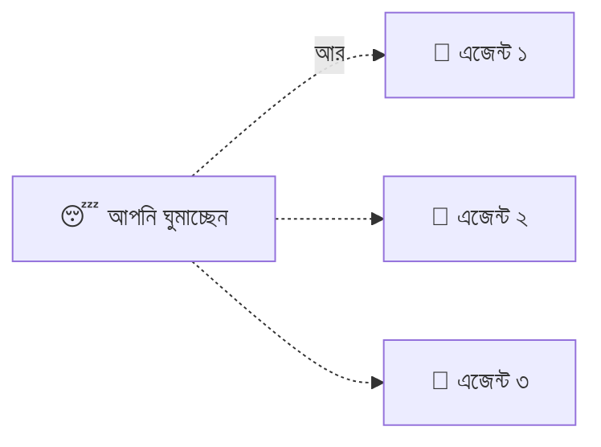

# সেকশন ৭ — কাজের ধরন (Patterns of Work) 🛠️

> এজেন্টের সঙ্গে আসলে কীভাবে কাজ করবেন? পাশে বসে নজর রাখবেন, নাকি ছেড়ে দিয়ে ঘুমাতে যাবেন? 😴
> কখন কোড পড়ে দেখবেন, আর কখন "চলছে তো চলুক"? এই শেষ সেকশনে কাজের আসল প্যাটার্নগুলো।

[⬅️ মূল পাতা](../README.md) · [⬅️ আগের সেকশন](06-memory-and-steering.md)

---

### হিউম্যান-ইন-দ্য-লুপ (Human-in-the-loop)

এমন একটা কাজের ধরন, যেখানে এক বা একাধিক মানুষ [সেশন](02-sessions-context-turns.md#সেশন-session) চলাকালীন এজেন্টের সঙ্গে জুটি বেঁধে থাকে — রিয়েল-টাইমে নজর রাখে, পথ দেখায়, হাত লাগায়। 👥 মানুষ এখানে হাজির, এবং সক্রিয়।

শিক্ষানবিশ ড্রাইভারের পাশে বসা ইনস্ট্রাক্টরের কথা ভাবুন 🚗 — দরকার পড়লেই হাত বাড়িয়ে স্টিয়ারিং ধরেন। ঝুঁকির কাজে, যেমন ডাটাবেস মাইগ্রেশন, এভাবে প্রতিটা স্টেপ চোখের সামনে দেখে নেওয়াই বুদ্ধিমানের কাজ।

💬 কথোপকথনে

🙋 "এটা রাতভর [AFK](#afk) চালিয়ে দেব?"

🧑‍🏫 "না না, schema মাইগ্রেশন — human-in-the-loop রাখুন। প্রতিটা স্টেপ চোখে দেখতে চাই, যাতে ভুল কলাম থেকে backfill করলে সঙ্গে সঙ্গে থামাতে পারি।"

---

### AFK

**Away From Keyboard** (কিবোর্ড থেকে দূরে)। 😴 এমন একটা কাজের ধরন, যেখানে আপনি একটা [সেশন](02-sessions-context-turns.md#সেশন-session) চালু করে এজেন্টকে একা রেখে উঠে চলে যান। এটাই AI কোডিংয়ের আসল গতি-গুণক — আপনি ঘুমান, খান, অন্য কাজে মন দেন, আর এদিকে অনেকগুলো AFK সেশন পাশাপাশি চলতে থাকে।

রাতে ওয়াশিং মেশিন চালিয়ে ঘুমিয়ে পড়ার মতো 🧺 — সকালে উঠে দেখলেন কাপড় ধোয়া শেষ। তবে এটা নিরাপদে করতে হলে দরকার একটা ঢিলা [পারমিশন মোড (Permission mode)](03-tools-and-environment.md#পারমিশন-মোড-permission-mode) আর একটা [স্যান্ডবক্স (Sandbox)](03-tools-and-environment.md#স্যান্ডবক্স-sandbox)। আর একটা কথা — একে "background agent" না বলাই ভালো; ওই নামটা মেশিনের দিকে নজর টানে, আসল কথাটার দিকে নয়, যে ইউজার চলে গেছে।

💬 কথোপকথনে

🙋 "এটা AFK চালাচ্ছি — তিনটা sandboxed এজেন্ট রিফ্যাক্টরে, সকালে PR রিভিউ করব।"

🧑‍🏫 "[Bypass permissions](03-tools-and-environment.md#এজেন্ট-মোড-agent-mode)?"

🙋 "হ্যাঁ, read-only [ফাইলসিস্টেম](03-tools-and-environment.md#ফাইলসিস্টেম-filesystem), নেটওয়ার্ক বন্ধ।"

---

### অটোমেটেড চেক (Automated check)

[এনভায়রনমেন্টে (Environment)](03-tools-and-environment.md#এনভায়রনমেন্ট-environment) চলা একটা নিশ্চিত (deterministic) যাচাই — টেস্ট, টাইপ চেক, লিন্ট, বিল্ড। ✅/❌ পাস কি ফেল, কোনো মতামত নেই। এজেন্ট নিজেই এর ফলাফল দেখে নিজেকে শুধরে নিতে পারে।

ক্যালকুলেটরে অঙ্ক মিলিয়ে দেখার মতো 🧮 — হয় মিলবে, নয় মিলবে না; "মোটামুটি মিলেছে" বলে কিছু নেই। আর একটা কথা মনে রাখবেন: ফ্লেকি (এলোমেলো) টেস্ট মানে ভাঙা চেক, চেক না-থাকা নয় — চেকের তো ডিজাইনেই নিশ্চিত হওয়ার কথা। সব টেস্ট একরকম automated check ঠিকই, তবে সব check কিন্তু টেস্ট নয়।

💬 কথোপকথনে

🙋 "AFK রানে এজেন্ট বারবার ভাঙা কোড দিচ্ছে।"

🧑‍🏫 "Sandbox-এ কী কী automated check ওয়্যার করা আছে?"

🙋 "শুধু ইউনিট টেস্ট।"

🧑‍🏫 "Typecheck আর lint যোগ করুন — PR ল্যান্ড করার আগেই ওগুলো থেকে নিজে শুধরে নেবে।"

---

### অটোমেটেড রিভিউ (Automated review)

এক এজেন্ট আরেক এজেন্টের কাজ রিভিউ করছে, প্রায়ই আলাদা [মডেল (Model)](01-the-model.md#মডেল-model) বা [সিস্টেম প্রম্পট (System prompt)](02-sessions-context-turns.md#সিস্টেম-প্রম্পট-system-prompt) দিয়ে। 🤖🔍 এটা non-deterministic — এটা একটা *মতামত* দাঁড় করায়, ঠিক/ভুলের রায় নয়।

এক বন্ধুর লেখা রচনা আরেক বন্ধু পড়ে মতামত দেওয়ার মতো ✍️ — "এই অংশটা দুর্বল, ওটা ভালো"। পার্থক্যটা মাথায় রাখবেন: [অটোমেটেড চেক (Automated check)](#অটোমেটেড-চেক-automated-check) ঠিক/ভুল বলে, আর review মতামত দেয়।

💬 কথোপকথনে

🙋 "AFK রান থেকে বেশি বাজে PR আসছে।"

🧑‍🏫 "Merge-এর আগে একটা automated review স্টেপ ঢোকান — আলাদা মডেল, আলাদা সিস্টেম প্রম্পট, সিকিউরিটি আর কন্ট্রাক্ট বদলের দিকে স্কোপ করা।"

---

### হিউম্যান রিভিউ (Human review)

ইউজার নিজে এজেন্টের লেখা কোড পড়ে একটা মতামত দাঁড় করাচ্ছে। 👀 ডিফ বা বদলানো ফাইল পড়া = রিভিউ; কিন্তু এজেন্ট *কী করেছে তার বর্ণনা* পড়াটা রিভিউ নয় — বর্ণনা তো আর আসল জিনিস নয়।

রান্না খাওয়ার আগে নিজে একবার চেখে দেখার মতো 🥄 — রাঁধুনি "দারুণ হয়েছে" বললেই তো আর হলো না, নিজে চেখে দেখুন। আর "code review" বললে বোঝার উপায় নেই সেটা মানুষ করল নাকি [অটোমেটেড (Automated review)](#অটোমেটেড-রিভিউ-automated-review) — তাই কোনটা বোঝাচ্ছেন, স্পষ্ট করে বলাই ভালো।

💬 কথোপকথনে

🙋 "আমি AFK আউটপুট human-review করেছি।"

🧑‍🏫 "ডিফ পড়েছেন, নাকি শুধু সারাংশ?"

🙋 "ডিফ। সারাংশে বলেছিল dead code মুছেছে — দেখা গেল ফাংশনটা একটা generated ফাইল থেকে ডাকা হচ্ছিল।"

---

### ভাইব কোডিং (Vibe coding)

এমন একটা কাজের ধরন, যেখানে ইউজার এজেন্টের কোড [হিউম্যান রিভিউ (Human review)](#হিউম্যান-রিভিউ-human-review) ছাড়াই মেনে নেয়। 😎 ডিফটাকে একটা কালো বাক্স ধরে নেওয়া হয় — ভেতরে কী আছে দেখার দরকার নেই, প্রোগ্রামটা চললেই হলো।

রেসিপি না দেখে রান্নার মতো — "খেতে ভালো হলেই হলো!" 🍲 মাঝে মাঝে চলেও যায়, কিন্তু গুরুত্বপূর্ণ জায়গায় (যেমন লগইন বা সিকিউরিটি) চোখ বুজে ভাইব করা বিপজ্জনক। আর একটা ভুল ধারণা ঝেড়ে ফেলুন — "vibe coding" মানে "বাজে AI কোড" নয়; এটা রিভিউ করার *ভঙ্গি* বোঝায়, কোডের মান নয়।

💬 কথোপকথনে

🙋 "auth ফ্লোতে কী বদলেছে পড়ে দেখেছেন?"

🧑‍🏫 "Vibe code করেছি — লগইন এখনো কাজ করছে, ওটুকুই চেক করেছি।"

🙋 "Push করার আগে ডিফটা পড়ুন — auth-এ ভাইব করাই তো গোপন তথ্য লগে লিক হওয়ার রাস্তা।"

---

### ডিজাইন কনসেপ্ট (Design concept)

কী বানানো হচ্ছে তার একটা ভাগ করা বোঝাপড়া — ইউজার আর এজেন্টের মাথায় একসঙ্গে থাকা একটা ছবি, যা কোনো একটা ফাইল বা ডকের সমান নয়। 💡 কথা, [হ্যান্ডঅফ আর্টিফ্যাক্ট (Handoff artifact)](05-handoffs.md#হ্যান্ডঅফ-আর্টিফ্যাক্ট-handoff-artifact), কোড — সবই ওই বোঝাপড়াটা ধরার চেষ্টা মাত্র, কোনোটাই *সেটা নয়*।

দুজন মিলে গল্প লেখার আগে দুজনের মাথায় একই গল্পের ছবি থাকার মতো 📖 — ছবিটা না মিললে, যত সুন্দর করেই লিখুন না কেন, গল্প এলোমেলো হবেই।

💬 কথোপকথনে

🙋 "ঠিক যা বলেছি তাই লিখছে, তবু ভুল হচ্ছে।"

🧑‍🏫 "আপনাদের design concept তো এখনো মেলেনি — ও ফাঁকগুলো নিজের অনুমানে ভরাট করছে। cancellation, refund, partial fulfilment — সব দুজনের মধ্যে মিলে যাওয়া পর্যন্ত কথা বলুন, তারপর [spec](05-handoffs.md#স্পেক-spec) লিখতে দিন।"

---

### গ্রিলিং (Grilling)

[ডিজাইন কনসেপ্ট (Design concept)](#ডিজাইন-কনসেপ্ট-design-concept) গড়ে তোলার একটা টেকনিক: এজেন্ট সক্রেটিসের মতো একটা একটা করে প্রশ্ন ছুড়ে ইউজারকে "জেরা" করে, আর প্রতিটার সঙ্গে একটা সুপারিশও দেয়। 🔥 বোঝাপড়া পাকা না হওয়া পর্যন্ত কোনো [হ্যান্ডঅফ আর্টিফ্যাক্ট (Handoff artifact)](05-handoffs.md#হ্যান্ডঅফ-আর্টিফ্যাক্ট-handoff-artifact) লেখা হয় না।

ভালো ডাক্তার ওষুধ দেওয়ার আগে একগাদা প্রশ্ন করেন 🩺 — "কবে থেকে? কেমন ব্যথা? আর কী হয়?" Grilling ঠিক তেমনই — কোড লেখার তাড়াহুড়ো একটু থামিয়ে আগে সব খুঁটিনাটি বের করে আনা। (মজার কথা, এই অভিধানটাও কিন্তু এমন grilling দিয়েই শুরু হয়েছিল। 😉)

💬 কথোপকথনে

🙋 "এটা সোজা spec লিখে ফেলল আর cancellation লজিক ভুল করল।"

🧑‍🏫 "আগে grill করান — partial cancel, refund, timing নিয়ে প্রশ্ন করিয়ে নিন, তারপর কিছু লিখতে দিন। কথায় ঠিক করা কোডে ঠিক করার চেয়ে অনেক সস্তা।"

---

## 🎯 সেকশন রিভিউ — সব মনে আছে তো?

প্রশ্ন ১: Human-in-the-loop আর AFK — কখন কোনটা?

ঝুঁকির কাজে (schema মাইগ্রেশন, auth) **human-in-the-loop**। নিরাপদ, পুনরাবৃত্তিমূলক কাজে **AFK** (sandbox + ঢিলা permission সহ)।

প্রশ্ন ২: Automated check বনাম Automated review?

Check = deterministic, পাস/ফেল (টেস্ট, lint)। Review = non-deterministic মতামত (এক এজেন্ট আরেকটাকে রিভিউ করে)।

প্রশ্ন ৩: Vibe coding-এর আসল মানে কী?

কোড **human review ছাড়াই** মেনে নেওয়া — কোডের মান নয়, রিভিউ করার *ভঙ্গি* বোঝায়।

প্রশ্ন ৪: Grilling কেন কোড লেখার আগে?

কারণ design concept আগে মিলিয়ে নেওয়া দরকার — কথায় ভুল ঠিক করা কোডে ঠিক করার চেয়ে অনেক সস্তা।

## 🧩 মিনি-চ্যালেঞ্জ

🕵️ আপনি রাতভর AFK রান চালাবেন আর সকালে দেখবেন। কোয়ালিটি ঠিক রাখতে কোন শব্দগুলো কাজে লাগাবেন?

- **Automated check** (test + typecheck + lint) — এজেন্ট নিজে শুধরাবে।
- **Automated review** — merge-এর আগে আলাদা এজেন্টের মতামত।
- সকালে **human review** — শুধু সারাংশ নয়, আসল ডিফ পড়ুন!
- ঝুঁকির অংশে **vibe coding** এড়িয়ে চলুন।

## ✅ শেখার চেকলিস্ট

> 💡 *Fork করে টিক দিন!*

- [ ] Human-in-the-loop = মানুষ পাশে, রিয়েল-টাইমে স্টিয়ার
- [ ] AFK = একা ছেড়ে দেওয়া (sandbox + permission জরুরি)
- [ ] Automated check = deterministic পাস/ফেল
- [ ] Automated review = এজেন্টের মতামত
- [ ] Human review = নিজে ডিফ পড়া (সারাংশ নয়)
- [ ] Vibe coding = রিভিউ ছাড়া মেনে নেওয়া
- [ ] Design concept + Grilling = কোডের আগে বোঝাপড়া মেলানো

---

🎉 **অভিনন্দন!** পুরো অভিধানটা আপনি শেষ করে ফেললেন। AI কোডিংয়ের শব্দগুলো আর রহস্য নয়। 🚀

👉 **এবার কী করবেন?** শব্দ শেখা শেষ — এবার কাজে লাগানোর পালা: [🎓 এরপর কী?](08-what-next.md)

[⬅️ মূল পাতায় ফিরুন](../README.md)
