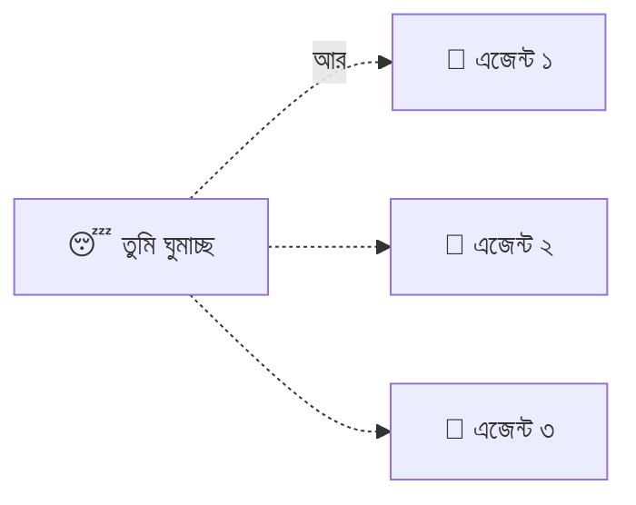

# সেকশন ৭ — কাজের ধরন (Patterns of Work) 🛠️

> এজেন্টের সাথে আসলে কীভাবে কাজ করবে? পাশে বসে দেখবে, নাকি ছেড়ে দিয়ে ঘুমাতে যাবে? 😴 কখন
> কোড পড়ে দেখবে, কখন শুধু "চলছে তো চলুক"? এই শেষ সেকশনে কাজের আসল প্যাটার্নগুলো।

[⬅️ মূল পাতা](../README.md) · [⬅️ আগের সেকশন](06-memory-and-steering.md)

---

### হিউম্যান-ইন-দ্য-লুপ (Human-in-the-loop)

এমন একটা কাজের ধরন, যেখানে এক বা একাধিক মানুষ [সেশন](02-sessions-context-turns.md#সেশন-session) চলাকালীন এজেন্টের সাথে জুটি বেঁধে থাকে — রিয়েল-টাইমে দেখে, পথ দেখায়, সাহায্য করে। 👥 মানুষ এখানে হাজির ও সক্রিয়।

> 🌟 **রোজকার উদাহরণ**
> শিক্ষানবিশ ড্রাইভারের পাশে বসা ইনস্ট্রাক্টর 🚗 — দরকার হলেই হাত বাড়িয়ে স্টিয়ারিং ধরে। ঝুঁকির
> কাজে (যেমন ডাটাবেস মাইগ্রেশন) এভাবেই প্রতিটা স্টেপ দেখে নেওয়া ভালো।

📝 নিজেকে যাচাই করো

প্রশ্ন: schema মাইগ্রেশনটা কি রাতভর [AFK](#afk) চালিয়ে দেব?

**উত্তর:** না — এটা ঝুঁকির কাজ, human-in-the-loop রাখো। প্রতিটা স্টেপ দেখে দরকারে পথ দেখাও।

---

### AFK

**Away From Keyboard** (কিবোর্ড থেকে দূরে)। 😴 এমন কাজের ধরন, যেখানে তুমি একটা [সেশন](02-sessions-context-turns.md#সেশন-session) চালু করে এজেন্টকে একা রেখে চলে যাও। এটাই AI কোডিংয়ের আসল গতি-গুণক — তুমি ঘুমাও, খাও, অন্য কাজ করো, আর অনেকগুলো AFK সেশন পাশাপাশি চলতে থাকে।

> 🌟 **রোজকার উদাহরণ**
> রাতে ওয়াশিং মেশিন চালিয়ে ঘুমিয়ে পড়া 🧺 — সকালে উঠে দেখো কাপড় ধোয়া শেষ। তবে নিরাপদে করতে
> দরকার ঢিলা [পারমিশন মোড (Permission mode)](03-tools-and-environment.md#পারমিশন-মোড-permission-mode) + [স্যান্ডবক্স (Sandbox)](03-tools-and-environment.md#স্যান্ডবক্স-sandbox)।

> ⚠️ **এড়িয়ে চলো:** "background agent" বলা — ওটা মেশিনের দিকে নজর দেয়, আসল কথাটা ("ইউজার চলে গেছে") নয়।

📝 নিজেকে যাচাই করো

প্রশ্ন: AFK রান নিরাপদে চালাতে দুটো জিনিস কী কী দরকার?

**উত্তর:** ঢিলা permission mode (যাতে বারবার না থামে) আর sandbox (যাতে কিছু ভাঙলেও ক্ষতি আটকে থাকে)।

---

### অটোমেটেড চেক (Automated check)

[এনভায়রনমেন্টে (Environment)](03-tools-and-environment.md#এনভায়রনমেন্ট-environment) চলা একটা নিশ্চিত (deterministic) যাচাই — টেস্ট, টাইপ চেক, লিন্ট, বিল্ড। ✅/❌ পাস বা ফেল, কোনো মতামত নেই। এজেন্ট নিজে এ থেকে শিখে নিজেকে শুধরে নিতে পারে।

> 🌟 **রোজকার উদাহরণ**
> ক্যালকুলেটরে অঙ্ক মিলিয়ে দেখা 🧮 — হয় মিলবে, নয় মিলবে না, কোনো "মোটামুটি" নেই। ফ্লেকি (এলোমেলো)
> টেস্ট মানে ভাঙা চেক, চেক না-থাকা নয় — চেক ডিজাইনেই নিশ্চিত হওয়ার কথা।

> ⚠️ **এড়িয়ে চলো:** "test" বলে সব বোঝানো — টেস্ট একধরনের automated check, কিন্তু সব check টেস্ট নয়।

📝 নিজেকে যাচাই করো

প্রশ্ন: AFK রানে এজেন্ট বারবার ভাঙা কোড দিচ্ছে — কী যোগ করব?

**উত্তর:** আরও automated check — typecheck আর lint। তাহলে PR জমা দেওয়ার আগেই নিজে শুধরে নেবে।

---

### অটোমেটেড রিভিউ (Automated review)

এক এজেন্ট আরেক এজেন্টের কাজ রিভিউ করছে, প্রায়ই আলাদা [মডেল (Model)](01-the-model.md#মডেল-model) বা [সিস্টেম প্রম্পট (System prompt)](02-sessions-context-turns.md#সিস্টেম-প্রম্পট-system-prompt) দিয়ে। 🤖🔍 এটা non-deterministic — এটা একটা *মতামত* তৈরি করে।

> 🌟 **রোজকার উদাহরণ**
> এক বন্ধুর লেখা রচনা আরেক বন্ধু পড়ে মতামত দিচ্ছে ✍️ — "এই অংশটা দুর্বল, ওটা ভালো"। [অটোমেটেড
> চেক (Automated check)](#অটোমেটেড-চেক-automated-check) ঠিক/ভুল বলে; review মতামত দেয় — পার্থক্যটা মাথায় রেখো।

📝 নিজেকে যাচাই করো

প্রশ্ন: AFK রান থেকে বাজে PR বেশি আসছে — কী যোগ করব?

**উত্তর:** Merge-এর আগে একটা automated review স্টেপ — আলাদা মডেল, আলাদা সিস্টেম প্রম্পট, সিকিউরিটি ও কন্ট্রাক্টে ফোকাস।

---

### হিউম্যান রিভিউ (Human review)

ইউজার নিজে এজেন্টের লেখা কোড পড়ে মতামত তৈরি করছে। 👀 ডিফ বা বদলানো ফাইল পড়া = রিভিউ; কিন্তু এজেন্ট *কী করেছে তার বর্ণনা* পড়া রিভিউ নয় — বর্ণনা তো আসল জিনিস না!

> 🌟 **রোজকার উদাহরণ**
> রান্না খাওয়ার আগে নিজে চেখে দেখা 🥄 — রাঁধুনি "দারুণ হয়েছে" বললেই তো হলো না, নিজে চেখে দেখো!

> ⚠️ **এড়িয়ে চলো:** শুধু "code review" বলা — এটা মানুষ নাকি [অটোমেটেড (Automated review)](#অটোমেটেড-রিভিউ-automated-review), বোঝা যায় না।

📝 নিজেকে যাচাই করো

প্রশ্ন: "আমি AFK আউটপুট human-review করেছি" — যথেষ্ট কি?

**উত্তর:** নির্ভর করে — ডিফ পড়েছ, নাকি শুধু সারাংশ? সারাংশ পড়া রিভিউ নয়, আসল ডিফ পড়তে হবে।

---

### ভাইব কোডিং (Vibe coding)

এমন একটা কাজের ধরন, যেখানে ইউজার এজেন্টের কোড [হিউম্যান রিভিউ (Human review)](#হিউম্যান-রিভিউ-human-review) ছাড়াই মেনে নেয়। 😎 ডিফকে কালো বাক্স ধরা হয় — ভেতরে কী আছে না দেখে, প্রোগ্রামটা চললেই হলো।

> 🌟 **রোজকার উদাহরণ**
> রেসিপি না দেখে রান্না — "খেতে ভালো হলেই হলো!" 🍲 মাঝে মাঝে চলে, কিন্তু গুরুত্বপূর্ণ জিনিসে
> (যেমন লগইন/সিকিউরিটি) চোখ বন্ধ করে ভাইব করা বিপজ্জনক।

> ⚠️ **এড়িয়ে চলো:** "vibe coding"-কে "বাজে AI কোড"-এর সমার্থক ভাবা — এটা রিভিউ করার *ভঙ্গি* বোঝায়, কোডের মান নয়।

📝 নিজেকে যাচাই করো

প্রশ্ন: auth (লগইন) ফ্লোতে vibe coding করা কি ঠিক?

**উত্তর:** ঝুঁকিপূর্ণ — push করার আগে ডিফ পড়ো। auth-এ চোখ বন্ধ করে ভাইব করলে গোপন তথ্য লিক হতে পারে।

---

### ডিজাইন কনসেপ্ট (Design concept)

কী বানানো হচ্ছে তার ভাগ করা বোঝাপড়া — ইউজার আর এজেন্টের মাথায় একসাথে থাকা ছবি, যা কোনো একটা ফাইল বা ডকের সমান নয়। 💡 কথা, [হ্যান্ডঅফ আর্টিফ্যাক্ট (Handoff artifact)](05-handoffs.md#হ্যান্ডঅফ-আর্টিফ্যাক্ট-handoff-artifact), কোড — সবই ওই বোঝাপড়াটা ধরার চেষ্টা, কিন্তু কোনোটাই *সেটা নয়*।

> 🌟 **রোজকার উদাহরণ**
> দুজন মিলে একটা গল্প লেখার আগে দুজনের মাথায় একই গল্পের ছবি থাকা 📖 — ছবিটা না মিললে, যতই
> সুন্দর করে লেখো, গল্প এলোমেলো হবে।

📝 নিজেকে যাচাই করো

প্রশ্ন: এজেন্ট ঠিক যা বললাম তাই লিখছে, তবু ভুল হচ্ছে — কেন?

**উত্তর:** তোমাদের design concept এখনো মেলেনি — এজেন্ট ফাঁকগুলো নিজের আন্দাজে ভরছে। আগে কথা বলে বোঝাপড়া মেলাও।

---

### গ্রিলিং (Grilling)

[ডিজাইন কনসেপ্ট (Design concept)](#ডিজাইন-কনসেপ্ট-design-concept) গড়ার একটা টেকনিক: এজেন্ট সক্রেটিসের মতো একটা একটা করে প্রশ্ন করে ইউজারকে "জেরা" করে, প্রতিটার জন্য একটা সুপারিশও দেয়। 🔥 বোঝাপড়া পাকা না হওয়া পর্যন্ত কোনো [হ্যান্ডঅফ আর্টিফ্যাক্ট (Handoff artifact)](05-handoffs.md#হ্যান্ডঅফ-আর্টিফ্যাক্ট-handoff-artifact) লেখা হয় না।

> 🌟 **রোজকার উদাহরণ**
> ভালো ডাক্তার ওষুধ দেওয়ার আগে একগাদা প্রশ্ন করেন 🩺 — "কবে থেকে? কেমন ব্যথা? আর কী হয়?"
> Grilling তেমন — কোড লেখার তাড়াহুড়ো থামিয়ে আগে সব খুঁটিনাটি বের করে আনা। (এই অভিধানটা যেভাবে
> বানানো হয়েছে, তার শুরুও কিন্তু এমন grilling দিয়েই! 😉)

📝 নিজেকে যাচাই করো

প্রশ্ন: এজেন্ট সোজা spec লিখে ফেলল আর cancellation লজিক ভুল করল — কী করা উচিত ছিল?

**উত্তর:** আগে grill করানো — partial cancel, refund, timing নিয়ে প্রশ্ন করিয়ে নেওয়া। কথায় ঠিক করা কোডে ঠিক করার চেয়ে সস্তা।

---

🎉 **অভিনন্দন!** তুমি পুরো অভিধান শেষ করে ফেলেছ। এখন AI কোডিংয়ের শব্দগুলো আর রহস্য নয়। 🚀

[⬅️ মূল পাতায় ফিরে যাও](../README.md)
