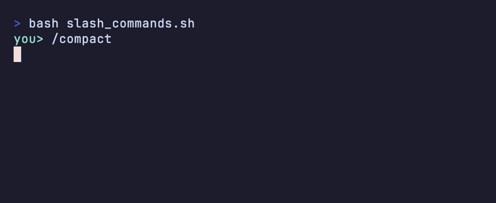
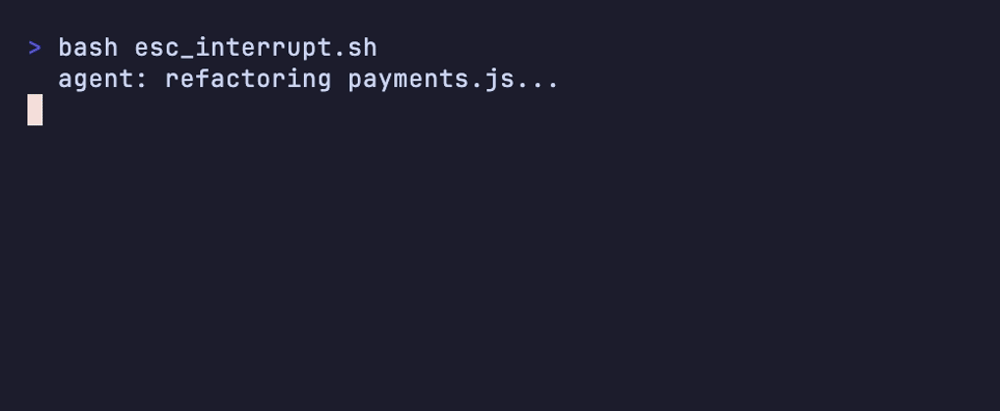
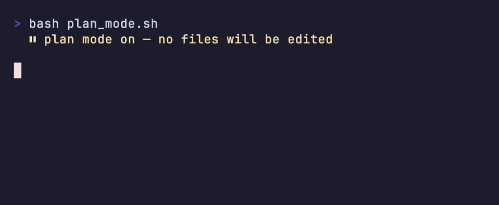

# হাতে-কলমে ১ — CLI কমান্ড গাইড 🖥️

> টার্মিনালে এজেন্টের সঙ্গে কথা বলছেন, হঠাৎ মনে হলো — "নতুন করে শুরু করব কীভাবে? থামাব কীভাবে? মডেলটা বদলাব কীভাবে?" 🤔
> এই সব ছোট ছোট নির্দেশই হলো CLI কমান্ড। এই সেকশনে Claude Code আর Codex-এর রোজকার কমান্ডগুলো হাতে-কলমে।

[⬅️ মূল পাতা](../README.md) · [⬅️ পার্ট ১ শেষ সেকশন](../dictionary/08-what-next.md)

> ⏰ **সর্বশেষ যাচাই: জুন ২০২৬।** CLI টুল দ্রুত বদলায় — সন্দেহ হলে অফিশিয়াল ডক দেখুন:
> [Claude Code docs](https://code.claude.com/docs) · [Codex docs](https://developers.openai.com/codex)

---

### স্ল্যাশ কমান্ড (Slash command)

`/` দিয়ে শুরু এমন একটা নির্দেশ, যেটা [মডেল (Model)](../dictionary/01-the-model.md#মডেল-model) নয়, [হার্নেস (Harness)](../dictionary/01-the-model.md#হার্নেস-harness) নিজে ধরে নেয় ও চালায়। 

টিভির রিমোটের বোতামের কথা ভাবুন 📺 — চ্যানেল বদলানোর বোতাম টিপলে আপনি অনুষ্ঠানকে কিছু বলছেন না, বলছেন *যন্ত্রটাকে*। স্ল্যাশ কমান্ডও তেমনই — কথাটা এজেন্টের কানে যায় না, যায় হার্নেসের কাছে; সেই-ই সেশন গুছিয়ে রাখে, থামায়, নতুন করে শুরু করে।

💬 কথোপকথনে

🙋 "আমি `/clear` লিখলাম, কিন্তু মডেল তো 'clear' মানেই বুঝল না!"

🧑‍🏫 "বুঝবে না তো — ওটা slash command, মডেলের কাছে যায়ই না। হার্নেস সেটা ধরে কনটেক্সট মুছে দেয়। মডেলকে কিছু বলতে চাইলে সাধারণ বাক্যে লিখুন।"

---

### `/init`

আপনার প্রজেক্টটা পুরো স্ক্যান করে এজেন্ট একটা মেমরি ফাইল (CLAUDE.md বা [AGENTS.md](../dictionary/06-memory-and-steering.md#agentsmd)) বানিয়ে দেয় — কোথায় কী আছে, কীভাবে চলে, সব টুকে রাখে।

নতুন বাসায় ঢুকে প্রথমে ঘর-দোর ঘুরে দেখে একটা নোট বানানোর মতো 🏠 — "রান্নাঘর এদিকে, সুইচবোর্ড ওদিকে"। একবার বানিয়ে নিলে প্রতি সেশনের শুরুতে এজেন্টকে আর গোড়া থেকে সব বোঝাতে হয় না।

💬 কথোপকথনে

🙋 "নতুন রিপোতে এজেন্ট কিছুই চেনে না, প্রতিবার সব বলতে হয়।"

🧑‍🏫 "একবার `/init` চালান — পুরো প্রজেক্ট স্ক্যান করে একটা AGENTS.md বানিয়ে দেবে। তারপর থেকে ও নিজেই কাঠামোটা চেনে।"

---

### `/clear`

[ক্লিয়ারিং (Clearing)](../dictionary/05-handoffs.md#ক্লিয়ারিং-clearing)-এর বাটন — এক চাপে চলতি কথাবার্তার সব মুছে গিয়ে একদম নতুন করে শুরু।

হোয়াইটবোর্ড মুছে ফেলার মতো 🧽 — আগের লেখাজোখা সব গায়েব, সাদা বোর্ড সামনে। আগের কাজ আর নতুন কাজের মধ্যে কোনো সম্পর্ক নেই, তখন এটাই সবচেয়ে পরিষ্কার শুরু।

💬 কথোপকথনে

🙋 "আগের ফিচার শেষ, এবার একদম আলাদা একটা বাগ ধরব।"

🧑‍🏫 "তাহলে `/clear` দিয়ে দিন — পুরনো কনটেক্সট টেনে নিয়ে গেলে শুধু টোকেন পুড়বে আর এজেন্ট গুলিয়ে ফেলবে।"

---

### `/compact`

[কম্প্যাকশন (Compaction)](../dictionary/05-handoffs.md#কম্প্যাকশন-compaction)-এর বাটন — পুরো কথা না মুছে, এতক্ষণের আলাপটা সংক্ষেপে গুছিয়ে রেখে জায়গা খালি করে। Codex-এও কমান্ডটার নাম একই: `/compact`।

লম্বা মিটিংয়ের শেষে শুধু সিদ্ধান্তগুলো এক পাতায় টুকে রাখার মতো 📝 — খুঁটিনাটি বাদ, সারমর্ম থাকল। সেশন লম্বা হয়ে গেলে, কিন্তু সুতোটা হারাতে না চাইলে এটাই কাজের।

💬 কথোপকথনে

🙋 "সেশন অনেক লম্বা হয়ে গেছে, এজেন্ট স্লো হচ্ছে — কিন্তু শুরু থেকে আবার বলতে চাই না।"

🧑‍🏫 "`/clear` নয়, `/compact` দিন। সব মুছবে না, সারাংশটা রেখে দেবে — সুতোটা থাকবে, জায়গাও খালি হবে।"

**🎬 টার্মিনালে দেখুন:** `/compact` মডেলের কাছে যায় না — হার্নেস ধরে কনটেক্সট সংক্ষেপ করে, সুতোটা থেকে যায় —

  

---

### `/resume`

বন্ধ করে রাখা কোনো পুরনো [সেশন (Session)](../dictionary/02-sessions-context-turns.md#সেশন-session) আবার ফিরিয়ে এনে ঠিক যেখানে ছেড়েছিলেন সেখান থেকে শুরু করা।

মাঝপথে থামানো সিনেমা পরে আবার একই জায়গা থেকে চালানোর মতো 🎬 — প্রথম থেকে দেখতে হয় না। কাল যে কাজ অসমাপ্ত রেখেছিলেন, আজ এক কমান্ডেই সেই আলাপে ফিরে যান।

🐠 গোল্ডি বলছে — "আমার তো তিন সেকেন্ডের মেমরি, কিন্তু `/resume` থাকলে আমিও কাল কোথায় থেমেছিলাম খুঁজে পেতাম!" সেশন বাছাইয়ের তালিকা থেকে ঠিকটা বেছে নিন।

💬 কথোপকথনে

🙋 "কাল রাতে অর্ধেক করা রিফ্যাক্টরটা শেষ করব, কিন্তু সেই কথাবার্তা তো শেষ করে বেরিয়ে গেছি।"

🧑‍🏫 "`/resume` চালান — পুরনো সেশনের তালিকা দেখাবে, কালকেরটা বেছে নিলে আগের পুরো কনটেক্সট নিয়েই ফিরে আসবে।"

---

### `/rewind`

একটা চেকপয়েন্টে ফিরে যাওয়া — যেন একটা টাইম মেশিন, যেটা কথাবার্তা বা কোডকে আগের কোনো নিরাপদ মুহূর্তে ফিরিয়ে নেয়। ⏪

গেমে আগের সেভ-পয়েন্ট থেকে আবার খেলা শুরু করার মতো 🎮 — কিছু গড়বড় হলে শেষ ভালো অবস্থায় ফিরে যান। এখানে শুধু কমান্ড হিসেবে এটুকু জানা থাকলেই চলবে; পুরো ধারণাটা বুঝতে দেখুন [চেকপয়েন্ট / রিওয়াইন্ড (Checkpoint / Rewind)](05-new-terms.md#চেকপয়েন্ট--রিওয়াইন্ড-checkpoint--rewind)।

💬 কথোপকথনে

🙋 "এজেন্ট গত তিন স্টেপে সব এলোমেলো করে ফেলেছে!"

🧑‍🏫 "`/rewind` দিন — ঝামেলা শুরুর আগের চেকপয়েন্টে ফিরে যান, তারপর নতুন করে নির্দেশ দিন।"

---

### `/model`

চলতি সেশনের [মডেল (Model)](../dictionary/01-the-model.md#মডেল-model) বদলানো — ছোট-দ্রুত মডেল আর বড়-চালাক মডেলের মধ্যে অদলবদল করা।

গাড়ির গিয়ার বদলানোর মতো ⚙️ — সহজ পথে ছোট মডেল (দ্রুত আর সস্তা), কঠিন চড়াইয়ে বড় মডেল (ধীর কিন্তু শক্তিশালী)। এই খরচ-বনাম-ক্ষমতার হিসাব নিয়ে বিস্তারিত আসছে `06-cost.md`-এ।

💬 কথোপকথনে

🙋 "সহজ rename-এর কাজে বড় মডেল পুড়িয়ে টাকা নষ্ট করছি মনে হয়।"

🧑‍🏫 "`/model` দিয়ে ছোটটায় নামিয়ে নিন — এই কাজে ওটাই যথেষ্ট। জটিল ডিজাইন এলে আবার বড়টায় উঠবেন।"

---

### `/agents`

আপনার [সাবএজেন্ট (Subagent)](../dictionary/06-memory-and-steering.md#সাবএজেন্ট-subagent)-গুলো দেখা, নতুন বানানো বা পুরনোগুলো বদলানো।

অফিসে আলাদা আলাদা কাজের জন্য আলাদা লোক রাখার মতো 👥 — একজন শুধু রিভিউ করে, একজন শুধু টেস্ট লেখে। এই কমান্ডে সেই "টিম"টা গুছিয়ে রাখেন।

💬 কথোপকথনে

🙋 "প্রতিবার রিভিউয়ের জন্য একই লম্বা নির্দেশ লিখতে হয়।"

🧑‍🏫 "`/agents` দিয়ে একটা রিভিউয়ার সাবএজেন্ট বানিয়ে রাখুন — নিজের সিস্টেম প্রম্পট, নিজের স্কোপ। পরে শুধু ডাকলেই হবে।"

---

### `#` (মেমরি শর্টকাট)

লাইনের একদম শুরুতে `#` দিলে, তার পরের কথাটা সরাসরি [মেমরি সিস্টেমে (Memory system)](../dictionary/06-memory-and-steering.md#মেমরি-সিস্টেম-memory-system) টুকে যায় — মানে স্থায়ীভাবে মনে রাখার ফাইলে যোগ হয়।

ফ্রিজে স্টিকি নোট সেঁটে রাখার মতো 📌 — "দুধ শেষ, কিনতে হবে"। এক মুহূর্তের আলাপে না রেখে কথাটা পাকাপাকি লিখে রাখা, যাতে পরের সেশনেও মনে থাকে।

💬 কথোপকথনে

🙋 "এজেন্ট বারবার ভুলে যায় যে আমরা tab নয়, space ইন্ডেন্ট ব্যবহার করি।"

🧑‍🏫 "`# সবসময় space দিয়ে ইন্ডেন্ট করবে` — এভাবে লিখে দিন। মেমরি সিস্টেমে গেঁথে যাবে, প্রতি সেশনে আর মনে করাতে হবে না।"

---

### ESC (থামানো)

চলন্ত একটা [টার্ন (Turn)](../dictionary/02-sessions-context-turns.md#টার্ন-turn)-এর মাঝপথে এজেন্টকে থামিয়ে দেওয়া। আর পরপর **দু-বার ESC** চাপলে আগের টার্নে ফিরে গিয়ে নতুন করে নির্দেশ দেওয়া যায়।

গাড়ির ব্রেক কষার মতো 🛑 — ভুল পথে যাচ্ছে দেখলেই সঙ্গে সঙ্গে থামান, পুরো রাস্তা পেরিয়ে যাওয়ার অপেক্ষা করবেন না। এজেন্ট ভুল বুঝে ভুল দিকে দৌড়ালে এটাই আপনার সবচেয়ে দরকারি বোতাম।

💬 কথোপকথনে

🙋 "ও তো ভুল ফাইল এডিট করতে শুরু করেছে — থামাব কীভাবে?"

🧑‍🏫 "ESC চাপুন, এক্ষুনি থেমে যাবে। ভুল নির্দেশটাও বদলাতে চাইলে দু-বার ESC দিয়ে আগের টার্নে ফিরে নতুন করে লিখুন।"

**🎬 টার্মিনালে দেখুন:** ভুল ফাইল এডিট করতে দেখলে ESC চাপলেই টার্ন মাঝপথে থামে, তারপর ঠিক ফাইল বলে দিয়ে আবার পথে —

  

---

### প্ল্যান মোড (Plan mode, shift+tab)

`shift+tab` দিয়ে চালু একটা মোড, যেখানে এজেন্ট আগে একটা পরিকল্পনা সাজায়, কোনো ফাইল ছোঁয় না — আপনি পরিকল্পনা পছন্দ করলে তবেই কোড লেখা শুরু। এর আত্মীয় হলো [গ্রিলিং (Grilling)](../dictionary/07-patterns-of-work.md#গ্রিলিং-grilling) — দুটোই কোডের আগে বোঝাপড়া পাকা করে।

রাজমিস্ত্রি ইট গাঁথার আগে নকশা দেখিয়ে নেওয়ার মতো 📐 — "এই তো প্ল্যান, ঠিক আছে?" রাজি হলে তবেই হাত লাগায়। পুরো ধারণাটা দেখুন [প্ল্যান মোড (Plan mode)](05-new-terms.md#প্ল্যান-মোড-plan-mode)।

💬 কথোপকথনে

🙋 "বড় একটা ফিচার, ভয় হচ্ছে এজেন্ট ভুল দিকে অনেকটা কোড লিখে ফেলবে।"

🧑‍🏫 "`shift+tab` দিয়ে plan mode-এ যান — আগে শুধু পরিকল্পনা দেখাবে, কোনো ফাইল ছোঁবে না। প্ল্যান পছন্দ হলে তবেই কোড লেখাতে দিন।"

**🎬 টার্মিনালে দেখুন:** প্ল্যান মোড আগে ধাপগুলো সাজায়, আপনি approve না করা পর্যন্ত একটা ফাইলও ছোঁয় না —

  

---

### `!` (শেল প্রিফিক্স)

লাইনের শুরুতে `!` দিলে তার পরের অংশটা সরাসরি টার্মিনাল কমান্ড হিসেবে চলে — এজেন্টকে না বলে আপনি নিজেই চালান। এটা আসলে [টুল কলের (Tool call)](../dictionary/03-tools-and-environment.md#টুল-কল-tool-call) মানুষ-চালিত রূপ।

এজেন্টকে দিয়ে না করিয়ে নিজে হাতে রিমোট কন্ট্রোল ধরার মতো 🖐️ — `!git status` লিখলেন, ফলটা সঙ্গে সঙ্গে চোখের সামনে। দ্রুত কিছু যাচাই করতে এজেন্টের অপেক্ষা না করে এটাই সহজ।

💬 কথোপকথনে

🙋 "শুধু দেখতে চাই কোন ফাইলগুলো বদলেছে — এজেন্টকে দিয়ে করানোর দরকার নেই।"

🧑‍🏫 "`!git status` লিখুন — সরাসরি শেলে চলবে, এজেন্টের টার্ন খরচ হবে না। এটা নিজের হাতে চালানো একটা টুল কলই বলতে পারেন।"

---

### Codex-এর কমান্ড

Codex-এও অনেক কমান্ড আছে, কয়েকটা নাম শুধু একটু আলাদা: `/new` (= Claude-এর `/clear`, নতুন করে শুরু), `/review` (কোড রিভিউ), `/approvals` (= [পারমিশন মোড (Permission mode)](../dictionary/03-tools-and-environment.md#পারমিশন-মোড-permission-mode) বদলানো)। আর `/init`, `/compact`, `/model` — এগুলো দু-জায়গায় একই কাজ করে।

দুই ব্র্যান্ডের রিমোট কন্ট্রোলের মতো 🎛️ — বোতামের লেখা একটু আলাদা, কিন্তু কাজ মোটামুটি একই। একটা শিখে ফেললে অন্যটা চিনে নেওয়া সহজ।

💬 কথোপকথনে

🙋 "Codex-এ এসে দেখি `/clear` নেই — তাহলে নতুন করে শুরু করব কীভাবে?"

🧑‍🏫 "Codex-এ ওটার নাম `/new`। আর অনুমতির কড়াকড়ি বদলাতে `/approvals` — মানে permission mode। `/compact` আর `/model` কিন্তু একই নামেই আছে।"

---

## 🔁 এক নজরে: Claude Code ↔ Codex

| কাজ | Claude Code | Codex | পার্ট ১-এর শব্দ |
|---|---|---|---|
| নতুন করে শুরু | `/clear` | `/new` | [Clearing](../dictionary/05-handoffs.md#ক্লিয়ারিং-clearing) |
| কথা সংক্ষেপ করা | `/compact` | `/compact` | [Compaction](../dictionary/05-handoffs.md#কম্প্যাকশন-compaction) |
| মেমরি ফাইল বানানো | `/init` | `/init` | [AGENTS.md](../dictionary/06-memory-and-steering.md#agentsmd) |
| মডেল বদলানো | `/model` | `/model` | [Model](../dictionary/01-the-model.md#মডেল-model) |
| অনুমতির কড়াকড়ি | permission mode | `/approvals` | [Permission mode](../dictionary/03-tools-and-environment.md#পারমিশন-মোড-permission-mode) |

---

## 🎯 সেকশন রিভিউ — সব মনে আছে তো?

প্রশ্ন ১: স্ল্যাশ কমান্ড আসলে কে ধরে — মডেল না হার্নেস?

**হার্নেস** ধরে, মডেল নয়। `/`-দিয়ে শুরু নির্দেশ মডেলের কাছে যায়ই না — হার্নেস সেটা নিজে চালায় (সেশন মোছা, থামানো ইত্যাদি)।

প্রশ্ন ২: `/clear` আর `/compact` — পার্থক্য কী?

`/clear` = সব মুছে একদম নতুন শুরু (কিছুই থাকে না)। `/compact` = কথা না মুছে সারাংশ রেখে জায়গা খালি করা (সুতোটা থাকে)।

প্রশ্ন ৩: প্ল্যান মোড কখন কাজে লাগে?

বড় বা ঝুঁকির কাজে — এজেন্ট আগে শুধু পরিকল্পনা দেখায়, কোনো ফাইল ছোঁয় না। প্ল্যান পছন্দ হলে তবেই কোড লেখা শুরু হয়, তাই ভুল দিকে অনেকটা কোড লেখার ঝুঁকি কমে।

প্রশ্ন ৪: Codex-এ Claude-এর `/clear`-এর সমতুল্য কোনটা?

`/new` — কাজ একই (নতুন করে শুরু), শুধু নামটা আলাদা।

## 🧩 মিনি-চ্যালেঞ্জ

🕵️ চ্যাট এলোমেলো হয়ে গেছে, কিন্তু এতক্ষণে নেওয়া সিদ্ধান্তগুলো হারাতে চান না — কোন কমান্ড-সিকোয়েন্স চালাবেন?

১. আগে জরুরি সিদ্ধান্তগুলো `#` দিয়ে টুকে মেমরি সিস্টেমে গেঁথে রাখুন (যেমন `# পেমেন্ট ফ্লো Stripe দিয়ে হবে`)।

২. **তারপর** `/compact` দিন (সারাংশ রেখে জায়গা খালি) — বা একদম পরিষ্কার শুরু চাইলে `/clear`।

মূল কথা: যা হারাতে চান না সেটা আগে স্থায়ী জায়গায় রাখুন, তারপরই মোছা/সংক্ষেপের কমান্ড দিন।

## ✅ শেখার চেকলিস্ট

> 💡 *Fork করে টিক দিন!*

- [ ] স্ল্যাশ কমান্ড = হার্নেস ধরে, মডেল নয়
- [ ] `/init` = প্রজেক্ট স্ক্যান করে মেমরি ফাইল বানায়
- [ ] `/clear` = সব মুছে নতুন শুরু
- [ ] `/compact` = সারাংশ রেখে জায়গা খালি
- [ ] `/resume` = পুরনো সেশন ফিরিয়ে আনা
- [ ] `/rewind` = চেকপয়েন্টে ফেরা (টাইম মেশিন ⏪)
- [ ] `/model` = মডেল বদলানো (খরচ vs ক্ষমতা)
- [ ] `/agents` = সাবএজেন্ট দেখা/বানানো
- [ ] `#` = মেমরি সিস্টেমে টুকে রাখা
- [ ] ESC = চলন্ত টার্ন থামানো (দু-বার = আগের টার্নে ফেরা)
- [ ] প্ল্যান মোড (shift+tab) = আগে প্ল্যান, পরে কোড
- [ ] `!` = সরাসরি শেল কমান্ড (মানুষ-চালিত টুল কল)
- [ ] Codex: `/new` = `/clear`, `/approvals` = permission mode

---

👉 **পরের সেকশন:** [হাতে-কলমে ২ — AI-ফ্রেন্ডলি ফোল্ডার স্ট্রাকচার](02-folder-structure.md)

[⬅️ মূল পাতায় ফিরুন](../README.md)
