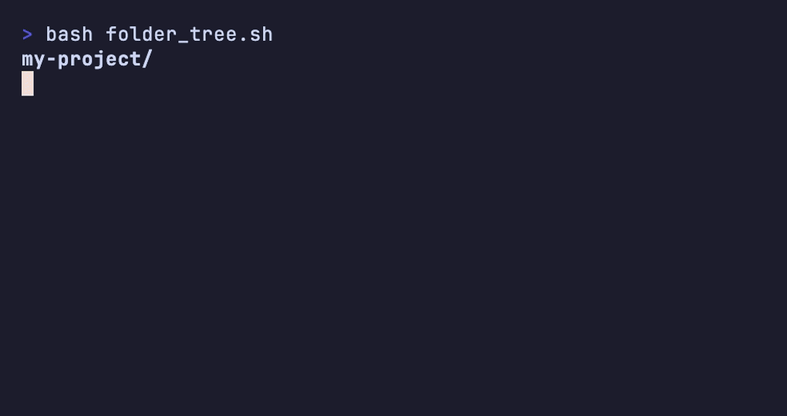
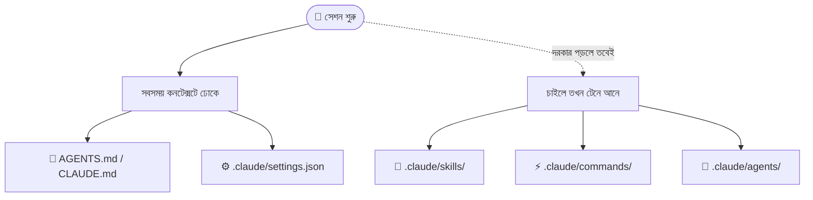

# হাতে-কলমে ২ — AI-ফ্রেন্ডলি ফোল্ডার স্ট্রাকচার 📁

> নতুন প্রজেক্টে এজেন্ট খুললেন, কিন্তু সে যেন বারবার তোতলায় — কোন কমান্ডে টেস্ট চলে জানে না, কোডিং স্টাইল ভুলে যায়, একই কথা বারবার বলতে হয়। 😮‍💨
> সমস্যাটা এজেন্টের নয়, আপনার ফোল্ডারের। কয়েকটা ফাইল ঠিক জায়গায় রাখলেই এজেন্ট ঘরের ছেলের মতো সব চিনে নেয়। এই সেকশনে সেই AI-ফ্রেন্ডলি কাঠামোটা হাতে-কলমে।

[⬅️ মূল পাতা](../README.md) · [⬅️ আগের সেকশন](01-cli-commands.md)

> ⏰ **সর্বশেষ যাচাই: জুন ২০২৬।** CLI টুল দ্রুত বদলায় — সন্দেহ হলে অফিশিয়াল ডক দেখুন:
> [Claude Code docs](https://code.claude.com/docs) · [Codex docs](https://developers.openai.com/codex)

---

একটা গোছানো প্রজেক্ট দেখতে মোটামুটি এমন হয় — চলুন আগে পুরো ম্যাপটা একনজরে দেখে নিই, তারপর এক-একটা ঘরে ঢুকব:

```text
আমার-প্রজেক্ট/
├── AGENTS.md / CLAUDE.md      # 🧠 এজেন্টের "চিরকুট" — প্রতি সেশনের শুরুতে পড়ে
├── .claude/
│   ├── commands/              # ⚡ নিজের বানানো স্ল্যাশ কমান্ড (প্রতি ফাইল = এক কমান্ড)
│   ├── skills/                # 🎒 স্কিল — দরকার পড়লে তবেই খোলে
│   ├── agents/                # 🤖 নিজের বানানো সাবএজেন্ট
│   └── settings.json          # ⚙️ পারমিশন, hooks ইত্যাদি
├── .mcp.json                  # 🔌 MCP সার্ভারের তালিকা
└── docs/specs/                # 📝 spec ও handoff artifact রাখার জায়গা
```

**🎬 টার্মিনালে দেখুন:** কোন ফাইল প্রতি সেশনে পড়া হয়, কোনটা দরকারে — পুরো কাঠামোটা এক নজরে —
<p align="center">
  
</p>

ভয় পাবেন না — সব একসঙ্গে বানাতে হবে না। দরকারমতো এক-একটা যোগ করবেন। চলুন এক-একটা ঘরে ঢুকি।

---

### AGENTS.md / CLAUDE.md

প্রজেক্টের গোড়ায় রাখা এজেন্টের "চিরকুট" — প্রতি সেশনের একদম শুরুতে এটাই সবার আগে পড়া হয়। কী এই ফাইল, বিস্তারিত দেখুন [AGENTS.md](../dictionary/06-memory-and-steering.md#agentsmd); কাজের দিক থেকে এটা অনেকটা প্রজেক্টের নিজস্ব [সিস্টেম প্রম্পট](../dictionary/02-sessions-context-turns.md#সিস্টেম-প্রম্পট-system-prompt)-এর মতো।

বাড়ির দরজায় টাঙানো নোটিশের মতো 🚪 — "জুতা বাইরে খুলুন, বেল একবার বাজান"। নতুন কেউ ঢুকেই নিয়মগুলো জেনে যায়, কাউকে মুখে বলতে হয় না। এজেন্টও তেমনি ঢুকেই জেনে নেয় — প্রজেক্ট কী, কীভাবে চালায়, কোন স্টাইল মানে। নিজে হাতে না লিখে `/init` দিয়েও বানিয়ে নিতে পারেন — দেখুন [হাতে-কলমে ১](01-cli-commands.md)।

<details>
<summary>💬 কথোপকথনে</summary>

🙋 "প্রতিবার নতুন সেশনে এজেন্টকে বলতে হয় আমরা npm নয়, pnpm ব্যবহার করি।"

🧑‍🏫 "একবার AGENTS.md-তে লিখে রাখুন — `প্যাকেজ ম্যানেজার: pnpm`। প্রতি সেশনের শুরুতে এজেন্ট নিজেই পড়ে নেবে, আর মুখে বলতে হবে না।"

</details>

---

### `.claude/commands/`

আপনার নিজের বানানো [স্ল্যাশ কমান্ড](01-cli-commands.md) যেখানে থাকে — এই ফোল্ডারে এক markdown ফাইল মানে ঠিক এক কাস্টম কমান্ড। ফাইলের নামই কমান্ডের নাম।

রান্নাঘরে নিজের হাতে লেখা রেসিপি কার্ডের বাক্সের মতো 🍱 — "চা বানানোর কার্ড", "ডাল বানানোর কার্ড"। যেটা দরকার সেটা টেনে নিলেই বাঁধা ধাপগুলো চোখের সামনে। `review.md` নামে একটা ফাইল রাখলে `/review` কমান্ডটা তৈরি। (হাতে-কলমে ৪-এ আমরা নিজের হাতে একটা `/handoff` কমান্ড বানানো দেখব — দেখুন [হাতে-কলমে ৪](04-popular-skills.md)।)

<details>
<summary>💬 কথোপকথনে</summary>

🙋 "একই PR-চেকলিস্ট প্রম্পট প্রতিবার কপি-পেস্ট করতে করতে ক্লান্ত।"

🧑‍🏫 "`.claude/commands/pr-check.md`-তে একবার লিখে রাখুন। তারপর শুধু `/pr-check` টাইপ করলেই পুরো প্রম্পটটা চলে যাবে।"

</details>

---

### `.claude/skills/`

আপনার [স্কিল (Skill)](../dictionary/06-memory-and-steering.md#স্কিল-skill)-গুলো এখানে থাকে — আর মূল কথাটা হলো, এগুলো *সবসময়* পড়া হয় না, **দরকার পড়লে তবেই খোলে**। এটাই [প্রগ্রেসিভ ডিসক্লোজার (Progressive disclosure)](../dictionary/06-memory-and-steering.md#প্রগ্রেসিভ-ডিসক্লোজার-progressive-disclosure)-এর হাতে-কলমে রূপ।

লাইব্রেরির তাকে সাজানো রেফারেন্স বইয়ের মতো 📚 — সব বই একসঙ্গে টেবিলে নিয়ে বসেন না, যেটা দরকার সেটাই তাক থেকে টেনে আনেন। ভারী জিনিস (লম্বা স্টাইল গাইড, বিশেষ কাজের নিয়ম) AGENTS.md-তে গাদা না করে স্কিলে রাখুন — এজেন্ট ঠিক সময়ে নিজেই টেনে নেবে।

<details>
<summary>💬 কথোপকথনে</summary>

🙋 "পুরো ৩০০ লাইনের ডিজাইন-সিস্টেম গাইড AGENTS.md-তে রেখেছিলাম, এখন এজেন্ট স্লো।"

🧑‍🏫 "ওটাকে `.claude/skills/`-এ একটা স্কিল বানিয়ে দিন। UI কাজ এলে এজেন্ট তবেই গাইডটা খুলবে — বাকি সময় কনটেক্সট হালকা থাকবে।"

</details>

---

### `.claude/agents/`

আপনার নিজের বানানো [সাবএজেন্ট (Subagent)](../dictionary/06-memory-and-steering.md#সাবএজেন্ট-subagent)-গুলোর সংজ্ঞা এখানে রাখা থাকে — প্রতিটার নিজের কাজ, নিজের স্কোপ।

অফিসে আলাদা আলাদা ডেস্কে আলাদা বিশেষজ্ঞ বসিয়ে রাখার মতো 👥 — একজন শুধু রিভিউয়ার, একজন শুধু টেস্ট-লেখক। এই ফোল্ডারে সেই "টিম"-এর প্রত্যেকের পরিচয়পত্র গোছানো থাকে, দরকারমতো ডেকে নেওয়া যায়।

<details>
<summary>💬 কথোপকথনে</summary>

🙋 "চাই একটা ডেডিকেটেড সিকিউরিটি-রিভিউয়ার, যে শুধু auth কোড দেখবে।"

🧑‍🏫 "`.claude/agents/`-এ একটা সাবএজেন্ট বানিয়ে রাখুন — নিজের সিস্টেম প্রম্পট দিয়ে সিকিউরিটিতে স্কোপ করা। পরে শুধু ডাকলেই হবে।"

</details>

---

### `.claude/settings.json`

প্রজেক্টের কারিগরি সেটিংস — কোন কাজে এজেন্টের কতটা অনুমতি ([পারমিশন মোড (Permission mode)](../dictionary/03-tools-and-environment.md#পারমিশন-মোড-permission-mode)), কোন মুহূর্তে কী hook চলবে, এসব এখানে লেখা থাকে।

বাড়ির মেইন সুইচবোর্ডের মতো ⚙️ — কোন ঘরে আলো জ্বলবে, কোনটা বন্ধ থাকবে, সব এক জায়গায় ঠিক করা। এটা প্রতি সেশনেই পড়া হয়, তাই এখানে নিয়ম বদলালে এজেন্টের আচরণও সঙ্গে সঙ্গে বদলায়।

<details>
<summary>💬 কথোপকথনে</summary>

🙋 "চাই এজেন্ট `git push` করার আগে যেন প্রতিবার আমাকে জিজ্ঞেস করে।"

🧑‍🏫 "`.claude/settings.json`-এ পারমিশন রুলে `git push`-কে confirm-এ রাখুন। এজেন্ট তখন push-এর আগে থেমে অনুমতি চাইবে।"

</details>

---

### `.mcp.json`

আপনার প্রজেক্ট কোন কোন [MCP](../dictionary/03-tools-and-environment.md#mcp) সার্ভারের সঙ্গে কথা বলবে, তার তালিকা এই ফাইলে — যেমন ডাটাবেস, ডকুমেন্টেশন বা ব্রাউজারের সার্ভার।

ফোনে কন্ট্যাক্ট লিস্ট সেভ করে রাখার মতো 📇 — কাকে দরকার পড়লে কোথায় ফোন করবেন, নম্বরটা আগেই তুলে রাখা। এজেন্ট দরকারমতো এই তালিকা দেখে ঠিক সার্ভারে "ফোন" করে।

<details>
<summary>💬 কথোপকথনে</summary>

🙋 "এজেন্টকে দিয়ে সরাসরি আমাদের স্টেজিং ডাটাবেসে কুয়েরি চালাতে চাই।"

🧑‍🏫 "ডাটাবেসের MCP সার্ভারটা `.mcp.json`-এ যোগ করুন। তালিকায় ঢুকলে এজেন্ট সেটাকে একটা টুলের মতোই ব্যবহার করতে পারবে।"

</details>

---

### `docs/specs/`

প্রজেক্টের [Spec](../dictionary/05-handoffs.md#স্পেক-spec) আর [Handoff artifact](../dictionary/05-handoffs.md#হ্যান্ডঅফ-আর্টিফ্যাক্ট-handoff-artifact) — মানে "কী বানাব আর কীভাবে" লেখা নথিগুলো রাখার ঠিকানা।

বাড়ি বানানোর নকশা একটা নির্দিষ্ট ড্রয়ারে গুছিয়ে রাখার মতো 📐 — পরে যে-ই কাজে নামুক, একই নকশা দেখে এগোয়। আজ যে spec লিখলেন, কাল নতুন সেশনে (বা অন্য কোনো এজেন্ট) সেটা খুলেই কাজে নেমে যেতে পারে।

<details>
<summary>💬 কথোপকথনে</summary>

🙋 "কালকের অর্ধেক করা ফিচারটা আজ আরেকটা ফ্রেশ সেশনে শেষ করতে চাই।"

🧑‍🏫 "কালকের spec-টা `docs/specs/`-এ ছিল তো? থাকলে নতুন সেশনে শুধু ওই ফাইলটা পড়তে বলুন — পুরো বোঝাপড়া এক ফাইলেই হাতে চলে আসবে।"

</details>

---

## ⏳ "সেশন শুরুতে পড়া" বনাম "দরকারে পড়া"

এই সাত-আটটা ফাইলের সবচেয়ে জরুরি ভাগটা হলো — **কোনটা প্রতিবার পড়া হয়, আর কোনটা শুধু দরকার পড়লে**। এটা বুঝলে ফোল্ডার-স্ট্রাকচারের আসল খেলাটা ধরে ফেলবেন।



ব্যাপারটা স্কুলব্যাগ গোছানোর মতো 🎒 — **রুটিন**টা রোজ একবার দেখে নেন (সবসময়-পড়া ফাইল), কিন্তু **সব বই** তো রোজ ব্যাগে নেন না, যেদিন যে ক্লাস সেদিন সেই বই (দরকারে-পড়া ফাইল)। AGENTS.md আর settings.json রুটিনের মতো — প্রতিদিন চোখ বোলান। স্কিল, কমান্ড, সাবএজেন্ট হলো বই — দরকার পড়লে তবেই তাক থেকে নামে।

এখান থেকেই সবচেয়ে দরকারি নিয়মটা আসে: **সবসময়-পড়া ফাইল ছোট রাখুন।** AGENTS.md-তে যত বেশি গাদা করবেন, প্রতি সেশনে তত বেশি [অ্যাটেনশন বাজেট (Attention budget)](../dictionary/04-failure-modes.md#অ্যাটেনশন-বাজেট-attention-budget) খরচ হবে — মূল কাজের জন্য মন কম পড়ে থাকবে। ভারী জিনিস স্কিলে সরিয়ে দিন।

🐠 গোল্ডি এখানে মাথা নাড়ছে — "আমার তো মাথায় এক চিমটি জায়গা, রুটিনটুকুই ধরে। তাই আমার ব্যাগেও শুধু আজকের বই রাখি, পুরো লাইব্রেরি বয়ে বেড়ালে আজকের অঙ্কটাই ভুলে যাব!"

---

## 🧰 কপি-পেস্ট স্টার্টার

নতুন প্রজেক্টে নামছেন? নিচের ছোট্ট AGENTS.md কঙ্কালটা কপি করে, ফাঁকা জায়গাগুলো নিজের প্রজেক্ট দিয়ে ভরে নিন। ছোট রাখুন — শুধু রোজ-দরকারি কথাগুলো:

```markdown
# আমার-প্রজেক্ট

ছোট্ট একটা টু-ডু ওয়েব অ্যাপ। ফ্রন্টএন্ড React, ব্যাকএন্ড Node.

## কীভাবে চালায়
pnpm install   # ডিপেনডেন্সি বসানো
pnpm dev       # লোকাল সার্ভার চালু

## কীভাবে টেস্ট করে
pnpm test      # পুরো টেস্ট স্যুট — কোড বদলালে এটা পাস করানো বাধ্যতামূলক

## নিয়ম-কানুন (convention)
- ইন্ডেন্ট: ২ স্পেস (tab নয়)
- প্যাকেজ ম্যানেজার: শুধু pnpm, npm/yarn নয়
- বড় স্টাইল গাইড এখানে নয় — সেটা .claude/skills/-এ আছে
```

> 📁 আসল কপি-করার-মতো ফাইলটা এখানে: [templates/AGENTS.md](../templates/AGENTS.md) — আর এই সেকশনের *পুরো* কাঠামোটার (commands, skills, agents, rules, hooks, settings.json) এক-একটা উদাহরণসহ স্টার্টার কিট: [templates/](../templates/README.md)

খেয়াল করুন — শেষ লাইনটা ইচ্ছে করে স্কিলের দিকে ইশারা করছে। সবসময়-পড়া ফাইলটা ছিমছাম রাখা, ভারী জিনিস দরকারে-পড়া জায়গায় — এই অভ্যাসটাই AI-ফ্রেন্ডলি প্রজেক্টের আসল চাবি।

---

## 🎯 সেকশন রিভিউ — সব মনে আছে তো?

<details>
<summary>প্রশ্ন ১: কোন কোন ফাইল প্রতি সেশনের শুরুতে পড়া হয়?</summary>

**AGENTS.md / CLAUDE.md** আর **.claude/settings.json** — এ দুটো সবসময় কনটেক্সটে ঢোকে। স্কিল, কমান্ড, সাবএজেন্ট কিন্তু দরকার পড়লে তবেই টেনে আনা হয়।

</details>

<details>
<summary>প্রশ্ন ২: স্কিল আলাদা ফোল্ডারে কেন — সব AGENTS.md-তে রাখলেই তো হতো?</summary>

কারণ স্কিল **দরকার পড়লে তবেই খোলে** — এটাই প্রগ্রেসিভ ডিসক্লোজার। সব AGENTS.md-তে গাদা করলে প্রতি সেশনে সবটা পড়া হতো, অযথা টোকেন আর অ্যাটেনশন খরচ হতো। আলাদা রাখায় ঠিক সময়ে ঠিক জিনিসটাই খোলে।

</details>

<details>
<summary>প্রশ্ন ৩: AGENTS.md খুব বড় হয়ে গেলে কী সমস্যা?</summary>

এটা প্রতি সেশনে পুরো পড়া হয়, তাই বড় হলে প্রতিবার বেশি **অ্যাটেনশন বাজেট** খরচ হয় — মূল কাজের জন্য এজেন্টের মন কম পড়ে থাকে, ভুল বাড়ে। তাই ভারী জিনিস স্কিলে সরিয়ে AGENTS.md ছোট রাখুন।

</details>

<details>
<summary>প্রশ্ন ৪: নিজের একটা স্ল্যাশ কমান্ড বানাতে চাইলে ফাইলটা কোথায় রাখবেন?</summary>

`.claude/commands/`-এ একটা markdown ফাইল রাখুন — এক ফাইল = এক কমান্ড, আর ফাইলের নামই কমান্ডের নাম (যেমন `review.md` → `/review`)।

</details>

## 🧩 মিনি-চ্যালেঞ্জ

<details>
<summary>🕵️ নতুন প্রজেক্টে এজেন্ট বারবার ভুল test-কমান্ড চালাচ্ছে (`npm test` দিচ্ছে, অথচ আপনারটা `pnpm test`)। কোন ফাইলে কী লিখবেন?</summary>

সঠিক টেস্ট কমান্ডটা **AGENTS.md**-তে লিখে রাখুন — যেমন একটা "## কীভাবে টেস্ট করে" সেকশনে `pnpm test`। এটা প্রতি সেশনে পড়া হয়, তাই এজেন্ট আর গুলিয়ে ফেলবে না।

চটজলদি একই কাজ চাইলে সেশনের মধ্যেই `#` মেমরি শর্টকাট ব্যবহার করুন — `# টেস্ট চালাও pnpm test দিয়ে, npm নয়` — এতে কথাটা সরাসরি মেমরি ফাইলে গেঁথে যায় ([হাতে-কলমে ১](01-cli-commands.md)-এর `#` মনে আছে তো?)।

মূল কথা: যেটা "প্রতিবার মনে রাখা চাই", সেটা সবসময়-পড়া ফাইলে রাখুন — মুখে বারবার বলায় নয়।

</details>

## ✅ শেখার চেকলিস্ট

> 💡 *Fork করে টিক দিন!*

- [ ] AGENTS.md / CLAUDE.md = এজেন্টের চিরকুট (প্রতি সেশনে পড়া হয়)
- [ ] `.claude/commands/` = নিজের স্ল্যাশ কমান্ড (এক ফাইল = এক কমান্ড)
- [ ] `.claude/skills/` = স্কিল, দরকারে তবেই খোলে (progressive disclosure)
- [ ] `.claude/agents/` = নিজের সাবএজেন্টের সংজ্ঞা
- [ ] `.claude/settings.json` = পারমিশন ও hooks (প্রতি সেশনে পড়া হয়)
- [ ] `.mcp.json` = MCP সার্ভারের তালিকা (দরকারে ডাকা হয়)
- [ ] `docs/specs/` = spec ও handoff artifact রাখার জায়গা
- [ ] সবসময়-পড়া (AGENTS.md, settings) ছোট রাখুন; ভারী জিনিস দরকারে-পড়া (skills) জায়গায়
- [ ] বড় AGENTS.md = বেশি অ্যাটেনশন বাজেট খরচ = বেশি ভুল

---

👉 **পরের সেকশন:** [হাতে-কলমে ৩ — প্রম্পটিং প্যাটার্ন](03-prompting-patterns.md)

[⬅️ মূল পাতায় ফিরুন](../README.md)
