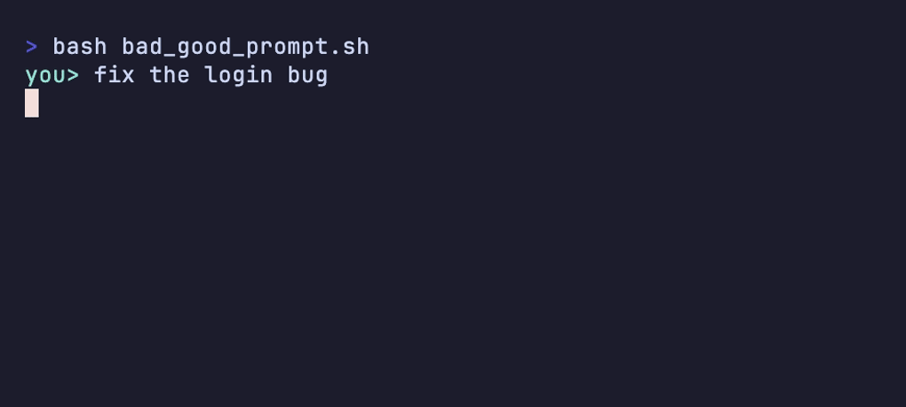

# হাতে-কলমে ৩ — প্রম্পটিং প্যাটার্ন ✍️

> এজেন্ট কাজ করছে, কিন্তু বারবার ভুল করছে — আপনার মনে হচ্ছে "এটা তো বোকা!"। 🤔
> অনেক সময় দোষটা এজেন্টের নয়, প্রম্পটের। কী চাইছেন আর কীভাবে চাইছেন — সামান্য কয়েকটা অভ্যাস বদলালেই এজেন্ট হঠাৎ অনেক চালাক হয়ে ওঠে। এই সেকশনে সেই প্রম্পট লেখার প্যাটার্নগুলো হাতে-কলমে।

[⬅️ মূল পাতা](../README.md) · [⬅️ আগের সেকশন](02-folder-structure.md)

---

### ফাইলের ঠিকানা দিন (Give the file path)

মূল কথা: কোন ফাইলের কোন জায়গায় সমস্যা, সেটা প্রম্পটেই বলে দিন। এজেন্টকে খুঁজতে না দিয়ে সোজা ঠিকানায় পাঠান।

```markdown
❌ **খারাপ:** লগইনের বাগটা ঠিক করো

✅ **ভালো:** `src/auth/login.js`-এর `validateUser()`-এ খালি পাসওয়ার্ড দিলেও true ফেরে — ঠিক করো
```

ঠিকানা ছাড়া চিঠির মতো ✉️ — "ঢাকার কাউকে দিয়ে দিন" বললে চিঠি কোনোদিন পৌঁছাবে না। ফাইল-পথ দিলে এজেন্ট ওই ফাইলটা সত্যিই পড়ে নেয়, ফলে তৈরি হয় [কনটেক্সচুয়াল নলেজ (Contextual knowledge)](../dictionary/04-failure-modes.md#কনটেক্সচুয়াল-নলেজ-contextual-knowledge) — মানে আন্দাজ নয়, চোখে-দেখা তথ্য। আর ঠিকানা না দিলে এজেন্ট প্রজেক্টের গঠন আন্দাজ করতে গিয়ে [হ্যালুসিনেশন (Hallucination)](../dictionary/04-failure-modes.md#হ্যালুসিনেশন-hallucination)-এ পড়ে — নেই এমন ফাইল বা ফাংশনের নাম বানিয়ে ফেলে।

<details>
<summary>💬 কথোপকথনে</summary>

🙋 "এজেন্টকে লগইন ঠিক করতে বললাম, ও তো `auth.py` বলে একটা ফাইল খুঁজছে — আমাদের তো সেটা নেই-ই!"

🧑‍🏫 "ঠিকানা দেননি বলেই আন্দাজ করছে। প্রম্পটে আসল পথটা দিন — `src/auth/login.js`-এর `validateUser()`। তাহলে ও ফাইলটা পড়েই কাজ শুরু করবে, বানিয়ে নয়।"

</details>

**🎬 টার্মিনালে দেখুন:** ঠিকানা ছাড়া প্রম্পটে এজেন্ট ২১৪টা ফাইল হাতড়ে ভুল ফাইল ছুঁয়ে ফেলে; ফাইল-পথ দিলে এক ফাইলে এক ঠিক ফিক্স —
<p align="center">
  
</p>

---

### Error পুরোটা পেস্ট করুন (Paste the whole error)

মূল কথা: কিছু ভাঙলে আপনার ভাষায় বর্ণনা না করে আসল error বা stack trace হুবহু পেস্ট করুন। মেশিনের লেখা মেশিনই ভালো পড়ে।

```markdown
❌ **খারাপ:** একটা error আসছে, কিছু কাজ করছে না

✅ **ভালো:** এই error-টা আসছে, ঠিক করো:

    TypeError: Cannot read properties of undefined (reading 'name')
        at renderUser (src/components/UserCard.jsx:14:21)
        at renderList (src/components/UserList.jsx:30:9)
```

ডাক্তারের কাছে রিপোর্ট নিয়ে যাওয়ার মতো 🩺 — মুখে "শরীরটা কেমন কেমন লাগছে" বললে ডাক্তার আন্দাজে ওষুধ দেন; কিন্তু রক্তের রিপোর্টটা হাতে দিলে তিনি ঠিক জায়গাটা ধরে ফেলেন। Stack trace-ও তেমন একটা রিপোর্ট — ভেতরে ফাইলের নাম, লাইন নম্বর, কোন ফাংশন থেকে কোনটা ডাকা হয়েছে, সব লেখা আছে। আপনার সারাংশে ওই খুঁটিনাটিগুলো হারিয়ে যায়।

<details>
<summary>💬 কথোপকথনে</summary>

🙋 "বললাম 'পেজটা লোড হচ্ছে না, একটা error আসছে' — এজেন্ট তবু ধরতে পারছে না।"

🧑‍🏫 "ওকে আসল error-টা পুরোটা পেস্ট করে দিন — stack trace সমেত। কোন ফাইলের কত নম্বর লাইনে ভাঙছে, ওটাই তো ওর দরকার। মুখের বর্ণনায় সেই তথ্য নেই।"

</details>

---

### এক টার্নে এক কাজ (One job per turn)

মূল কথা: একসঙ্গে গাদা কাজ চাপিয়ে দেবেন না। কাজটা ভেঙে, এক [টার্নে](../dictionary/02-sessions-context-turns.md#টার্ন-turn) একটা করে দিন।

```markdown
❌ **খারাপ:** বাগ ঠিক করো, refactor-ও করো, টেস্টও লেখো, README-ও আপডেট করো

✅ **ভালো:** আগে শুধু বাগটা ঠিক করো — `src/auth/login.js`-এর খালি-পাসওয়ার্ড সমস্যাটা।
        (এটা হয়ে গেলে পরের টার্নে টেস্ট লেখাব, তারপর refactor।)
```

এক হাতে চারটা বাজারের ব্যাগ ধরার মতো 🛍️ — সবগুলোই ধরতে গিয়ে শেষমেশ একটাও ঠিকমতো ধরা হয় না, কিছু না কিছু পড়ে যায়। এজেন্টেরও [অ্যাটেনশন বাজেট (Attention budget)](../dictionary/04-failure-modes.md#অ্যাটেনশন-বাজেট-attention-budget) সীমিত — একসঙ্গে চারটা কাজ দিলে প্রতিটাতেই মন কম পড়ে, কোনোটাই ভালো হয় না। একটা একটা করে দিন; প্রতিটা শেষ হলে আপনি যাচাই করে নিতে পারবেন, এজেন্টও পরেরটায় পুরো মন দিতে পারবে।

<details>
<summary>💬 কথোপকথনে</summary>

🙋 "এক প্রম্পটে চারটা কাজ দিয়েছিলাম — বাগ ফিক্স, রিফ্যাক্টর, টেস্ট, ডক। সব আধাখেঁচড়া হয়ে এলো!"

🧑‍🏫 "স্বাভাবিক — একসঙ্গে চারটা ব্যাগ ধরলে এমনই হয়। ভেঙে দিন: এই টার্নে শুধু বাগ। সবুজ হলে পরের টার্নে টেস্ট। তারপর রিফ্যাক্টর। এক টার্নে এক কাজ।"

</details>

---

### সফলতার মাপকাঠি আগে বলুন (State success criteria)

মূল কথা: "ভালো করে বানাও" এজেন্টের কাছে কিছুই বোঝায় না। "কাজ শেষ" বলতে আপনি ঠিক কী বোঝেন, সেটা মাপা যায় এমন ভাষায় আগেই বলে দিন।

```markdown
❌ **খারাপ:** redirect-টা ভালো করে বানাও

✅ **ভালো:** `npm test` সবুজ হলে আর পুরনো URL নতুন পেজে redirect করলে — কাজ শেষ
```

দর্জিকে মাপ দেওয়ার মতো 📏 — শুধু "সুন্দর একটা জামা বানান" বললে যা-খুশি একটা বানিয়ে দেবেন; কিন্তু বুক-কোমর-হাতার মাপ দিলে জামাটা গায়ে লাগবেই। সফলতার মাপকাঠি দিলে এজেন্ট নিজেই বুঝে নেয় কখন থামতে হবে — আর সেই মাপকাঠি যদি একটা [অটোমেটেড চেক (Automated check)](../dictionary/07-patterns-of-work.md#অটোমেটেড-চেক-automated-check) হয় (যেমন `npm test`), তাহলে এজেন্ট নিজেই চালিয়ে নিজেকে যাচাই করে নিতে পারে — আপনাকে জিজ্ঞেস করার আগেই।

<details>
<summary>💬 কথোপকথনে</summary>

🙋 "'ফর্মটা ভালো করে কাজ করাও' বললাম — ও বলল 'হয়ে গেছে', কিন্তু ভ্যালিডেশন তো হচ্ছে না।"

🧑‍🏫 "'ভালো' মানে ওর কাছে এক, আপনার কাছে আরেক। মাপকাঠি দিন: 'খালি ইমেইলে সাবমিট আটকাবে আর `npm test` সবুজ হবে — তবেই শেষ'। এবার ও নিজেই বুঝবে কখন কাজটা সত্যিই হলো।"

</details>

---

### আগে জেরা করান, পরে কোড (Get grilled first)

মূল কথা: বড় বা ঘোলাটে কাজে সোজা কোড লেখাতে যাবেন না। এজেন্টকে আগে প্রশ্ন করতে বলুন — "আগে আমাকে প্রশ্ন করো, তারপর প্ল্যান দাও"।

```markdown
❌ **খারাপ:** একটা পুরো নোটিফিকেশন সিস্টেম বানাও

✅ **ভালো:** একটা নোটিফিকেশন সিস্টেম বানাতে চাই। কোড লেখার আগে আমাকে
        এক-এক করে প্রশ্ন করো — ইমেইল না পুশ, কে পাবে, কখন — তারপর একটা প্ল্যান দাও।
```

বাড়ি বানানোর আগে স্থপতির হাজারটা প্রশ্নের মতো 🏗️ — "ক'টা ঘর? রান্নাঘর কোন দিকে? বাজেট কত?" — এই প্রশ্নগুলো বিরক্তিকর মনে হলেও, এগুলোই ভুল ভিত গাঁথা থেকে বাঁচায়। এই টেকনিকটার নাম [গ্রিলিং (Grilling)](../dictionary/07-patterns-of-work.md#গ্রিলিং-grilling) — উদ্দেশ্য হলো কোড লেখার আগে দুজনের মাথায় একই [ডিজাইন কনসেপ্ট (Design concept)](../dictionary/07-patterns-of-work.md#ডিজাইন-কনসেপ্ট-design-concept) দাঁড় করানো। কথায় ভুল ধরা কোডে ভুল ধরার চেয়ে ঢের সস্তা।

🐠 গোল্ডি ফিসফিস করছে — "আমি তো জিজ্ঞেস না করেই লাফ দিই, তাই বারবার দেয়ালে ধাক্কা খাই! আপনি বরং এজেন্টকে আগে জেরা করতে দিন।" পরের সেকশনে এই কাজটা সহজ করে এমন তৈরি স্কিল (brainstorming / grill-me) দেখব — [হাতে-কলমে ৪](04-popular-skills.md)।

<details>
<summary>💬 কথোপকথনে</summary>

🙋 "'একটা সাবস্ক্রিপশন বিলিং বানাও' বলতেই ও সোজা কোড লিখে ফেলল — refund, partial cancel কিছুই ভাবেনি।"

🧑‍🏫 "ওকে কোডে লাফ দিতে দেবেন না। বলুন — 'আগে আমাকে প্রশ্ন করো, তারপর প্ল্যান দাও'। refund, partial cancel, timing সব প্রশ্ন করিয়ে নিন। বোঝাপড়া মিললে তবেই কোড।"

</details>

---

## 🎯 সেকশন রিভিউ — সব মনে আছে তো?

<details>
<summary>প্রশ্ন ১: প্রম্পটে ফাইল-পথ দিলে hallucination কমে কেন?</summary>

পথ দিলে এজেন্ট ওই ফাইলটা সত্যিই পড়ে — তৈরি হয় চোখে-দেখা **কনটেক্সচুয়াল নলেজ**। পথ না দিলে ও প্রজেক্টের গঠন *আন্দাজ* করে, আর সেই আন্দাজ থেকেই নেই-এমন ফাইল/ফাংশন বানিয়ে ফেলে (hallucination)।

</details>

<details>
<summary>প্রশ্ন ২: এক টার্নে পাঁচটা কাজ চাপালে কী হয়?</summary>

এজেন্টের **অ্যাটেনশন বাজেট** ভাগ হয়ে যায় — প্রতিটা কাজে মন কম পড়ে, সব আধাখেঁচড়া হয়। (এক হাতে চারটা ব্যাগ ধরার মতো 🛍️।) ভেঙে এক টার্নে একটা করে দিন।

</details>

<details>
<summary>প্রশ্ন ৩: "ভালো করে বানাও" — সমস্যাটা কোথায়?</summary>

"ভালো" মাপা যায় না — আপনার আর এজেন্টের কাছে এর মানে আলাদা। তাই মাপা-যায় এমন **সফলতার মাপকাঠি** দিন (যেমন `npm test` সবুজ + পুরনো URL redirect করে)। পারলে মাপকাঠিটা একটা অটোমেটেড চেক রাখুন — এজেন্ট নিজেই যাচাই করে নেবে।

</details>

<details>
<summary>প্রশ্ন ৪: একটা error দেখা দিলে এজেন্টকে কী দেবেন?</summary>

আপনার ভাষায় বর্ণনা নয় — আসল **stack trace** হুবহু পেস্ট করুন। ফাইলের নাম আর লাইন নম্বর ওখানেই আছে; ডাক্তারের কাছে রিপোর্ট নিয়ে যাওয়ার মতো 🩺।

</details>

## 🧩 মিনি-চ্যালেঞ্জ

<details>
<summary>🕵️ এই খারাপ প্রম্পটটা পাঁচটা প্যাটার্ন মেনে নতুন করে লিখুন: "সাইটটা স্লো, ঠিক করে দাও, আর ডিজাইনটাও সুন্দর করো"</summary>

প্রম্পটটায় পাঁচটাই দোষ আছে: ঠিকানা নেই, কোনো মাপ নেই (কত স্লো? "সুন্দর" মানে কী?), error/ডেটা নেই, একসঙ্গে দুটো আলাদা কাজ (স্পিড + ডিজাইন), আর কাজটা বড় হলেও কোনো জেরা নেই। একটা নমুনা rewrite —

**ধাপ ১ (এক টার্নে এক কাজ + আগে জেরা):**

> হোমপেজ লোড স্লো মনে হচ্ছে। কোড লেখার আগে আমাকে কয়েকটা প্রশ্ন করো — কোন পেজ, কোথায় স্লো (নেটওয়ার্ক না রেন্ডার), কীসের ভিত্তিতে মাপছ — তারপর একটা প্ল্যান দাও। ডিজাইনের কাজ এখন না, ওটা আলাদা টার্নে।

**ধাপ ২ (ফাইল-পথ + error/ডেটা + সফলতার মাপকাঠি):**

> `src/pages/Home.jsx` লোড হতে Lighthouse-এ LCP ৪.৮ সেকেন্ড দেখাচ্ছে — নিচের ট্রেসটা দিলাম।
> মাপকাঠি: LCP ২.৫ সেকেন্ডের নিচে নামবে আর `npm test` সবুজ থাকবে — তবেই কাজ শেষ।

মূল শিক্ষা: একটা ঘোলাটে প্রম্পটকে কয়েকটা স্পষ্ট, মাপা-যায়, এক-কাজের টার্নে ভেঙে ফেলাই আসল কৌশল।

</details>

## ✅ শেখার চেকলিস্ট

> 💡 *Fork করে টিক দিন!*

- [ ] ফাইলের ঠিকানা দিন — পথ দিলে contextual knowledge, না দিলে hallucination
- [ ] Error পুরোটা পেস্ট করুন — stack trace হুবহু, মুখের বর্ণনা নয়
- [ ] এক টার্নে এক কাজ — গাদা কাজ ভেঙে দিন (attention budget)
- [ ] সফলতার মাপকাঠি আগে বলুন — "ভালো" নয়, মাপা-যায় এমন শর্ত
- [ ] আগে জেরা করান, পরে কোড — বড় কাজে grilling, তারপর প্ল্যান

---

👉 **পরের সেকশন:** [হাতে-কলমে ৪ — জনপ্রিয় স্কিল ও ওয়ার্কফ্লো](04-popular-skills.md)

[⬅️ মূল পাতায় ফিরুন](../README.md)
