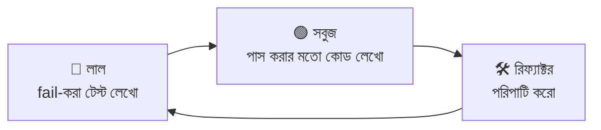
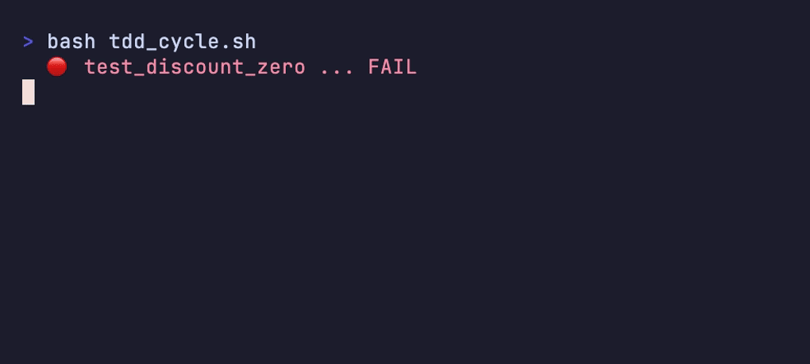
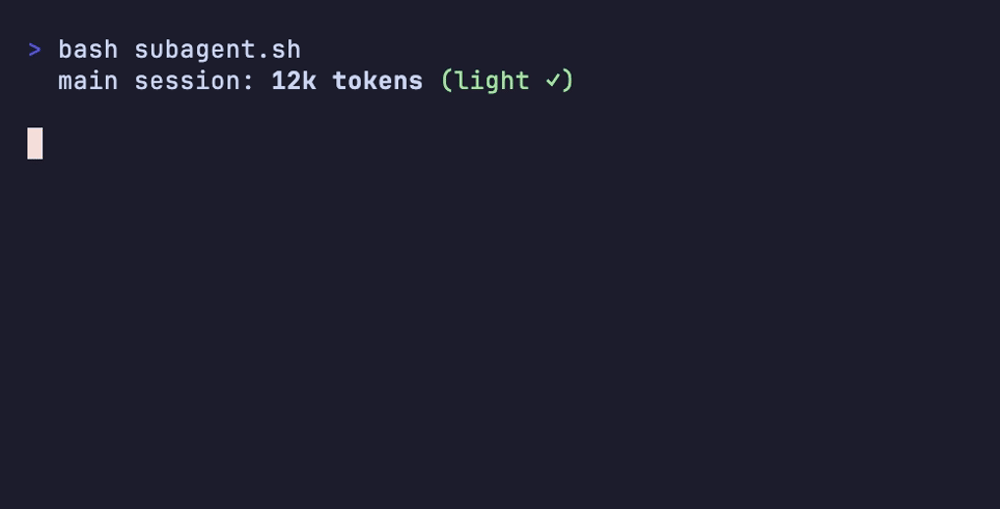
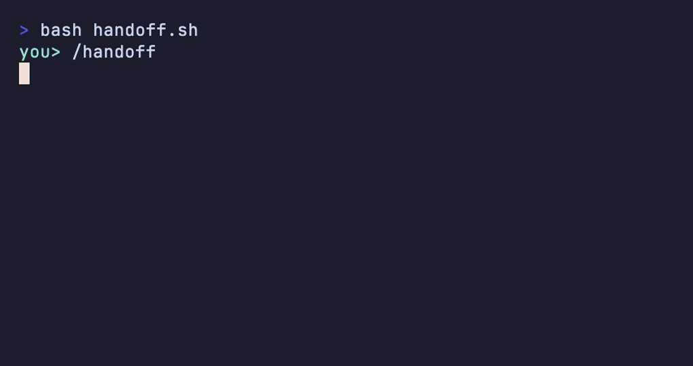
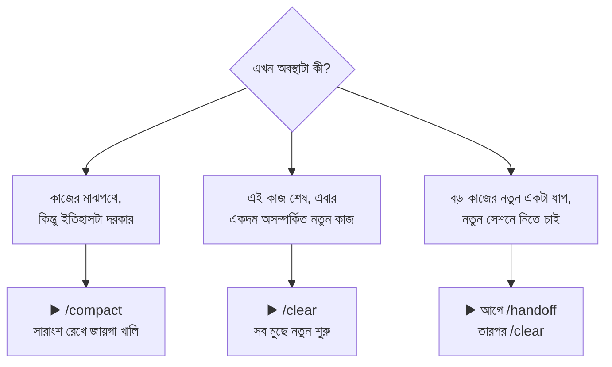

# হাতে-কলমে ৪ — জনপ্রিয় স্কিল ও ওয়ার্কফ্লো 🎒

> এজেন্টকে শুধু "কোড লেখো" বললেই কি ভালো কাজ হয়? অভিজ্ঞ লোকেরা তো তা করে না — তারা কিছু বাঁধা *ওয়ার্কফ্লো* মেনে চলে: আগে আইডিয়া ঝালাই, তারপর প্ল্যান, তারপর টেস্ট, শেষে রিভিউ। 🧭
> এই সব চালু ঘরানাগুলোই হলো "স্কিল"। এই সেকশনে community-তে সবচেয়ে চলতি স্কিল-প্যাটার্নগুলো হাতে-কলমে — কোনটা কখন ডাকবেন।

[⬅️ মূল পাতা](../README.md) · [⬅️ আগের সেকশন](03-prompting-patterns.md)

> ⏰ **সর্বশেষ যাচাই: জুন ২০২৬।** CLI টুল দ্রুত বদলায় — সন্দেহ হলে অফিশিয়াল ডক দেখুন:
> [Claude Code docs](https://code.claude.com/docs) · [Codex docs](https://developers.openai.com/codex)

---

[স্কিল](../dictionary/06-memory-and-steering.md#স্কিল-skill) শব্দটা পার্ট ১-এ শিখেছেন — গুছিয়ে রাখা একটা নির্দেশনা-বান্ডিল, এজেন্ট দরকারমতো যেটা টেনে নেয়। এবার দেখব community-তে সবচেয়ে চালু স্কিল-ঘরানাগুলো: কোনটা কী করে, কখন ডাকবেন।

একটা কথা আগেই পরিষ্কার করে নিই — এগুলো মূলত open-source "superpowers" ঘরানার ও community-তে শেয়ার করা প্যাটার্ন, কোনো টুলের built-in ফিচার নয়। নাম এক জায়গায় এক রকম, আরেক জায়গায় আরেক রকম হতে পারে — **নামটা মুখস্থ করার দরকার নেই, ধরনটা বুঝে নিন।** কাজের ধাপগুলো চিনলে যে নামেই আসুক, চিনে ফেলবেন।

---

### 🧠 ব্রেনস্টর্মিং (brainstorming)

কোডের এক লাইনও লেখার আগে এজেন্ট আপনাকে এক-এক করে প্রশ্ন ছুড়ে আপনার আবছা আইডিয়াটাকে একটা পরিষ্কার [ডিজাইন কনসেপ্ট (Design concept)](../dictionary/07-patterns-of-work.md#ডিজাইন-কনসেপ্ট-design-concept)-এ নামিয়ে আনে। মাথার ভেতরের ঝাপসা ছবিটা দুজনের মধ্যে মিলে যাওয়াই এর লক্ষ্য।

**কখন ডাকবেন:** যখন মাথায় আছে "একটা নোটিফিকেশন সিস্টেম চাই" — কিন্তু কী, কখন, কাকে, তা এখনো ঠিক করেননি। 💭 আর্কিটেক্টের সঙ্গে বসে বাড়ির নকশা ঠিক করার মতো — "ক'টা ঘর? রান্নাঘর কোন দিকে? রোদ চাই কোথায়?" — এসব ঠিক না করে ইট গাঁথা শুরু করলে পরে ভাঙতে হয়।

<details>
<summary>💬 কথোপকথনে</summary>

🙋 "একটা রিমাইন্ডার ফিচার বানাতে চাই, কিন্তু ঠিক গুছিয়ে উঠতে পারছি না।"

🧑‍🏫 "তাহলে আগে brainstorm করান — এজেন্টকে বলুন প্রশ্ন করে করে স্কোপটা বের করতে। recurring না one-time? notification কীসে যাবে? সব মিলে গেলে তবেই ডিজাইন দাঁড় করান।"

</details>

---

### 🔥 গ্রিল-মি (grill-me)

আপনার ইতিমধ্যে তৈরি করা একটা প্ল্যানকে এজেন্ট উল্টেপাল্টে জেরা করে — ফাঁক, ফাঁকি আর না-ভাবা কেসগুলো বের করে আনে। এটাই পার্ট ১-এর [গ্রিলিং (Grilling)](../dictionary/07-patterns-of-work.md#গ্রিলিং-grilling) টেকনিকের সরাসরি প্রয়োগ।

**কখন ডাকবেন:** প্ল্যান লেখা শেষ, মনে হচ্ছে "এ তো নিখুঁত" — তখনই। 🥊 ব্রেনস্টর্মিংয়ের সঙ্গে গুলিয়ে ফেলবেন না: **ওখানে শূন্য থেকে আইডিয়া গড়া হয়, এখানে তৈরি প্ল্যানকে পরীক্ষা করা হয়।** পরীক্ষার আগে বন্ধুকে দিয়ে নিজের উত্তরপত্র যাচাই করানোর মতো — "এই অঙ্কটা তো ভুল করেছিস!"

<details>
<summary>💬 কথোপকথনে</summary>

🙋 "প্ল্যানটা দাঁড় করিয়েছি, মনে হচ্ছে সব ঠিকই আছে।"

🧑‍🏫 "ঠিক আছে কিনা সেটা grill করে দেখুন — এজেন্টকে বলুন এই প্ল্যানের দুর্বল জায়গা খুঁজতে। concurrent ইউজার? error হলে কী? — এই প্রশ্নগুলোতেই আসল ফাঁক বেরোয়।"

</details>

---

### 🧪 টেস্ট-ড্রিভেন ডেভেলপমেন্ট (test-driven development)

উল্টো পথে কাজ: আগে fail-করা একটা টেস্ট লেখা হয়, তারপর সেই টেস্ট পাস করানোর মতো করে কোড লেখা হয়। টেস্টটাই আগে থেকে বলে দেয় "সফল" মানে কী — মানে এটা একটা [অটোমেটেড চেক (Automated check)](../dictionary/07-patterns-of-work.md#অটোমেটেড-চেক-automated-check) আগেভাগে বসিয়ে নেওয়া।

**কখন ডাকবেন:** লজিক জটিল, বা পরে ভাঙার ভয় আছে — এমন কাজে। চক্রটা সহজ: লাল (fail) → সবুজ (pass) → পরিপাটি (refactor):



পরীক্ষার প্রশ্নটা আগে হাতে পেয়ে তারপর পড়তে বসার মতো 🎯 — কী জিজ্ঞেস করবে জানলে পড়াটাও ঠিক জায়গায় হয়।

<details>
<summary>💬 কথোপকথনে</summary>

🙋 "ডিসকাউন্ট হিসাবের লজিকটা এজেন্ট বারবার ভুল করছে।"

🧑‍🏫 "TDD-তে যান — আগে কয়েকটা fail-করা টেস্ট লেখান (১০%, ১০০%, ০ টাকা)। তারপর কোড লেখান যতক্ষণ না সব সবুজ হয়। টেস্টই তখন রেলিং হয়ে দাঁড়াবে।"

</details>

**🎬 টার্মিনালে দেখুন:** আগে লাল (fail) টেস্ট, তারপর ন্যূনতম কোডে সবুজ (pass), তারপর সবুজ রেখেই রিফ্যাক্টর — চক্রটা ঘুরতেই থাকে —
<p align="center">
  
</p>

---

### 🐛 সিস্টেম্যাটিক ডিবাগিং (systematic-debugging)

বাগ দেখলেই আন্দাজে এদিক-ওদিক বদলানো নয় — একটা শৃঙ্খলা মেনে চলা: **reproduce** (বাগটা আগে নিজে ঘটাও) → **hypothesis** (কারণ কী হতে পারে আন্দাজ করো) → **instrument** (লগ/প্রিন্ট বসিয়ে প্রমাণ খোঁজো) → **fix** (তবেই ঠিক করো)।

**কখন ডাকবেন:** "এই লাইনটা বদলে দেখি" — এই অভ্যাসটা যখন কাজ করছে না। 🔬 আন্দাজে fix-এর বিপদ পার্ট ১-এ পড়েছেন: এজেন্ট [হ্যালুসিনেশন (Hallucination)](../dictionary/04-failure-modes.md#হ্যালুসিনেশন-hallucination)-এর ঝোঁকে আত্মবিশ্বাসী গলায় ভুল কারণ বানিয়ে দিতে পারে। ডাক্তার রোগ না বুঝেই ওষুধ দিলে যা হয় — উপসর্গ বদলায়, রোগ থাকে।

<details>
<summary>💬 কথোপকথনে</summary>

🙋 "এজেন্ট তিনবার তিন রকম 'কারণ' বলে তিনটা ফাইল বদলাল — বাগ তবু রয়ে গেছে।"

🧑‍🏫 "ও আন্দাজে fix করছে। systematic-debugging-এ যান — আগে বাগটা reproduce করান, তারপর লগ বসিয়ে আসল কারণ প্রমাণ করান। প্রমাণের আগে যেন এক লাইনও না বদলায়।"

</details>

---

### 📝 প্ল্যান লেখা ও চালানো (writing-plans / executing-plans)

দুটো জোড়া-স্কিল। প্রথমটায় এজেন্ট একটা [স্পেক (Spec)](../dictionary/05-handoffs.md#স্পেক-spec) থেকে ছোট ছোট, ক্রমিক ধাপের একটা প্ল্যান লেখে — অনেকটা [টিকিট (Ticket)](../dictionary/05-handoffs.md#টিকিট-ticket)-এর তালিকার মতো। দ্বিতীয়টায় সেই প্ল্যানটা ধাপে ধাপে execute করে, প্রতি ধাপ শেষে একটা checkpoint-এ থেমে আপনাকে দেখায়।

**কখন ডাকবেন:** বড় কাজ, যেটা একটা [টার্ন](../dictionary/02-sessions-context-turns.md#টার্ন-turn)-এ শেষ হবে না। 🗺️ লম্বা সফরের আগে রাস্তার ধাপগুলো (কোথায় থামব, কোথায় তেল নেব) লিখে নিয়ে তারপর বেরোনোর মতো — হারিয়ে যাওয়ার ভয় কমে, আর প্রতি স্টপে দেখে নেওয়া যায় ঠিক পথে আছি কিনা।

<details>
<summary>💬 কথোপকথনে</summary>

🙋 "এত বড় ফিচার এক চ্যাটে করতে গিয়ে এজেন্ট মাঝপথে সব গুলিয়ে ফেলছে।"

🧑‍🏫 "আগে একটা প্ল্যান লেখান — spec থেকে ৬-৭টা ছোট ধাপ। তারপর executing-plans দিয়ে এক-এক ধাপ চালান, প্রতিবার থামিয়ে দেখে নিন। গোটাটা একসঙ্গে গিলতে দেবেন না।"

</details>

---

### 🔍 কোড রিভিউ (code-review / pre-PR)

কোড merge করার ঠিক আগে আরেকটা এজেন্ট পুরো ডিফটা পড়ে মতামত দেয় — বাগ, সিকিউরিটি ফাঁক, কন্ট্রাক্ট-ভাঙা খুঁজে বের করে। এটাই পার্ট ১-এর [অটোমেটেড রিভিউ (Automated review)](../dictionary/07-patterns-of-work.md#অটোমেটেড-রিভিউ-automated-review)-এর প্যাকেজ-করা রূপ।

**কখন ডাকবেন:** যে কোনো PR পাঠানোর আগে — বিশেষ করে AFK রানের আউটপুটে। 👓 তবে মনে রাখবেন, এটা [হিউম্যান রিভিউ (Human review)](../dictionary/07-patterns-of-work.md#হিউম্যান-রিভিউ-human-review)-এর **বিকল্প নয়, সংযোজন** — দুটো চোখ ভালো, একটা মেশিনের, একটা আপনার। বানান-চেকার আর প্রুফরিডার দুজনই দরকার; একজন আছে বলে অন্যজনকে বাদ দেওয়া যায় না।

<details>
<summary>💬 কথোপকথনে</summary>

🙋 "এজেন্ট কোড রিভিউ করে 'সব ঠিক' বলেছে — তাহলে আর নিজে দেখার দরকার নেই, তাই না?"

🧑‍🏫 "না, ওটা সংযোজন, বিকল্প নয়। এজেন্ট-রিভিউ অনেক কিছু ধরে ফেলে ঠিকই, কিন্তু auth বা পেমেন্টের মতো জায়গায় ডিফটা নিজেও একবার পড়ুন।"

</details>

---

### 🤖 সাবএজেন্ট-ড্রিভেন ডেভেলপমেন্ট (subagent-driven development)

মূল সেশনটাকে পরিষ্কার আর হালকা রেখে, প্রতিটা আলাদা টাস্ক একটা করে fresh [সাবএজেন্ট (Subagent)](../dictionary/06-memory-and-steering.md#সাবএজেন্ট-subagent)-কে দিয়ে করানো। সাবএজেন্ট কাজ সেরে শুধু সারাংশটা ফেরত পাঠায়, পুরো ঘাঁটাঘাঁটি নয়।

**কখন ডাকবেন:** যখন অনেকগুলো আলাদা ছোট কাজ আছে, আর মূল আলাপটা ভারী হয়ে যাচ্ছে। 🧹 এতে [অ্যাটেনশন বাজেট (Attention budget)](../dictionary/04-failure-modes.md#অ্যাটেনশন-বাজেট-attention-budget) বাঁচে — প্রতিটা সাবএজেন্ট তার কাজের আবর্জনা নিজের কাছে রেখে দেয়, মূল সেশনে শুধু পরিষ্কার ফলটা আসে। একজন ম্যানেজার যেমন প্রতিটা খুঁটিনাটি নিজে না করে আলাদা লোককে দিয়ে করিয়ে শুধু রিপোর্ট নেন।

<details>
<summary>💬 কথোপকথনে</summary>

🙋 "অনেকগুলো ফাইল খুঁজে দেখাতে বললাম, এখন মূল চ্যাটটা এত ভরে গেছে যে এজেন্ট মূল কাজটাই ভুলে যাচ্ছে।"

🧑‍🏫 "খোঁজাখুঁজির কাজগুলো subagent-কে দিন — ও পুরো ফাইল ঘেঁটে শুধু উত্তরটা ফেরত দেবে। মূল সেশনের attention budget তাহলে আসল কাজের জন্যই বাঁচবে।"

</details>

**🎬 টার্মিনালে দেখুন:** ভারী খোঁজাখুঁজি সাবএজেন্টে যায়, ফেরত আসে শুধু তিন লাইনের সারাংশ — মূল সেশন হালকা ও মনোযোগ অটুট —
<p align="center">
  
</p>

---

### ✅ শেষ-দাবির-আগে-যাচাই (verification-before-completion)

"কাজ শেষ" — এই কথাটা বলার আগে এজেন্টকে প্রমাণ হাজির করতে বাধ্য করা: আসল টেস্ট-আউটপুট, সত্যিকারের একটা রান, কমান্ডের ফলাফল। দাবি নয়, সাক্ষ্য।

**কখন ডাকবেন:** সবসময়, যখনই এজেন্ট "হয়ে গেছে / ঠিক করে দিয়েছি" বলে। 🧾 কারণ এজেন্টের একটা স্বভাব আছে — [সাইকোফ্যান্সি (Sycophancy)](../dictionary/04-failure-modes.md#সাইকোফ্যান্সি-sycophancy), মানে আপনাকে খুশি করতে "হয়ে গেছে" বলে দেওয়ার ঝোঁক, যদিও আদৌ চালিয়ে দেখেনি। বিল মেটানোর আগে দোকানদারকে "রসিদ দেখান তো" বলার মতো — মুখের কথায় নয়, কাগজে।

<details>
<summary>💬 কথোপকথনে</summary>

🙋 "এজেন্ট বলল বাগ ফিক্স হয়ে গেছে, কিন্তু চালিয়ে দেখি সেই একই error!"

🧑‍🏫 "ও তো verify করেনি, শুধু খুশি করতে বলেছে। নিয়ম করে নিন — 'শেষ' বলার আগে টেস্ট চালিয়ে আউটপুটটা দেখাতে হবে। প্রমাণ ছাড়া 'হয়ে গেছে' মানে হয়নি।"

</details>

---

### 🤝 হ্যান্ডঅফ (handoff)

এটাই সবচেয়ে বড়টা — তিনটে অংশে ভেঙে দেখি। একটা সেশন শেষ হলে বা টোকেন ভরে এলে, কাজের সব সূত্র এক জায়গায় লিখে রেখে যাওয়া, যাতে পরের সেশন (বা পরের দিনের আপনি) ঠিক যেখানে থামল সেখান থেকেই ধরতে পারে।

🐠 গোল্ডি এটা একদম বুঝে গেছে — "আমার তো তিন সেকেন্ডের মেমরি! নতুন সেশন আগের কিচ্ছু মনে রাখে না — তাই আমি যা ভুলব না জানি, সেটাই আগে artifact-এ লিখে রাখি। **আমার কাছে artifact-টাই সব।**" নতুন সেশন সত্যিই শূন্য থেকে শুরু করে — তার একমাত্র স্মৃতি আপনি যা লিখে রেখে যাবেন।

#### (ক) নিজের `/handoff` কমান্ড বানান

এই হ্যান্ডঅফ লেখাটা প্রতিবার হাতে না করে, একটা কমান্ড বানিয়ে নেওয়া যায়। মনে আছে [হাতে-কলমে ২](02-folder-structure.md)-এ দেখেছিলেন — `.claude/commands/` ফোল্ডারে একটা ফাইল রাখলেই সেটা একটা স্ল্যাশ কমান্ড হয়ে যায়? `.claude/commands/handoff.md` নামে এই ফাইলটা বানালেই `/handoff` কমান্ডটা হাতে চলে আসবে:

```markdown
এই সেশনের কাজের একটা handoff artifact লেখো docs/specs/handoff-YYYY-MM-DD.md ফাইলে।
অবশ্যই থাকবে: (১) লক্ষ্য কী ছিল, (২) কী কী হয়ে গেছে (ফাইলের path সহ),
(৩) কী বাকি, (৪) যে সিদ্ধান্তগুলো নেওয়া হয়েছে ও কেন,
(৫) পরের সেশন প্রথমে কোন ফাইলগুলো পড়বে।
```

ব্যস — এবার যেকোনো সেশনের শেষে শুধু `/handoff` লিখলেই এজেন্ট এই ছকে একটা আর্টিফ্যাক্ট লিখে দেবে।

**🎬 টার্মিনালে দেখুন:** `/handoff` একটা আর্টিফ্যাক্ট লিখে রাখে — পরের সেশন শূন্য থেকে নয়, এখান থেকেই শুরু করে —
<p align="center">
  
</p>

#### (খ) হ্যান্ডঅফ আর্টিফ্যাক্ট টেমপ্লেট

কমান্ড যা লিখবে, সেটার চেহারা মোটামুটি এই রকম — চাইলে নিজের হাতেও এই টেমপ্লেটটা কপি করে ভরে রাখতে পারেন:

```markdown
# হ্যান্ডঅফ — YYYY-MM-DD (আজকের তারিখ)

## লক্ষ্য
(এই সেশনে কী করতে চেয়েছিলাম — এক-দুই লাইনে)

## যা হয়ে গেছে
- (কাজ ১ — যে ফাইলে: `path/to/file.js`)
- (কাজ ২ — ...)

## যা বাকি
- (এখনো করা হয়নি এমন কাজ, ক্রম অনুযায়ী)

## সিদ্ধান্ত ও কারণ
- (কোন সিদ্ধান্ত নিয়েছি, এবং **কেন** — বিকল্পটা কেন বাদ দিলাম)

## পরের সেশন আগে পড়বে
- `path/to/important-file.js` — (কেন এটা আগে পড়া জরুরি)
- `docs/specs/the-spec.md`
```

মূল কথা: শুধু "কী করেছি" নয়, **"কেন করেছি"**-টাও লিখুন — পরের সেশন সিদ্ধান্তগুলোর পেছনের যুক্তি না জানলে সেগুলো ভেঙে ফেলতে পারে।

#### (গ) কখন `/compact`, কখন `/clear`, কখন `/handoff`

তিনটে কাছাকাছি, কিন্তু আলাদা কাজের জিনিস — কোনটা কখন, এই ছকে গুলিয়ে যাবে না:



মানে — মাঝপথে সুতো না হারিয়ে জায়গা চাই? [কম্প্যাকশন (Compaction)](../dictionary/05-handoffs.md#কম্প্যাকশন-compaction) (`/compact`)। কাজ শেষ, নতুন অসম্পর্কিত কাজ? [ক্লিয়ারিং (Clearing)](../dictionary/05-handoffs.md#ক্লিয়ারিং-clearing) (`/clear`)। বড় কাজের নতুন ধাপ নতুন সেশনে নেবেন? আগে একটা [হ্যান্ডঅফ (Handoff)](../dictionary/05-handoffs.md#হ্যান্ডঅফ-handoff) আর্টিফ্যাক্ট লিখে রাখুন, **তারপর** `/clear` — নইলে নতুন সেশন সত্যিই কিচ্ছু জানবে না।

<details>
<summary>💬 কথোপকথনে</summary>

🙋 "বড় ফিচারের প্রথম ধাপ শেষ। দ্বিতীয় ধাপটা কাল ফ্রেশ মাথায় ধরব ভাবছি।"

🧑‍🏫 "তাহলে এখন `/handoff` চালান — আজকের সিদ্ধান্ত আর কী বাকি সব একটা আর্টিফ্যাক্টে লিখে যাক। তারপর `/clear`। কাল সেই ফাইলটা পড়িয়ে শুরু করলে নতুন সেশনও ঠিক জায়গা থেকে ধরবে।"

</details>

---

## 🛍️ স্কিল কোথায় পাবেন, কীভাবে বানাবেন

এই স্কিলগুলোর অনেকটাই আপনাকে শূন্য থেকে লিখতে হবে না — community-তে গোছানো আছে। একটা পুরো স্কিল-বান্ডিল ([প্লাগইন](05-new-terms.md#প্লাগইন-plugin)) ইনস্টল করে নেওয়া যায়, আর এমন প্লাগইন একসঙ্গে খুঁজে-পাওয়ার জায়গাটাকে বলে [মার্কেটপ্লেস](05-new-terms.md#মার্কেটপ্লেস-marketplace) — অনেকটা ফোনের অ্যাপ স্টোরের মতো, যেখান থেকে অন্যের বানানো স্কিল নামিয়ে নিজের এজেন্টে জুড়ে নেওয়া যায়। (এই দুটো শব্দ পরের সেকশনে আরও বিস্তারিত আসছে।)

### নিজের প্রথম SKILL.md

তবে নিজের একটা স্কিল বানানোও খুব সহজ। [হাতে-কলমে ২](02-folder-structure.md)-এ দেখেছিলেন `.claude/skills/` ফোল্ডারের কথা — সেখানে একটা ফোল্ডার বানিয়ে তার ভেতরে `SKILL.md` ফাইল রাখলেই হলো। ধরুন আপনি চান কমিট মেসেজ সবসময় বাংলায় লেখা হোক। বানান `.claude/skills/bangla-commit/SKILL.md`:

```markdown
---
name: bangla-commit
description: গিট কমিট মেসেজ লেখার সময় ব্যবহার করো — যখনই ইউজার "কমিট করো" বা "commit" বলে।
---

# বাংলা কমিট মেসেজ

এই প্রজেক্টে কমিট মেসেজ **বাংলায়** লিখতে হবে। নিয়ম:

১. প্রথম লাইন (summary) ৫০ অক্ষরের মধ্যে রাখো, শেষে দাঁড়ি দিও না।
২. প্রথম লাইনে কী বদলেছে তা বর্তমান কালে লেখো — "যোগ করা হলো", "ঠিক করা হলো"।
৩. দরকার হলে একটা ফাঁকা লাইন দিয়ে নিচে কেন এই বদল, তা ২-৩ লাইনে লেখো।
৪. ইংরেজি technical শব্দ (যেমন API, bug) যেমন আছে তেমনই রাখো, জোর করে অনুবাদ কোরো না।
```

ওপরের `description`-টাই হলো *trigger* — এটা পড়েই এজেন্ট বোঝে কখন এই স্কিলটা টেনে নেবে। আপনি "কমিট করো" বললেই এজেন্ট এই নিয়মগুলো মেনে চলবে, আর তার আগ পর্যন্ত ফাইলটা [কনটেক্সট](../dictionary/02-sessions-context-turns.md#কনটেক্সট-context)-এ জায়গা নষ্ট করে না। `SKILL.md`-এর গঠন নিয়ে আরও বিস্তারিত পরের সেকশনে — [SKILL.md](05-new-terms.md#skillmd)।

---

## 🎯 সেকশন রিভিউ — সব মনে আছে তো?

<details>
<summary>প্রশ্ন ১: ব্রেনস্টর্মিং আর গ্রিল-মি — পার্থক্য কী?</summary>

**ব্রেনস্টর্মিং** = শূন্য থেকে আইডিয়া গড়া (এখনো প্ল্যান নেই)। **গ্রিল-মি** = তৈরি প্ল্যানকে জেরা করে ফাঁক বের করা। একটা গড়ে, আরেকটা পরীক্ষা করে।

</details>

<details>
<summary>প্রশ্ন ২: TDD-তে আগে কী আসে — কোড না টেস্ট?</summary>

আগে **fail-করা টেস্ট**, তারপর সেটা পাস করার মতো কোড। চক্র: 🔴 লাল → 🟢 সবুজ → 🛠️ রিফ্যাক্টর। টেস্টই আগে বলে দেয় "সফল" মানে কী।

</details>

<details>
<summary>প্রশ্ন ৩: কখন `/compact`, কখন `/clear`, কখন `/handoff`?</summary>

মাঝপথে, ইতিহাস দরকার → **`/compact`**। কাজ শেষ, নতুন অসম্পর্কিত কাজ → **`/clear`**। বড় কাজের নতুন ধাপ নতুন সেশনে → আগে **`/handoff`**, তারপর `/clear`।

</details>

<details>
<summary>প্রশ্ন ৪: সাবএজেন্ট-ড্রিভেন ডেভেলপমেন্ট context বাঁচায় কীভাবে?</summary>

প্রতিটা সাবএজেন্ট তার কাজের সব ঘাঁটাঘাঁটি নিজের কাছে রেখে শুধু পরিষ্কার সারাংশটা ফেরত দেয় — মূল সেশনের **অ্যাটেনশন বাজেট** আবর্জনায় ভরে না, আসল কাজের জন্য বাঁচে।

</details>

## 🧩 মিনি-চ্যালেঞ্জ

<details>
<summary>🕵️ ৩ দিনের একটা ফিচার বানাচ্ছেন। কোন স্কিল কোন ক্রমে ডাকবেন?</summary>

একটা স্বাভাবিক ক্রম:

১. **ব্রেনস্টর্মিং** — আবছা আইডিয়াকে পরিষ্কার ডিজাইনে নামান।
২. **গ্রিল-মি** — দাঁড়-করানো প্ল্যানের ফাঁক বের করুন।
৩. **প্ল্যান লেখা** (writing-plans) — ছোট ছোট ক্রমিক ধাপে ভাঙুন।
৪. **TDD / সাবএজেন্ট-ড্রিভেন** — ধাপগুলো বানান (টেস্ট-আগে, সেশন পরিষ্কার রেখে)।
৫. **শেষ-দাবির-আগে-যাচাই** — "হয়ে গেছে" বলার আগে প্রমাণ দেখান।
৬. **কোড রিভিউ** — merge-এর আগে এজেন্ট + নিজে, দু-জোড়া চোখ।
৭. **হ্যান্ডঅফ** — দিন শেষে আর্টিফ্যাক্ট লিখে রাখুন, পরের দিন ঠিক জায়গা থেকে শুরু।

</details>

## ✅ শেখার চেকলিস্ট

> 💡 *Fork করে টিক দিন!*

- [ ] ব্রেনস্টর্মিং = কোডের আগে প্রশ্ন করে আইডিয়াকে ডিজাইনে নামানো
- [ ] গ্রিল-মি = তৈরি প্ল্যানকে জেরা করে ফাঁক বের করা
- [ ] TDD = আগে fail-টেস্ট, তারপর কোড (🔴→🟢→🛠️)
- [ ] সিস্টেম্যাটিক ডিবাগিং = reproduce → hypothesis → instrument → fix (আন্দাজে নয়)
- [ ] প্ল্যান লেখা ও চালানো = spec → ছোট ধাপ → checkpoint-সহ execute
- [ ] কোড রিভিউ = merge-এর আগে এজেন্ট-রিভিউ (হিউম্যান রিভিউর সংযোজন, বিকল্প নয়)
- [ ] সাবএজেন্ট-ড্রিভেন = fresh subagent দিয়ে মূল সেশন পরিষ্কার ও attention budget বাঁচানো
- [ ] শেষ-দাবির-আগে-যাচাই = "শেষ" বলার আগে প্রমাণ (sycophancy এড়াতে)
- [ ] হ্যান্ডঅফ = artifact লিখে রাখা; `/handoff` কমান্ড + টেমপ্লেট + compact/clear/handoff ছক
- [ ] স্কিল কোথায়/কীভাবে = প্লাগইন ও মার্কেটপ্লেস থেকে নেওয়া, বা নিজের `SKILL.md` বানানো

---

👉 **পরের সেকশন:** [হাতে-কলমে ৫ — নতুন শব্দ](05-new-terms.md)

[⬅️ মূল পাতায় ফিরুন](../README.md)
