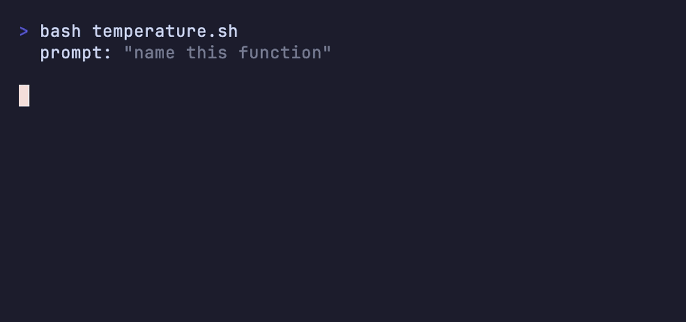
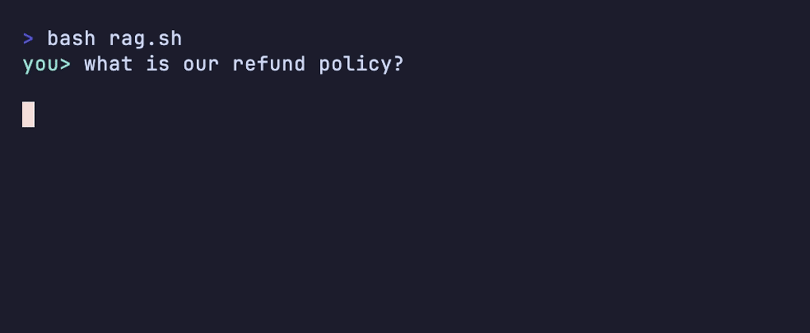

# হাতে-কলমে ৫ — নতুন শব্দ (মূল অভিধানের বাইরে) 📖

> পার্ট ১-এ ৬২টা শব্দ শিখেছেন — কিন্তু রোজ কাজ করতে গিয়ে এর বাইরেও আরও কিছু শব্দ কানে আসবে: কেউ slash command-এর কথা বলবে, কেউ RAG, কেউ temperature। 🆕
> এই সেকশনে সেই বাড়তি শব্দগুলো — অভিধানের ছাঁদেই, এক-এক করে। মূল ৬২টার পরে এগুলোই আপনার পরের ধাপ।

[⬅️ মূল পাতা](../README.md) · [⬅️ আগের সেকশন](04-popular-skills.md)

---

### স্ল্যাশ কমান্ড (Slash command)

`/` দিয়ে শুরু একটা সংক্ষিপ্ত নির্দেশ, যেটা [মডেল (Model)](../dictionary/01-the-model.md#মডেল-model)-এর কাছে যায় না — [হার্নেস (Harness)](../dictionary/01-the-model.md#হার্নেস-harness) নিজে ধরে চালায়। রোজকার কমান্ডগুলোর হাতে-কলমে তালিকা আছে [হাতে-কলমে ১](01-cli-commands.md)-এ।

টিভির রিমোটের বোতামের মতো 📺 — অনুষ্ঠানকে নয়, যন্ত্রটাকে নির্দেশ দিচ্ছেন। `/clear`, `/compact`, `/model` — এসব এজেন্টের কানে পৌঁছায়ই না, হার্নেস সেগুলো নিজে সামলায়।

💬 কথোপকথনে

🙋 "`/clear` লিখলাম, এজেন্ট তো 'clear' মানেই ধরল না!"

🧑‍🏫 "ধরবে না — ওটা slash command, হার্নেস ধরে। মডেলকে কিছু বলতে চাইলে সাধারণ বাক্যে লিখুন; `/`-দিয়ে শুরু করলেই সেটা হার্নেসের কাজ হয়ে যায়।"

---

### কাস্টম কমান্ড (Custom command)

নিজের হাতে বানানো একটা [স্ল্যাশ কমান্ড (Slash command)](#স্ল্যাশ-কমান্ড-slash-command) — কাজটা সোজা: `.claude/commands/` ফোল্ডারে একটা মার্কডাউন ফাইল রাখলেই ফাইলের নামটা একটা কমান্ড হয়ে যায় (`handoff.md` → `/handoff`)। ফোল্ডারটার পরিচয় পেয়েছেন [হাতে-কলমে ২](02-folder-structure.md)-এ।

মোবাইলে নিজের বানানো শর্টকাটের মতো 📱 — যে নির্দেশটা বারবার লিখতে হয়, একবার গুছিয়ে রেখে দিলে পরে এক টোকায় চলে। যেমন `/handoff` কমান্ডটা — কীভাবে বানায়, পুরোটা দেখানো আছে [হাতে-কলমে ৪](04-popular-skills.md)-এ।

💬 কথোপকথনে

🙋 "প্রতিবার সেশন শেষে একই লম্বা handoff নির্দেশ টাইপ করতে করতে ক্লান্ত।"

🧑‍🏫 "একটা কাস্টম কমান্ড বানিয়ে নিন — `.claude/commands/handoff.md`-এ নির্দেশটা লিখে রাখুন। তারপর থেকে শুধু `/handoff` লিখলেই হবে।"

---

### প্ল্যান মোড (Plan mode)

এজেন্ট আগে একটা পরিকল্পনা সাজায়, কোনো ফাইল ছোঁয় না — আপনি প্ল্যান পছন্দ করলে তবেই কোড লেখা শুরু। আগে ভাবা, পরে করা। এর আত্মীয় হলো [গ্রিলিং (Grilling)](../dictionary/07-patterns-of-work.md#গ্রিলিং-grilling) — দুটোই কোড লেখার আগে বোঝাপড়া পাকা করে নেয়।

রান্নার আগে বাজারের লিস্টি বানিয়ে নেওয়ার মতো 📝 — কী কী লাগবে আগে ঠিক করে নিলে বাজারে গিয়ে এলোমেলো হতে হয় না। প্ল্যান হাতে থাকলে এজেন্ট ভুল দিকে অনেকটা কোড লিখে ফেলার ঝুঁকি কমে।

💬 কথোপকথনে

🙋 "বড় ফিচার, ভয় হচ্ছে এজেন্ট ভুল বুঝে অনেকটা লিখে ফেলবে।"

🧑‍🏫 "Plan mode-এ যান — আগে শুধু পরিকল্পনা দেখাবে, একটা ফাইলও ছোঁবে না। প্ল্যান পছন্দ হলে তবেই কোড লেখাতে দিন।"

---

### চেকপয়েন্ট / রিওয়াইন্ড (Checkpoint / Rewind)

এজেন্টের প্রতিটা ধাপে একটা করে সেভ-পয়েন্ট (চেকপয়েন্ট) তৈরি হয়; কিছু গড়বড় হলে আগের কোনো নিরাপদ চেকপয়েন্টে ফিরে যাওয়ার নামই রিওয়াইন্ড ⏪। কমান্ড হিসেবে এটা দেখেছেন [হাতে-কলমে ১](01-cli-commands.md)-এর `/rewind`-এ।

ভিডিও গেমের সেভ-পয়েন্টের মতো 🎮 — খেলতে খেলতে মরে গেলেন? শেষ সেভ থেকে আবার শুরু, পুরো লেভেল গোড়া থেকে খেলতে হয় না। এজেন্ট তিন স্টেপে সব এলোমেলো করলে, ঝামেলা শুরুর আগের চেকপয়েন্টে ফিরে নতুন করে চালান।

💬 কথোপকথনে

🙋 "শেষ কয়েকটা স্টেপে এজেন্ট সব গুবলেট করে ফেলেছে — undo করব কীভাবে?"

🧑‍🏫 "রিওয়াইন্ড করুন — ঝামেলা শুরুর আগের চেকপয়েন্টে ফিরে যান, ওখান থেকে আবার নতুন নির্দেশ দিন। প্রতিটা ধাপেই তো সেভ আছে।"

---

### হুক (Hooks)

নির্দিষ্ট কোনো ঘটনা ঘটলে নিজে-নিজে চলে যাওয়া একটা স্ক্রিপ্ট — যেমন প্রতিবার ফাইল-এডিটের পরে নিজে থেকে লিন্ট চালানো। এজেন্টকে আলাদা করে বলতে হয় না; ঘটনাটা ঘটলেই হুক চলে। এটা একরকম [অটোমেটেড চেক (Automated check)](../dictionary/07-patterns-of-work.md#অটোমেটেড-চেক-automated-check)-কে স্বয়ংক্রিয়ভাবে বসিয়ে নেওয়া।

দরজার সেন্সর-লাইটের মতো 💡 — কেউ সামনে এলেই বাতি জ্বলে, আলাদা করে সুইচ টিপতে হয় না। ঘটনা (দরজায় কেউ এল / ফাইল এডিট হলো) → প্রতিক্রিয়া (বাতি জ্বলল / লিন্ট চলল), নিজে থেকেই।

💬 কথোপকথনে

🙋 "এজেন্ট মাঝে মাঝে ফাইল এডিট করে কিন্তু ফরম্যাট করতে ভুলে যায়।"

🧑‍🏫 "একটা হুক বসান — 'ফাইল এডিট' ঘটনায় নিজে থেকে formatter চলবে। এজেন্ট মনে রাখুক বা না-রাখুক, হুক ঠিক চলবে।"

---

### গিট ওয়ার্কট্রি (Git worktree)

একই git repo-র পাশাপাশি একাধিক আলাদা working কপি রাখার ব্যবস্থা — প্রতিটায় আলাদা ব্রাঞ্চ, আলাদা ফাইল। তাই একসঙ্গে কয়েকটা এজেন্ট পাশাপাশি কাজ করতে পারে, কেউ কারো ফাইল ঘাঁটে না। [AFK](../dictionary/07-patterns-of-work.md#afk) রানে যখন অনেকগুলো এজেন্ট একসঙ্গে ছাড়েন, এটাই তাদের আলাদা রাখার আসল কৌশল।

একই বইয়ের কয়েকটা আলাদা কপি কয়েকজনকে দিয়ে দেওয়ার মতো 📚 — যে যার কপিতে দাগ কাটে, কারো নোট অন্যের পাতায় গিয়ে পড়ে না। শেষে যার যার বদল আলাদা করে দেখে মিলিয়ে নেওয়া যায়।

💬 কথোপকথনে

🙋 "তিনটা এজেন্ট একসঙ্গে রিফ্যাক্টরে দিয়েছিলাম — ওরা একে অন্যের বদল মুছে দিচ্ছে!"

🧑‍🏫 "একই কপিতে তিনজনকে কাজ করালে তো তা-ই হবে। প্রতিটা এজেন্টকে আলাদা git worktree দিন — আলাদা ফোল্ডার, আলাদা ব্রাঞ্চ। তখন আর সংঘর্ষ হবে না।"

---

### হেডলেস মোড (Headless mode)

কোনো চ্যাট-UI ছাড়াই এজেন্ট চালানো — সরাসরি একটা স্ক্রিপ্ট থেকে বা CI পাইপলাইনের ভেতর থেকে। কমান্ড দেওয়া, উত্তর নেওয়া, সবই কোডের মধ্য দিয়ে; কোনো মানুষ সামনে বসে টাইপ করছে না।

ড্রাইভার-ছাড়া স্বয়ংক্রিয় মেট্রোর মতো 🚇 — কেউ স্টিয়ারিং ধরে নেই, তবু ঠিক সময়ে চলছে, থামছে। হেডলেস মোডেও এজেন্ট পুরো কাজটা একা সারে, ইন্টারফেসে কারো হাত লাগে না।

💬 কথোপকথনে

🙋 "প্রতিটা PR-এ নিজে থেকে এজেন্ট দিয়ে একটা রিভিউ চালাতে চাই, রোজ হাতে বসে নয়।"

🧑‍🏫 "তাহলে headless mode-এ চালান — CI স্ক্রিপ্ট থেকেই এজেন্ট ডাকুন, চ্যাট-উইন্ডো লাগবে না। উত্তরটা স্ক্রিপ্ট পড়ে নিয়ে পরের ধাপে কাজে লাগাবে।"

---

### ব্যাকগ্রাউন্ড এজেন্ট (Background agent)

পেছনে চুপচাপ চলতে থাকা একটা এজেন্ট, যার দিকে আপনি সারাক্ষণ তাকিয়ে নেই। শব্দটা চালু আছে ঠিকই, তবে একটা সতর্কবার্তা: এটা মেশিনের দিকে নজর টানে। কাজের *ধরন* বোঝাতে পার্ট ১-এর [AFK](../dictionary/07-patterns-of-work.md#afk) শব্দটাই বেশি কাজের — কারণ আসল কথাটা তো মেশিন "পেছনে" চলছে নয়, **ইউজার কিবোর্ড ছেড়ে চলে গেছে**।

পেছনে চলতে থাকা ওয়াশিং মেশিনের মতো 🧺 — কিন্তু ফোকাসটা মেশিনে নয়, আপনার দিকে: আপনি তো এ ফাঁকে অন্য কাজে চলে গেছেন। সেই "চলে যাওয়া"-টাই AFK ভালো ধরে, "background" নয়।

💬 কথোপকথনে

🙋 "এটা একটা background agent-এ চালিয়ে দিই?"

🧑‍🏫 "চালান, তবে শব্দটা একটু সাবধানে। 'background' বললে মনে হয় মেশিনটাই আসল ব্যাপার। বলুন AFK — কারণ মূল কথা হলো আপনি সরে যাচ্ছেন, আর তাই sandbox আর permission ঠিক রাখা জরুরি।"

---

### থিংকিং টোকেন (Thinking tokens)

চূড়ান্ত উত্তর লেখার আগে মডেল নিজের জন্য যে "খসড়া ভাবনা" তৈরি করে, সেগুলোই থিংকিং টোকেন। এগুলো চূড়ান্ত উত্তরের অংশ না হলেও খরচের খাতায় [আউটপুট টোকেন (Output tokens)](../dictionary/01-the-model.md#আউটপুট-টোকেন-output-tokens) হিসেবেই গোনা হয়।

পরীক্ষার রাফ খাতার মতো ✍️ — উত্তর লেখার আগে যেখানে এলোমেলো হিসাব কষে নেন। রাফ পাতা খাতার দামেই পড়ে; মডেলের ভাবনাও তেমনি, দেখা না গেলেও দাম ঠিকই লাগে।

💬 কথোপকথনে

🙋 "উত্তরটা তো ছোট, তবু এত টোকেন পুড়ল কেন?"

🧑‍🏫 "চূড়ান্ত উত্তরের আগে মডেল অনেকটা thinking token খরচ করেছে — রাফ খাতার মতো। ওগুলো output হিসেবেই দাম নেয়, যদিও পর্দায় পুরোটা দেখেননি।"

---

### টেম্পারেচার (Temperature)

মডেলের উত্তরের "দুঃসাহস" মাপার একটা নব: কম মানে সাবধানী, একঘেয়ে, বারবার একই ধাঁচের উত্তর; বেশি মানে সৃজনশীল, কিন্তু এলোমেলো হওয়ার ঝুঁকিও বেশি। এটা পার্ট ১-এর [নন-ডিটারমিনিজম (Non-determinism)](../dictionary/01-the-model.md#নন-ডিটারমিনিজম-non-determinism)-এর সঙ্গে সরাসরি জড়িত — temperature যত বেশি, ছক্কা তত বেশি এলোমেলো।

রান্নায় ঝালের মাত্রার মতো 🌶️ — কম দিলে সবার মুখে রোচে কিন্তু সাদামাটা, বেশি দিলে জমে ভালো, তবে কখনো মুখ পুড়েও যেতে পারে। কাজ বুঝে নবটা ঠিক করে নিতে হয়।

💬 কথোপকথনে

🙋 "কোড জেনারেশনে মাঝে মাঝে আজগুবি জিনিস বানিয়ে দিচ্ছে।"

🧑‍🏫 "Temperature কমিয়ে দিন — উত্তর বেশি সাবধানী আর অনুমেয় হবে। কবিতা-গল্পে উল্টোটা চাইতে পারেন, কিন্তু কোডে কম temperature-ই নিরাপদ।"

**🎬 টার্মিনালে দেখুন:** কম temperature-এ একই নিরাপদ উত্তর বারবার; বেশি temperature-এ এলোমেলো, সৃজনশীল, ঝুঁকিপূর্ণ —

  

---

### RAG

**Retrieval-Augmented Generation** — উত্তর দেওয়ার আগে মডেল প্রথমে দরকারি তথ্য খুঁজে আনে, তারপর সেটা সামনে রেখে উত্তর লেখে। নিজের ভেতরের স্মৃতির ভরসায় না থেকে, প্রতিবার টাটকা তথ্য টেনে আনা। এটাই [কনটেক্সচুয়াল নলেজ (Contextual knowledge)](../dictionary/04-failure-modes.md#কনটেক্সচুয়াল-নলেজ-contextual-knowledge) জোগানোর একটা স্বয়ংক্রিয় উপায়।

ওপেন-বুক পরীক্ষার মতো 📖 — সব মুখস্থ রাখার দরকার নেই, প্রশ্ন দেখে আগে বইয়ের ঠিক পাতাটা খুঁজে বার করুন, তারপর সেখান থেকে দেখে উত্তর লিখুন। ভুল কম, আর তথ্যও টাটকা।

💬 কথোপকথনে

🙋 "কোম্পানির পুরো ডকুমেন্টেশন তো context window-এ আঁটবে না।"

🧑‍🏫 "পুরোটা ঠাসার দরকার নেই — RAG ব্যবহার করুন। প্রশ্ন বুঝে শুধু দরকারি অংশটুকু খুঁজে এনে context-এ দিন, তারপর উত্তর। ওপেন-বুক পরীক্ষার মতো।"

**🎬 টার্মিনালে দেখুন:** RAG আগে ডকে খুঁজে দরকারি ফাইলটা context-এ জুড়ে নেয়, তারপর সেটা দেখে উত্তর — স্মৃতি নয়, ওপেন-বুক —

  

---

### এমবেডিং (Embedding)

লেখাকে অর্থ-অনুযায়ী সংখ্যার একটা "ঠিকানায়" বদলে ফেলার কৌশল — কাছাকাছি মানের লেখা পায় কাছাকাছি ঠিকানা। তাই অর্থে মিল আছে এমন জিনিস খুঁজে বার করা সহজ হয়ে যায়। [RAG](#rag)-এর খোঁজার কাজটা প্রায়ই এই এমবেডিং দিয়েই হয়।

লাইব্রেরির বিষয়ভিত্তিক তাকের মতো 🗂️ — রান্নার বই সব এক তাকে, ইতিহাসের বই আরেক তাকে। বই খুঁজতে গেলে কাছের তাকেই কাছের বিষয়টা মেলে। এমবেডিংও তেমন, কাছের ঠিকানা মানেই কাছের মানে।

💬 কথোপকথনে

🙋 "RAG তো বুঝলাম, কিন্তু 'দরকারি অংশ' খুঁজে পায় কীভাবে — শুধু শব্দ মিলিয়ে?"

🧑‍🏫 "শব্দ নয়, মানে মিলিয়ে — embedding দিয়ে। প্রশ্ন আর ডকের প্রতিটা অংশ সংখ্যার ঠিকানায় বদলে যায়; সবচেয়ে কাছের ঠিকানাগুলোই টেনে আনা হয়।"

---

### ফাইন-টিউনিং (Fine-tuning)

একটা তৈরি মডেলকে নিজের ডেটার ওপর আরও খানিকটা ঘষামাজা করা — মানে কার্যত [প্যারামিটার (Parameters)](../dictionary/01-the-model.md#প্যারামিটার-parameters)গুলো আবার নতুন করে নাড়ানো। এটা [ট্রেনিং (Training)](../dictionary/01-the-model.md#ট্রেনিং-training)-এরই একটা ছোট সংস্করণ — দামি, ঝামেলার, আর সহজে পুরনো হয়ে যায়। তাই প্রায় সবসময় [কনটেক্সচুয়াল নলেজ (Contextual knowledge)](../dictionary/04-failure-modes.md#কনটেক্সচুয়াল-নলেজ-contextual-knowledge) দিয়ে কাজ চালানোই সস্তা।

পাকা রাঁধুনিকে নতুন করে রান্নার ইশকুলে পাঠানোর মতো 👨‍🍳 — শেখানো যায়, কিন্তু সময়-টাকা দুটোই বিস্তর। তার চেয়ে হাতের কাছে নতুন রেসিপিটা ধরিয়ে দেওয়াই (context) অনেক সহজ।

💬 কথোপকথনে

🙋 "আমাদের কোডবেস চেনাতে মডেলটা fine-tune করিয়ে নিই?"

🧑‍🏫 "তাতে প্যারামিটারই বদলে যাবে — কার্যত নতুন মডেল, খরচও মেলা। এক প্রজেক্টের জন্য অতটা না করে দরকারি জিনিসটা context-এ দিন বা RAG ব্যবহার করুন, ঢের সস্তা।"

---

### স্ট্রিমিং (Streaming)

মডেল পুরো উত্তর শেষ করার অপেক্ষা না করে, একেকটা [টোকেন (Token)](../dictionary/01-the-model.md#টোকেন-token) তৈরি হওয়া-মাত্রই সেটা পর্দায় দেখিয়ে দেয়। এই যে এক-এক করে টোকেন আসা — এটাই তো [নেক্সট-টোকেন প্রেডিকশন (Next-token prediction)](../dictionary/01-the-model.md#নেক্সট-টোকেন-প্রেডিকশন-next-token-prediction)-এর স্বভাব, স্ট্রিমিং শুধু সেটা সরাসরি চোখের সামনে এনে দেয়।

খাবার রান্না হওয়া-মাত্র টেবিলে আসার মতো 🍽️ — পুরো থালি একসঙ্গে সাজিয়ে আনার জন্য বসে থাকতে হয় না, যেটা তৈরি, সেটা আগে আসে। তাই অপেক্ষাটা কম লাগে, কাজ এগোচ্ছে দেখাও যায়।

💬 কথোপকথনে

🙋 "এজেন্ট চুপ করে আছে — হ্যাং করল নাকি?"

🧑‍🏫 "স্ট্রিমিং চালু থাকলে এই সন্দেহটাই হতো না — টোকেন তৈরি হওয়া-মাত্র চোখের সামনে আসত, বুঝতেন কাজ এগোচ্ছে। পুরো উত্তরের অপেক্ষায় বসে থাকা লাগত না।"

---

### প্লাগইন (Plugin)

কমান্ড, স্কিল আর এজেন্ট — এক বা একাধিক জিনিস একসঙ্গে গুছিয়ে রাখা একটা প্যাকেট, যেটা এক ইনস্টলেই পুরোটা যোগ হয়ে যায়। আলাদা আলাদা করে প্রতিটা বসানোর ঝামেলা নেই।

টিফিন-বক্স সেটের মতো 🍱 — ভাত, ডাল, তরকারি সব আলাদা বাটিতে, কিন্তু এক ব্যাগেই গোছানো; তুলে নিলেই পুরো খাবার হাতে। প্লাগিনও তেমন এক প্যাকেটে গোটা সেট।

💬 কথোপকথনে

🙋 "একটা টিমের পুরো ওয়ার্কফ্লো — কমান্ড, স্কিল, রিভিউয়ার এজেন্ট — সব একসঙ্গে নিতে চাই।"

🧑‍🏫 "একটা একটা করে বসানোর দরকার নেই — ওটা যদি একটা plugin হিসেবে প্যাকেজ করা থাকে, এক ইনস্টলেই পুরো সেট চলে আসবে।"

---

### মার্কেটপ্লেস (Marketplace)

[প্লাগইন (Plugin)](#প্লাগইন-plugin) খুঁজে পাওয়ার আর নামিয়ে নেওয়ার একটা জায়গা — community-র লোকেরা নিজেদের বানানো প্যাকেট এখানে শেয়ার করে রাখে। কোন স্কিল-প্যাটার্নগুলো চালু, তার অনেকটাই দেখেছেন [হাতে-কলমে ৪](04-popular-skills.md)-এ।

ফোনের অ্যাপ স্টোরের মতো 🛍️ — যা দরকার খুঁজুন, পছন্দ হলে ইনস্টল করুন, নিজে শূন্য থেকে বানানোর দরকার নেই। অন্যের পরিশ্রমটুকু এক ক্লিকে নিজের কাজে লাগিয়ে নেওয়া যায়।

💬 কথোপকথনে

🙋 "এই স্কিলগুলো কি সব নিজে হাতে লিখতে হবে?"

🧑‍🏫 "না না, অনেকটাই মার্কেটপ্লেসে গোছানো আছে — অ্যাপ স্টোরের মতো। দরকারি plugin-টা খুঁজে ইনস্টল করুন, তারপর দরকার হলে নিজের মতো বদলে নিন।"

---

### SKILL.md

একটা [স্কিল (Skill)](../dictionary/06-memory-and-steering.md#স্কিল-skill)-এর রেসিপি-ফাইল। ভেতরে তিনটে জিনিস থাকে: একটা `name`, একটা `description` (এজেন্ট এটা পড়েই বোঝে কখন স্কিলটা *trigger* হবে), আর কাজের ধাপগুলো। এই description-টুকুই আগে লোড হয়, বাকিটা দরকারে — এটাই [প্রগ্রেসিভ ডিসক্লোজার (Progressive disclosure)](../dictionary/06-memory-and-steering.md#প্রগ্রেসিভ-ডিসক্লোজার-progressive-disclosure)। একটা পুরো `SKILL.md` হাতে-কলমে বানানো দেখানো আছে [হাতে-কলমে ৪](04-popular-skills.md)-এ।

রান্নার রেসিপি-কার্ডের মতো 🍳 — ওপরে নাম আর "কখন বানাবেন", নিচে ধাপে ধাপে নির্দেশ। এজেন্ট রেসিপির নাম-অংশটা পড়ে ঠিক করে, এই পদটা এখন দরকার কিনা; দরকার হলে তবেই ভেতরের ধাপগুলোয় ঢোকে।

🐠 গোল্ডি এখানে খুশি — "আমার তো তিন সেকেন্ডের মেমরি! কিন্তু `SKILL.md` ফাইলে লেখা থাকলে আমাকে মনে রাখতে হয় না — দরকারের সময় এজেন্ট নিজেই টেনে নেয়।"

💬 কথোপকথনে

🙋 "স্কিলটা মাঝে মাঝে চলে, মাঝে মাঝে চলে না — কেন?"

🧑‍🏫 "`SKILL.md`-এর `description`-টা দেখুন — ওটাই trigger। কখন স্কিলটা লাগবে, সেটা পরিষ্কার করে না লিখলে এজেন্ট বুঝবে না কখন টানবে। description স্পষ্ট করুন।"

---

## 🎯 সেকশন রিভিউ — সব মনে আছে তো?

প্রশ্ন ১: Temperature বাড়ালে উত্তরে কী হয়?

উত্তর বেশি **সৃজনশীল ও বৈচিত্র্যময়** হয়, কিন্তু সেই সঙ্গে **এলোমেলো ও অনিশ্চিত** হওয়ার ঝুঁকিও বাড়ে। কম temperature = সাবধানী, অনুমেয়, একঘেয়ে। কোডে সাধারণত কম-ই ভালো।

প্রশ্ন ২: কোম্পানির ডক চেনাতে — fine-tune না RAG/context?

প্রায় সবসময় **RAG / context**-ই সস্তা ও সহজ। Fine-tuning মানে প্যারামিটার আবার নাড়ানো — দামি, ঝামেলার, আর ডক বদলালে আবার করতে হয়। তথ্য সরাসরি context-এ দেওয়া বা RAG দিয়ে টেনে আনাই ব্যবহারিক।

প্রশ্ন ৩: Hook আর Skill-এর পার্থক্য কী?

**Hook** নির্দিষ্ট একটা ঘটনায় (যেমন ফাইল-এডিট) নিজে-নিজে চলে — এজেন্টের সিদ্ধান্ত লাগে না। **Skill** এজেন্ট দরকারমতো নিজে টেনে নেয় (`SKILL.md`-এর description পড়ে)। একটা ঘটনা-চালিত, আরেকটা এজেন্ট-চালিত।

প্রশ্ন ৪: Thinking token-এর জন্য কি দাম লাগে?

হ্যাঁ — চূড়ান্ত উত্তরে না দেখালেও এগুলো **output token হিসেবেই** গোনা হয়। পরীক্ষার রাফ খাতার মতো; দেখা না গেলেও খাতার দামেই পড়ে।

## 🧩 মিনি-চ্যালেঞ্জ

🕵️ কোম্পানির নিজস্ব ডকুমেন্টেশন এজেন্টকে জানাতে চান — fine-tune করবেন, নাকি RAG/context? কেন?

প্রায় নিশ্চিতভাবে **RAG / context** —

- **খরচ:** fine-tuning মানে প্যারামিটার আবার নাড়ানো ([ট্রেনিং](../dictionary/01-the-model.md#ট্রেনিং-training)-এরই ছোট রূপ) — দামি ও সময়সাপেক্ষ। Context-এ তথ্য দেওয়া বহুগুণ সস্তা।
- **টাটকা থাকা:** ডক তো বদলাতেই থাকবে। RAG প্রতিবার নতুন তথ্য খুঁজে আনে; fine-tuned মডেল পুরনো হয়ে যায়, আবার নতুন করে ট্রেন করতে হয়।
- **নির্ভরযোগ্যতা:** RAG-এ উত্তরটা সামনে-রাখা [কনটেক্সচুয়াল নলেজ](../dictionary/04-failure-modes.md#কনটেক্সচুয়াল-নলেজ-contextual-knowledge)-এর ওপর দাঁড়ায় — যাচাই করা সহজ, হ্যালুসিনেশনও কম।

মোদ্দা কথা: ডক চেনাতে fine-tuning প্রায় সবসময়ই অতিরিক্ত — RAG/context দিয়েই কাজ চলে যায়।

## ✅ শেখার চেকলিস্ট

> 💡 *Fork করে টিক দিন!*

- [ ] স্ল্যাশ কমান্ড = `/`-নির্দেশ, হার্নেস ধরে
- [ ] কাস্টম কমান্ড = `.claude/commands/`-এ নিজের বানানো slash command
- [ ] প্ল্যান মোড = আগে প্ল্যান, পরে কোড (ফাইল ছোঁয় না)
- [ ] চেকপয়েন্ট / রিওয়াইন্ড = প্রতি ধাপে সেভ, ভুলে ⏪ ফেরা
- [ ] হুক = নির্দিষ্ট ঘটনায় নিজে-নিজে চলা স্ক্রিপ্ট
- [ ] গিট ওয়ার্কট্রি = একাধিক working কপি, এজেন্টরা পাশাপাশি নিরাপদে
- [ ] হেডলেস মোড = UI ছাড়া স্ক্রিপ্ট/CI থেকে এজেন্ট চালানো
- [ ] ব্যাকগ্রাউন্ড এজেন্ট = পেছনে চলা এজেন্ট (ধরন বোঝাতে AFK-ই ভালো শব্দ)
- [ ] থিংকিং টোকেন = খসড়া ভাবনা, output হিসেবে দাম লাগে
- [ ] টেম্পারেচার = উত্তরের "দুঃসাহস" নব (কম = সাবধানী, বেশি = এলোমেলো)
- [ ] RAG = আগে খুঁজে আনো, তারপর উত্তর (ওপেন-বুক পরীক্ষা)
- [ ] এমবেডিং = লেখাকে অর্থ-ঠিকানায় বদলানো; কাছের ঠিকানা = কাছের মানে
- [ ] ফাইন-টিউনিং = প্যারামিটার আবার নাড়ানো; প্রায়ই RAG/context সস্তা
- [ ] স্ট্রিমিং = টোকেন তৈরি হওয়া-মাত্র দেখানো
- [ ] প্লাগইন = কমান্ড+স্কিল+এজেন্টের এক-প্যাকেট
- [ ] মার্কেটপ্লেস = প্লাগইনের দোকান (community-শেয়ার)
- [ ] SKILL.md = স্কিলের রেসিপি (name + description-trigger + ধাপ)

---

👉 **পরের সেকশন:** [হাতে-কলমে ৬ — টোকেন ও খরচ](06-cost.md)

[⬅️ মূল পাতায় ফিরুন](../README.md)
