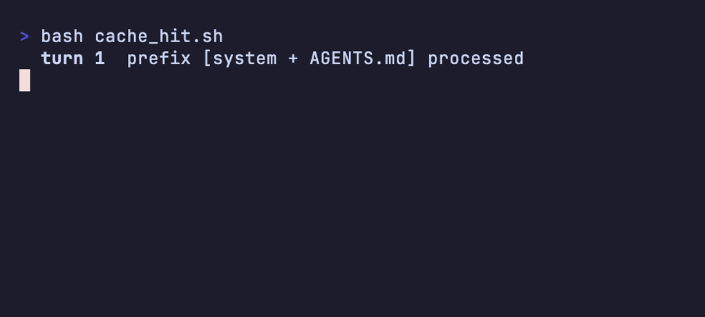

# হাতে-কলমে ৬ — টোকেন ও খরচ 💰

> মাস শেষে বিল দেখে চমকে উঠলেন — "এত টাকা পুড়ল কীসে?" 😳 এজেন্ট তো কাজই করছিল, খরচটা গেল কোথায়?
> এই সেকশনে টোকেনের হিসাব আর খরচ কমানোর রোজকার কৌশল — কোন মডেল কখন, ক্যাশ কীভাবে কাজে লাগে, আর টাকা পোড়ানো অভ্যাসগুলো কী কী।

[⬅️ মূল পাতা](../README.md) · [⬅️ আগের সেকশন](05-new-terms.md)

---

### টোকেনের দাম (Token pricing)

প্রোভাইডাররা সাধারণত প্রতি ১০ লাখ (million) টোকেনে দাম ধরে — আর সব টোকেনের দাম এক নয়: [ইনপুট টোকেন (Input tokens)](../dictionary/01-the-model.md#ইনপুট-টোকেন-input-tokens) তুলনায় সস্তা, [আউটপুট টোকেন (Output tokens)](../dictionary/01-the-model.md#আউটপুট-টোকেন-output-tokens) কয়েকগুণ দামি, আর [ক্যাশ টোকেন (Cache tokens)](../dictionary/01-the-model.md#ক্যাশ-টোকেন-cache-tokens) সবচেয়ে সস্তা।

বিদ্যুৎ বিলের কথা ভাবুন ⚡ — মাসে একটা বাঁধা ফি নয়, বরং কত ইউনিট পুড়ল তার হিসাব। এজেন্টের সঙ্গে যত কথা হয়, যত লেখা পড়ে-লেখে, তত টোকেন "পোড়ে"। নির্দিষ্ট সংখ্যা মুখস্থ করার দরকার নেই — দামগুলো ঘনঘন বদলায়; শুধু অনুপাতটা মাথায় রাখুন: পড়া সস্তা, লেখা দামি, আর আগের-পড়া-জিনিস আবার কাজে লাগানো সবচেয়ে সস্তা।

💬 কথোপকথনে

🙋 "আউটপুট আর ইনপুট — দামে তো একই ব্যাপার, তাই না?"

🧑‍🏫 "একদমই না। output token কয়েকগুণ দামি। তাই এজেন্টকে দিয়ে গাদা গাদা কোড বা লম্বা ব্যাখ্যা লেখানোর আগে ভাবুন — পড়ার (input) চেয়ে লেখার (output) দাম অনেক বেশি।"

---

### কোন মডেল কখন (Model tiers)

বড় [মডেল (Model)](../dictionary/01-the-model.md#মডেল-model) মানে বেশি বুদ্ধিমান, কিন্তু দামি আর ধীর; ছোট মডেল মানে সস্তা আর দ্রুত, কিন্তু কম গভীর। সহজ-যান্ত্রিক কাজ ছোট মডেলে ছেড়ে দিন, জটিল প্ল্যানিং বা ডিজাইন বড় মডেলে তুলুন।

কাছের দোকানে যেতে হেঁটেই যান 🚶 — দূরের বড় বাজারে গেলে তবেই গাড়ি বের করেন। rename, ফরম্যাট ঠিক করা, ছোট বাগ — এসবে বড় মডেল পোড়ানো মানে শুধু টাকা নষ্ট। সেশনের মাঝপথেই [হাতে-কলমে ১](01-cli-commands.md)-এর `/model` দিয়ে অদলবদল করতে পারেন — কঠিন অংশে উঠুন, সহজ অংশে নামুন।

💬 কথোপকথনে

🙋 "সব কাজই ডিফল্ট বড় মডেলে করছি — ঠিক আছে তো?"

🧑‍🏫 "জটিল ডিজাইনে ঠিক আছে, কিন্তু সারাদিনের ছোট ছোট কাজেও বড়টা চালানো মানে বিনা দরকারে টাকা পোড়ানো। `/model` দিয়ে সহজ কাজে ছোটটায় নামুন — দ্রুতও হবে, সস্তাও হবে।"

---

### ক্যাশ-বান্ধব অভ্যাস (Cache-friendly habits)

[প্রিফিক্স ক্যাশ (Prefix cache)](../dictionary/01-the-model.md#প্রিফিক্স-ক্যাশ-prefix-cache)-এর মূল কথাটা আবার মনে করুন: কথোপকথনের শুরুর অংশটা যদি অপরিবর্তিত থাকে, প্রোভাইডার সেটা নতুন করে প্রসেস করে না — পুরোনোটাই কাজে লাগায়, ফলে সস্তা আর দ্রুত।

গোল্ডি 🐠 এটা ভালো বোঝে — "শুরুটা একই থাকলে আর গোড়া থেকে পড়তে হয় না!" তাই অভ্যাস করুন: AGENTS.md বা শুরুর প্রম্পটটা ঘনঘন বদলাবেন না, আর লম্বা সেশনের গোড়ার দিকটা যতটা পারেন স্থির রাখুন। শুরুতে একটা শব্দ এদিক-ওদিক করলেই ক্যাশ "মিস" হয় — তখন গোটা শুরুটা আবার দাম দিয়ে প্রসেস হয়।

💬 কথোপকথনে

🙋 "আমার সেশন দ্রুত আর সস্তা রাখার সহজ একটা অভ্যাস বলুন তো।"

🧑‍🏫 "সেশনের শুরুর অংশটা স্থির রাখুন — AGENTS.md বা গোড়ার নির্দেশ বারবার এডিট করবেন না। শুরুটা একই থাকলে prefix cache হিট করে, প্রোভাইডার ওই অংশ আবার প্রসেস করে না — তাতেই দাম আর সময় দুটোই বাঁচে।"

**🎬 টার্মিনালে দেখুন:** শুরুটা একই থাকলে cache হিট (সস্তা, দ্রুত); AGENTS.md এডিট করলেই prefix বদলে cache মিস — গোটা শুরু আবার দাম দিয়ে প্রসেস —

  

---

### খরচ কমানোর চেকলিস্ট (Cost-saving checklist)

রোজকার কাজে এই কয়টা অভ্যাস ধরলে বিল অনেকটাই নামে। কেন খরচ হয় তার মূলে আছে [কনটেক্সট উইন্ডো (Context window)](../dictionary/02-sessions-context-turns.md#কনটেক্সট-উইন্ডো-context-window) — প্রতি টার্নে ওই গোটা উইন্ডোটাই আবার প্রোভাইডারের কাছে যায়, তাই সেটা যত ভারী, খরচও তত বেশি।

- **ছোট কাজ ছোট মডেলে।** সহজ-যান্ত্রিক কাজে বড় মডেল পোড়াবেন না।
- **এক টার্নে এক কাজ।** এলোমেলো অনেক কিছু একসঙ্গে চাপালে এজেন্ট গুলিয়ে ফেলে আর টোকেনও বেশি পোড়ে — দেখুন [হাতে-কলমে ৩](03-prompting-patterns.md)।
- **এলোমেলো লম্বা চ্যাট জমতে দেবেন না।** পুরো চ্যাটটা প্রতি টার্নে আবার পাঠানো হয় = প্রতিবার গোটা ইতিহাসের দাম। কাজ বদলালে [হাতে-কলমে ১](01-cli-commands.md)-এর `/clear` (নতুন শুরু) বা `/compact` (সারাংশ রেখে) দিন।
- **ভারী খোঁজাখুঁজি সাবএজেন্টে পাঠান।** বড় কোডবেস ঘাঁটার কাজ আলাদা সাবএজেন্টে সরালে মূল সেশনের উইন্ডো হালকা থাকে — দেখুন [হাতে-কলমে ৪](04-popular-skills.md)।

💬 কথোপকথনে

🙋 "একই সেশনে সারাদিন কাজ করছি, বিল লাফিয়ে বাড়ছে — কেন?"

🧑‍🏫 "ওই লম্বা সেশনটাই কারণ। কনটেক্সট উইন্ডো এখন বিশাল, আর প্রতি টার্নে গোটাটা আবার যাচ্ছে। কাজ বদলে গেলে `/clear`, আর সুতো ধরে রাখতে চাইলে `/compact` — দুটোতেই উইন্ডো হালকা হয়, খরচ নামে।"

---

## 🎯 সেকশন রিভিউ — সব মনে আছে তো?

প্রশ্ন ১: ইনপুট নাকি আউটপুট টোকেন — কোনটা দামি?

**আউটপুট** টোকেন কয়েকগুণ দামি (এজেন্ট যা *লেখে*)। ইনপুট (যা পাঠানো হয়) তুলনায় সস্তা, আর ক্যাশ টোকেন সবচেয়ে সস্তা।

প্রশ্ন ২: প্রিফিক্স ক্যাশ "হিট" হয় কীভাবে?

কথোপকথনের **শুরুর অংশটা অপরিবর্তিত** থাকলে। তখন প্রোভাইডার ওই অংশ আবার প্রসেস না করে আগেরটাই কাজে লাগায় — সস্তা আর দ্রুত। শুরুটা বদলালে ক্যাশ মিস করে।

প্রশ্ন ৩: লম্বা এলোমেলো চ্যাট কেন দামি হয়?

কারণ **প্রতি টার্নে পুরো চ্যাটটাই আবার** প্রোভাইডারের কাছে পাঠানো হয় — গোটা কনটেক্সট উইন্ডোর দাম প্রতিবার দিতে হয়। চ্যাট যত লম্বা, প্রতি টার্নের খরচ তত বেশি।

## 🧩 মিনি-চ্যালেঞ্জ

🕵️ মাস শেষে বিল হঠাৎ দ্বিগুণ! তিনটা সম্ভাব্য কারণ ও তার সমাধান বলুন।

- **সব কাজ বড় মডেলে করছেন।** → সহজ-যান্ত্রিক কাজে `/model` দিয়ে ছোট মডেলে নামুন।
- **লম্বা এলোমেলো সেশন চালাচ্ছেন।** → প্রতি টার্নে গোটা উইন্ডো আবার যাচ্ছে; কাজ বদলালে `/clear`, সুতো রাখতে চাইলে `/compact`।
- **AGENTS.md বা শুরুর প্রম্পট ঘনঘন বদলাচ্ছেন।** → প্রতিবার prefix cache মিস হয়ে গোটা শুরুটা আবার দাম দিয়ে প্রসেস হচ্ছে; গোড়ার অংশটা স্থির রাখুন।

## ✅ শেখার চেকলিস্ট

> 💡 *Fork করে টিক দিন!*

- [ ] দাম ধরা হয় প্রতি ১০ লাখ টোকেনে (নির্দিষ্ট সংখ্যা নয়, অনুপাত মনে রাখুন)
- [ ] ইনপুট সস্তা < আউটপুট দামি; ক্যাশ টোকেন সবচেয়ে সস্তা
- [ ] ছোট-যান্ত্রিক কাজ ছোট মডেলে, জটিল কাজ বড় মডেলে (`/model`)
- [ ] শুরুর অংশ স্থির রাখলে prefix cache হিট করে — সস্তা ও দ্রুত
- [ ] এক টার্নে এক কাজ; এলোমেলো লম্বা চ্যাট জমতে দেবেন না (`/clear` / `/compact`)
- [ ] ভারী খোঁজাখুঁজি সাবএজেন্টে — মূল সেশনের উইন্ডো হালকা থাকে

---

👉 **পরের সেকশন:** [হাতে-কলমে ৭ — নিরাপত্তা](07-safety.md)

[⬅️ মূল পাতায় ফিরুন](../README.md)
